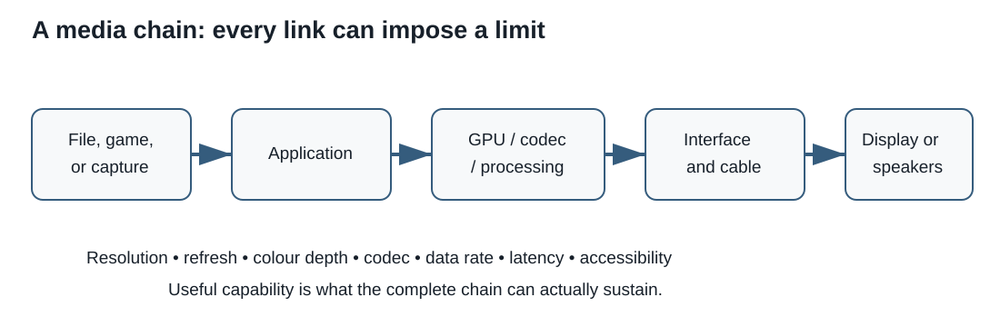

# Session 11 - From files to images and sound: evaluating a media chain

## Purpose of the session

In Session 10, we examined the operating system as a manager of processes, memory, files, and devices. When an application displays a 3D scene, plays a video, or reproduces a recording, it uses those services, but the operating system does not turn data into light and sound by itself.

A media experience depends on a **complete chain**:

- the file, scene, or stream to process;
- the application and its programming interfaces;
- the operating system and drivers;
- the graphics processor or media engines;
- memory and storage;
- the display, audio device, and their settings;
- formats, containers, and codecs;
- the needs of the person using the system.

This session answers five questions:

> How do data become a visible image or audible sound?

> When is integrated graphics sufficient, and when does a dedicated graphics card become relevant?

> Why are the priorities of a gaming system not necessarily the priorities of a CAD workstation?

> How can we interpret display, audio, and codec specifications without isolating one number?

> How can accessibility be included in a technical recommendation from the beginning?

## Objectives

By the end of the session and associated Lab, you should be able to:

- describe introductory graphics, video, and audio chains;
- distinguish graphics rendering, video decoding, and display output;
- explain the general roles of a graphics API, driver, GPU, video memory, and media engine;
- distinguish integrated graphics from a dedicated graphics card in terms of memory, energy, heat, cost, and upgradeability;
- connect a workload to relevant GPU criteria;
- compare the priorities of gaming, CAD, and media-creation systems;
- distinguish pixel dimensions, pixel density, scaling, refresh rate, response time, and input latency;
- interpret colour depth, gamut, luminance, contrast, and HDR as related properties;
- explain a digital audio chain involving sampling, quantization, channels, digital-to-analogue conversion, and a transducer;
- distinguish container, codec, encoding, decoding, lossy compression, and lossless compression;
- verify whether a media requirement depends on specific hardware acceleration;
- include visual, auditory, interaction, and physical-accessibility requirements in a recommendation.

!!! info "Scope of the session"
    **Master today:** media-chain model; image, pixel, and subpixel; colour depth; simplified uncompressed-image calculation; integrated and dedicated GPUs; VRAM; gaming, CAD, and creation criteria; pixel dimensions, density, scaling, refresh rate, response time, luminance, contrast, and gamut; audio chain; sample rate, sample depth, and channels; container and codec; lossy and lossless compression; hardware acceleration; accessibility requirements.

    **Recognize today:** graphics APIs; shaders; rasterization; specialized encode and decode engines; variable refresh rate; calibration; HDR; ADC and DAC; bitrate; codec profiles and levels; chroma subsampling; multichannel audio.

    **Go further after the Lab link:** detailed colour equations, CIE spaces, ray tracing, GPGPU computing, fine audio-video synchronization, psychoacoustics, inter-frame compression, and professional colour-management pipelines. This section is optional.

## The problem with a “powerful” system that gives a poor experience

The **Atlas** project is a gaming and live-streaming PC. One proposal includes:

- an expensive graphics card;
- a display advertised as “4K HDR”;
- a USB headset;
- live-streaming software;
- a library of videos in several formats.

This list does not prove that the chain works well. Several problems remain possible:

- the GPU produces irregular frame times at the selected pixel dimensions;
- the display operates at a lower refresh rate than expected;
- the application uses software encoding even though a suitable hardware engine is available;
- a file uses a recognized container but an unsupported codec;
- the display covers an advertised gamut without providing the required accuracy;
- the headset is connected, but the application is still using another microphone;
- captions, scaling, or accessible controls are missing.

The responsible question is not:

> Which component has the largest number?

It becomes:

> What complete path processes the content, what must each stage support, and what evidence confirms that the system works for the person concerned?

## Three chains that intersect

The word **media** includes several paths. They share the operating system, drivers, and some resources, but they do not perform exactly the same work.

### Interactive graphics rendering

A game or CAD application constructs a scene from geometry, textures, lights, data, and commands.

```text
application and scene
        ↓
graphics API and driver
        ↓
commands, data, and shaders
        ↓
GPU: transformation, rasterization, and pixel work
        ↓
image in memory
        ↓
display engine
        ↓
display
```

The **graphics API** provides a common vocabulary between the application and system. The **driver** adapts requests to the platform and GPU. The GPU processes many elements in parallel and produces pixel values. Exact details vary by API and architecture; this model traces responsibility across the layers.

### Video playback

A recorded video does not necessarily require rebuilding a 3D scene. Its tracks must be read from a container, decoded, synchronized, and presented.

```text
file or stream
   ↓ read container
video, audio, and caption tracks
   ↓ software or hardware decoding
images and audio samples
   ↓ scaling, colour processing, mixing, and synchronization
display, speakers, or headset
```

A modern GPU or processor may contain **specialized media engines** for particular encode and decode formats. Their presence, supported profiles, and actual use by the application must be verified separately.

### Audio playback

```text
file, microphone, or application
        ↓
decoding or capture
        ↓
digital samples and audio mixing
        ↓
driver and audio device
        ↓
DAC and amplification, when required
        ↓
speaker or headset
```

During capture, the path may begin at a microphone, pass through an analogue-to-digital converter, then be processed and encoded.

??? question "Check: does a video always use the GPU in the same way as a game?"
    No. A game generally constructs images from an interactive scene. Video playback may depend mainly on decoding, scaling, colour conversion, compositing, and display output. Both paths may use the GPU, but they exercise different units and require different evidence.

## Pixels, subpixels, and a digital image

A **pixel** is an image unit. On many displays, each visible pixel is produced from red, green, and blue subpixel components that can be controlled separately. Physical arrangements vary by panel technology, so the RGB model is not a universal description of every panel layout.

<figure markdown="span">
  { loading=lazy width="760" }
  <figcaption>A close-up shows how red, green, and blue components contribute to colours on an LCD. Photo: Luís Flávio Loureiro dos Santos, <a href="https://commons.wikimedia.org/wiki/File:LCD_RGB.jpg">Wikimedia Commons</a>, <a href="https://creativecommons.org/licenses/by/3.0/">CC BY 3.0</a>.</figcaption>
</figure>

### Colour depth

**Colour depth** indicates how many bits represent the components of a pixel or signal. In a common RGB model:

- 8 bits per component provide 256 levels per component and 24 bits for RGB;
- 10 bits per component provide 1,024 levels per component and 30 bits for RGB;
- an alpha channel may add transparency information to an image without automatically creating more displayable colours.

More bits can reduce visible banding in some gradients and provide greater processing precision. They do not by themselves guarantee an accurate image: the file, application, GPU, output path, panel, and calibration must preserve the information.

### A simplified uncompressed-image calculation

For a simple image in which every pixel uses the same number of bits:

```text
pixel count = width × height
image bits = pixel count × bits per pixel
image bytes = bits ÷ 8
```

For `2,560 × 1,440` at `30 bits/pixel`:

```text
2,560 × 1,440 = 3,686,400 pixels
3,686,400 × 30 = 110,592,000 bits
110,592,000 ÷ 8 = 13,824,000 bytes ≈ 13.18 MiB
```

This is a simplified raw image. It is not the total VRAM required by a game, because an application may retain multiple images, depth buffers, textures, geometry, shaders, acceleration structures, caches, and other data.

??? question "Check: does doubling both dimensions double the number of pixels?"
    No. Doubling both width and height multiplies the pixel count by four. Always calculate the product of the two dimensions.

## Pixel dimensions, aspect ratio, and density

In product specifications, **resolution** often means pixel dimensions. To avoid ambiguity, distinguish:

- **pixel dimensions**, such as `1,920 × 1,080`;
- **aspect ratio**, the relationship between width and height, such as `16:9`;
- **pixel density**, pixels per unit of physical length, often expressed as PPI;
- **scaling**, logical enlargement of text and interface elements so that they remain usable.

| Common label | Pixel dimensions | Note |
|---|---:|---|
| Full HD | 1,920 × 1,080 | common 16:9 format |
| QHD | 2,560 × 1,440 | about 1.78 times as many pixels as Full HD |
| UHD “4K” | 3,840 × 2,160 | common television and computer format |
| DCI 4K | 4,096 × 2,160 | distinct digital-cinema format |

Commercial names are sometimes used imprecisely. Exact pixel dimensions are stronger evidence.

<figure markdown="span">
  { loading=lazy width="760" }
  <figcaption>The comparison shows that dimensions increase on both axes, so pixel area grows quickly. Illustration: TRauMa, <a href="https://commons.wikimedia.org/wiki/File:Digital_video_resolutions_%28VCD_to_4K%29.svg">Wikimedia Commons</a>, <a href="https://creativecommons.org/publicdomain/zero/1.0/">CC0 1.0</a>.</figcaption>
</figure>

### Density and scaling

Two displays with the same physical size can have different pixel dimensions. The one with more pixels has greater density. Interface elements may appear smaller unless the operating system applies suitable scaling.

```text
pixel diagonal = √(width² + height²)
PPI = pixel diagonal ÷ diagonal in inches
```

Greater density may improve fine detail, but it does not remove the need to consider viewing distance, scaling, panel quality, and the user’s visual requirements.

## The GPU: parallel work, memory, and specialized engines

A **graphics processing unit (GPU)** is designed to execute many image, scene, and parallel calculations efficiently. A dedicated graphics card commonly includes:

- the GPU;
- video memory;
- power-delivery circuits;
- cooling;
- a PCIe interface;
- display outputs;
- specialized encoding, decoding, or compute engines on some models.

<figure markdown="span">
  { loading=lazy width="760" }
  <figcaption>A dedicated graphics card combines the GPU, memory, power delivery, cooling, and connections. Photo: Nick Stathas, <a href="https://commons.wikimedia.org/wiki/File:A_Complex_Graphics_Card.jpg">Wikimedia Commons</a>, <a href="https://creativecommons.org/licenses/by-sa/4.0/">CC BY-SA 4.0</a>.</figcaption>
</figure>

### Integrated graphics

An **integrated GPU** is located in the same processor, package, or system chip as other primary functions. It commonly uses part of system memory and shares bandwidth with the processor.

Possible strengths:

- lower cost and power use;
- less physical space and cooling required;
- enough capability for office work, many video tasks, and some light games or creative workloads;
- effective integration in a laptop or small system.

Possible limits:

- shared memory and bandwidth;
- sustained performance constrained by power and heat;
- little or no independent upgrade path;
- capability that depends on the processor, installed memory, firmware, and system design.

### Dedicated graphics

A **dedicated GPU** is on a separate card or module and usually has its own VRAM.

Possible strengths:

- greater compute capacity and memory bandwidth;
- separate VRAM;
- cooling and power designed for higher sustained loads;
- possible replacement in a modular desktop;
- model-specific professional drivers, outputs, and specialized features.

Possible limits:

- cost, power, heat, size, and noise;
- physical and electrical compatibility requirements;
- wasted capacity when the workload does not use it;
- dependence on drivers, applications, and supported functions.

!!! warning "Integrated and dedicated are not quality grades"
    Integrated graphics may be the most efficient choice for an office or media-playback system. Dedicated graphics may be required for a game, complex scene, or certified application. Relevance depends on the need.

## Interpreting GPU specifications

| Characteristic | Useful question | Interpretation limit |
|---|---|---|
| Model and architecture | Which functions and drivers are supported? | The name alone does not describe the workload |
| VRAM | Do the required data fit in video memory? | More VRAM does not fix an underpowered GPU |
| Memory bandwidth | How quickly can some data move to and from memory? | Architectures and caches differ |
| Units or cores | What parallel capacity is available? | Counts are not directly comparable across families |
| Clock rate | At what rate do some units operate? | A higher clock does not prove better overall performance |
| Board power | Are the power supply and cooling suitable? | Thermal and electrical values must be read according to the manufacturer’s definition |
| Encoders and decoders | Which codecs, profiles, and stream counts are accelerated? | Support also depends on driver and application |
| Drivers and certification | Is the target application tested or certified? | Certification applies to specific versions and combinations |
| Dimensions | Can the card be installed and cooled? | Length alone does not describe thickness or obstruction |

FLOPS, clock rates, and core counts can describe an architecture, but they do not replace a test that matches the workload.

## Gaming, CAD, and creation: different priorities

### Gaming

A gaming system commonly aims to produce images quickly and consistently at selected pixel dimensions and quality settings.

Relevant criteria include:

- frame rate and frame time;
- consistency rather than only the average;
- target pixel dimensions and visual settings;
- latency through the chain;
- VRAM capacity and bandwidth;
- game and driver support;
- power, heat, noise, and cost.

An average of `120 frames/s` can hide visible stalls. Frame-time distribution and low-percentile results can supplement an average.

### CAD and professional visualization

A computer-aided design workstation may prioritize:

- stability in the exact application;
- a hardware-and-driver combination certified by the software publisher;
- display or calculation precision where required;
- ability to handle complex models;
- sufficient VRAM, sometimes with error-correction support on particular products;
- support, deployment, and maintainable versions.

Professional GPU vendors publish independent-software-vendor certification lists. Certification is targeted evidence, not a universal statement that a professional card is faster in every workload.

### Video creation and live streaming

A creation workload may combine:

- decoding several streams;
- effects and rendering;
- substantial VRAM use;
- hardware encoding;
- colour management;
- sustained storage throughput;
- an accurate monitoring display.

For live streaming, a hardware encoder may reduce part of the processor load, but the codec, quality, session limits, application, and streaming platform still require verification.

??? question "Check: is an expensive gaming card automatically the best CAD choice?"
    No. It may provide strong raw performance, but professional work may require certification, a particular driver version, support, or precision. Verify the exact application and certified combination before recommending it.

## Displays: a combination of properties

### Refresh rate and frame rate

**Refresh rate**, measured in hertz, states how often the display can update its image. **Frame rate** states how many images the application produces per second.

They interact but are not identical:

- a 60 Hz display provides 60 refresh opportunities per second;
- an application may produce fewer or more frames than the refresh rate;
- variable refresh can help synchronize display updates with frame production within a supported range;
- the cable, port, GPU, and display must support the chosen pixel-dimension and refresh combination, which Session 12 examines in detail.

A simple pixels-per-second indicator is:

```text
pixels per second = width × height × refreshes per second
```

`2,560 × 1,440 at 144 Hz` is about `531 million pixels/s`, while `3,840 × 2,160 at 60 Hz` is about `498 million pixels/s`. This comparison does not predict game performance by itself because scenes, effects, and architectures differ.

### Response time and input latency

**Response time** describes pixel transitions under a stated measurement method. **Input latency** describes the delay from an action to a visible result. An advertised response value is not automatically the latency of the whole chain.

Manufacturer methods differ. Independent tests should state mode, refresh rate, transition overshoot, and conditions.

### Panel technology

| Technology | General mechanism | Compromises to verify |
|---|---|---|
| LED-backlit LCD | liquid crystals modulate light produced behind the panel | contrast, viewing angles, uniformity, response, local dimming |
| OLED and other emissive panels | each pixel produces its own light | low black level, sustained luminance, image retention, cost |
| Mini-LED | LCD backlight using many small LED zones | number and control of zones, blooming, cost, thickness |

“LED” often describes the backlight of an LCD, not an alternative to LCD. Terms such as *QLED* may identify a technology or marketing family; consult documentation for the exact panel.

### Luminance, contrast, and HDR

**Luminance** describes light produced in a direction and is often expressed in `cd/m²`. **Contrast** relates bright and dark levels, but the measurement method matters.

**HDR** aims to provide a broader range of luminance and colour. An HDR chain requires, among other things:

- suitable content and format;
- an operating system and application that process it;
- sufficient output capability and link bandwidth;
- a display with appropriate luminance, black level, colour, and processing.

A logo or the word “HDR” is not complete proof. A published certification such as a VESA DisplayHDR tier provides more specific criteria, but it must be interpreted for the exact tier and need.

### Gamut, accuracy, and calibration

A **gamut** is the set of colours a system can represent. Common references include sRGB, Display P3, DCI-P3, and Adobe RGB. A percentage has meaning only when the reference and measurement method are stated.

**Colour accuracy** describes how closely measured colours match requested values. **Calibration** adjusts or characterizes a chain. Broad gamut coverage therefore does not guarantee accuracy without measurements, profiles, and suitable conditions.

## Audio: from air to numbers and back to air

<figure markdown="span">

```text
microphone → ADC → samples → processing/codec
                                  ↓
speaker ← amplification ← DAC ← playback/mixing
```

<figcaption>Audio capture and playback connect transducers, analogue-to-digital and digital-to-analogue conversion, and software processing. Original course diagram, CC BY 4.0.</figcaption>
</figure>

### Capture

A microphone turns air-pressure changes into an electrical signal. An analogue-to-digital converter, or **ADC**, measures the signal and produces digital samples.

### Processing

The system may then:

- mix several sources;
- apply gain or effects;
- convert sample rate;
- encode or transmit the result;
- synchronize audio with video.

### Playback

A digital-to-analogue converter, or **DAC**, turns digital samples into an analogue signal. An amplifier may provide the required power, and a transducer in a speaker or headset produces pressure changes.

### Digital characteristics

| Characteristic | Describes | Evaluation question |
|---|---|---|
| Sample rate | number of samples per second | Does it match the source, application, and device? |
| Sample depth | bits available per uncompressed sample | What range and processing precision are required? |
| Channels | distinct audio paths, such as mono or stereo | Do capture, content, and playback use the same layout? |
| Bitrate | encoded data per second | Is the audio raw or compressed, constant or variable? |
| Latency | delay through the capture or playback path | Is the need conversational, musical, gaming, or production? |

For uncompressed PCM audio:

```text
raw bitrate = sample rate × bits per sample × channels
```

Example:

```text
48,000 samples/s × 24 bits × 2 channels
= 2,304,000 bit/s
= 2.304 Mbit/s before packaging and metadata
```

A higher value is not automatically audible or useful. It increases storage, processing, and transfer requirements; the need, noise, transducers, and environment still matter.

!!! warning "The sound device is not the whole chain"
    Capture quality also depends on the microphone, position, room, gain, and noise. Playback quality also depends on the headset or speakers, amplification, environment, and settings.

## Containers and codecs

A **container** organizes one or more tracks and their metadata. It may contain:

- a video track;
- one or more audio tracks;
- captions or subtitles;
- chapters;
- language and synchronization information.

A **codec** defines a method for encoding and decoding a type of content. A filename or extension therefore does not always reveal the codec.

```text
container
├── video track encoded with a codec
├── audio track encoded with a codec
├── caption track
└── metadata
```

Examples to recognize:

| Element | Examples |
|---|---|
| Containers | MP4, Matroska/MKV, WebM, MOV, Ogg |
| Video codecs | H.264/AVC, H.265/HEVC, VP9, AV1 |
| Audio codecs | AAC, Opus, MP3, FLAC |

Valid combinations depend on the container specification and software support.

### Lossy and lossless compression

**Lossless** compression allows exact reconstruction of the encoded data. **Lossy** compression removes or approximates some information to reduce size or bitrate further.

The choice depends on:

- archiving or distribution;
- available bandwidth;
- target quality;
- encoding time;
- compatibility;
- licensing and software support;
- latency.

### Hardware acceleration

A processor or GPU may contain a block that encodes or decodes particular codecs. Verify:

1. the codec;
2. the profile, level, depth, and chroma format;
3. maximum pixel dimensions and frame rate;
4. encoding, decoding, or both;
5. simultaneous-stream limits when published;
6. driver and application support.

A file that does not play may therefore involve several causes: unsupported container, missing codec, unsupported profile, damaged file, driver, digital-rights restriction, or insufficient performance.

??? question "Check: do two .mp4 files necessarily use the same codec?"
    No. MP4 describes a container. Tracks may use different codecs, profiles, and parameters. Inspect metadata or documentation before concluding.

## Accessibility is a technical requirement

A successful media chain is not measured only by fidelity or speed. The person concerned must be able to perceive the content and operate the controls.

### Visual requirements

Depending on the need:

- scaling without loss of function;
- suitable display size and viewing distance;
- sufficient contrast;
- information that does not depend on colour alone;
- real text rather than unnecessary text embedded in images;
- reduced motion or avoidance of problematic flashing;
- screen-reader or magnifier support when required;
- suitable height, tilt, or placement adjustment.

### Auditory requirements

Depending on the need:

- captions that include speech and important sounds;
- transcripts for audio content;
- speaker identification;
- independent volume control;
- mono options when channel separation could hide information;
- visual or haptic alternatives for audio alerts;
- audio description when essential visual information is not otherwise conveyed.

### Interaction requirements

Playback, volume, track, and caption controls must work with the person’s available input methods. Specialized peripherals are examined in Session 12.

WCAG primarily applies to Web content, but principles such as captions, non-colour-only communication, resizing, and motion control provide useful methods for writing verifiable media requirements.

!!! warning "Do not guess the need"
    An “accessible” label does not prove that a product is suitable. Ask which barriers must be reduced, which functions are used, and how the person prefers to interact with the system.

## Integrated evaluation method

To evaluate a media chain:

1. **Define the content and action:** interactive game, CAD, editing, playback, capture, or streaming.
2. **Define the quality target:** pixel dimensions, frame or refresh rate, colour, audio, latency, and duration.
3. **State accessibility requirements:** perception, scaling, captions, controls, and peripherals.
4. **Trace the path:** application, API, driver, GPU or media engine, memory, codec, display, and audio.
5. **Verify each compatibility condition:** function, version, profile, capacity, power, and connection.
6. **Compare compromises:** performance, stability, cost, heat, noise, energy, and support.
7. **Preserve evidence:** official documentation, observation, calculation, and a test matching the workload.
8. **Write a provisional recommendation:** defensible decision, limits, and an open question.

### Example: Atlas at 1440p while live streaming

The client wants to play at `2,560 × 1,440` with a high frame rate while streaming the session.

An evaluation must verify:

- GPU performance in the game and settings concerned;
- VRAM and frame-time consistency;
- available encoder and the codec accepted by the platform;
- processor and storage load;
- the pixel dimensions and refresh rate actually accepted by the display;
- microphone, audio monitoring, and latency;
- captions or other communication requirements;
- ports and cables, which Session 12 evaluates.

A graphics-card specification alone cannot confirm the whole chain.

## Common errors to avoid

### Confusing pixel dimensions with density

`3,840 × 2,160` describes a pixel count. Density also depends on physical size.

### Calculating one raw image and calling it “required VRAM”

The image calculation provides an introductory minimum. Applications retain many additional kinds of data.

### Comparing cores or FLOPS across architectures without context

Definitions, specialized units, clock rates, drivers, and workloads differ.

### Assuming a professional card is always faster

It may prioritize certification, stability, memory, support, and precision rather than gaming performance per dollar.

### Confusing frame rate with refresh rate

The GPU produces frames; the display refreshes. Their relationship depends on synchronization and the rest of the chain.

### Treating “HDR” as complete proof

Verify luminance, black level, gamut, depth, certification, and end-to-end support.

### Confusing container and codec

A file extension does not necessarily identify the encoding of its tracks.

### Treating accessibility as a final add-on

Display, audio, content, and control requirements influence the original system choice.

<figure markdown="span">
  { loading=lazy width="900" }
  <figcaption>C12 synthesis diagram. It is a conceptual reference; real hardware specifications must still be verified in the relevant documentation.</figcaption>
</figure>

## What to remember

- A media experience is a chain of software, drivers, processing, memory, formats, and devices.
- 3D rendering, video playback, and audio playback use related but different paths.
- Integrated graphics commonly share system memory; a dedicated card commonly has its own VRAM, power delivery, and cooling.
- Gaming, CAD, and media creation do not have identical priorities.
- Pixel dimensions, density, scaling, refresh, and response describe different properties.
- Depth, gamut, accuracy, luminance, contrast, and HDR must be evaluated together.
- An audio chain connects capture, samples, processing, conversion, and transducers.
- A container organizes tracks; a codec encodes and decodes their content.
- Hardware acceleration must be verified for codec, profile, dimensions, driver, and application.
- Accessibility is a set of observable, verifiable requirements, not a general label.
- A strong recommendation traces the entire path and identifies missing evidence.

## Put it into practice

[Lab 11 - Observing and evaluating a graphics and audio chain](../labs/lab-11.md) asks you to observe the workstation, perform calculations, compare GPU and display options, interpret a codec matrix, and add accessibility requirements to the Atlas specification.

## Go further

### Chroma subsampling

Some formats preserve more spatial detail for luminance than for colour components. Notations such as `4:4:4`, `4:2:2`, and `4:2:0` describe this organization. Effects depend on content, processing, and use; computer text may respond differently from natural video.

### Colour management

A professional chain may use ICC profiles, working spaces, hardware calibration, and measurement instruments. A profile cannot repair a display that is physically unable to produce the required gamut or luminance.

### Measuring frame time

At `60 frames/s`, each frame has about `16.67 ms`. At `120 frames/s`, each has about `8.33 ms`. Irregular frame-time distribution can be visible even when the average appears high.

### Useful technical sources

- [Direct3D graphics pipeline](https://learn.microsoft.com/en-us/windows/win32/direct3d11/overviews-direct3d-11-graphics-pipeline)
- [Windows audio architecture](https://learn.microsoft.com/en-us/windows-hardware/drivers/audio/windows-audio-architecture)
- [AMD Radeon PRO certified applications](https://www.amd.com/en/products/graphics/workstations/radeon-pro/certified-applications.html)
- [NVIDIA RTX ISV certifications](https://www.nvidia.com/en-us/products/workstations/isv-certifications/)
- [W3C WCAG 2.2](https://www.w3.org/TR/WCAG22/)
- [VESA DisplayHDR performance criteria](https://displayhdr.org/performance-criteria/)
