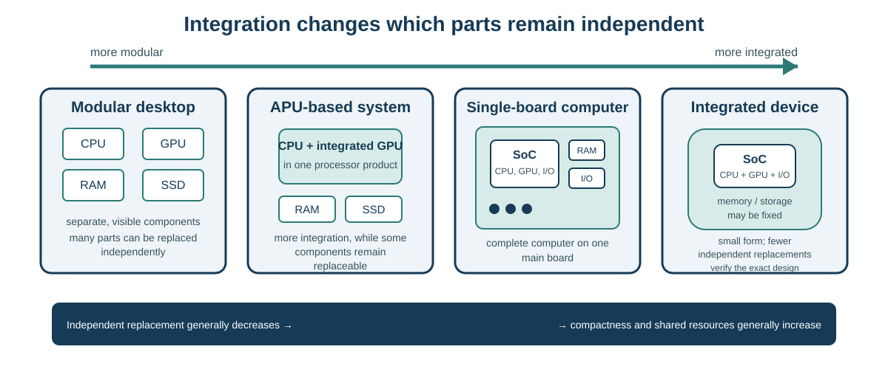

# Session 13 - From the modular PC to the integrated system: evaluating an SoC solution

## Purpose of the session

In Session 1, you began the course with a deliberately broad question: **where are the computers around us?** You may have identified a smartphone, watch, console, television, calculator, or another device that does not look like a desktop PC.

Since then, we have almost moved in the opposite direction. From Sessions 4 through 12, we separated the computer into visible, analysable functions: processor, RAM, storage, graphics, motherboard, controllers, connectors, and peripherals. The modular PC is particularly useful for learning these functions because many of them remain physically distinct.

This Session **closes that loop**. How can so many computing functions fit inside a phone, watch, router, smart television, or small embedded device? One major answer is **integration**: functions once spread across several chips or boards can be combined in one chip, one module, or one board.

SoC-based solutions are therefore not an exotic exception to the PC model. They are **ubiquitous in contemporary computing**, especially in smartphones, tablets, watches, televisions, network equipment, consoles, vehicles, appliances, and embedded systems. The modular PC remains important, but it is only one manifestation of what a computer can look like.

We will compare degrees of integration rather than search for one universally superior architecture. A compact solution may reduce space, power use, or cost for a specific requirement. The same integration may also limit repair, expansion, and upgrading.

!!! question "Return to Session 1"
    Think back to your “where are the computers?” list. For each very compact object, ask a new question: **which functions that we studied separately now need to be integrated for that device to exist in this form?**

## Objectives

By the end of the Session and associated Lab, you should be able to:

- explain the **system-on-chip (SoC)** concept;
- explain why highly integrated solutions are common in everyday computing devices;
- distinguish a chip, system-on-module, single-board computer, microcontroller, and modular computer;
- use an **AMD APU** as a conceptual bridge between a processor with integrated graphics and a more highly integrated solution;
- explain why **Arm** describes an instruction-set architecture rather than a physical form factor;
- compare integrated and modular platforms against a requirement;
- evaluate form factor, complete cost, power, heat, compatibility, repairability, and upgrading;
- explain how integration can change a device replacement cycle;
- make a provisional recommendation that separates facts, inferences, and missing evidence.

!!! info "Scope of the session"
    **Master today:** system-on-chip, single-board computer, embedded system, degree of integration, modular platform, complete cost, repairability, upgrading, and replacement cycle.

    **Recognize today:** the ubiquity of SoCs in familiar devices; system-on-module; microcontroller; APU; Arm; Apple Silicon; and Raspberry Pi.

    **Go further:** interconnected small dies (*chiplets*), specialized accelerators, advanced memory architectures, and detailed electronic design.

## Opening problem: three clients, three requirements

Consider three clients:

1. a shop wants a compact, quiet digital-signage system;
2. a person wants a gaming and live-streaming PC that can be upgraded for several years;
3. a team wants a small system to read sensors and control a device.

All three solutions contain processing, memory, storage, and interfaces. They do not require the same degree of integration.

```text
small size and low power
          ↕ trade-off
replacement, expansion, and upgrading
```

The useful question is not “Which architecture is best?” but:

> Which architecture satisfies the requirement, and what constraints does it create over the intended use period?

## Start from the modular PC

A modular desktop may separate major functions into distinct components:

```text
processor
+ motherboard and controllers
+ memory modules
+ graphics card or integrated graphics
+ storage
+ network controller
+ power and cooling
```

This separation can support diagnosis, replacement, and upgrading. It can also require more space, connectors, wiring, power-delivery capacity, or cooling, especially in a high-performance platform.

!!! question "Check: does modular automatically mean repairable?"
    No. Distinct parts may support replacement, but availability, documentation, tools, warranty, and enclosure design still matter.

## The AMD APU as a conceptual bridge

AMD uses **APU** for some products that combine processor cores and graphics in one product.

```text
separate processor + separate graphics card
                    ↓
processor with integrated graphics
                    ↓
broader integration in a system-on-chip
```

The APU acts as a **conceptual bridge**. It shows how a function once carried by a separate card can move into the processor product.

<figure markdown="span">
  { loading=lazy width="480" }
  <figcaption>An AMD A4-5300: the package resembles a conventional desktop processor, but the product combines processor cores with integrated graphics. Photo: Trio3D, <a href="https://commons.wikimedia.org/wiki/File:AMD_A4-5300.png">Wikimedia Commons</a>, <a href="https://creativecommons.org/licenses/by-sa/3.0/">CC BY-SA 3.0</a>.</figcaption>
</figure>

!!! warning "APU and SoC are not universal synonyms"
    APU is AMD product terminology. For a specific product, use its documentation to establish which functions are actually integrated.

## What is a system-on-chip?

A **system-on-chip**, or **SoC**, integrates several major functions on one chip. Depending on the product, it may include:

- processor cores;
- graphics;
- memory controllers;
- input-output and storage controllers;
- networking functions;
- media engines;
- specialized accelerators;
- security functions.

The word *system* does not mean that the complete computer exists inside the chip. The SoC still belongs to a board or device that may include memory, storage, power, connectors, and supporting parts.

Some commercial architectures place several interconnected dies in one integrated-circuit package. At this level, retain the central method: **product documentation must establish what is integrated, where it is located, and what remains replaceable.**

<figure markdown="span">
  { loading=lazy width="460" }
  <figcaption>The Apple M1 is a modern example of a large-scale SoC: processing, graphics, and several specialized engines are combined in one integrated design. Illustration: Henriok, <a href="https://commons.wikimedia.org/wiki/File:Apple_M1.jpg">Wikimedia Commons</a>, <a href="https://creativecommons.org/publicdomain/zero/1.0/">CC0 1.0</a>.</figcaption>
</figure>



The figure represents a **conceptual continuum**, not four rigid categories. A real device may sit between two examples, and a high degree of integration does not by itself establish performance or repairability. The exact product still needs to be examined.

## From the phone in your pocket to the SoC on the board

The smartphone makes integration especially concrete. A pocket-sized device needs to combine processing, graphics, photo/video processing, communication, power management, memory, storage, sensors, and many interfaces in very little space.

<figure markdown="span">
  { loading=lazy width="430" }
  <figcaption>The smartphone is one of the most familiar manifestations of a highly integrated computing platform. Photo: Bisasco baby, <a href="https://commons.wikimedia.org/wiki/File:Smart_phone_device.jpg">Wikimedia Commons</a>, <a href="https://creativecommons.org/licenses/by/4.0/">CC BY 4.0</a>.</figcaption>
</figure>

But **the phone is not the SoC**. The SoC is only one component on the main board, alongside memory, storage, radio circuits, power management, and other specialized components.

<figure markdown="span">
  { loading=lazy width="760" }
  <figcaption>A phone main board shows what “highly integrated” means at the hardware level: many functions are concentrated onto a very small board. The SoC remains one component in that assembly, not the complete device. Photo: IGeeksBlog, <a href="https://commons.wikimedia.org/wiki/File:IPhone_3Gs_Motherboard.jpg">Wikimedia Commons</a>, <a href="https://creativecommons.org/licenses/by-sa/4.0/">CC BY-SA 4.0</a>.</figcaption>
</figure>

!!! example "Return to Session 1's hidden computers"
    A phone or smartwatch does not need to resemble a PC to fit our working definition of a computer. Integration explains **how** the functions we studied separately throughout the course can fit into these familiar forms.

## Distinguish chip, module, board, and device

| Term | Main physical level | Main idea |
|---|---|---|
| **SoC** | chip | several major functions are integrated on one chip |
| **System-on-module (SoM)** | module | an SoC and supporting parts sit on a module for a carrier board |
| **Single-board computer (SBC)** | board | an almost complete computer is gathered on one main board |
| **Microcontroller** | chip | a small integrated computer is designed mainly for control and input-output |
| **Embedded system** | device or subsystem | the computer is built into a product or designed for a defined function |
| **Mini PC** | complete device | small size alone does not prove an SoC design |
| **Modular PC** | platform | several important components can be replaced separately |

A Raspberry Pi is a **single-board computer**. It contains an SoC, but the complete board also contains connectors, supporting circuits, and a storage path.

<figure>
  
  <figcaption>The Raspberry Pi 4 is a single-board computer: the SoC is only one board component. Photo: Michael H. (“Laserlicht”), <a href="https://commons.wikimedia.org/wiki/File:Raspberry_Pi_4_Model_B_-_Side.jpg">Wikimedia Commons</a>, <a href="https://creativecommons.org/licenses/by-sa/4.0/">CC BY-SA 4.0</a>.</figcaption>
</figure>

??? question "Check: SoC, SoM, or SBC?"
    - A chip combining processing, graphics, and controllers: **SoC**.
    - A module carrying the SoC and memory for a carrier board: **SoM**.
    - A board offering processing, memory, ports, and bootable storage: **SBC**.

## Arm is not a physical form factor

**Arm** describes a family of instruction-set architectures. It does not determine the size of the device.

An Arm device can be a phone, laptop, server, SBC, embedded system, or microcontroller. Two Arm devices may therefore differ greatly in performance, interfaces, operating systems, and purpose.

## Two case families: Apple Silicon and Raspberry Pi

### Apple Silicon

Apple Silicon systems integrate processing, graphics, media processing, and control functions. Depending on the model, integration may improve energy efficiency and reduce space while limiting separate replacement of memory or other subsystems.

A responsible recommendation verifies the studied model and distinguishes workload performance, software and peripheral compatibility, memory and storage selected at purchase, software-support duration, and repair options.

### Raspberry Pi

Raspberry Pi models target other requirements. Their small size, general-purpose input-output pins, and ecosystem can suit learning, prototyping, signage, small services, and embedded systems.

A Raspberry Pi does not automatically replace a PC. Suitability depends on the model, operating system, software, peripherals, storage, cooling, and expected performance.

## What integration may provide

Greater integration may provide a smaller form factor, fewer separate interconnections, lower power for a suitable workload, simpler cooling in some cases, lower complete cost for some uses, portability, or a platform suited to a specialized product.

These are possible benefits, not guarantees. They must be verified for the model and requirement.

## What integration may limit

An integrated solution may impose fixed or soldered memory, difficult-to-replace storage, limited expansion, fewer ports, dependence on adapters or docks, thermal limits under sustained load, software-compatibility limits, manufacturer dependence for repair, or replacement of the board or device when one subsystem becomes inadequate.

## Observe, document, and measure: different evidence

Lab 13 may use physical hardware, a prepared Velxio simulation, or a static evidence package. These routes do not produce the same evidence.

| Item | Physical hardware | Prepared Velxio | Static package |
|---|---|---|---|
| Real form and connectors | observed | represented | documented by image |
| Program behaviour | observed | simulated or emulated | described by transcript |
| Real heat and power | sometimes measurable | not established | documented only |
| Repair and replacement | inspection + documentation | not established | documentation required |
| Sustained performance | controlled measurement required | not established | documented result only |

A simulation may demonstrate a logical relationship between code and input-output. It does not prove real heat, power, durability, or performance.

## Form factor, complete cost, and replacement cycle

A low purchase price does not prove a low complete cost. Power supply, enclosure, storage, video adapter, USB hub, software licence, integration time, and support may also be required.

```text
modular PC
insufficient memory → add or replace memory
failed SSD          → replace the SSD
new graphics need   → replace the graphics card

highly integrated system
insufficient fixed memory
        ↓
replace the main board or device
```

Distinguish technical life, software-support life, useful performance, repairability, partial upgrading, and cost over the intended use period.

### Worked example: simplified teaching cost

| Item | Integrated system | Compact modular PC |
|---|---:|---:|
| Purchase | $300 | $520 |
| Required accessories | $110 | $30 |
| Estimated energy | $80 | $150 |
| Planned replacement | $300 | $90 |
| **Simplified total** | **$790** | **$790** |

The totals are equal in this model, but the risks differ. One scenario replaces the complete integrated system; the other replaces storage only. The recommendation must explain assumptions rather than compare only the final number.

## Platform-evaluation method

1. **Define the requirement.** Workload, space, budget, use period, and constraints.
2. **Identify the integration level.** Which functions belong to the chip, module, board, or separate component?
3. **Verify compatibility.** Software, OS, peripherals, storage, and networking.
4. **Compare criteria.** Form factor, ports, power, heat, performance, and complete cost.
5. **Examine lifecycle.** Support, diagnosis, repair, upgrading, and replacement.
6. **Separate statements.** Observed fact, inference, recommendation, and missing evidence.

??? question "Check: what evidence is missing?"
    A photograph may show that no DIMM is visible. It does not by itself establish maximum capacity, integration method, or repair policy. Model documentation is still required.

## Integrated synthesis

Return first to the Session 1 question: computers do not disappear when they stop looking like PCs. In many familiar devices, **integration simply makes their components less visible and less independent**.

Then return to the three clients.

- A digital-signage system may favour integration when software, ports, operating temperature, and support are verified.
- A gaming and live-streaming PC may gain more value from replaceable graphics, storage, or memory than from very small size.
- A sensor system may suit an SBC or microcontroller, but those categories do not provide the same OS or resources.

Integration changes the trade-offs. The responsible choice depends on the requirement, intended use period, and available evidence.

## Common errors to avoid

- **Confusing the SoC with the complete computer.** Check whether the statement describes a chip, module, board, or device.
- **Assuming SoCs are limited to development boards.** Phones, tablets, watches, and many embedded products also depend on highly integrated designs.
- **Treating APU and SoC as synonyms.** Check the documented product organization.
- **Assuming Arm means small or low-performance.** Arm describes an instruction-set architecture.
- **Assuming integration always lowers complete cost.** Include accessories, energy, and expected replacement.
- **Assuming soldered parts cannot fail.** Integration mainly changes the available repair options.
- **Calling a system upgradeable without evidence.** Name the parts that are actually replaceable and the documented limits.

## What to remember

- An SoC integrates several major functions on one chip.
- SoCs and other highly integrated platforms are common in the phones, tablets, watches, network equipment, televisions, and embedded systems around us.
- SoM, SBC, and complete device describe different physical levels.
- An APU is a conceptual bridge, not a universal synonym for SoC.
- Arm is an instruction-set architecture, not a form factor.
- Integration may improve size, efficiency, and cost for some requirements.
- It may reduce expansion, repairability, and upgrading.
- Complete cost and replacement cycle must be evaluated against the client requirement.
- Responsible recommendations separate facts, inferences, and missing evidence.

## Put it into practice

[Lab 13](../labs/lab-13.md) provides a complete evidence package for comparing integrated and modular platforms. Physical Raspberry Pi or prepared Velxio observation may enrich the work without becoming the only route.
