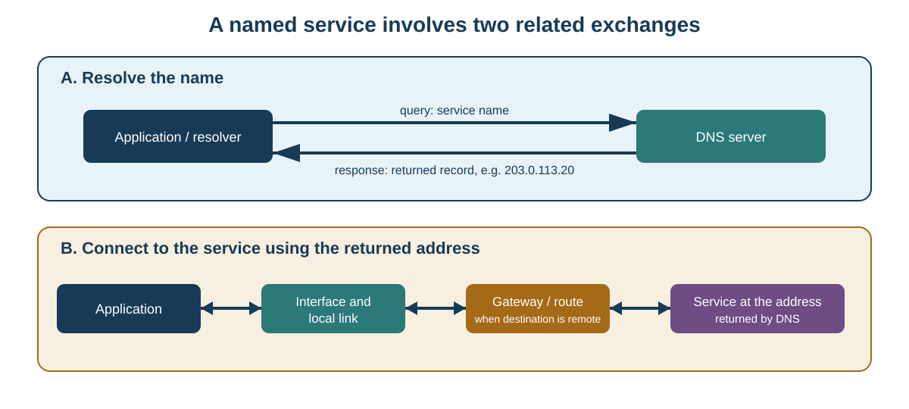

# Session 14 - From the network interface to the service: tracing two exchanges

## Purpose of the session

Session 12 separated the 8P8C connector from Ethernet technology. Session 13 showed that a network controller may be integrated into a motherboard, SoC, or complete computer.

We now follow data **beyond the connector and adapter**. An application that communicates with a named service depends on a chain of responsibilities: local link, addressing, routing decision, name resolution, transport, and the application service.

Communication with a named service often requires **two related but distinct exchanges**:

1. resolve the name through DNS;
2. communicate with the returned address through IP and a transport protocol.

Each exchange is itself encapsulated through several layers. A problem described as “the Internet is down” may therefore actually be located in a cable, Wi-Fi link, address, route, DNS, TCP, UDP, or the final application.

This Session answers five questions:

> How does application data become an Ethernet or Wi-Fi frame, and how is it unpacked again at the destination?

> How does a workstation decide whether to send directly to a local machine or hand the packet to a gateway?

> What roles do MAC addresses, IP addresses, and logical ports play, and why are they not interchangeable?

> Why do DNS, DHCP, TCP, UDP, and ICMP solve different problems?

> Which evidence helps locate a failure without changing workstation configuration?

## Objectives

### Main pathway

By the end of the Session and associated Lab, you should be able to:

- distinguish network card or adapter, network interface, physical medium, and link;
- explain the general roles of a switch, wireless access point, and router;
- explain simple encapsulation as `application data → transport → IP → frame → signal`;
- distinguish an Ethernet frame, IP packet, TCP segment, and UDP datagram;
- explain the roles of a MAC address, IPv4 address, prefix, and logical port;
- interpret an IPv4 address with its prefix and determine whether a simple destination is local or remote;
- explain how ARP finds a MAC address for an IPv4 next hop on an Ethernet link;
- explain why a remote destination IP may be carried inside a frame addressed to the default gateway's MAC address;
- explain a default route and recognize that a host may have several routes and interfaces;
- describe the basic DHCP exchange and distinguish automatic configuration from proven connectivity;
- distinguish the DNS resolver, DNS server, and final service;
- recognize A, AAAA, and CNAME records and DNS TTL at an introductory level;
- distinguish TCP and UDP services without reducing them to “reliable” and “fast”;
- explain source and destination ports in transport communication;
- explain what `ping`, `tracert`, `Resolve-DnsName`, and a TCP port test can and cannot prove;
- compare basic wired and wireless characteristics against a requirement;
- interpret simple network output and distinguish observation, inference, and missing evidence;
- apply layered troubleshooting and select the most precise next test;
- formulate a network recommendation that considers compatibility, stability, efficiency, and maintainability.

!!! question "Guiding questions"
    1. **Which layer currently carries the data?** Application, transport, IP, link, or physical medium?
    2. **Is the destination local or remote?** The prefix changes the next step.
    3. **Which address belongs to this layer?** MAC, IP, and logical port do not identify the same thing.
    4. **Which service is actually being tested?** A DNS response is not an HTTP response; `ping` is not a TCP-port test.
    5. **What conclusion does the evidence really support?** A positive or negative result confirms some responsibilities, not the whole chain.

!!! info "Scope of the session"
    **Master today:** adapter and interface; medium and link; switch, access point, and router; encapsulation; frame, packet, segment, and datagram; MAC address; IPv4 address and prefix; local-or-remote decision; ARP; gateway and default route; DHCP; DNS; logical ports; TCP; UDP; ICMP; `ping`; `tracert`; layered troubleshooting; wired/wireless comparison.

    **Recognize today:** loopback; IPv4 link-local `169.254.0.0/16`; private IPv4 ranges; documentation-only address ranges; IPv6 and 128-bit addresses; `::1`; IPv6 link-local addresses; routing table; SSID; Wi-Fi PHY rate; locally administered or randomized MAC addresses.

    **Go further after the Lab link:** general subnet calculations; Ethernet/IP/TCP/UDP header details; IPv6 neighbour discovery; NAT; VLANs; MTU and fragmentation; detailed recursive DNS and encrypted DNS; dynamic routing. This section is optional.

<div class="admonition info session-14-navigation"><p class="admonition-title">Navigation guide</p>
<p>This Session is deliberately detailed because it should remain useful as a reference. For a first reading, follow this pathway:</p>
<ol>
<li><strong>Communication chain:</strong> encapsulation and each layer's responsibility.</li>
<li><strong>Local link:</strong> Ethernet, Wi-Fi, switch, access point, and MAC address.</li>
<li><strong>Logical addressing:</strong> IPv4, prefix, ARP, and gateway.</li>
<li><strong>Configuration and names:</strong> DHCP, then DNS.</li>
<li><strong>Transport:</strong> ports, TCP, and UDP.</li>
<li><strong>Troubleshooting:</strong> ICMP, <code>ping</code>, <code>tracert</code>, and the next useful test.</li>
</ol>
<p>General subnetting, NAT, VLANs, and detailed protocol headers remain enrichment material.</p></div>

## Opening problem: “the network doesn't work”

On a lab workstation, an application cannot reach `service.test`.

The workstation reports:

```text
Ethernet interface : Up
link speed         : 1 Gbps
IPv4 address       : 192.168.10.25/24
gateway            : 192.168.10.1
DNS server         : 192.168.10.53
```

Then:

```powershell
Resolve-DnsName service.test
```

fails, while a controlled test to an instructor-provided IP address succeeds.

It is tempting to conclude: “the cable is good, so the network works and DNS is broken.” The first part is too broad. An active link is useful evidence, but it does not verify every route, the final service, the correct port, authentication, or the application.

We need a method that separates responsibilities and asks at each step:

> What does this result confirm, and what remains unknown?

## Communication is a stack, not one pipe

When an application sends data, each layer adds information needed for its own task.

```text
application data
      ↓
TCP segment       or       UDP datagram
      ↓
IP packet
      ↓
Ethernet or Wi-Fi frame
      ↓
bits, electrical signals, light, or radio waves
```

At the destination, the process is reversed.

| Unit | Layer | Contains, among other things |
|---|---|---|
| Application data | Application | DNS query, HTTP request, file data, message, etc. |
| TCP segment | Transport | ports, sequence numbers, acknowledgements, flags |
| UDP datagram | Transport | ports, length, checksum |
| IP packet | Internet | source/destination IP addresses, upper protocol, hop limit |
| Ethernet frame | Link | source/destination MAC addresses, type, payload, FCS |

!!! warning "The terms are not interchangeable"
    In casual conversation, “packet” may be used loosely for network data. During troubleshooting, precise vocabulary identifies the responsibility: MAC addresses belong to local delivery, IP addresses to routed packets, and ports to transport.

### Encapsulation

```text
┌────────────────────────────────────────────┐
│ Ethernet frame                             │
│  ┌──────────────────────────────────────┐  │
│  │ IPv4 packet                          │  │
│  │  ┌────────────────────────────────┐  │  │
│  │  │ TCP segment                    │  │  │
│  │  │  ┌──────────────────────────┐  │  │  │
│  │  │  │ application data         │  │  │  │
│  │  │  └──────────────────────────┘  │  │  │
│  │  └────────────────────────────────┘  │  │
│  └──────────────────────────────────────┘  │
└────────────────────────────────────────────┘
```

The same IP packet may be carried in different link frames as it crosses different networks. This is one reason **MAC addresses and IP addresses have different jobs**.

## Adapter, interface, medium, and link

A **network card or adapter** is the hardware that allows communication. It may be integrated into a motherboard or SoC, installed in PCI Express, attached through USB, built into a portable device, or represented virtually.

The operating system exposes that capability as a **network interface**. A host may therefore display Ethernet, Wi-Fi, VPN, virtual-switch, virtual-machine, and disabled interfaces at the same time.

A visible interface does not prove that a **link** is working.

<figure markdown="span">
  { loading=lazy width="680" }
  <figcaption>This historical network card reinforces the distinction between the hardware adapter and the physical media it can expose. Photo: Nixdorf, <a href="https://commons.wikimedia.org/wiki/File:Network_card.jpg">Wikimedia Commons</a>, <a href="https://creativecommons.org/licenses/by-sa/3.0/">CC BY-SA 3.0</a>.</figcaption>
</figure>

### Physical or virtual interface?

```text
Name       Description                  Status   LinkSpeed
Ethernet   Intel(R) Ethernet Adapter    Up       1 Gbps
vEthernet  Hyper-V Virtual Ethernet     Up       10 Gbps
```

The `10 Gbps` value does not prove that a physical 10-Gbit/s cable connects the workstation to the network. A virtual interface may represent an internal software path.

??? question "Check: which interface should describe the physical link?"
    Identify the physical adapter associated with the cable or radio actually used. A virtual interface may matter to a VM, but it does not replace observation of the host's physical path.

## Ethernet: local communication in frames

Ethernet is a family of IEEE 802.3 technologies. In a modern office network, a workstation is commonly connected point-to-point to a **switch**.

<figure markdown="span">
  { loading=lazy width="760" }
  <figcaption>A switch connects several local Ethernet links. Photo: Raysonho @ Open Grid Scheduler / Grid Engine, <a href="https://commons.wikimedia.org/wiki/File:EthernetSwitch.jpg">Wikimedia Commons</a>, <a href="https://creativecommons.org/publicdomain/zero/1.0/">CC0 1.0</a>.</figcaption>
</figure>

### Simplified Ethernet frame

```text
┌──────────────┬──────────────┬───────────┬──────────────┬─────┐
│ dest. MAC    │ source MAC   │ type      │ payload      │ FCS │
│ 6 bytes      │ 6 bytes      │ 2 bytes   │              │     │
└──────────────┴──────────────┴───────────┴──────────────┴─────┘
```

The diagram is intentionally simplified. For this Session, remember that the frame identifies a local source and destination and may carry IPv4, IPv6, ARP, or another protocol.

### MAC addresses

A common Ethernet MAC address is `48 bits` or `6 bytes`, often displayed in hexadecimal:

```text
00-11-22-33-44-55
```

or:

```text
00:11:22:33:44:55
```

A MAC address supports delivery **on the local link**. It is not the permanent identity of an entire computer: systems may have multiple interfaces, virtual interfaces, locally administered addresses, or randomized addresses.

The Ethernet broadcast address is:

```text
FF:FF:FF:FF:FF:FF
```

ARP uses broadcast for some local questions.

### What a switch does

In a simplified model, an Ethernet switch:

1. receives a frame on a port;
2. learns the source MAC address on that port;
3. examines the destination MAC address;
4. forwards the frame toward the known destination port when possible;
5. floods broadcasts and some unknown destinations across the local domain.

The switch does not normally decide the IP path to the Internet. That is routing's job.

!!! warning "Switch and router are not synonyms"
    One commercial box may combine switching, routing, Wi-Fi, DHCP, and other functions. The functions still need to be distinguished: a switch forwards local frames; a router forwards IP packets between networks.

## Wi-Fi: a local link over shared radio

Wi-Fi belongs to the IEEE 802.11 family. A Wi-Fi station commonly communicates with a **wireless access point**, which may bridge traffic to a wired LAN.

<figure markdown="span">
  { loading=lazy width="650" }
  <figcaption>A wireless access point provides a radio link to wireless stations. Photo: Pjpearce, <a href="https://commons.wikimedia.org/wiki/File:Wireless_access_point.jpg">Wikimedia Commons</a>, <a href="https://creativecommons.org/publicdomain/zero/1.0/">CC0 1.0</a>.</figcaption>
</figure>

### Access point, router, and “Wi-Fi router”

A **wireless access point** provides the Wi-Fi link. A **router** connects IP networks. A home “Wi-Fi router” commonly combines:

```text
router
+ Ethernet switch
+ wireless access point
+ DHCP server
+ often firewall, NAT, and other services
```

Separating those roles makes troubleshooting more precise.

### Why Wi-Fi throughput varies

Useful throughput depends on the capabilities common to the client and AP, band, channel, channel width, signal quality, distance, obstacles, interference, competing stations, retransmissions, protocol overhead, and upstream network load.

Reported **link speed** or **PHY rate** is therefore not guaranteed application throughput.

### SSID

The **SSID** is a network name used to identify a Wi-Fi network to users and stations. It does not replace an IP address. Wi-Fi also uses link-layer addresses, although detailed 802.11 frame formats are beyond the main pathway.

## IPv4: a 32-bit logical address

An IPv4 address contains `32 bits`, usually written as four decimal octets:

```text
192.168.10.25
```

The address alone is incomplete. The **prefix** tells the host which bits identify the local network.

```text
192.168.10.25/24
```

means that the first `24` bits are part of the prefix used for routing decisions.

### Connect the prefix to binary

`/24` corresponds to:

```text
11111111.11111111.11111111.00000000
255.255.255.0
```

With:

```text
workstation: 192.168.10.25/24
local host:  192.168.10.80
remote host: 192.168.11.5
```

`192.168.10.80` shares the local `/24`; `192.168.11.5` does not.

### A prefix that does not end on an octet boundary

```text
address: 192.168.10.130/26
mask:    255.255.255.192
```

The last octet gives:

```text
130      = 10000010
192      = 11000000
AND        10000000 = 128
```

So the network prefix is:

```text
192.168.10.128/26
```

`192.168.10.180` is inside this prefix; `192.168.10.200` is not.

!!! note "You do not need full subnetting today"
    The main pathway requires understanding **why the prefix is necessary** and classifying supplied examples. General subnet calculations remain enrichment.

## IPv4 ranges to recognize

| Prefix | Role to recognize |
|---|---|
| `10.0.0.0/8` | private use |
| `172.16.0.0/12` | private use |
| `192.168.0.0/16` | private use |
| `169.254.0.0/16` | IPv4 link-local/autoconfiguration |
| `127.0.0.0/8` | IPv4 loopback |
| `192.0.2.0/24` | documentation TEST-NET-1 |
| `198.51.100.0/24` | documentation TEST-NET-2 |
| `203.0.113.0/24` | documentation TEST-NET-3 |

A private address is not “fake”; it is valid inside private networks but is not globally routed on the public Internet.

## Local or remote: the decision that changes the frame

Assume:

```text
workstation     192.168.10.25/24
workstation MAC 00:11:22:33:44:55
gateway         192.168.10.1
gateway MAC     AA:AA:AA:AA:AA:AA
local host      192.168.10.80
local host MAC  66:77:88:99:AA:BB
remote host     203.0.113.20
```

For a **local** destination, the IP packet targets `192.168.10.80` and the Ethernet frame targets the local host's MAC address.

For a **remote** destination, the IP packet still targets `203.0.113.20`, but the first Ethernet frame targets the gateway's MAC address.

!!! question "Check: does the gateway replace the destination IP?"
    Not in this simple routing model. The gateway receives a link-layer frame addressed to itself, removes that local envelope, examines the packet's destination IP, and selects the next hop. NAT may modify addresses in other scenarios and remains enrichment.

## ARP: finding the IPv4 next-hop MAC address

**ARP** maps a local IPv4 next hop to a link-layer address such as an Ethernet MAC address.

For a local host, the workstation may ask essentially:

> Who has 192.168.10.80? Tell me your link-layer address.

For a remote host such as `203.0.113.20`, the workstation **does not** look for the remote server's MAC address. It resolves the MAC of its local next hop, here `192.168.10.1`.

```text
remote destination IP
        ↓
routing decision
        ↓
next hop = 192.168.10.1
        ↓
ARP: which MAC owns 192.168.10.1?
        ↓
frame to gateway MAC
```

The system temporarily caches some IP↔MAC mappings. A cached entry is useful evidence but not proof that every service on that host is currently available.

## Local switch, then router

```text
workstation
  │ frame dest. MAC = gateway
  ▼
switch
  │ forwards according to MAC
  ▼
router / gateway
  │ removes local frame
  │ examines destination IP
  │ decrements hop limit
  │ selects route
  ▼
new link
  │ new frame for that link
  ▼
next hop
```

IP packets may cross multiple routers. Link frames are local to each link and are replaced as the packet progresses.

## Routing: choosing a next hop

A host has a **routing table**. A simplified example:

```text
192.168.10.0/24  → directly through Ethernet
0.0.0.0/0        → gateway 192.168.10.1
```

`0.0.0.0/0` is a **default route**, used when no more specific route applies.

A host may also have loopback routes, local routes, VPN routes, virtual interfaces, several physical adapters, and routes added by software. The presence of one default gateway therefore does not prove every destination will always use that same interface.

## DHCP: obtain configuration, not “Internet”

**DHCP** can provide an IPv4 address, prefix or mask, default gateway, DNS servers, lease duration, and other options.

### Basic exchange

```text
client                         DHCP server
  │ DHCPDISCOVER  ───────────────→ │
  │ ←────────────── DHCPOFFER      │
  │ DHCPREQUEST   ───────────────→ │
  │ ←────────────── DHCPACK        │
```

This is often remembered as **DORA**: Discover, Offer, Request, Acknowledge.

A successful lease proves configuration was obtained through that process. It does **not** prove the DNS server currently responds, the gateway reaches every destination, or the final service works.

### `169.254.0.0/16`

Windows may self-assign an IPv4 link-local address when a DHCP-configured interface does not obtain the expected lease.

This supports the conclusion that normal DHCP configuration was not obtained. It does **not** automatically locate the cause: link, authentication, server, relay, or another dependency may be involved.

## DNS: turn a name into usable information

**DNS** is a distributed database that associates names with records.

```text
application
   ↓
system resolver
   ↓
configured DNS / recursive resolver
   ↓ if needed
other DNS servers
   ↓
response
```

The configured resolver may answer from cache rather than contacting authoritative infrastructure for every request.

| Record | General role |
|---|---|
| `A` | name → IPv4 address |
| `AAAA` | name → IPv6 address |
| `CNAME` | alias → canonical name |
| `MX` | mail exchangers for a domain |
| `NS` | name servers for a zone |

The main pathway mainly requires recognizing `A`, `AAAA`, and `CNAME`.

### DNS TTL and caching

A DNS record commonly has a **TTL** that controls how long a result may remain cached under DNS rules.

!!! warning "DNS TTL and IP TTL are different"
    DNS TTL controls cache lifetime. IPv4 TTL limits packet hops. They share an acronym but solve different problems.

## Two exchanges to reach a named service

### Exchange A: DNS resolution

```text
application
→ resolver
→ DNS server 192.168.10.53
→ response: A 203.0.113.20
```

The DNS query itself still uses transport, IP, and a local link.

### Exchange B: service connection

```text
application
→ transport protocol and port
→ IP packet to 203.0.113.20
→ route / gateway
→ remote network
→ service
```

The DNS server is not automatically a hop on this second path.



??? question "Check: does successful DNS prove the service works?"
    No. It proves that a usable DNS response was obtained. The final service may still be unavailable, filtered, misconfigured, inaccessible on the requested port, or incompatible with the application.

## Logical ports: deliver to the right process

IP reaches a host or logical interface. Multiple applications may communicate at once. TCP and UDP use **ports** to identify communication endpoints.

Port numbers are `16 bits`, from `0` through `65,535`.

```text
source IP + source port
 destination IP + destination port
 transport protocol
```

Example:

```text
192.168.10.25:51842  →  203.0.113.20:443  TCP
```

The client's source port is often selected temporarily; the destination port identifies the requested service according to the application protocol and configuration.

## TCP: connection and ordered byte stream

**TCP** provides an ordered byte-stream service with sequence numbers, acknowledgements, retransmission, checksum, flow control, congestion control, and connection state.

### Simplified three-way handshake

```text
client                         server
  │ SYN        ─────────────────→ │
  │ ←──────────────── SYN + ACK   │
  │ ACK        ─────────────────→ │
  │                                │
  │        TCP data follows        │
```

The goal is not to memorize every TCP flag today. The important point is that a TCP port test checks something different from `ping`.

### Success, refusal, and timeout differ

- a **successful connection** supports that a TCP service accepted the connection on that address and port;
- **connection refused** means a negative response was received, commonly because no service is listening or policy explicitly rejected it;
- **timeout** may reflect filtering, route failure, outage, or silence and is less precise about location.

## UDP: datagrams without a TCP connection

**UDP** provides a simpler datagram service. Its header includes source port, destination port, length, and checksum.

UDP itself does not provide TCP's connection handshake, automatic retransmission, ordered delivery, or equivalent flow control.

That does not make every UDP application “unreliable.” Applications may add their own sequencing, acknowledgements, correction, or recovery. Modern protocols such as QUIC build richer behaviour above UDP.

“UDP = fast” is therefore too broad.

## ICMP: control and IP troubleshooting

**ICMP** is neither TCP nor UDP. It carries control messages associated with IP.

Useful types to recognize include Echo Request, Echo Reply, Destination Unreachable, and Time Exceeded.

### `ping`

A successful `ping` supports that an ICMP Echo round trip succeeded for those messages. It does **not** prove that a Web service works, a TCP port is open, DNS works, or all future packets will succeed.

A failed `ping` does not prove the host is down because ICMP may be filtered.

## `tracert`: use the hop limit

In IPv4, routers decrement the packet's **TTL**. When it reaches zero, a router may return ICMP **Time Exceeded**. Windows `tracert` exploits this by sending probes with increasing TTL values.

```text
TTL 1 → first router may answer
TTL 2 → second router may answer
TTL 3 → third router may answer
...
```

### Why an asterisk is not automatically a failed router

```text
1  192.168.10.1
2  *  *  *
3  198.51.100.8
4  203.0.113.20
```

The second hop did not provide the expected response, but later hops did. The correct statement is that the second hop **did not answer this probe as expected**, not that the router is necessarily down.

## Read outputs as limited evidence

### Interface state

```text
Name      InterfaceDescription        Status  LinkSpeed
Ethernet  Intel(R) Ethernet Adapter    Up      1 Gbps
Wi-Fi     Wireless Adapter             Down    0 bps
```

**Observation:** Ethernet reports `Up` at `1 Gbps`.

**Reasonable inference:** an Ethernet link has been established at the reported rate.

**Not proved:** DHCP, DNS, gateway, Internet, or remote service.

### IP configuration

```text
IPv4Address : 192.168.10.25
PrefixLength: 24
Gateway     : 192.168.10.1
DNSServer   : 192.168.10.53
DHCP        : Enabled
```

These values are configured or reported. They do not prove the gateway or DNS server currently responds.

### DNS result

```text
Name         Type TTL Section IPAddress
service.test A    300 Answer  203.0.113.20
```

This supports that an `A` record was returned. It does not prove the final service accepts a connection.

### TCP port test

```powershell
Test-NetConnection 203.0.113.20 -Port 443
```

Using the IP address directly isolates TCP connectivity better from DNS resolution. Using a name adds DNS as another dependency.

### Observed route

```text
1  192.168.10.1
2  *  *  *
3  198.51.100.8
4  203.0.113.20
```

This shows some routers returned responses consistent with `tracert`. It does not prove the reverse path is identical or that the application service works.

## Small troubleshooting toolkit

| Tool or observation | Target question | Does not prove by itself |
|---|---|---|
| link light/status | is there a local link? | IP configuration or remote service |
| `Get-NetAdapter` | which interfaces and states are reported? | which path an application will actually use |
| `Get-NetIPConfiguration` | which addresses, gateway, and DNS are configured? | that those systems answer |
| `ping <IP>` | does ICMP Echo round-trip? | TCP, UDP, or application service |
| `Resolve-DnsName <name>` | which DNS response is obtained? | final service availability |
| `tracert -d <IP>` | which hops answer TTL probes? | guaranteed path or final service |
| `Test-NetConnection <IP> -Port n` | does a TCP connection to this port succeed? | correct application behaviour above TCP |

!!! warning "A tool may test several layers at once"
    `ping example.name` must resolve the name before sending ICMP. To isolate DNS from IP connectivity, use an approved IP address or a controlled transcript. Good troubleshooting reduces unnecessary dependencies in each test.

## Wired or wireless? Evaluate against the need

| Criterion | Wired | Wireless |
|---|---|---|
| Mobility | low once cable is installed | high |
| Medium | copper or fibre depending on technology | radio |
| Interference | generally more predictable on a correctly installed link | environment-dependent |
| Link rate | often stable on a dedicated link | varies with signal, sharing, and modulation |
| Latency | usually predictable on the LAN | may vary with contention and retransmission |
| Installation | cabling, outlets, switches | coverage, AP placement, channels, power |
| Security | physical port control can help but is insufficient alone | radio authentication/encryption is essential |
| Troubleshooting | physical link and counters are often direct | adds signal, channel, association, and roaming |

A fixed live-streaming workstation may favour Ethernet when stability and predictable behaviour matter and cabling is available. A portable used across several rooms naturally favours Wi-Fi, but coverage, client/AP capabilities, security, driver stability, and fallback options still need to be evaluated.

## Layered troubleshooting method

The best first test is not always `ping`. It depends on what is already confirmed.

1. **Define the symptom.** “Internet doesn't work” is too broad.
2. **Confirm medium and link.** Cable, radio signal, interface, negotiated state.
3. **Confirm logical configuration.** Address, prefix, gateway, DNS, unexpected link-local configuration.
4. **Decide local or remote.** The prefix determines whether the next hop is local or a gateway.
5. **Test the nearest unconfirmed responsibility.** Do not repeat already-supported checks without a reason.
6. **Preserve uncertainty.** Write: “This test confirms X. It does not confirm Y. The next test targets Z.”

### Integrated scenarios

**A — interface down**

```text
Ethernet : Down
IPv4     : none
```

The first unconfirmed responsibility is the interface or link. DNS is not yet a useful test.

**B — `169.254.x.x`**

```text
Ethernet : Up
IPv4     : 169.254.34.8/16
Gateway  : none
```

The link appears present, but expected IPv4 configuration was not obtained. DHCP or one of its dependencies needs investigation.

**C — DNS fails, controlled IP succeeds**

```text
Ethernet : Up
IPv4     : 192.168.10.25/24
Gateway  : 192.168.10.1
DNS      : 192.168.10.53
Resolve-DnsName service.test : timeout
controlled test to 203.0.113.20 : success
```

The evidence makes name resolution the priority. It does not justify saying “everything except DNS works.”

**D — TCP connection refused**

```text
DNS    : service.test → 203.0.113.20
Route  : destination reached in transcript
TCP    : requested port refused
```

Resolution and part of the IP path are supported. The next questions concern the service, expected port, and filtering policy.

## Evaluate a network solution as a component

C12 asks students not only to troubleshoot but to **evaluate** components.

Start with the requirement: mobility or fixed workstation, useful throughput, latency sensitivity, distance, available infrastructure, security requirements, operating system and drivers, budget, and expected lifetime.

Then verify compatibility:

```text
hardware form/interface
+ operating-system driver
+ supported network standards
+ common capability with the network
+ cabling / antennas / connectors
+ required security and authentication
```

A faster-rated adapter does not automatically improve performance when the switch, AP, cable, signal, or upstream service is the actual limit.

### Lifecycle

| Criterion | Network question |
|---|---|
| **Longevity** | Will standards, rates, drivers, and security remain suitable for the expected life? |
| **Stability** | Is the link predictable in the real environment? Are drivers and hardware sufficiently proven? |
| **Efficiency** | Does the gain in performance or mobility justify cost, power, cabling, coverage, and complexity? |
| **Maintainability** | Can the adapter, cable, or AP be replaced? Will drivers and diagnostic tools remain available? |

## Integrated synthesis: trace both exchanges and the layers

### Exchange A — obtain the address

```text
name
 ↓
DNS resolver
 ↓
DNS server
 ↓
A / AAAA / CNAME record
```

### Exchange B — reach the service

```text
returned address
 ↓
port + TCP/UDP
 ↓
IP packet
 ↓
local-or-remote decision
 ↓
ARP for host or gateway
 ↓
Ethernet frame / Wi-Fi link
 ↓
switch / access point
 ↓
router if destination is remote
 ↓
service
```

At each router in a simple IPv4 path without NAT, the local frame is removed, destination IP is examined, TTL is decremented, a route is selected, and a new frame is constructed for the next link.

## Common errors to avoid

| Plausible error | Corrective test or method |
|---|---|
| Treating `Up` as proof the Internet works | State only the confirmed link; test the next responsibility. |
| Picking `vEthernet` as the physical interface because it reports 10 Gbps | Identify the physical adapter and actual path. |
| Confusing frame, packet, and segment | Identify the layer and addresses belonging to it. |
| Treating a MAC address as permanent computer identity | Reason by interface and account for virtual/randomized addresses. |
| Looking for the MAC of a remote Internet server | Resolve the MAC of the **local next hop**, usually the gateway. |
| Reading an IP address without its prefix | Use address + prefix to decide local or remote. |
| Assuming the gateway replaces destination IP | Separate packet IP addresses from frame MAC addresses. |
| Saying DHCP “provides Internet” | Treat DHCP as configuration; test route, DNS, and service separately. |
| Placing DNS as a mandatory hop to the final service | Draw two separate exchanges. |
| Confusing DNS TTL and IP TTL | DNS: cache lifetime; IP: hop limit. |
| Saying “network port” without context | Specify physical switch port or TCP/UDP port. |
| Saying TCP is “slow but reliable” and UDP “fast but unreliable” | Describe actual mechanisms and relate them to application needs. |
| Treating failed `ping` as proof the host is offline | Test the intended service; ICMP may be filtered. |
| Treating a `tracert` asterisk as route failure | Check later hops and limit the conclusion to the ICMP response. |
| Confusing link speed with application throughput | Examine the complete path and workload. |
| Treating a “Wi-Fi router” as one function | Separate access point, switching, routing, DHCP, and other services. |

## What to remember

- Network communication is **encapsulated**: application, transport, IP, link, and physical medium have different responsibilities.
- The card or adapter is hardware; the interface is the operating-system representation; interfaces may be physical or virtual.
- A switch forwards frames within a local link; a router forwards IP packets between networks; an access point provides a Wi-Fi link.
- A MAC address supports local delivery. An IP address supports routed logical communication. A TCP/UDP port identifies an application communication endpoint.
- IPv4 must be interpreted with its prefix to decide whether a destination is local or remote.
- ARP maps an IPv4 next hop to a MAC address on the local link. For a remote destination, the next hop is normally the gateway, not the final server.
- A default route is a fallback route; a host may have several routes and interfaces.
- DHCP supplies configuration. Plausible configuration does not prove DNS, gateway, or final service availability.
- DNS returns records and may answer from cache. Name resolution is a separate exchange from the service connection.
- TCP provides an ordered byte stream with connection and reliability mechanisms; UDP provides datagrams with fewer built-in mechanisms. Suitability depends on the application.
- ICMP supports control and troubleshooting. `ping` and `tracert` do not directly test a TCP or UDP application service.
- Responsible troubleshooting confirms one responsibility at a time and chooses the next test that most precisely reduces uncertainty.
- A network recommendation should consider compatibility, stability, efficiency, and maintainability, not only the largest advertised Gbit/s number.

## Put it into practice

In [Lab 14 - Observing and diagnosing two network exchanges](../labs/lab-14.md), you will interpret physical and virtual interfaces, IPv4 configuration, local-or-remote decisions, DNS resolution, ICMP tests, and a service connection. You will then apply the layered method to stable scenarios and formulate network requirements for the Atlas evolving specification.

## Go further

### IPv6

IPv6 uses `128-bit` addresses, commonly written as hexadecimal groups separated by colons:

```text
2001:db8:1234:5678::25
```

IPv6 loopback is `::1`. Link-local addresses belong to `fe80::/10`. IPv6 uses **Neighbour Discovery** through ICMPv6 rather than ARP for corresponding functions.

### General IPv4 subnetting

For an arbitrary prefix, a bitwise AND between an address and mask determines the network prefix. General range, broadcast, and host-count calculations remain beyond today's main pathway.

### NAT

**Network Address Translation** may modify addresses and sometimes ports as packets cross an intermediate device. It is common between private IPv4 networks and the public Internet but is not required to understand the local/gateway logic in the main pathway.

### VLANs

A switched network can be logically divided into separate broadcast domains using VLANs. Two ports on the same physical switch are therefore not necessarily in the same logical link. Detailed 802.1Q tagging remains outside this Session.

### MTU and fragmentation

Each link has limits on the amount of data it can carry in a frame or packet. MTU problems can create cases where small communication succeeds but larger transfers fail. Detailed IPv4 and IPv6 behaviour remains enrichment.

### Recursive and encrypted DNS

A recursive resolver may consult root, top-level-domain, and authoritative servers while caching results. DNS over TLS and DNS over HTTPS encrypt transport between some clients and resolvers; they do not change the fundamental role of DNS records.

## Technical reference sources

- [IEEE 802.3 - Standard for Ethernet](https://standards.ieee.org/ieee/802.3/10422/)
- [IEEE 802.11-2024 - Wireless LAN MAC and PHY specifications](https://standards.ieee.org/ieee/802.11/10548/)
- [RFC 791 - Internet Protocol](https://www.rfc-editor.org/rfc/rfc791.html)
- [RFC 826 - Address Resolution Protocol](https://www.rfc-editor.org/rfc/rfc826.html)
- [RFC 2131 - Dynamic Host Configuration Protocol](https://www.rfc-editor.org/rfc/rfc2131.html)
- [RFC 1034 - Domain Names: Concepts and Facilities](https://www.rfc-editor.org/rfc/rfc1034.html)
- [RFC 1035 - Domain Names: Implementation and Specification](https://www.rfc-editor.org/rfc/rfc1035.html)
- [RFC 9293 - Transmission Control Protocol](https://www.rfc-editor.org/rfc/rfc9293.html)
- [RFC 768 - User Datagram Protocol](https://www.rfc-editor.org/rfc/rfc768.html)
- [RFC 792 - Internet Control Message Protocol](https://www.rfc-editor.org/rfc/rfc792.html)
- [RFC 8200 - Internet Protocol, Version 6 (IPv6)](https://www.rfc-editor.org/rfc/rfc8200.html)
- [IANA - IPv4 Special-Purpose Address Space](https://www.iana.org/assignments/iana-ipv4-special-registry/iana-ipv4-special-registry.xhtml)
- [Microsoft Learn - How to use TRACERT to troubleshoot TCP/IP problems](https://learn.microsoft.com/en-us/troubleshoot/windows-server/networking/trace-route-troubleshoot-tcp-ip-problems)
- [Microsoft Learn - Resolve-DnsName](https://learn.microsoft.com/en-us/powershell/module/dnsclient/resolve-dnsname)
- [Microsoft Learn - Test-NetConnection](https://learn.microsoft.com/en-us/powershell/module/nettcpip/test-netconnection)
