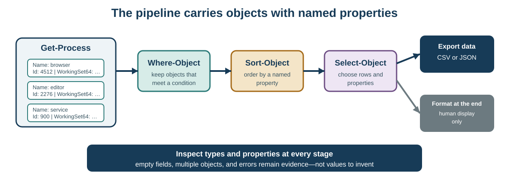

# Session 15 - From command to script: automating with PowerShell

## Purpose of the session

In several earlier Labs, you have already used PowerShell to observe processor, memory, storage, peripherals, and networking. Until now, PowerShell has mainly been an inspection tool: one command answered one specific question.

This Session marks a transition. You are preparing to work with Windows and Windows Server systems where PowerShell also becomes an **administration and automation tool**. A systems administrator does not want to repeat the same series of commands manually on ten workstations, copy results by hand, or depend on memory to perform the same checks consistently.

A **script** preserves a procedure so that it can be reviewed, changed, repeated, and verified.

The guiding question is therefore:

> **How do we move from interactive commands to a small repeatable PowerShell script while understanding what it observes, what it could change, and what authorization context it runs under?**

The lab workstations use Windows Server 2022 and may permit administrator elevation. The required activities in this Session remain deliberately non-destructive and do not require elevation. The goal is to learn the method before later courses use PowerShell to administer services, accounts, server roles, networking, and other system components.

## Objectives

By the end of the Session and associated Lab, you should be able to:

- distinguish terminal, shell, command, cmdlet, pipeline, and script;
- explain PowerShell's place in Windows and Windows Server administration;
- distinguish a normal PowerShell session from an elevated session;
- recognize that elevation increases what Windows permits without changing the PowerShell language;
- use `Get-Command` and `Get-Help` to discover a command;
- inspect an object's type, properties, and methods with `Get-Member`;
- explain that PowerShell pipelines normally pass structured objects;
- filter, sort, and select objects and their properties;
- use variables and comments;
- create a `.ps1` file, inspect it, run it, edit it, and run it again;
- complete a report object from a supplied model;
- use a supplied `if` condition to handle an unreported value;
- export CSV and JSON data and re-import them to verify structure;
- distinguish observation operations from operations that may change the system;
- treat errors and limitations as useful evidence rather than invitations to bypass policy.

!!! info "Scope of the session"
    **Master today:** terminal, shell, `.ps1` script, object, type, property, pipeline, filter, sort, selection, variable, comment, custom object, export, verification, script execution, and the distinction between a normal and elevated session.

    **Master with a supplied model:** `if` condition, calculated property, and handling an unreported value.

    **Recognize today:** methods, `foreach`, `try`/`catch`, error parameters, change-oriented verbs such as `Set`, `New`, `Remove`, `Start`, and `Stop`, execution policy, and remote automation.

    **Go further after the Lab link:** Windows PowerShell 5.1 and PowerShell 7, functions, loops, fuller error handling, modules, remoting, and principles for repeatable administrative scripts.

## Opening problem: ten workstations, one method

You must record processor, memory, storage, operating-system, and networking information from ten Windows workstations.

Manual collection may produce:

- omitted fields;
- inconsistent units;
- inconsistent column names;
- transcription errors;
- commands run in a different order;
- a procedure that is difficult to reproduce or audit.

A script can apply the same procedure to every workstation. Automation does not, however, make a procedure automatically correct. A bad script can repeat a bad assumption ten times faster.

The important skill is therefore two-sided:

```text
make the procedure repeatable
              +
keep careful interpretation of the results
```

## PowerShell in systems administration

PowerShell was designed for administration and automation. The same principles we use today to **observe** a workstation are later used to administer Windows and Windows Server.

Typical task families include:

| Administrative need | PowerShell tools you may encounter |
|---|---|
| Inspect processes and services | `Get-Process`, `Get-Service` |
| Query hardware and Windows | `Get-CimInstance` |
| Inspect networking | `Get-NetAdapter`, `Get-NetIPConfiguration` |
| Read event logs | `Get-WinEvent` |
| Manage services | `Start-Service`, `Stop-Service`, `Set-Service` |
| Manage accounts or groups | local-account or Active Directory cmdlets depending on the environment |
| Administer server roles | modules associated with installed roles |
| Administer multiple computers | PowerShell Remoting, sessions, and remote commands |

Most of these advanced tasks are **not required in C12**. They show why it is useful to understand objects, pipelines, scripts, and execution context now.

!!! warning "Recognizing a command is not permission to run it"
    In this Session, we may name cmdlets that change a system so that you recognize their future role. Do not execute a change command merely because it appears in documentation or an example.

## Terminal, shell, command, and script

| Term | Role |
|---|---|
| **Terminal** | application or window that displays and carries a shell's input and output |
| **Shell** | program that reads commands and launches operations |
| **Command** | instruction given to the shell |
| **Cmdlet** | specialized PowerShell command, often named with verb-noun syntax |
| **Pipeline** | processing chain that passes objects from one command to the next |
| **Script** | file or block that preserves instructions for later execution |

Windows PowerShell 5.1 normally uses `powershell.exe`. PowerShell 7 uses `pwsh.exe`. They share much of the language, but modules, some features, and some behaviours can differ.

<figure markdown="span">
  { loading=lazy width="820" }
  <figcaption>Windows Terminal is a terminal application that can host different shells. The window itself is therefore not the shell. Screenshot: Ghettoblaster, <a href="https://commons.wikimedia.org/wiki/File:Windows_Terminal_Preview_Screenshot.png">Wikimedia Commons</a>, <a href="https://creativecommons.org/publicdomain/zero/1.0/">CC0 1.0</a>.</figcaption>
</figure>

!!! question "Check: terminal or shell?"
    Opening Windows Terminal and selecting a PowerShell profile does not mean that “Windows Terminal is PowerShell.” The terminal provides the interface; PowerShell is the shell and language running inside it.

## Normal and elevated sessions

Windows can run PowerShell with your account's ordinary rights or in an **elevated** process after approval through User Account Control (UAC).

Elevation does not turn PowerShell into a different language:

```text
same PowerShell language
+ same object and pipeline principles
+ more operations allowed by Windows
= greater possible consequences
```

Some administrative tasks require elevation. Others do not. A good working habit is to use the privilege level required for the task rather than the highest level available by default.

!!! note "Administrator access available ≠ elevation required"
    You may have administrator access on the Windows Server 2022 workstations. Today's required activities are nevertheless designed to work without elevation. If an observation command works in a normal session, there is no learning advantage in running it with additional privilege.

## Read verbs as a first clue

PowerShell cmdlets often follow a **verb-noun** convention.

```text
Get-Process
Get-Service
Set-Service
Start-Service
Stop-Service
Remove-Item
```

The verb gives an initial clue:

- `Get` is commonly associated with reading or observation;
- `Set`, `New`, `Remove`, `Start`, `Stop`, `Enable`, and `Disable` commonly indicate an action that can change state.

But **the verb is not a complete safety analysis**. Before an unfamiliar command:

1. identify it with `Get-Command`;
2. read `Get-Help` and official documentation;
3. check its parameters;
4. determine what it reads or changes;
5. determine whether the task requires elevation;
6. run a modification only when it belongs to the assigned work.

## Why PowerShell works with objects

A fundamental difference from many historical shells is that PowerShell normally passes **structured objects**, not only displayed text.

An object may contain:

- a type;
- properties;
- methods;
- a display representation that reveals only some data.

```text
object
├── type
├── properties: descriptive values
└── methods: possible actions
```

This structure is particularly useful for administration: one command can produce service, process, disk, or network-interface objects, and another command can directly filter a property of those objects.

## Discover a command

### `Get-Command`

```powershell
Get-Command Get-Service
Get-Command -Verb Get -Noun Service
```

`Get-Command` helps discover what exists in the current environment.

### `Get-Help`

```powershell
Get-Help Get-Service
Get-Help Get-Service -Examples
Get-Help Get-Service -Full
```

Local help may be incomplete or older than current online documentation. It remains a useful first stop for syntax, parameters, and examples.

!!! question "Before running an unfamiliar command"
    If you find `Restart-Service`, what is the responsible next action? Read its help and determine its effect and parameters before executing it. The name suggests a change, but documentation confirms what the command actually does.

## Inspect an object with `Get-Member`

```powershell
Get-Process | Get-Member
```

`Get-Member` reveals object types and members.

- a **property** describes a value such as `Name`, `Id`, or `WorkingSet64`;
- a **method** represents a possible action.

!!! warning "Observe a method without invoking it"
    In this course, record a method name to recognize the concept, but do not invoke it on a process or system object merely to “see what happens.”

The table shown on screen does not necessarily represent every available property.

## The pipeline passes objects

```powershell
Get-Process |
    Sort-Object WorkingSet64 -Descending |
    Select-Object -First 10 Name, Id, WorkingSet64
```

1. `Get-Process` produces process objects.
2. `Sort-Object` orders them by `WorkingSet64`.
3. `Select-Object` keeps the first ten and chooses selected properties.



### Filter with `Where-Object`

```powershell
Get-Process |
    Where-Object WorkingSet64 -gt 100MB
```

The filter retains objects whose `WorkingSet64` property exceeds the supplied value.

### Calculated property: read a supplied model

```powershell
Get-Process |
    Select-Object Name,
        @{Name='MemoryMiB'; Expression={[math]::Round($_.WorkingSet64 / 1MB, 1)}}
```

Inside `Expression`, `$_` represents the current pipeline object. You do not need to memorize the full syntax; you should be able to explain the model and carefully modify a supplied name or value.

## Data and formatting

```powershell
Get-Process | Format-Table Name, Id
```

`Format-Table` prepares display for a person. It should normally not appear before a data-export command.

Prefer:

```powershell
Get-Process |
    Select-Object Name, Id |
    Export-Csv -Path .\processes.csv -NoTypeInformation -Encoding UTF8
```

The principle is: **transform data first; format presentation last**.

## Variables and comments

A variable stores a value or collection:

```powershell
$Processes = Get-Process
$Processes.Count
```

Descriptive names improve readability:

```powershell
$OperatingSystem
$TotalMemoryBytes
$ActiveAdapter
```

A comment begins with `#`:

```powershell
# Collect basic workstation information
$Computer = Get-CimInstance Win32_ComputerSystem
```

A useful comment explains intent, an assumption, or a reason. It does not merely translate the code into English.

## Your first `.ps1` file: a complete walkthrough

Reading “put the commands into a `.ps1` file” is not the same as knowing how to create and run a script. The following is the complete path.

### Step 1 — create a working folder

```powershell
$Folder = Join-Path $HOME 'C12-PowerShell'
New-Item -ItemType Directory -Path $Folder -Force
Set-Location $Folder
Get-Location
```

The script remains in your user space rather than a system folder.

### Step 2 — create the file in a text editor

```powershell
notepad.exe .\my-first-script.ps1
```

If Windows asks to create the file, accept. Enter:

```powershell
# Produce a minimal summary of this PowerShell session
$ComputerName = $env:COMPUTERNAME
$PowerShellVersion = $PSVersionTable.PSVersion
$Moment = Get-Date

[pscustomobject]@{
    Computer = $ComputerName
    PowerShell = $PowerShellVersion.ToString()
    ExecutedAt = $Moment
}
```

Save the file as **plain text** with the `.ps1` extension, then close the editor.

### Step 3 — verify what was actually saved

```powershell
Get-ChildItem .\my-first-script.ps1
Get-Content .\my-first-script.ps1
```

This confirms the filename and contents before execution.

!!! warning "Watch for `.ps1.txt`"
    Depending on the editor and Windows settings, a file may appear to be named `my-first-script.ps1` while the actual name ends in `.ps1.txt`. `Get-ChildItem` confirms what PowerShell actually sees.

### Step 4 — run the script explicitly

```powershell
.\my-first-script.ps1
```

Why `\.\`?

PowerShell does not automatically search the current directory for commands in the same way as some historical shells. `.` means **the current directory**, and `\` introduces the path to the file.

```text
.\my-first-script.ps1
│ └──────────── file
└─ current directory
```

### Step 5 — edit, save, and run again

Reopen the file:

```powershell
notepad.exe .\my-first-script.ps1
```

Add, for example:

```powershell
User = $env:USERNAME
```

Save, then run again:

```powershell
.\my-first-script.ps1
```

You have now followed the fundamental cycle:

```text
write
→ inspect
→ run
→ observe output or error
→ edit
→ run again
```

### Step 6 — if the script does not run

Do not begin by changing system configuration.

1. read the exact message;
2. verify the filename and path;
3. inspect `Get-ExecutionPolicy -List`;
4. preserve the error in your permanent record;
5. use the instructor-approved fallback if managed policy blocks execution.

PowerShell execution policy is a **safety feature**, but Microsoft explicitly notes that it is not a security boundary that prevents an authorized user from every possible action. In a managed environment, the policy should be respected rather than bypassed.

## From interactive prototype to administrative script

A recommended progression is:

```text
one interactive command
       ↓ verify
add a filter or transformation
       ↓ verify
store the result in a variable
       ↓ verify
assemble tested steps in a .ps1 file
       ↓ execute and review
add output, validation, and comments
       ↓
repeatable script
```

This approach avoids copying a long opaque script and then trying to understand several failures at once.

## Build a report object

```powershell
$Computer = Get-CimInstance Win32_ComputerSystem
$System = Get-CimInstance Win32_OperatingSystem

$Report = [pscustomobject]@{
    ComputerName = $env:COMPUTERNAME
    Manufacturer = $Computer.Manufacturer
    Model = $Computer.Model
    OperatingSystem = $System.Caption
    MemoryGiB = [math]::Round($Computer.TotalPhysicalMemory / 1GB, 1)
}

$Report
```

`[pscustomobject]` creates an object whose properties are selected for the report. The script can then export **structured data** instead of trying to recover text that has already been formatted for display.

## Describe an unreported value

An empty field does not prove that a component is absent.

```powershell
if ([string]::IsNullOrWhiteSpace($Computer.Model)) {
    $Model = 'Not reported'
}
else {
    $Model = $Computer.Model
}
```

The condition chooses a path according to a test. `Not reported` describes the evidence without inventing a conclusion.

## A complete fallback pattern

Some commands may be absent or restricted.

```powershell
$AdapterName = 'Not reported'

if (Get-Command Get-NetAdapter -ErrorAction SilentlyContinue) {
    $Adapter = Get-NetAdapter |
        Where-Object Status -eq 'Up' |
        Select-Object -First 1

    if ($null -ne $Adapter) {
        $AdapterName = $Adapter.Name
    }
}
```

Lab 15 supplies patterns of this kind. The goal is to learn to **read, verify, and adapt** them, not to design a complete error-handling framework from a blank page.

## Export and re-import

### CSV

```powershell
$Report |
    Export-Csv -Path .\system-report.csv -NoTypeInformation -Encoding UTF8

$CsvAgain = Import-Csv .\system-report.csv
$CsvAgain
$CsvAgain | Get-Member
```

CSV is well suited to tabular data. After `Import-Csv`, values are generally read back as text.

### JSON

```powershell
$Report |
    ConvertTo-Json |
    Set-Content -Path .\system-report.json -Encoding UTF8

$JsonAgain = Get-Content -Raw .\system-report.json |
    ConvertFrom-Json

$JsonAgain | Get-Member
$JsonAgain
```

JSON more naturally preserves a property structure. In either case, **a command completing without error does not prove that the file contains what you intended**. Re-import and verify.

## Errors: signal, context, and next action

A PowerShell error may indicate:

- an unknown command name;
- an invalid parameter;
- a missing file or path;
- an object without the expected property;
- insufficient permission;
- an execution-policy condition;
- an unavailable module or feature;
- a real fault in the system being queried.

The responsible first response is not “open an administrator console and try again.” Ask:

> **Which assumption did this error just disprove?**

For example, `Access is denied` may show that an operation requires a different authorization context. It does not prove that elevation is always the correct solution; the command itself may be inappropriate for the assigned task.

## Toward administrative scripts: repeatability and consequences

An administrative script may be run more than once. You therefore need to think about what happens **on the second run**.

Compare these intentions:

```text
“create C:\Reports”
“make sure C:\Reports exists”
```

The second wording encourages checking state before acting. This relates to **idempotence**: where practical, an administration procedure should produce a predictable state even when run again.

You do not need to master that concept today. Keep the professional question:

> If this script runs a second time, what will it change?

## Integrated synthesis

PowerShell can turn manual observation into a repeatable procedure:

```text
administrative requirement
→ choose an appropriate privilege context
→ discover and understand commands
→ produce objects
→ inspect their properties
→ filter, sort, and select
→ test stages interactively
→ save tested stages in a .ps1 file
→ produce structured output
→ re-import and verify
→ preserve errors and limitations
```

Automation improves consistency and scale. It also increases the importance of checking a command **before** repeating it.

## Common errors to avoid

- **Confusing the terminal with PowerShell.** Identify the terminal application and the shell it hosts.
- **Assuming the pipeline passes only displayed text.** Inspect objects with `Get-Member`.
- **Invoking a method simply because `Get-Member` lists it.** Recognize it before deciding whether it is appropriate.
- **Using `Format-Table` before export.** Transform and export data first; format display last.
- **Copying a long script without testing stages.** Build and verify progressively.
- **Accidentally saving a `.ps1.txt` file.** Verify the name with `Get-ChildItem`.
- **Typing only the script name and assuming PowerShell searches the current directory.** Use an explicit path such as `.\script.ps1`.
- **Treating an empty value as proof of absence.** Record `Not reported` and seek another source.
- **Using elevation as the first answer to every error.** Identify the cause and effect of the command first.
- **Changing execution policy merely to make an exercise work.** Respect managed policy and use the approved fallback.
- **Assuming a PowerShell 7 script necessarily works in Windows PowerShell 5.1.** Verify version, modules, and syntax.

## What to remember

- PowerShell is a shell and automation language designed around systems administration.
- A terminal can host PowerShell; the terminal and shell are different layers.
- An elevated session has greater authority but uses the same PowerShell language.
- Having administrator access does not mean you should work elevated all the time.
- `Get-Command`, `Get-Help`, and `Get-Member` support discovery and inspection.
- Pipelines normally pass structured objects.
- `Where-Object`, `Sort-Object`, and `Select-Object` transform collections.
- A `.ps1` file is a text file containing PowerShell instructions; create it, inspect it, execute it with an explicit path, then improve it in small steps.
- `[pscustomobject]` creates structured output suitable for a report.
- An unreported value should remain an uncertainty rather than becoming an invented conclusion.
- Exports should be re-imported and verified.
- Interpret an error before changing permissions or configuration.
- The same foundations will later support Windows Server administration of services, accounts, networking, and multiple systems.

## Put it into practice

[Lab 15](../labs/lab-15.md) applies this progression: inspect the environment, build and explain pipelines, collect system objects, complete a structured report, export and re-import the results, then assemble the tested blocks into `system-report.ps1`.

## Go further

### Windows PowerShell 5.1 and PowerShell 7

Windows PowerShell 5.1 and PowerShell 7 can coexist. PowerShell 7 uses `pwsh.exe` and evolves separately from Windows PowerShell. Always compare:

```powershell
$PSVersionTable
```

before blaming a script for an environment difference.

### Loops

A loop can apply an operation to several objects:

```powershell
foreach ($Service in Get-Service | Select-Object -First 5) {
    $Service.Name
}
```

This principle becomes important for administration at scale, but complex `foreach` scripts are not required in the main C12 pathway.

### Error handling

PowerShell provides tools such as `-ErrorAction` and `try`/`catch` for managing some errors. These become important when a script must continue a collection cleanly across multiple machines.

### Functions, modules, and remoting

As a script grows, **functions** group reusable operations. **Modules** group commands associated with a product or role. **PowerShell Remoting** allows commands to run in sessions on other machines when the environment is configured to permit it.

These mechanisms are more relevant in later administration courses. C12 supplies the foundation: understand commands, objects, pipelines, execution context, and the transformation of a tested procedure into a repeatable script.

## Technical reference sources

- [Microsoft Learn - PowerShell documentation](https://learn.microsoft.com/powershell/)
- [Microsoft Learn - about Execution Policies](https://learn.microsoft.com/powershell/module/microsoft.powershell.core/about/about_execution_policies)
- [Microsoft Learn - PowerShell 101](https://learn.microsoft.com/powershell/scripting/learn/ps101/)
- [Microsoft Learn - about Scripts](https://learn.microsoft.com/powershell/module/microsoft.powershell.core/about/about_scripts)
- [Microsoft Learn - Get-Command](https://learn.microsoft.com/powershell/module/microsoft.powershell.core/get-command)
- [Microsoft Learn - Get-Help](https://learn.microsoft.com/powershell/module/microsoft.powershell.core/get-help)
- [Microsoft Learn - Get-Member](https://learn.microsoft.com/powershell/module/microsoft.powershell.utility/get-member)
