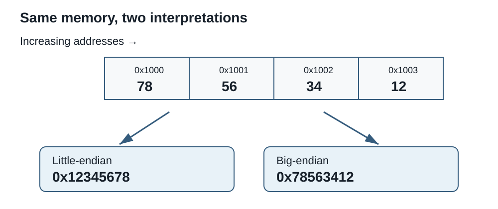

# Session 3 - Internal Data Representation and Endianness

## Purpose of the session

In Session 2, we learned to write the same value in bases 2, 10, and 16. A sequence of bits does not, by itself, state what it represents.

For example, the byte `11110000` can be interpreted as:

- the unsigned integer `240`;
- the signed integer `-16` in two's complement;
- a colour component;
- part of a floating-point number, character, sound, or instruction.

The system must know the **width**, **type**, **encoding**, and sometimes the **byte order**. This session studies these conventions and introduces IEEE 754 single precision. The complete encoding and decoding procedure appears in required self-study after the lab link.

## Objectives

### Main pathway

By the end of the main pathway, you should be able to:

- distinguish a bit from a byte and decimal prefixes from binary prefixes;
- determine the capacity and range of a fixed-width integer, then encode or decode unsigned and signed integers using two's complement;
- explain the roles of the sign, exponent, and fraction in IEEE 754 single precision;
- distinguish a character, a Unicode code point, and its byte encoding;
- reconstruct a multi-byte value in big-endian or little-endian order;
- select an interpretation from the width, type, encoding, and byte order;
- show verifiable work rather than an isolated result.

### Required self-study

After the required self-study, you should also be able to construct and decode a normalized finite IEEE 754 single-precision number.

!!! info "Scope of the session"
    **Master today:** units, fixed width, ranges, unsigned integers, two's complement, the general organization of IEEE 754, text, Unicode, UTF-8, endianness, and selecting an interpretation.

    **Required self-study after the lab link:** binary fractions, IEEE 754 single-precision construction, approximation, rounding, and decoding.

    **Not required:** manual construction of signed zero, subnormal values, infinities, `NaN` values, and the 64-bit format.

## Bits need context

A bit pattern does not automatically contain its type. A program, file format, or protocol supplies the interpretation rules.

| Required information | Corresponding question |
|---|---|
| Width | How many bits or bytes belong to the value? |
| Type | Is it an integer, real number, character, or something else? |
| Convention | Is the integer signed? Which encoding represents the text? |
| Byte order | Which byte of a multi-byte value comes first? |

!!! question "One pattern, several meanings"
    Consider `01000001`.

    1. What is its value as an unsigned integer?
    2. Which ASCII character uses this code?
    3. Do these two interpretations contradict each other?
    4. What information would allow you to select the correct interpretation?

The answer to the third question is no. The bits are identical; the rules used to read them are different.

## Bits, bytes, and prefixes

A **bit**, symbol `b`, is a binary digit. A **byte**, symbol `B`, contains eight bits.

`1 byte = 8 bits`

Capitalization matters:

- `100 Mb/s` normally describes one hundred megabits per second;
- `100 MB` normally describes one hundred megabytes.

### Decimal and binary prefixes

Two prefix families coexist.

| Family | Symbol | Multiplier | Example |
|---|---|---:|---:|
| Decimal, SI | kB | 103 = 1,000 bytes | 1 kB = 1,000 bytes |
| Decimal, SI | MB | 106 = 1,000,000 bytes | 1 MB = 1,000 kB |
| Decimal, SI | GB | 109 = 1,000,000,000 bytes | 1 GB = 1,000 MB |
| Binary, IEC | KiB | 210 = 1,024 bytes | 1 KiB = 1,024 bytes |
| Binary, IEC | MiB | 220 = 1,048,576 bytes | 1 MiB = 1,024 KiB |
| Binary, IEC | GiB | 230 = 1,073,741,824 bytes | 1 GiB = 1,024 MiB |

!!! warning "KB, MB, and GB can be used ambiguously"
    Some documents and interfaces use `KB`, `MB`, and `GB` for multiples of 1,024 even though the precise IEC symbols are `KiB`, `MiB`, and `GiB`. Others use those labels for decimal multiples.

    When the convention is not stated, ask for it. In your work, write the multiplier you used.

## Fixed width

A value stored in a system has a defined width. A width of `n` bits provides exactly 2n configurations.

| Width | Configurations | Hexadecimal digits |
|---:|---:|---:|
| 4 bits | 16 | 1 |
| 8 bits | 256 | 2 |
| 16 bits | 65,536 | 4 |
| 32 bits | 4,294,967,296 | 8 |

A minimum representation may omit zeros at the far left. A fixed-width representation must preserve them.

`45``10` = `101101``2`

Using eight bits: `00101101``2`

Width does not change a value when it fits in the container. It states which positions are available and allows us to determine the representable range.

## Unsigned integers

In an **unsigned** integer, every configuration represents zero or a positive value.

For `n` bits:

`minimum = 0`

`maximum = 2``n`` - 1`

| Width | Minimum | Maximum |
|---:|---:|---:|
| 4 bits | 0 | 15 |
| 8 bits | 0 | 255 |
| 16 bits | 0 | 65,535 |

To encode an unsigned integer:

1. check that it lies within the permitted range;
2. convert it to binary;
3. add zeros on the left until the required width is reached;
4. group by four if a hexadecimal answer is required.

Eight-bit example:

`150``10` = `10010110``2` = `96``16`

!!! warning "An out-of-range value has no valid representation at that width"
    `300` cannot be represented as an eight-bit unsigned integer because the range ends at `255`.

    Some systems or languages may truncate or wrap a value into the range. That behaviour does not make the result an exact eight-bit representation of `300`. Operations, carry, and overflow will be studied in Session 5.

## Signed integers

A **signed** integer must represent negative values, zero, and positive values. Modern systems commonly use **two's complement**.

For `n` bits:

`minimum = -2``n - 1`

`maximum = 2``n - 1`` - 1`

| Width | Minimum | Maximum |
|---:|---:|---:|
| 4 bits | -8 | 7 |
| 8 bits | -128 | 127 |
| 16 bits | -32,768 | 32,767 |

The negative range contains one more value than the positive range. Using eight bits, `-128` exists, but `+128` does not exist as a signed integer.

??? info "Why not simply store a separate sign?"
    A convention could reserve the leftmost bit for a sign and store the magnitude in the other bits. That method would, however, create two representations of zero, `00000000` and `10000000`, and require different rules for several additions.

    Two's complement instead arranges the patterns like a counter that returns to the beginning after its maximum value. With eight bits, adding `1` to `11111111` produces `00000000`, so `11111111` naturally plays the role of `-1`. Inverting the bits of a magnitude and then adding `1` finds the corresponding negative pattern. This convention retains one zero and allows the same addition circuitry to be used for positive and negative integers.

### The most significant bit

In a two's-complement representation, the far-left bit allows us to recognize the sign:

- `0` indicates a positive value or zero;
- `1` indicates a negative value.

However, you cannot simply remove this bit and convert the rest. One direct way to interpret a signed integer gives the leftmost bit the negative value `-2``n - 1`, while the remaining positions retain their positive values.

Using eight bits:

`11110000``2` = `-128 + 64 + 32 + 16 = -16`

The same pattern interpreted as unsigned equals `240`.

## Producing two's complement

To represent a negative integer at a required width:

1. check that the value fits within the signed range;
2. convert its absolute value to binary;
3. pad with zeros to the required width;
4. invert every bit;
5. add `1`, preserving exactly the required width.

Example: represent `-37` using eight bits.

| Step | Result |
|---|---|
| Absolute value of 37 | `00100101` |
| Inverted bits | `11011010` |
| Add 1 | `11011011` |
| Hexadecimal | `DB` |

Therefore:

`-37``10` = `11011011``2` = `DB``16` as an eight-bit signed integer.

### Decoding a negative value

To decode a signed pattern whose leftmost bit is `1`, you can:

- use the negative positional weight of the leftmost bit directly; or
- invert the bits, add `1`, convert the resulting magnitude, and apply the negative sign.

Example: `10010110` as an eight-bit signed integer.

| Step | Result |
|---|---|
| Received bits | `10010110` |
| Inverted bits | `01101001` |
| Add 1 | `01101010` |
| Decimal magnitude | `106` |
| Signed value | `-106` |

!!! question "One byte, two integers"
    Interpret `10001101` as:

    1. an eight-bit unsigned integer;
    2. an eight-bit signed integer.

    Explain why the answers differ even though no bit changed.

## How should we represent fractional or decimal values?

So far, we have mostly represented integers such as `-3`, `0`, and `42`. Many real-world quantities, however, fall between two integers: `$12.34`, a height of `1.72 m`, a mass of `68.4 kg`, or the fraction `1/3`.

These values do not all have the same needs:

| Type of value | Example | Representation need |
|---|---|---|
| Fixed depth | `$12.34` in a bank account | The system can reserve exactly two digits for cents. |
| Variable depth | a height or mass | `1.7 m`, `1.72 m`, and `1.723 m` may be suitable depending on the measurement's precision. |
| Infinite depth | `1/3 = 0.333...` | No finite number of decimal digits represents the value exactly. It must be rounded or retained as a fraction in another form. |

One solution is to decide in advance how many positions appear to the right of the point. For example, the integer `1234` could represent `$12.34` if the last two positions always mean cents. This is a **fixed-point** representation. It works well when every value uses the same depth, but becomes less convenient when the size of the values or the required precision varies greatly.

Another solution borrows from scientific notation. In `1.72 × 10``0` and `1.72 × 10``6`, the same significant digits can describe values of very different magnitudes because an exponent moves the point. A **floating-point** representation similarly stores significant digits and an exponent.

Memory is still finite, so floating point cannot retain infinitely many digits. It represents some values exactly and approximates others. We now introduce the general organization of IEEE 754. Fractional positions and the complete procedures will be practised in the required self-study.

!!! note "Point or comma?"
    English-language programming languages, technical formats, and computing tools normally use the point in a value such as `3.5`. French mathematical notation normally writes the same value as `3,5`. In this course's binary examples, the point also separates the integer and fractional parts; it does not mean multiplication.

## IEEE 754 single precision

IEEE 754 **single precision** uses 32 bits to represent a floating-point number.

| Field | Width | Role |
|---|---:|---|
| Sign | 1 bit | `0` positive, `1` negative |
| Biased exponent | 8 bits | Actual exponent + 127 |
| Fraction | 23 bits | Bits after the initial `1` in normalized form |

Layout:

`S EEEEEEEE FFFFFFFFFFFFFFFFFFFFFFF`

For the normalized numbers studied here, the mathematical form is:

`(-1)``S`` × 1.F × 2``E - 127`

The `1` before the fraction is implicit: it is not stored in the 23-bit fraction field.

??? info "Why an implicit 1 and a biased exponent?"
    A non-zero normalized binary number always begins with `1`; no other binary digit is possible in that position. IEEE 754 can therefore omit this predictable `1` and devote all 23 fraction bits to the digits that follow it. The `1` is restored during decoding.

    The actual exponent may be negative or positive. Rather than storing it in two's complement, the format adds `127` and stores an unsigned biased exponent. For example, an actual exponent of `-3` becomes `124`, while `+3` becomes `130`. This arrangement also leaves the field's extreme patterns available for zero, subnormal values, infinities, and `NaN` values.

!!! note "Limit of the IEEE 754 introduction"
    We work with normalized single-precision values. Signed zero, subnormal values, infinities, `NaN` values, and the 64-bit format are distinguished in the documentation, but their manual construction is not required here.

!!! danger "IMPORTANT — required exam preparation"
    IEEE 754 may be assessed on the final examination. You must complete the self-study and the automatically marked Lab 3 exercises before the exam-review session.

    Required scope is limited to **normalized finite single-precision values**. Manual construction of signed zero, subnormal values, infinities, `NaN` values, and the 64-bit format is not required.

## Representing text

In Session 1, the interactive router manipulated letters such as `A`, `B`, and `C`. We chose those symbols to observe instructions and state without yet asking how a letter becomes bits.

One byte offers 256 configurations. That is sufficient for unaccented Latin letters, digits, and several symbols, but human writing systems contain far more than a few hundred characters. Unicode now lists well over one hundred thousand characters: alphabets, syllabaries, ideographs, scientific signs, historical symbols, and pictographs. An encoding convention must connect each abstract character to a sequence of bytes.

An abstract character is not the same thing as its code or the bytes used to store it.

| Level | Example for A |
|---|---|
| Character | `A` |
| Unicode code point | `U+0041` |
| UTF-8 byte | `41``16` |

### ASCII and Unicode

ASCII defines 128 codes, from `0` through `127`, including:

- unaccented Latin letters;
- digits;
- punctuation;
- the space and control characters such as tab and line feed.

Unicode assigns code points to a much larger set of characters. UTF-8 transforms these code points into sequences of one through four bytes.

The first 128 UTF-8 codes are identical to ASCII. Thus:

- `A` becomes byte `41`;
- the `LF` line feed becomes `0A`;
- `é` becomes the two bytes `C3 A9` in UTF-8.

!!! warning "One character does not always occupy one byte"
    That rule works for ASCII characters encoded in UTF-8, but not for all of Unicode. Count the bytes in the requested encoding, not only the visible characters.

## Images, sound, and other data

The same principle extends to other digital information:

- an image associates values with pixels and colour components;
- sound associates values with samples taken over time;
- an instruction associates a bit pattern with an operation;
- a file format states how to read its different regions.

This session does not require memorizing image or audio formats. The important idea is that bits receive meaning through a known convention.

## Endianness: byte order

A value wider than one byte must state which byte comes first.

Consider the 32-bit value:

`0x12345678`

Its four bytes are `12`, `34`, `56`, and `78`.

| Convention | Byte order, first position to last |
|---|---|
| Big-endian | `12 34 56 78` |
| Little-endian | `78 56 34 12` |

In big-endian order, the most significant byte comes first. In little-endian order, the least significant byte comes first.

### Where are these conventions used today?

Contemporary personal computers overwhelmingly use little-endian order. x86-64 processors use it, and ARM systems in many laptops, phones, and personal devices normally operate in this mode. Little-endian is therefore the most common case when inspecting the memory of a modern PC.

Big-endian nevertheless remains important:

- Internet protocols traditionally use big-endian **network byte order** for many multi-byte values;
- IBM mainframe environments use a big-endian architecture;
- some microcontrollers, embedded systems, peripherals, and data formats require big-endian order;
- processors or tools may support more than one mode even when a particular product selects one by default.

Byte order should therefore not be guessed from the device category alone. The processor, protocol, or format documentation remains authoritative.

!!! warning "Endianness does not reverse the bits within each byte"
    Byte `78` remains `01111000`. Little-endian order changes the positions of complete bytes in a multi-byte value; it does not turn `78` into `1E` and does not read the bits from right to left.

### What changes and what does not

- A one-byte value is not affected by endianness.
- A 16-, 32-, or 64-bit value can be affected.
- The protocol or format must define the expected order.
- UTF-8 text bytes follow the order defined by UTF-8; an entire text file is not reversed because the processor is little-endian.

Memory addresses and the exact placement of values will be studied in Session 4. For now, we focus on correctly reconstructing a value from a byte sequence.

<figure markdown="span">
  { loading=lazy width="900" }
  <figcaption>C12 synthesis diagram. It is a conceptual reference; real hardware specifications must still be verified in the relevant documentation.</figcaption>
</figure>

## Integrated synthesis: choosing the correct interpretation

| Situation | Questions to ask |
|---|---|
| Fixed-width integer | How many bits? Signed or unsigned? |
| Floating-point number | Which format and precision? |
| Text | Which encoding? How many bytes per character? |
| Multi-byte value | Big-endian or little-endian? |
| Unknown value | Which program, format, or protocol defines its meaning? |

## Common errors to avoid

### Forgetting to check the range

Converting a magnitude to binary does not prove that it fits the requested width and type.

### Applying two's complement to an unsigned integer

Two's complement is a convention for signed integers. A negative value has no valid unsigned representation.

### Forgetting the implicit 1 in IEEE 754

For a normalized number, the fraction field stores only the bits after the first `1`. Decoding must restore that `1`.

### Storing the actual exponent directly

The eight-bit field stores `e + 127`, not simply `e`.

### Confusing a code point with its bytes

`U+00E9` identifies the character `é`; the corresponding UTF-8 bytes are `C3 A9`.

### Reversing bits instead of bytes

Endianness reorders the complete bytes of a multi-byte value.

## What to remember

- Bits need a type and convention to have meaning.
- Fixed width determines capacity and range.
- An `n`-bit unsigned integer ranges from `0` through `2ⁿ - 1`.
- A two's-complement signed integer ranges from `-2ⁿ⁻¹` through `2ⁿ⁻¹ - 1`.
- Binary fractions use negative powers of two.
- IEEE 754 single precision uses 1 sign bit, 8 biased-exponent bits, and 23 fraction bits.
- Some decimal fractions must be approximated in binary.
- UTF-8 can use several bytes for one character.
- Endianness determines byte order, not bit order within a byte.

## Put it into practice

[Continue to Lab 3 - Interpreting Internal Representations](../labs/lab-3.md)

## Required self-study: IEEE 754 single precision

This self-study forms part of the examination preparation. It is completed outside the main session pathway to protect class time for integers, two's complement, text, and endianness.

Complete the corresponding automatically checked activities in Lab 3 and retain your work. Bring questions to class before the exam-review session.

!!! danger "IMPORTANT — potentially assessed content"
    You must be able to construct and decode **normalized finite IEEE 754 single-precision values**, including cases where bytes must first be restored to logical order.

### Fractional positions in binary

Positional notation continues to the right of the radix point. The exponents become negative.

| Position | 20 | 2-1 | 2-2 | 2-3 | 2-4 |
|---:|---:|---:|---:|---:|---:|
| Value | 1 | 1/2 | 1/4 | 1/8 | 1/16 |

For example:

`10.101``2` = `2 + 1/2 + 1/8 = 2.625``10`

#### Converting a decimal fraction

To convert a decimal fractional part to binary:

1. multiply the fraction by `2`;
2. keep the integer part, `0` or `1`;
3. repeat with the new fractional part;
4. read the integer parts in the order they were produced.

Example using `0.625`:

| Calculation | Produced bit | New fraction |
|---|:---:|---:|
| 0.625 × 2 = 1.25 | 1 | 0.25 |
| 0.25 × 2 = 0.5 | 0 | 0.5 |
| 0.5 × 2 = 1.0 | 1 | 0 |

Therefore, `0.625``10` = `0.101``2`.

Some fractions do not terminate. For example, base-10 `0.1` produces a repeating binary sequence. A fixed width must then preserve an approximation.

### Constructing a 32-bit IEEE 754 value

Complete procedure:

1. determine the sign bit;
2. convert the integer part to binary;
3. convert the fractional part to binary;
4. combine both parts and normalize to `1.F × 2``e`;
5. calculate the biased exponent `E = e + 127`, then write it using eight bits;
6. remove the initial `1` and pad or round the fraction to 23 bits;
7. assemble the sign, exponent, and fraction;
8. group the 32 bits in fours to produce eight hexadecimal digits.

#### Complete example: -13.25

**1. Sign**

The value is negative: `S = 1`.

**2 and 3. Binary conversion**

`13``10` = `1101``2`

`0.25``10` = `0.01``2`

Therefore, `13.25``10` = `1101.01``2`.

**4. Normalization**

`1101.01``2` = `1.10101 × 2``3`

The actual exponent is `e = 3`.

**5. Biased exponent**

`E = 3 + 127 = 130`

`130``10` = `10000010``2`

**6. 23-bit fraction**

Remove the initial `1` from `1.10101`:

`10101000000000000000000`

**7. Assembly**

`1 10000010 10101000000000000000000`

Without spaces:

`11000001010101000000000000000000`

**8. Hexadecimal**

`1100 0001 0101 0100 0000 0000 0000 0000`

`C1540000``16`

Therefore, the IEEE 754 single-precision representation of `-13.25` is `0xC1540000`.

### Approximation and rounding

When the binary fraction ends before 23 bits, add zeros on the right. When it continues, the nearest representable value must be selected according to the requested rounding rule.

The usual IEEE 754 mode is **round to nearest, ties to even**. You must therefore retain additional bits before deciding whether to increase the 23-bit fraction. The simplified rule “the next bit is 1, so always round up” fails in some exact tie cases.

For checkable work:

1. produce more than 23 fraction bits;
2. separate the 23 retained bits from the discarded bits;
3. state the rounding rule used;
4. show any carry caused by rounding;
5. accept that the reconstructed value may differ slightly from the original decimal value.

!!! question "Why is 0.1 a problem?"
    `0.1` has a finite representation in base 10 but a repeating representation in base 2. A 23-bit field cannot preserve an infinite sequence. The system therefore stores a nearby binary value.

    This approximation explains some surprising results in financial calculations, equality comparisons, and repeated accumulation.

### Decoding an IEEE 754 value

To return from a 32-bit representation to the decimal value:

1. convert hexadecimal to 32 bits if necessary;
2. separate the sign, eight exponent bits, and 23 fraction bits;
3. convert the exponent to base 10 and subtract `127`;
4. place the implicit `1` before the fraction;
5. apply the power of two by moving the radix point or expanding the positions;
6. apply the sign.

#### Example: 0x41280000

`0x41280000` = `01000001001010000000000000000000``2`

Separation:

`0 10000010 01010000000000000000000`

- sign: `0`, therefore positive;
- stored exponent: `10000010``2` = `130`;
- actual exponent: `130 - 127 = 3`;
- significand: `1.0101``2`.

`1.0101 × 2``3` = `1010.1``2`

`1010.1``2` = `8 + 2 + 1/2 = 10.5``10`

Therefore, `0x41280000` represents `10.5`.

!!! warning "Comparing floating-point results in programming"
    In a programming course, you may calculate a value that should mathematically equal `0.3`, then discover that its stored representation is slightly above or below it. A comparison asking whether two floating-point results are **exactly equal** can therefore fail even when the values are sufficiently close for the problem being solved.

    The usual approach is to compare the difference between the values with an appropriate **tolerance**, or to use an approximate-comparison function supplied by the language or its library. The tolerance must reflect the scale and requirements of the problem; one arbitrary constant is not suitable for every calculation.
