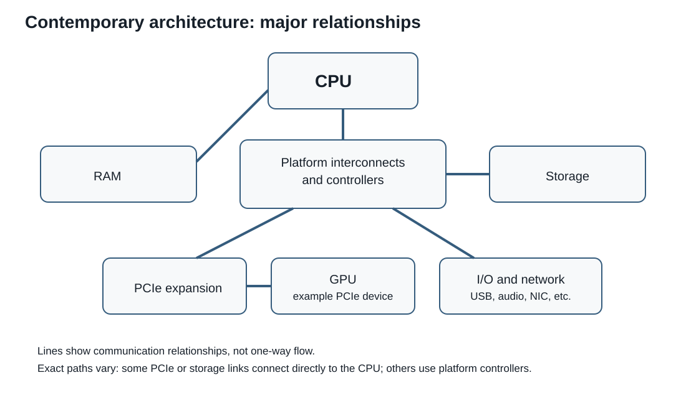

# Session 4 - Addressable Memory and Microcomputer Architecture

## Purpose of the session

In Session 1, we described a computer as a system that represents information, retains state, and follows instructions. In Session 3, we saw that the same bit pattern can represent an integer, real number, text, or something else according to its type and convention.

### A puzzle to begin

You press the `C` key and, almost immediately, the letter appears on the screen. Where did the information go between those two events?

- Did the keyboard send the letter directly to the screen?
- Does the processor retain every character itself?
- Where did the bits representing `C` wait?
- How did the different components know where to send them?

Form an initial hypothesis. We will return to the same journey at the end of the session with more precise vocabulary.

First, we need to place those bits within a real machine:

> Where is a value stored, how does the processor find it, and along which paths does it move?

This session connects internal representations to the physical organization of a microcomputer. It distinguishes the visible layers of a component, introduces addressable memory, and explains the roles of the memory hierarchy, controllers, and buses.

## Objectives

By the end of this session, you should be able to:

- distinguish a component's physical layers and the general roles of a CPU, GPU, microcontroller, SoC, and SoM;
- place registers, cache, RAM, and secondary storage in a hierarchy, then explain RAM volatility;
- distinguish a memory address from stored contents and follow the hexadecimal addresses of consecutive locations;
- determine and interpret the locations occupied by a multi-byte value using its width, type, and endianness;
- distinguish the roles of address, data, and control buses as well as controllers and interfaces;
- follow a simplified read between memory and a processor register;
- explain, using an introductory model, the path of information from a keypress to the display.

!!! question "Guiding questions"
    1. **What is it physically?** A board, package, die, or connector?
    2. **Where is information stored?** In a register, cache, RAM, or storage?
    3. **How does it move?** Along which interconnects and under the control of which components?

!!! info "Scope of the session"
    **Master today:** PCB, package, die, CPU, register, RAM, storage, address, contents, width, endianness, and the roles of the three buses.

    **Recognize today:** GPU, MCU, SoC, SoM, PCIe, USB, SATA, NVMe, northbridge, and southbridge. These terms will be developed when they become necessary.

    **Not required:** memorizing the detailed electrical operation of interfaces or the complete protocols of the buses mentioned.

## Returning to the stored program

In the von Neumann model, **instructions** and **data** can reside in the same memory. They have the same physical appearance: both are bit patterns. Context determines whether a pattern is executed as an instruction or interpreted as a value.

??? info "Reminder: fetch, decode, execute"
    In Session 1, we summarized the instruction cycle using three actions:

    1. **Fetch**: the control unit obtains the next instruction from memory and places it in a **register**, a tiny temporary storage area inside the processor.
    2. **Decode**: it interprets the requested operation and identifies the relevant data, registers, or addresses.
    3. **Execute**: the processor performs the operation, which may change a register, read or write memory, or control another component.

    The cycle then repeats with the next instruction. Fetching an **instruction** and executing a `LOAD` instruction that fetches **data** are two distinct transfers.

Later, we will see how a `LOAD` instruction brings data from RAM to one of these registers. To follow it, we must first distinguish:

- where the value is stored;
- the number used to find that location;
- the component requesting the read;
- the paths taken by the address, command, and value.

## From the visible system to the silicon die

The word **component** is broad. It may refer to a complete part installed in a computer, an integrated circuit soldered onto a board, or an element inside a chip.

### The printed circuit board

A **printed circuit board**, or **PCB**, is the rigid support that carries components and connects them with conductive traces. A motherboard is a large PCB; a graphics card, memory module, and SSD may also have their own PCBs.

A highly simplified modern view looks more like this:

```text
CPU ───── RAM
 │
 ├──── GPU or other high-speed peripherals
 │
 └──── input/output controller ──── USB, storage, network, audio…
```

Details vary, but several functions once divided among separate chips are now integrated into the CPU or other controllers.

<div class="image-callouts" style="--image-width: 768px;">
  

  <span class="image-callout image-callout--line-right" tabindex="0" style="--x: 14%; --y: 12%; --line-offset: 76%; --line-length: 103px; --line-angle: 82deg;">
    RAM slots
    <span class="image-callout__tooltip">These slots receive the RAM modules located to the left of the processor socket.</span>
  </span>

  <span class="image-callout image-callout--line-right" tabindex="0" style="--x: 21%; --y: 54%; --line-offset: 35%; --line-length: 76px; --line-angle: -40deg;">
    CPU socket
    <span class="image-callout__tooltip">The processor socket receives the CPU package and provides the electrical connections between the processor and the motherboard.</span>
  </span>

  <span class="image-callout image-callout--line-bottom" tabindex="0" style="--x: 46%; --y: 10%; --line-offset: 52%; --line-length: 118px; --line-angle: 76deg;">
    RAM slots
    <span class="image-callout__tooltip">This second bank of memory shows that several RAM modules can surround the processor socket on a workstation motherboard.</span>
  </span>

  <span class="image-callout image-callout--line-bottom" tabindex="0" style="--x: 68%; --y: 11%; --line-offset: 65%; --line-length: 73px; --line-angle: 78deg;">
    Chipset heat sink
    <span class="image-callout__tooltip">The heat sink covers an important motherboard control chip here and helps remove the heat it produces.</span>
  </span>

  <span class="image-callout image-callout--line-bottom" tabindex="0" style="--x: 87%; --y: 27%; --line-offset: 55%; --line-length: 28px; --line-angle: 90deg;">
    Storage connectors
    <span class="image-callout__tooltip">These connectors are used to attach storage devices, such as internal drives and similar hardware.</span>
  </span>

  <span class="image-callout image-callout--line-right" tabindex="0" style="--x: 8%; --y: 79%; --line-offset: 30%; --line-length: 69px; --line-angle: -18deg;">
    Rear I/O
    <span class="image-callout__tooltip">This area groups the ports accessible at the back of the case, including audio, USB, networking, and other interfaces.</span>
  </span>

  <span class="image-callout image-callout--line-top" tabindex="0" style="--x: 49%; --y: 77%; --line-offset: 75%; --line-length: 49px; --line-angle: -49deg;">
    PCIe slots
    <span class="image-callout__tooltip">These slots allow expansion cards to be added, such as a graphics card, network card, or another controller.</span>
  </span>

  <span class="image-callout image-callout--line-top" tabindex="0" style="--x: 79%; --y: 77%; --line-offset: 66%; --line-length: 81px; --line-angle: -67deg;">
    Main power connector
    <span class="image-callout__tooltip">This connector brings power from the power supply unit to the motherboard.</span>
  </span>
</div>

<p class="image-callouts__caption">
  Motherboard from a Dell Precision T3600 workstation manufactured in 2012, photographed by Marcin Wieclaw (pcsite.co.uk). Its processor socket, RAM slots, PCIe connections, and integrated input/output remain representative of the general physical organization of a contemporary motherboard. <a href="https://commons.wikimedia.org/wiki/File:Computer-motherboard.jpg">Wikimedia Commons</a>, <a href="https://creativecommons.org/licenses/by-sa/4.0/">CC BY-SA 4.0</a>.
</p>

??? info "Historical context: northbridge and southbridge"
    The following diagram represents a typical mid-2000s architecture. It is useful for seeing the connections, but it is not a blueprint of every current computer.

    { width="430" loading=lazy }

    *Diagram by Moxfyre. [Wikimedia Commons](https://commons.wikimedia.org/wiki/File:Motherboard_diagram.svg), public domain ([Public Domain Mark 1.0](https://creativecommons.org/publicdomain/mark/1.0/)).*

### Package, die, and connector

An integrated circuit has several layers that must not be confused:

| Layer | What it is | What we observe |
|---|---|---|
| Chip or die | Small piece of silicon on which microscopic transistors and connections are manufactured | Usually hidden |
| Package | Structure protecting the die and providing electrical contacts and a surface for managing heat | The part commonly called “the processor” |
| Connector or socket | Motherboard component receiving a removable part | Lever, frame, or contacts on the PCB |
| PCB | Support carrying the connector and other components | The complete board and visible traces |

```text
motherboard (PCB)
└── connector, if the component is removable
    └── component package
        └── silicon die
```

A component soldered directly to the PCB does not necessarily use a socket. A heat sink may also hide the package.

??? info "Why place a die inside a package?"
    Silicon alone is small and fragile. The package:

    - protects the die;
    - connects its tiny contacts to connections usable by the board;
    - helps transfer heat to a heat sink;
    - makes manufacturing, transport, and sometimes replacement practical.

??? question "Check: in what order are the layers nested?"
    From the largest support to the smallest element, the usual order is **PCB → connector, if present → package → silicon die**.

    The connector remains on the PCB when a removable processor is taken out; the die remains hidden inside its package.

Physical form does not yet tell us **what a component does**. We therefore move from layers we can touch to the roles they make possible.

## Several kinds of computing components

The following categories primarily describe **roles** and degrees of integration. They do not always correspond to completely different physical forms.

!!! note "Nuance: physical form, role, or integration?"
    - **Die, package, connector, and PCB** answer: “which physical layer are we discussing?”
    - **CPU and GPU** primarily answer: “what work does this component perform?”
    - **SoC and SoM** primarily answer: “which functions are combined, and in what form?”

    These categories can overlap. For example, an SoC is a die with a role and a package; an SoM is a small PCB normally carrying an SoC.

| Term | General role | Example use |
|---|---|---|
| CPU | Execute general instructions and coordinate the system | Personal computer, server |
| GPU | Perform many similar operations in parallel, particularly for images | Display, 3D rendering, parallel computing |
| Microcontroller, MCU | Control a device with integrated processor, memory, and peripherals | Keyboard, microwave oven, sensor |
| System on chip, SoC | Combine several major system functions in one integrated circuit | Phone, tablet, single-board computer |
| System on module, SoM | Place an SoC and supporting components on a small module intended for another board | Embedded product, industrial prototype |

??? info "SoC, SoM, and microcontroller: what is the difference?"
    A **microcontroller** generally targets predictable device control and includes the resources required for that task. An **SoC** may integrate more powerful processors, memory controllers, a GPU, interfaces, and other functions needed to run a complex system.

    An **SoM** is not only a chip. It is a small PCB module that normally carries an SoC, RAM, and other components. It then connects to a carrier board providing the ports and circuits specific to the product.

    The boundaries may overlap. Manufacturer documentation remains authoritative for a particular product.

!!! note "Scope of this session"
    We identify the general roles here. Cores, threads, instruction sets, and performance criteria will be studied in Session 5. Complete SoC trade-offs return in Session 13.

All these components process or route information. They therefore need places to retain instructions, current data, and durable files.

## Why use several kinds of memory?

The processor needs data quickly, but no single form of memory is simultaneously extremely fast, very large, persistent, and inexpensive. Systems therefore use a **memory hierarchy**.

| Level | General location | Relative speed | Relative capacity | Volatile? | Role |
|---|---|---|---|---|---|
| Registers | Inside the CPU | Highest | Tiny | Yes | Values being used immediately |
| Cache | Inside or very near the CPU | Very high | Small | Yes | Copies of data likely to be useful soon |
| RAM | Main memory | High | Medium to large | Yes | Programs and data currently in use |
| Secondary storage | SSD, disk, or another medium | Lower | Large | No | Retained files and programs |

**Volatile** means that the contents depend on electrical power. When the computer is turned off, registers, cache, and RAM normally lose their contents. Secondary storage is designed to persist.

> **General rule:** the closer memory is to the processor, the faster, smaller, and more expensive per byte it tends to be. More distant memory can be larger and persistent, but is generally slower.

??? info "Why not build all memory like registers?"
    Registers are extremely close to the execution units and very fast, but occupy valuable processor area. Larger memory requires more hardware and connections.

    The hierarchy therefore exploits locality: a small amount of information remains very close to the processor, a larger amount resides in RAM, and the durable collection resides in storage. Data is copied among levels as required.

??? question "Check: where do four pieces of information belong?"
    Order these from the level nearest the CPU to the most distant: a saved file, a value being calculated now, a running program, and a recently reused copy.

    **Answer:** register (current value) → cache (recent copy) → RAM (running program) → secondary storage (saved file).

The hierarchy tells us **which kind of memory** to use. To find one precise byte in RAM, we now need a locating system: addresses.

## RAM as addressable memory

For our model, RAM is a long sequence of locations. Each location:

- has a unique **address**;
- stores one **byte**;
- is adjacent to the preceding and following addresses.

!!! note "An address is not the contents"
    An address answers “where?” The contents answer “what?”

    Address `0204` might contain `D6`. Changing the contents does not require changing the address, just as replacing an object in a locker does not change the locker number.

Addresses are normally written in hexadecimal. They increase according to base-16 rules:

```text
0208, 0209, 020A, 020B, 020C, 020D, 020E, 020F, 0210
```

After `F`, the digit returns to `0` and a carry moves to the next position.

??? question "Check: which address follows `020F`?"
    The answer is `0210`. In hexadecimal, the digit returns to `0` after `F`, and a carry moves to the next position.

### Reading a memory table

| Address | Contents |
|---:|:---:|
| `0200` | `41` |
| `0201` | `42` |
| `0202` | `2A` |
| `0203` | `01` |
| `0204` | `D6` |
| `0205` | `FF` |

Each content entry has two hexadecimal digits, therefore eight bits, therefore one byte.

From this table alone:

- the contents at address `0202` are `2A`;
- the address following `0205` is `0206`;
- `41 42` might represent two ASCII characters, integer `0x4142`, two components, or something else;
- the table does not automatically provide a value's type.

## Multi-byte values

A value wider than one byte occupies several consecutive addresses.

| Width | Number of bytes | Number of locations |
|---:|---:|---:|
| 8 bits | 1 | 1 |
| 16 bits | 2 | 2 |
| 32 bits | 4 | 4 |
| 64 bits | 8 | 8 |

A 32-bit value beginning at address `0206` occupies:

`0206`, `0207`, `0208`, `0209`

The immediately following available address is `020A`.

??? question "Check: which locations contain a 32-bit value?"
    A 32-bit value beginning at address `021E` occupies four bytes: `021E`, `021F`, `0220`, and `0221`. The next address is `0222`.

### Reconstructing the logical value

Suppose locations `0202` and `0203` contain, in that order:

```text
Address  0202  0203
Byte       2A    01
```

If the requested type is a little-endian 16-bit unsigned integer, the least significant byte appears at the lower address. The logical value is therefore:

`0x012A = 298`<sub>`10`</sub>

We reuse the questions from Session 3:

1. What is the starting address?
2. How many bytes belong to the value?
3. In which order are they interpreted?
4. Which type must be applied?

!!! warning "Do not reverse the entire table"
    Endianness applies to each multi-byte value, not to memory as a whole. You must first know the starting address and the width of the value.

We now know where a value resides and how many locations it occupies. The processor must still be able to request and receive it.

## Instructions, data, and registers

A **register** is a tiny temporary storage area inside the processor. CPU units work directly with values placed in registers. We can now return to the instruction announced at the beginning of the session.

In our model:

```text
LOAD [0202], R1
```

produces these conceptual steps:

1. the CPU requests a read;
2. it supplies address `0202`;
3. memory returns byte `2A`;
4. the CPU places a copy of `2A` in `R1`.

The original contents may remain in memory. The transfer provides a copy to the processor.

A simplified instruction such as:

```text
STORE R1, [0205]
```

instead requests that the contents of `R1` be written to address `0205`.

!!! note "This model is deliberately simplified"
    A real processor uses caches, multiple specialized registers, virtual addresses, load-store units, and complex protocols. The model retains only the roles required to follow a value.

A `LOAD` operation therefore requires three pieces of information: **which operation**, **where to read**, and **which value returns**. This separation leads us to the bus model.

## Buses, interconnects, and controllers

A **bus** is a shared or organized communication mechanism that allows components to exchange information according to defined rules.

{ width="680" loading=lazy }

*Conceptual system-bus diagram by W. Nowicki. [Wikimedia Commons](https://commons.wikimedia.org/wiki/File:Computer_system_bus.svg), [CC BY-SA 3.0](https://creativecommons.org/licenses/by-sa/3.0/).*

In the classical model:

| Bus | Question it answers | Example during a read |
|---|---|---|
| Control bus | Which operation? | Read |
| Address bus | Where? | Address `0202` |
| Data bus | Which value? | Byte `2A` |

??? question "Check: which bus carries what?"
    During a read at address `0202`, match `READ`, `0202`, and `2A` to the three roles.

    **Answer:** `READ` is the command carried by the **control bus**; `0202` is the location carried by the **address bus**; `2A` is the value returned by the **data bus**.

??? info "A bus is not necessarily a visible cable"
    A bus may be represented by PCB traces, connections inside a chip, a connector, or a communication protocol.

    The three-bus model is useful for separating roles. In modern systems, a serial link may transmit packets combining several kinds of information rather than using three visibly separate groups of wires.

### Controllers and interfaces

A **controller** manages the details required to communicate with a component or group of components. It receives requests, applies the appropriate protocol, and reports results or errors.

Return to the path followed by our keypress: **USB** carries the keyboard's message. Other paths serve other needs: **PCIe** can connect a GPU or fast SSD, **SATA** is associated with many storage devices, and **NVMe** defines commands for SSDs that are generally carried over PCIe.

These names are for **recognition** today; you do not yet need to memorize all their characteristics.

| Name | Role in this context |
|---|---|
| PCI Express, PCIe | High-speed interconnect used by cards and SSDs, among other components |
| USB | Family of connections and protocols for many external peripherals |
| SATA | Interface mainly associated with storage devices |
| NVMe | Command protocol for SSDs, normally using PCIe |

These names do not all describe exactly the same layer. A physical connector, electrical link, protocol, and controller work together, but they are not synonyms.

<figure markdown="span">
  { loading=lazy width="900" }
  <figcaption>C12 synthesis diagram. It is a conceptual reference; real hardware specifications must still be verified in the relevant documentation.</figcaption>
</figure>

## Integrated synthesis: from a keypress to the screen

Return to the hypothesis you formed at the beginning. The keyboard does not send a letter directly to the screen, and the CPU does not retain all the information by itself. A simple input involves several components:

1. the keyboard's microcontroller detects a keypress;
2. the USB controller receives and transfers a message;
3. the operating system and CPU interpret the event;
4. data and instructions are accessed in cache or RAM;
5. the CPU or GPU prepares the image change;
6. the display controller sends the result to the screen.

Input, processing, memory, storage, and output are not isolated machines. They are roles collaborating through interconnects.

We can now describe the journey using our three guiding questions: the keyboard, motherboard, and chips are physical objects; the event and its data are held temporarily in the memory hierarchy; controllers and interconnects route them to the components that process and display them.

## Common errors to avoid

### Confusing the address and contents

`0202` identifies a location. `2A` is the byte stored in that location.

### Counting values instead of bytes

A 32-bit value occupies four locations in our table even though it represents one number.

### Forgetting the transition from F to 0

`020F` is followed by `0210`, not `02010`.

### Interpreting before knowing the type

The bytes do not state whether they represent text, an integer, a real number, or an instruction.

### Imagining that the CPU contains all memory

Registers and caches are inside or near the CPU, but RAM and secondary storage are separate levels.

### Treating interface, connector, and protocol as synonyms

They participate in the same communication but describe different layers.

## What to remember

### What is it physically?

- A PCB carries and connects components.
- A package protects a silicon die and connects it to the system; a connector may receive that package.
- CPU, GPU, MCU, SoC, and SoM describe roles or levels of integration, not a single sequence of physical layers.

### Where is information stored?

- The hierarchy of registers, cache, RAM, and storage balances speed, capacity, persistence, and cost.
- An address identifies a location; its contents are the byte stored there.
- A multi-byte value occupies several addresses; width, type, and endianness reconstruct it.

### How does it move?

- Registers receive the values being manipulated immediately by the CPU.
- Buses and controllers allow components to exchange operations, addresses, and data.

## Put it into practice

[Continue to Lab 4 - Locating and Moving Data](../labs/lab-4.md)
