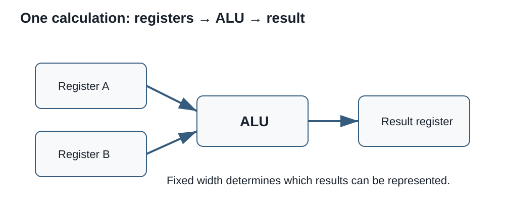

# Session 5 - Processor, ALU, and Fixed-Width Arithmetic

## Purpose of the session

In Session 4, we followed a value from an address in RAM into a processor register. That value can now be used by an instruction.

What happens next?

```text
LOAD [0202], R1
LOAD [0203], R2
ADD  R1, R2
```

The first two instructions place values in registers. The third asks the processor to perform an addition. This operation raises two questions that guide the session:

> Which part of the processor actually performs the calculation?

> What happens when the mathematical result cannot fit within the available number of bits?

This session introduces the processor's major internal roles, then uses the **arithmetic logic unit**, or **ALU**, to connect the binary representations from Sessions 2 and 3 to the operation of a real computer. We will study fixed-width addition, carries, unsigned wraparound, and signed overflow. We will finish by learning how to interpret several common specifications of a real processor.

## Objectives

By the end of this session, you should be able to:

- distinguish the roles of the control unit, registers, ALU, and cache, then follow the simplified path of operands and a result;
- explain operation width, perform fixed-width binary addition, and show carries;
- separate the full sum from the retained result and explain unsigned wraparound;
- recognize signed overflow, distinguish it from carry out, and interpret the main status indicators;
- distinguish width, instruction set, core, hardware thread, logical processor, frequency, pipeline, and cache levels;
- interpret a processor specification sheet and compare several characteristics against a need, platform, and constraints.

!!! question "Guiding questions"
    1. **Who directs the operation?** How does the control unit interpret an instruction?
    2. **Where are the operands?** Which registers supply values to the ALU?
    3. **Does the result fit?** How do we distinguish carry, wraparound, and signed overflow?

!!! info "Scope of the session"
    **Master today:** control unit, register, ALU, operand, result, width, binary addition, carry, carry out, unsigned wraparound, and signed overflow.

    **Recognize today:** core, hardware thread, frequency, base and boost frequency, pipeline, L1/L2/L3 cache, instruction set, logical processor, performance core, and efficiency core.

    **Not required:** detailed microarchitecture, branch prediction, speculative execution, or precise performance calculation from one characteristic alone.

## An opening puzzle: what comes after 255?

Imagine an unsigned eight-bit counter. It currently contains:

```text
11111111
```

This pattern represents `255`<sub>`10`</sub>. The processor must now add `1`.

Mathematically:

```text
255 + 1 = 256
```

However, an eight-bit register has only eight positions. The binary representation of `256` requires nine:

```text
1 00000000
```

Which value will remain in the register?

!!! question "Initial hypothesis"
    Before completing the addition, choose the hypothesis that seems most plausible.

    1. The register temporarily expands to nine bits.
    2. The processor always refuses the operation.
    3. The ninth bit is reported elsewhere and the register's eight bits become `00000000`.
    4. The result automatically becomes a negative number.

    Record your choice and justification. We will return to the counter after examining the processor's internal organization.

## From the visible processor to the work performed

In everyday language, **processor** may refer to the physical package installed in a motherboard socket. In this session, we are mainly concerned with the functions implemented inside that package.


### Package, socket, and contact arrangement

The **processor package** is the component handled during installation. The **socket** is the corresponding mechanical and electrical connector on the motherboard. It aligns the processor, maintains contact, and connects its signals to the rest of the platform.

Two contact arrangements are especially useful to recognize:

- **LGA** (*land grid array*): spring contacts are mainly in the motherboard socket, while the processor presents flat contact lands;
- **PGA** (*pin grid array*): pins are mainly underneath the processor and enter openings in the socket.

A socket name identifies a specific interface. The number following `LGA`, for example, is not a performance measurement; it forms part of the package and contact-arrangement name.

| Manufacturer | Desktop socket family | Arrangement | Example processor families |
|---|---|---|---|
| Intel | LGA1700 | LGA | Some 12th-, 13th-, and 14th-generation Intel Core desktop processors |
| Intel | LGA1851 | LGA | Intel Core Ultra desktop processors, Series 2 |
| AMD | AM4 | PGA | Many earlier-generation Ryzen processors |
| AMD | AM5 | LGA | Recent Ryzen processors designed for the AM5 platform |

!!! warning "Manufacturer does not determine the socket"
    An Intel processor is not compatible with every Intel motherboard, and an AMD processor is not compatible with every AMD motherboard. The **exact socket** must match. Session 8 will then add chipset, firmware, and the official support list to that check.

!!! note "Examples, not a permanent catalogue"
    Socket families change. The table helps distinguish manufacturer, processor family, and socket through recent examples; it does not replace the exact model's specification.

This distinction locates the processor physically. We can now examine the work performed inside its package.

A modern processor contains a very large number of circuits. To understand one instruction, we will use a deliberately simplified model:

```text
                    ┌──────────────────────────────┐
instruction ───────▶│ control unit                 │
                    │          │                   │
                    │          ▼                   │
data ◀─────────────▶│      registers ◀────▶ ALU    │
                    │          ▲            │      │
                    │          └── result ───┘      │
                    │        cache memory           │
                    └──────────────────────────────┘
```

This diagram represents **roles**, not necessarily one unique and physically separate block for each role in every processor.

### The control unit

The **control unit** coordinates instruction execution. In our model, it:

- obtains the instruction;
- decodes it;
- determines the requested operation;
- selects the relevant registers or data;
- commands the required transfers;
- directs the result to its destination.

It does not replace the ALU. It organizes the operation and indicates what must be done.

### Registers

A **register** is a very small storage location inside the processor. It can temporarily hold:

- an operand;
- a result;
- an address;
- an instruction;
- state needed to control execution.

Registers are identified by names or numbers defined by the processor architecture. An instruction may specify which registers to read and which register receives the result.

### The arithmetic logic unit

The **arithmetic logic unit**, or **ALU**, performs operations on bit patterns.

It may perform operations including:

| Category | Examples |
|---|---|
| Arithmetic | addition, subtraction, increment, decrement |
| Logic | AND, OR, exclusive OR, NOT |
| Comparison | determine whether values are equal or one is smaller |
| Shift | move bits left or right |

A real processor may contain several specialized execution units. The term ALU remains useful for understanding the general role of circuits that perform integer arithmetic and logical operations.

### Cache memory

**Cache memory** retains copies of data and instructions likely to be needed soon. It reduces how often the processor must wait for more distant memory.

Common labels include:

- **L1**: very small and very close to the execution units;
- **L2**: larger, but generally somewhat farther away;
- **L3**: larger again and often shared among several cores.

The details vary by processor. We should not assume that every model has exactly the same organization.

!!! question "Check: who does what?"
    Match each action to its principal role.

    1. temporarily retain the two operands;
    2. decode the `ADD` instruction;
    3. produce the sum;
    4. retain a recent copy of data obtained from RAM.

    **Answer:** registers → control unit → ALU → cache memory.

## From the instruction cycle to the ALU

Consider this simplified instruction:

```text
ADD R1, R2, R3
```

We will interpret it as:

> Add the contents of `R1` and `R2`, then place the result in `R3`.

The conceptual path is:

1. the control unit decodes the `ADD` operation;
2. it identifies `R1` and `R2` as source registers;
3. the register contents become the **operands**;
4. the ALU performs the addition;
5. the result at the specified width is placed in `R3`;
6. status indicators may be updated.

```text
R1 ── operand A ───┐
                   ├──▶ ALU ── result ──▶ R3
R2 ── operand B ───┘
```

!!! note "Syntax varies"
    Real instruction sets do not all use the same syntax. Some write the destination first, some use two operands, and others use three. Our notation is only intended to track the roles.

## Instruction set and architecture

An **instruction set** describes the operations a processor can execute and how programs request them. The term **instruction set architecture**, or **ISA**, describes matters including:

- the available instructions;
- registers visible to programs;
- supported data sizes;
- how instructions are encoded;
- certain addressing and execution rules.

Families such as **x86-64** and **Arm** use different instruction sets. Two processors compatible with the same ISA can still have different internal organizations and performance.

!!! warning "Architecture and product model are not synonyms"
    A processor name identifies a product. The ISA identifies the machine language it understands. Many products and generations may implement the same ISA.

## Data width and operation width

An ALU does not work with unlimited abstract numbers. It operates on bit patterns of a defined width.

In an eight-bit operation:

```text
operand A : 8 bits
operand B : 8 bits
result    : 8 bits
```

The mathematical sum of two eight-bit values may nevertheless require nine bits.

For example:

```text
  11111111
+ 00000001
----------
1 00000000
```

The full sum contains nine bits, but the value retained in an eight-bit destination is only:

```text
00000000
```

The extra bit is the **carry out**.

!!! note "Fixed-width rule"
    For an `n`-bit operation, the destination retains the `n` least significant bits of the result.

    Extra bits do not automatically become part of the destination. The processor may report their presence through a status indicator.

## How to perform binary addition

Binary addition follows the same principle as decimal addition: work from right to left and pass a carry to the next position.

### The four fundamental cases

| A | B | Carry in | Sum bit | Carry out |
|:---:|:---:|:---:|:---:|:---:|
| 0 | 0 | 0 | 0 | 0 |
| 0 | 1 | 0 | 1 | 0 |
| 1 | 0 | 0 | 1 | 0 |
| 1 | 1 | 0 | 0 | 1 |

When the carry in is `1`, it must also be added:

| A | B | Carry in | Total | Sum bit | Carry out |
|:---:|:---:|:---:|---:|:---:|:---:|
| 0 | 0 | 1 | 1 | 1 | 0 |
| 0 | 1 | 1 | 2 | 0 | 1 |
| 1 | 0 | 1 | 2 | 0 | 1 |
| 1 | 1 | 1 | 3 | 1 | 1 |

In binary:

- `0 + 0 = 0`;
- `0 + 1 = 1`;
- `1 + 1 = 10`: write `0` and carry `1`;
- `1 + 1 + 1 = 11`: write `1` and carry `1`.

### Example without a final carry out

Add `0101` and `0011` using four bits:

```text
 carries :   1 1
             0 1 0 1
           + 0 0 1 1
           ---------
             1 0 0 0
```

The sum is `1000`<sub>`2`</sub>, or `8`<sub>`10`</sub>. It fits in four bits, so there is no final carry out.

### Example with a final carry out

Add `1110` and `0101` using four bits:

```text
 carries : 1 1 1
             1 1 1 0
           + 0 1 0 1
           ---------
           1 0 0 1 1
```

The full mathematical sum is `10011`<sub>`2`</sub>, or `19`<sub>`10`</sub>.

In a four-bit destination:

- the retained result is `0011`;
- the final carry out is `1`.

??? question "Check: four-bit addition"
    Calculate `1011 + 0110` using four bits.

    1. What is the full sum?
    2. Which four bits are retained?
    3. Is there a final carry out?

    **Answer:** the full sum is `10001`; the retained result is `0001`; the final carry out is `1`.

## Unsigned integers and wraparound

With `n` bits, an unsigned integer can represent values from `0` through `2`<sup>`n`</sup>` - 1`.

| Width | Minimum | Maximum | Number of patterns |
|---:|---:|---:|---:|
| 4 bits | 0 | 15 | 16 |
| 8 bits | 0 | 255 | 256 |
| 16 bits | 0 | 65,535 | 65,536 |

When the result exceeds the maximum, only the bits that fit within the width are retained. The value therefore returns to the beginning of the range. This behaviour is called **wraparound**.

### The opening counter

```text
  11111111   255
+ 00000001     1
----------
1 00000000   256 as the full sum
```

Using eight bits, the register retains:

```text
00000000
```

The counter therefore moves from `255` to `0`.

This is not a random result. Unsigned `n`-bit arithmetic operates **modulo `2`**<sup>`n`</sup>. For eight bits, we retain the remainder after division by `256`.

```text
256 modulo 256 = 0
257 modulo 256 = 1
511 modulo 256 = 255
```

!!! note "Wraparound can be intentional or problematic"
    A circular counter may intentionally use wraparound. In a file-size, price, or security calculation, unexpected wraparound can cause a serious error.

### Another example

```text
  11111010   250
+ 00001010    10
----------
1 00000100   260 as the full sum
```

The eight-bit result is `00000100`, or `4`. The carry out reports that the unsigned sum did not fit within eight bits.

## One pattern, two interpretations

In Session 3, we saw that a bit pattern does not state its own type.

Consider:

```text
10000000
```

Using eight bits, this pattern may represent:

- `128` as an unsigned integer;
- `-128` as a two's-complement signed integer.

The ALU produces bits. Their interpretation depends on the instruction, data type, and program context.

This distinction explains why carry out alone cannot identify every possible error.

## Reminder: two's complement

For a signed two's-complement integer using `n` bits:

- the leftmost bit is the sign bit;
- `0` indicates a non-negative value;
- `1` indicates a negative value;
- the range is `-2`<sup>`n-1`</sup> through `2`<sup>`n-1`</sup>` - 1`.

| Width | Signed minimum | Signed maximum |
|---:|---:|---:|
| 4 bits | -8 | 7 |
| 8 bits | -128 | 127 |
| 16 bits | -32,768 | 32,767 |

!!! note "Why is the range not symmetrical?"
    With eight bits, one pattern represents zero. This leaves 255 patterns: 127 positive and 128 negative.

    The minimum has the special pattern `10000000`, while the maximum is `01111111`.

## Signed overflow

**Signed overflow** occurs when the mathematical result lies outside the representable range, even though the ALU still produces a bit pattern of the expected width.

### Positive overflow

```text
  01111111   127
+ 00000001     1
----------
  10000000  -128 when interpreted as signed
```

The mathematical sum should be `128`, but eight signed bits can only represent values from `-128` through `127`.

There is no final carry out, but signed overflow occurs.

### Negative overflow

```text
  10000000  -128
+ 11111111    -1
----------
1 01111111   127 in the eight retained bits
```

The mathematical sum should be `-129`, below the minimum representable value. The retained result therefore appears positive.

In this case, both final carry out and signed overflow occur.

### Practical rule for addition

For two's-complement addition:

> Signed overflow occurs when two operands with the same sign produce a result with the opposite sign.

| Sign of A | Sign of B | Sign of result | Signed overflow? |
|:---:|:---:|:---:|:---:|
| positive | positive | negative | Yes |
| negative | negative | positive | Yes |
| positive | negative | positive or negative | No |
| negative | positive | positive or negative | No |

!!! warning "Different signs do not overflow during addition"
    Adding a positive value and a negative value generally moves the result toward zero. The result cannot therefore exceed both ends of the signed range.

## Carry out and overflow are not the same

**Carry out** primarily answers an unsigned question:

> Does the full sum require an additional bit?

**Signed overflow** answers a signed question:

> Is the mathematical result outside the signed range?

These conditions are independent.

| 8-bit addition | Unsigned interpretation | Signed interpretation | Carry out | Signed overflow |
|---|---:|---:|:---:|:---:|
| `11111111 + 00000001` | 255 + 1 → 0 | -1 + 1 → 0 | Yes | No |
| `01111111 + 00000001` | 127 + 1 → 128 | 127 + 1 → -128 | No | Yes |
| `10000000 + 11111111` | 128 + 255 → 127 | -128 + -1 → 127 | Yes | Yes |
| `11111110 + 00000001` | 254 + 1 → 255 | -2 + 1 → -1 | No | No |

??? question "Check: carry or overflow?"
    For each addition, state whether final carry out and signed overflow occur.

    1. `11111111 + 00000001`
    2. `01111111 + 00000001`
    3. `10000000 + 11111111`
    4. `11111110 + 00000001`

    Then compare your answers with the preceding table. The ALU produces the same pattern; the questions we ask about that pattern are different.

## Status indicators

After an operation, a processor may update **status indicators**, often called *flags*. They allow later instructions to learn something about the result without repeating the operation.

Common conceptual indicators include:

| Conceptual indicator | What it reports |
|---|---|
| Zero | The retained result is zero |
| Sign | The result's sign bit is `1` |
| Carry | A carry left the most significant position |
| Overflow | The signed result is not representable at the chosen width |

Exact names and detailed rules vary by architecture.

!!! note "An indicator does not understand the program"
    An indicator reports a condition. The program or following instruction decides whether that condition is normal, expected, or problematic.

## What about subtraction?

An ALU may perform subtraction directly or by using a form of addition with two's complement.

Conceptually:

```text
A - B = A + (-B)
```

For example, using eight bits:

```text
5 - 3 = 5 + (-3)
```

The two's-complement representation of `-3` is `11111101`:

```text
  00000101    5
+ 11111101   -3
----------
1 00000010    2
```

The retained eight bits represent `2`.

!!! warning "Carry and borrow in subtraction"
    Architectures do not all interpret the carry indicator in exactly the same way after subtraction. Some use it to report the absence of a borrow; others expose the information differently.

    In this session, our detailed analysis of carry and overflow therefore focuses on addition.

## What does “64-bit processor” mean?

The expression **64-bit** can describe several widths associated with an architecture, including the size of many general-purpose registers and the width of common integer operations.

It does not mean that every circuit, instruction, or transfer in the processor always uses exactly 64 bits.

A 64-bit processor and operating system can, among other things:

- directly manipulate wider integers and addresses than a 32-bit architecture;
- use a much larger potential address space;
- run an operating system and applications designed for that ISA.

!!! warning "Theoretical width and practical limit"
    A 64-bit address theoretically provides `2`<sup>`64`</sup> different patterns. Processors, operating systems, and motherboards do not necessarily implement or use every one of those address bits.

    The amount of RAM that can actually be used therefore depends on several limits, not on the phrase “64-bit” alone.

This connects to Session 4: address width determines how many different locations can be identified, while data width states how many bits can be processed or transferred in a particular context.

## Core, hardware thread, and logical processor

A **core** is a unit capable of executing an instruction stream. One physical processor may contain several cores.

Some cores can maintain the state of more than one hardware thread. The operating system often presents these as multiple **logical processors**.

| Term | General idea |
|---|---|
| Physical processor | Package or component installed in the system |
| Core | Execution resource inside the processor |
| Hardware thread | Context allowing one core to make progress on more than one instruction stream |
| Logical processor | Execution resource visible to the operating system |

!!! warning "Two threads do not mean twice the performance"
    Two hardware threads on one core share some resources. The gain depends on the software, workload, and the processor resource limiting execution.

### Performance and efficiency cores

Some processors use different kinds of cores:

- **performance cores**, designed to provide greater performance per thread;
- **efficiency cores**, designed to complete work using less power and chip area.

The operating system and processor cooperate to schedule work. The total core count therefore does not describe the whole performance picture.

## Frequency and clock cycles

**Frequency** states how many clock cycles occur each second.

- `1 MHz` = one million cycles per second;
- `1 GHz` = one billion cycles per second.

A cycle provides a common rhythm for circuits, but it does not necessarily correspond to one complete instruction.

An instruction may:

- require several cycles;
- overlap its execution with other instructions;
- wait for data;
- be divided into several stages;
- use a different execution unit.

!!! warning "More GHz does not automatically mean faster"
    Performance also depends on architecture, core count, cache, memory bandwidth, power limits, cooling, and the software being executed.

### Pipeline and overlapped execution

An instruction can be divided into stages, such as fetching the instruction, decoding it, obtaining operands, and executing the operation. A **pipeline** allows several instructions to occupy different stages at the same time.

```text
cycle 1: instruction A — fetch
cycle 2: instruction A — decode    | instruction B — fetch
cycle 3: instruction A — execute   | instruction B — decode | instruction C — fetch
```

This overlap can increase throughput, but it does not guarantee that one complete instruction finishes during every cycle. A dependency between instructions, data missing from cache, or a branch decision can slow the pipeline.

Some processors can also send several operations to different execution units during the same cycle. This capability contributes to performance, but depends on the program and on operand availability.

### Base and boost frequency

A specification sheet may state:

- a **base frequency**, associated with sustained operation under defined conditions;
- a **boost frequency**, temporarily reachable when temperature, power, and workload allow it.

The advertised maximum frequency does not mean that every core always operates at that frequency.

## How to read a processor specification sheet

A specification sheet contains many values. We must connect them to the actual need rather than automatically choosing the largest number.

| Characteristic | Useful question |
|---|---|
| Cores and threads | Can the software use several tasks in parallel? |
| Frequencies | What per-core performance can reasonably be expected from this architecture? |
| Cache | How much data and instruction content can remain near the execution units? |
| ISA and extensions | Are the operating system and applications compatible? |
| Socket or package | Is the processor physically and electrically compatible with the motherboard? |
| Supported memory | Which RAM types, capacities, and speeds are officially supported? |
| Power | Are the cooling and power supply appropriate for the intended workload? |
| Integrated graphics | Is a separate graphics card required? |

### Why comparison requires several indicators

Consider two fictional processors:

| Characteristic | Processor A | Processor B |
|---|---:|---:|
| Cores | 4 | 8 |
| Maximum frequency | 4.8 GHz | 4.2 GHz |
| Cache | 12 MB | 24 MB |
| Power | 65 W | 105 W |

These figures are not enough to declare one universal winner.

We must also know:

- the type of software;
- how many threads it can actually use;
- the performance of each core;
- how long the workload lasts;
- the available cooling;
- cost;
- the required motherboard;
- relevant benchmark results.

!!! question "Mini-analysis"
    One person mainly uses a browser, office applications, and videoconferencing. Another regularly performs 3D rendering and software compilation.

    Explain why they might select different processors even if one model has the greatest number of cores.

<figure markdown="span">
  { loading=lazy width="900" }
  <figcaption>C12 synthesis diagram. It is a conceptual reference; real hardware specifications must still be verified in the relevant documentation.</figcaption>
</figure>

## Integrated synthesis: connecting specifications to internal operation

Commercial characteristics describe resources that ultimately serve instruction execution:

- **cores** allow several instruction streams to progress;
- **hardware threads** improve the use of some shared resources;
- **frequency** provides the timing rhythm;
- **caches** bring data and instructions closer;
- the **ISA** defines operations visible to programs;
- units such as the **ALU** perform the requested calculations.

None of these characteristics acts alone. A technical recommendation must therefore consider the complete system and the work to be performed.

## Common errors to avoid

### Confusing the processor with the ALU

The ALU is one functional part of a processor. The processor also contains registers, control units, caches, and other execution units.

### Adding without preserving the width

An eight-bit operation retains eight bits. Writing nine bits as the register result changes the problem.

### Confusing an intermediate carry with the final carry out

An addition may produce several carries between columns. Only the carry leaving the most significant position is the final carry out.

### Inferring signed overflow from carry alone

Carry out can occur without signed overflow, and signed overflow can occur without carry out.

### Interpreting bits before knowing the type

`10000000` is `128` as an unsigned integer and `-128` as an eight-bit signed integer.

### Comparing processors only by frequency

Two processors at the same frequency may complete different amounts of work per cycle and behave differently during a sustained workload.

### Adding core frequencies together

An eight-core 4 GHz processor does not become a 32 GHz processor. Cores perform work in parallel; their frequencies do not add in that way.

## What to remember

### How does the processor organize an operation?

- The control unit decodes and coordinates.
- Registers provide operands and receive results.
- The ALU performs arithmetic and logical operations.
- Cache memory keeps useful information near the execution units.

### What happens to an oversized result?

- The operation has a defined width.
- The destination retains the least significant bits that fit.
- Carry out indicates that an unsigned sum required another bit.
- Unsigned integers wrap modulo `2`<sup>`n`</sup>.

### How do we recognize signed overflow?

- We must know the width and two's-complement interpretation.
- Two operands with the same sign producing an opposite-sign result indicate overflow.
- Carry out and signed overflow answer different questions.

### How do we compare processors?

- Cores, threads, frequency, cache, ISA, power, and compatibility describe different aspects.
- No isolated figure identifies the best processor for every use.
- A recommendation must connect characteristics to needs, budget, and the rest of the system.

## Put it into practice

[Continue to Lab 5 - Observing the processor and analyzing ALU arithmetic](../labs/lab-5.md)
