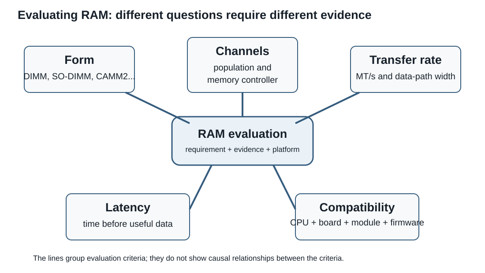

# Session 6 - Random-access memory: capacity, performance, and modern formats

## Purpose of the session

In Session 4, we learned that an address identifies a byte in memory and that a multi-byte value occupies several consecutive addresses. In Session 5, we followed operands into processor registers and the ALU, then saw that caches keep likely-to-be-reused data and instructions close to the execution units.

We now need to examine the much larger working memory that supplies those caches: **random-access memory**, or **RAM**.

This session addresses three questions:

> How does RAM temporarily retain a large quantity of data?

> How do capacity, bandwidth, and latency affect system behaviour?

> How do we determine whether a memory module or technology is suitable for a particular processor, motherboard, and use case?

We will connect the internal operation of DRAM to the characteristics visible on a specification sheet: DDR generation, transfer rate in MT/s, channels, latency, ECC, module type, and physical form factor. We will finish with DIMM, SO-DIMM, CAMM2, and LPCAMM2, establishing a method for evaluation without assuming that one technology is always superior.

## Objectives

### Main pathway

By the end of the main pathway, you should be able to:

- explain the role of RAM and distinguish SRAM, DRAM, storage, and cache memory;
- distinguish installed capacity, supported capacity, and available memory;
- interpret a DDR generation and distinguish MHz from MT/s;
- calculate theoretical bandwidth and compare simple CAS latencies;
- explain how channels and module population affect performance and compatibility;
- distinguish ECC, UDIMM, RDIMM, DIMM, SO-DIMM, CAMM2, and LPCAMM2;
- check memory compatibility using processor, motherboard or system, and module documentation;
- determine what evidence is needed to recommend a memory solution for a system's requirements, compatibility, reliability, and life cycle.

!!! question "Guiding questions"
    1. **Where is the data now?** In a register, cache, RAM, or storage?
    2. **How much can be moved, and how long must we wait?** Capacity, bandwidth, and latency answer different questions.
    3. **Is the complete system compatible?** The module alone does not determine actual speed, reliability, or whether it can be installed.

!!! info "Scope of the session"
    **Master today:** the role and volatility of RAM, SRAM and DRAM, capacity, DDR, MHz and MT/s, bandwidth, CAS latency, channels, ECC, UDIMM, RDIMM, DIMM, SO-DIMM, CAMM2, LPCAMM2, and the compatibility workflow.

    **Recognize today:** SPD, JEDEC settings, XMP or EXPO profiles, and soldered memory.

    **Go further after the lab link:** detailed DRAM addressing, secondary timings, base clock, multipliers, memory-controller ratios, overclocking, memory training, and profile optimization. This section is optional.

<div class="admonition info session-6-navigation"><p class="admonition-title">Navigation guide</p>
<p>This session is deliberately detailed because it is a reference after class. For a first reading, follow this pathway:</p>
<ol>
<li><strong>Role of RAM:</strong> memory hierarchy, SRAM, and DRAM.</li>
<li><strong>Measures not to confuse:</strong> capacity, MT/s, bandwidth, and latency.</li>
<li><strong>Organization:</strong> channels, module population, and ECC.</li>
<li><strong>Compatibility:</strong> DDR generation, form, memory controller, motherboard, and documentation.</li>
<li><strong>Modern forms:</strong> DIMM, SO-DIMM, CAMM2, and LPCAMM2.</li>
</ol>
<p>SPD, profiles, and advanced tuning remain recognition-level or enrichment material according to the scope callout above.</p></div>

## A story about a book: where should we look for the next word?

Imagine that the processor is currently working with one exact word from a book.

| Memory level | Element in the analogy |
|---|---|
| Register | The exact word currently required |
| L1 cache | The sentence containing that word |
| L2 cache | The paragraph containing that sentence |
| L3 cache | The page containing that paragraph |
| RAM | The book containing that page |
| Storage | Another book that must be retrieved from the library |

If the next required word is in the same sentence, the processor can find it in what is already very close, represented here by L1 cache.

If it is in another sentence in the same paragraph, a larger nearby region must be consulted, represented by L2 cache. The useful sentence is then brought closer before the word is placed in the register.

If it is in another paragraph on the same page, L3 cache represents a still larger region to consult.

If it is on another page of the same book, the system must reach RAM. If the required content is not presently in RAM, the operating system may need to retrieve it from storage, which is more like travelling to a library.

```text
current word
    │
    ▼
register
    │ miss
    ▼
L1: sentence
    │ miss
    ▼
L2: paragraph
    │ miss
    ▼
L3: page
    │ miss
    ▼
RAM: book
    │ data absent from working memory
    ▼
storage: library
```

### What the analogy helps us understand

The analogy represents two important ideas.

**Spatial locality** means that when one item is used, nearby items are often likely to be used soon. A program frequently processes consecutive instructions, neighbouring array elements, or adjacent characters in text.

**Temporal locality** means that recently used data is often likely to be used again soon. A loop, a frequently consulted variable, or a repeated instruction are examples.

These patterns allow caches to bring blocks of data closer before every individual byte is explicitly requested.

!!! warning "An analogy, not a literal diagram"
    A cache does not understand words, sentences, or paragraphs. It transfers blocks of bytes called **cache lines**. The details of lookup, filling, and replacement vary among processors.

    The analogy represents distance, the amount of nearby data retained, and increasing access cost when the required data must be found farther away.

??? question "Check: which level in the analogy?"
    Match each situation to the first region in which the data might be found.

    1. The next character is in the same sentence.
    2. It is in another paragraph on the same page.
    3. It is on another page in the same book.
    4. The document is not presently loaded into working memory.

    **Answer:** L1, L3, RAM, and then storage.

## RAM is working memory

**Random-access memory** retains instructions and data used by running programs. It provides far more capacity than registers and caches while still allowing much faster access than secondary storage.

RAM is **volatile**: its contents are not retained when power is removed.

When you open an application or file:

1. persistent data is read from an SSD or another storage device;
2. the required parts are placed in RAM;
3. useful blocks are then brought closer into caches;
4. immediate operands are placed in registers;
5. execution units perform operations.

```text
storage → RAM → caches → registers → execution units
  slower     │       │        │              faster
   large     │       │        │              small
 capacity    └───────┴────────┴── increasing proximity to CPU
```

### Insufficient capacity

When RAM cannot hold the active working set, the operating system may temporarily move some data between RAM and storage. This allows the system to continue operating, but storage remains much slower than RAM.

We will study virtual memory and paging more precisely during the operating-systems session. For now, remember:

> Adding capacity can greatly improve a system that genuinely lacks RAM, but adding RAM to a system that already has enough does not automatically make every operation faster.

## SRAM and DRAM: two different trade-offs

The term RAM describes memory that can be accessed by address, but several technologies can fill that role.

### SRAM

**SRAM** (*static random-access memory*) stores a bit in a small circuit built from several transistors. It does not require periodic refresh while power is present.

It is:

- very fast;
- expensive per bit;
- relatively low-density;
- used in small quantities close to execution units, especially in caches.

### DRAM

**DRAM** (*dynamic random-access memory*) typically represents a bit using a capacitor controlled by a transistor.

The capacitor gradually loses charge. Its contents must therefore be periodically read and restored through a process called **refresh**.

DRAM is:

- slower than SRAM;
- less expensive per bit;
- much denser;
- suitable for the large capacity of main memory.

| Property | SRAM | DRAM |
|---|---|---|
| Typical use | Processor caches | Main memory |
| Cell structure | Several transistors | Transistor and capacitor, simplified model |
| Periodic refresh | No | Yes |
| Density | Lower | Higher |
| Cost per bit | Higher | Lower |
| Typical system capacity | Small | Large |

!!! note "Registers are not simply an even smaller cache"
    Registers and SRAM may use related circuit techniques, but a register is an architectural or internal resource directly used by execution units. A cache automatically manages copies of data from a more distant level.

## How a DRAM cell retains a bit

In our simplified model:

- an electrical charge represents one state;
- the absence or a different amount of charge represents the other state;
- a transistor controls access to the capacitor;
- reading may disturb the state, which must then be restored;
- natural charge leakage requires periodic refresh.

```text
word line ── controls the transistor
                  │
bit line ─────────┤── capacitor
```

The memory controller and DRAM circuitry coordinate these operations. The processor does not execute a separate software instruction to refresh each cell.

!!! warning "Electrical charge does not mean an analogue value visible to software"
    Circuits interpret states using electrical thresholds. A program sees bits and bytes, not the exact charge stored in a capacitor.

## Revisiting address space and capacity

With `n` address bits, `2`<sup>`n`</sup> different patterns can be formed.

If each address identifies one byte:

```text
32 address bits
→ 2³² addresses
→ 4,294,967,296 bytes
→ 4 GiB of theoretical address space
```

Several different limits must nevertheless be distinguished.

| Limit | Question |
|---|---|
| Architectural address space | How many addresses can the architecture express? |
| Address bits actually implemented | How many of those bits does this processor actually use? |
| Memory controller | What capacity, channels, and memory types are supported? |
| Motherboard and firmware | Which modules, capacities, and population arrangements are supported? |
| Installed memory | How much physical memory is present? |
| Usable system memory | How much remains available after hardware and software reservations? |

A “64-bit processor” does not therefore guarantee that the system accepts `2`<sup>`64`</sup> bytes of RAM.

??? question "Check: which capacity is being described?"
    A 64-bit computer has 16 GiB installed, but the system reports 15.7 GiB usable. The processor manufacturer states a maximum memory capacity of 256 GiB.

    - `256 GiB` describes a product or controller limit.
    - `16 GiB` describes physically installed memory.
    - `15.7 GiB` describes usable memory after reservations.

## From SDRAM to DDR

Modern main memory is generally **SDRAM**, meaning DRAM synchronized with a communication clock.

**DDR** means *double data rate*. Transfers occur at two points during each clock cycle, producing two data transfers per cycle.

```text
memory clock: 3,000 million cycles per second
DDR:          2 transfers per cycle
result:       6,000 million transfers per second
```

Memory sold as **DDR5-6000** is therefore described by a transfer rate of `6,000 MT/s`, not a 6,000 MHz memory clock.

### MHz and MT/s

- **MHz** measures millions of cycles per second;
- **MT/s** measures millions of transfers per second.

For simplified DDR memory:

```text
transfer rate in MT/s ≈ 2 × memory clock in MHz
```

Using a different DDR5 rate:

```text
DDR5-5600
≈ 2,800 MHz memory clock
× 2 transfers per cycle
= 5,600 MT/s
```

!!! question "Your turn: work backwards"
    DDR5-5200 memory performs `5,200 MT/s`.

    What is its approximate underlying memory clock in MHz?

??? success "Check"
    `5,200 ÷ 2 = 2,600`

    In this simplified model, DDR5-5200 therefore uses an underlying memory clock of approximately **2,600 MHz**.

!!! warning "A common commercial habit"
    Retailers and some software often refer to “6000 MHz RAM.” This usually means a DDR transfer rate of 6000 MT/s. It does not mean that the DRAM clock performs 6000 million cycles per second.

## DDR generations

DDR generations are not merely different speeds. They change electrical characteristics, signalling, power management, and internal organization.

| Generation | General idea | Physical compatibility |
|---|---|---|
| DDR3 | Older generation still found in legacy systems | Its own notch and electrical characteristics |
| DDR4 | Very common in PCs from the 2010s and early 2020s | Incompatible with DDR3 and DDR5 |
| DDR5 | Higher transfer rates and capacities, with organizational and power changes | Incompatible with DDR4 |

<div style="display:grid;grid-template-columns:repeat(auto-fit,minmax(210px,1fr));gap:1rem;align-items:start;margin:1rem 0;">
  <figure style="margin:0;">
    
    <figcaption><strong>DDR3 DIMM.</strong> Photograph: Suyash.dwivedi, <a href="https://commons.wikimedia.org/wiki/File:2GB_DDR3_Desktop_RAM_1333Mhz.jpg">Wikimedia Commons</a>, <a href="https://creativecommons.org/licenses/by-sa/4.0/">CC BY-SA 4.0</a>.</figcaption>
  </figure>
  <figure style="margin:0;">
    
    <figcaption><strong>DDR4 DIMM.</strong> Photograph: ElooKoN, <a href="https://commons.wikimedia.org/wiki/File:RAM_Module_(SDRAM-DDR4).jpg">Wikimedia Commons</a>, <a href="https://creativecommons.org/licenses/by-sa/4.0/">CC BY-SA 4.0</a>.</figcaption>
  </figure>
  <figure style="margin:0;">
    
    <figcaption><strong>DDR5 DIMM.</strong> Photograph: Jacek Halicki, <a href="https://commons.wikimedia.org/wiki/File:2023_Pami%C4%99ci_Corsair_Vengeance_RGB.jpg">Wikimedia Commons</a>, <a href="https://creativecommons.org/licenses/by-sa/4.0/">CC BY-SA 4.0</a>.</figcaption>
  </figure>
</div>

The photographs help you recognize the general shape of a DIMM, but appearance alone cannot identify the generation reliably. Heat spreaders, colours, and chip counts vary by manufacturer. Check the label, notch, specification sheet, and intended platform.

DDR4 and DDR5 desktop modules may be described as having the same broad contact count in some specifications, but their notches, signalling, and operation differ. They are not interchangeable.

!!! note "DDR5 on-die ECC"
    DDR5 chips use internal correction mechanisms to improve manufacturing yield and internal reliability. This **on-die ECC** does not replace platform ECC that protects data across the broader path visible to the system.

## Calculating theoretical bandwidth

**Bandwidth** describes how much data could be transferred per unit of time under ideal conditions.

For the bandwidth exercises in this course, we use a **simplified 64-bit aggregate platform data-path model**:

```text
64 bits ÷ 8 = 8 bytes per transfer
```

A standard DDR5 DIMM divides this data path into **two independent 32-bit data subchannels**. On an ECC DIMM, each subchannel is 40 bits wide: 32 data bits plus 8 ECC check bits. This organization allows more independent access, but it does not double the 64 data bits used in our aggregate calculation.

In the calculations below, “64-bit channel” refers to the **64-bit aggregate platform path used by this simplified model**, not to one DDR5 subchannel.

With DDR5-5600:

```text
5,600 million transfers/s × 8 bytes
= 44,800 million bytes/s
≈ 44.8 GB/s for this 64-bit aggregate path
```

With two independent 64-bit aggregate paths:

```text
44.8 GB/s × 2
≈ 89.6 GB/s
```

Simplified general formula:

```text
theoretical bandwidth
= transfer rate in MT/s × bytes transferred per aggregate path × aggregate-path count
```

!!! warning "Theoretical does not mean measured"
    This formula does not account for commands, refreshes, row changes, conflicts, waiting, software limitations, or controller efficiency. A real application will not necessarily achieve this maximum.

??? question "Guided example"
    A platform uses two 64-bit aggregate paths with DDR5-4800 in this simplified model.

    ```text
    4,800 MT/s × 8 bytes × 2 channels
    = 76,800 MB/s
    ≈ 76.8 GB/s
    ```

    This describes aggregated theoretical bandwidth.

## Capacity, bandwidth, and latency

These three characteristics answer different questions.

| Characteristic | Main question |
|---|---|
| Capacity | How much active data can remain in RAM? |
| Bandwidth | How much data can be transferred each second? |
| Latency | How long must we wait before requested data begins to arrive? |

Large capacity does not automatically imply low latency. A high transfer rate does not prevent an individual request from waiting. Low latency does not guarantee sufficient capacity.

### Road analogy

- **Capacity** resembles the total quantity of goods that can be held in a warehouse.
- **Bandwidth** resembles the number of trucks that can use a road each minute.
- **Latency** resembles the time required for the first truck to complete the journey.

A wider road can move more goods without necessarily reducing the distance to the warehouse.

## Converting CAS latency into time

Comparing only the `CL` number can be misleading because each cycle is shorter at a higher clock rate.

For DDR memory:

```text
approximate CAS latency in ns
= CL × 2,000 ÷ DDR transfer rate in MT/s
```

### Example 1: DDR5-6000 CL30

```text
30 × 2,000 ÷ 6,000
= 10 ns
```

### Example 2: DDR5-4800 CL40

```text
40 × 2,000 ÷ 4,800
≈ 16.7 ns
```

The first module has both a lower CL value and a higher transfer rate. In other comparisons, a larger CL number may still produce a similar time because each cycle is shorter.

!!! question "Check: which one responds sooner?"
    Compare DDR5-5600 CL28 with DDR5-6400 CL32.

    ```text
    28 × 2,000 ÷ 5,600 = 10 ns
    32 × 2,000 ÷ 6,400 = 10 ns
    ```

    Their approximate CAS latency is the same even though their transfer rates and CL values differ.

## CPU and RAM do not use one shared clock

The processor core, memory controller, and DRAM may operate in different clock domains.

- core frequency describes the rhythm of some CPU operations;
- the memory clock organizes communication with DRAM;
- DDR transfer rate describes data transfers;
- the controller uses ratios and queues to coordinate these domains;
- caches reduce how often the core must wait for RAM.

A 5 GHz processor and DDR5-6000 memory do not therefore operate “at the same speed,” and the numbers cannot be compared directly.

### When does faster memory help?

Faster memory may help when a workload:

- transfers large quantities of data;
- frequently exceeds cache capacity;
- uses integrated graphics that share system RAM;
- uses many cores that place pressure on memory;
- is strongly limited by memory bandwidth or latency.

It may have less effect when:

- the working set largely fits in cache;
- the processor is mainly waiting for storage, networking, or another device;
- the software cannot issue enough requests to use the additional bandwidth;
- another bottleneck already dominates performance.

## Channels and module population

Channel count is a property of the processor and platform. Physical installation must follow the motherboard or system documentation.

On a desktop board with four slots and two channels, two modules are often installed in a specific pair of slots. Colours may help, but the manual remains authoritative.

!!! warning "Two modules do not always guarantee two channels"
    Behaviour depends on the architecture, format, and platform wiring. Some modern formats provide a wide interface through one module; some systems divide or organize channels in other ways.

### Population and electrical load

Adding modules increases capacity, but may also increase the load on the controller and motherboard traces.

Stable speed may depend on:

- module count;
- rank count;
- total capacity;
- the quality of the memory controller in the processor;
- motherboard trace design;
- firmware version;
- voltage, temperature, and timings.

A processor specification may therefore list different supported speeds for `2×1R`, `2×2R`, `4×1R`, or `4×2R` configurations.

## SPD, JEDEC settings, and performance profiles

A module generally contains a small **SPD** (*serial presence detect*) memory that describes its characteristics and several supported operating settings.

During startup, firmware can read this information to configure memory.

### JEDEC settings

Standardized settings define combinations of transfer rate, timings, and voltage intended for interoperability.

By default, a system generally chooses a set of parameters supported by the module, processor, and motherboard.

### XMP and EXPO

**Intel XMP** and **AMD EXPO** provide profiles that make higher-performance memory settings easier to apply.

A profile may alter:

- transfer rate;
- timings;
- voltage;
- some controller-related parameters.

These profiles simplify configuration, but they do not turn an overclocked setting into a universal guarantee.

!!! warning "Validated profile does not mean compatible with every system"
    A manufacturer may validate a kit at a particular setting under particular conditions. Final stability still depends on the processor, motherboard, firmware, module population, and thermal conditions.

    Intel describes XMP as a method for overclocking compatible memory, and AMD describes EXPO as DDR5 memory-overclocking technology. Both manufacturers warn that out-of-specification operation may affect stability, data, hardware, or warranty coverage.

## Parity, ECC, and reliability

Electrical disturbances, defects, or other events can alter bits. Systems use different techniques to detect or correct some errors.

### Parity

A parity bit can detect some error patterns but does not normally provide enough information to reconstruct the incorrect bit.

### Platform ECC

**ECC** (*error-correcting code*) memory retains additional information that allows the controller to detect and correct certain errors.

A common implementation can correct a one-bit error and detect some multi-bit errors, but exact capabilities depend on the system.

Using ECC requires a compatible chain:

- processor and controller;
- motherboard and firmware;
- module type;
- supported configuration.

Installing a module labelled ECC is not sufficient if the platform does not use it.

### On-die ECC and platform ECC

| Mechanism | Main protection |
|---|---|
| DDR5 on-die ECC | Corrects some errors inside the chip to improve its internal operation |
| Platform ECC | Protects data visible to the controller and system across a broader path |

The first does not automatically replace the second.

## UDIMM and RDIMM

### UDIMM

A **UDIMM** (*unbuffered DIMM*) sends command and address signals without the register used by an RDIMM. It is common in desktop computers and some workstations.

### RDIMM

An **RDIMM** (*registered DIMM*) uses a register for some command and address signals. This reduces the electrical load seen by the controller and supports server configurations with more modules or greater capacity.

| Property | UDIMM | RDIMM |
|---|---|---|
| Common use | Desktop PC, some workstations | Servers and high-capacity platforms |
| Command/address register | No | Yes |
| Typical expansion capacity | More limited | Higher, depending on platform |
| Compatibility | Platform designed for UDIMM | Platform designed for RDIMM |

!!! warning "RDIMM and UDIMM are not interchangeable options"
    A slot that looks similar does not guarantee compatibility. The processor, motherboard, and firmware must support the exact module type.

## Traditional physical formats

### DIMM

A **DIMM** is the common memory-module format used in desktop computers and many servers. It inserts vertically or at an angle into an edge-contact connector.

### SO-DIMM

A **SO-DIMM** is a shorter module intended for laptops, mini-PCs, and compact systems. It also uses an edge-contact connector.

DIMM and SO-DIMM mainly describe module shape. We must still verify:

- DDR generation;
- electrical type;
- capacity;
- transfer rate;
- ECC or non-ECC;
- registered or unbuffered;
- platform compatibility.

### Soldered memory

Some devices solder DRAM or LPDDR chips directly to the motherboard. This can reduce height, trace length, and power consumption, but normally limits repair and upgrades.

## Why seek a new form factor?

Traditional edge-contact modules impose constraints:

- connector height;
- trace length between controller and chips;
- board area;
- difficulty providing a very wide interface in a thin device;
- increasing electrical load at high speeds.

A new form factor may improve some of these concerns, but can also introduce:

- a new ecosystem of motherboards and modules;
- higher initial cost;
- limited availability;
- a different installation procedure;
- new cooling or mechanical-pressure requirements.

## CAMM2

**CAMM2** identifies a standardized family of modules mounted flat against the board and connected through compressed contacts instead of a long edge connector.

The form factor is different because the design constraints have changed. A DIMM or SO-DIMM must place all of its contacts along one edge, then carry signals through that connector and across motherboard traces to the memory chips. As transfer rates rise, those paths become harder to keep electrically clean; in a thin device, a vertical edge connector also imposes inconvenient height and layout constraints. CAMM2 instead distributes contacts beneath a module that lies flat against the board. This arrangement can shorten traces, reduce height, provide a wider interface through one module, and give designers more freedom when positioning chips and cooling hardware.

The module is generally held by a plate or screws that apply even pressure to the contacts. That pressure is part of the electrical interface, so the module does not simply “click” into a slot in the same way as a SO-DIMM.

{ width="650" loading=lazy }

*Display of CAMM2 mechanical components by Amphenol at Computex 2025. Photograph: 4300streetcar, [Wikimedia Commons](https://commons.wikimedia.org/wiki/File:Amphenol_CAMM2_RAM_display.jpg), [CC BY 4.0](https://creativecommons.org/licenses/by/4.0/).*

This approach can permit:

- shorter electrical paths;
- lower height;
- a wider interface in one module;
- greater capacity density;
- different motherboard and cooling layouts;
- replaceability, unlike directly soldered memory.

CAMM2 describes a **module and interface form factor**. By itself, it does not reveal the DRAM technology, capacity, transfer rate, ECC capability, or intended use.

## LPCAMM2

**LPCAMM2** is an implementation within the CAMM2 family designed to use low-power memory, notably LPDDR5X, in a replaceable module.

LPDDR has traditionally been soldered in order to maintain short signal paths and low power consumption. LPCAMM2 aims to preserve several of those advantages while permitting module replacement.

Current LPCAMM2 products mainly target thin laptops, mobile workstations, and some AI-oriented PCs. Manufacturers emphasize:

- a 128-bit interface in one module;
- high transfer rates;
- lower power consumption;
- less space than a pair of SO-DIMMs;
- replaceable or upgradeable memory.

!!! warning "LPCAMM2 is not simply a faster SO-DIMM"
    It uses a different memory technology, interface, connector, and platform organization. A computer designed for SO-DIMM cannot accept LPCAMM2 unless it was designed for that form factor.

## CAMM2, LPCAMM2, and other formats

| Format | Commonly associated technology | General orientation | Replaceable? |
|---|---|---|:---:|
| DIMM | DDR, often UDIMM or RDIMM depending on platform | Desktop and server | Yes |
| SO-DIMM | DDR for compact systems | Laptop and mini-PC | Yes |
| Soldered LPDDR | LPDDR | Thin, power-efficient devices | Usually no |
| CAMM2 | Varies by implementation | Flat compression-attached module | Yes |
| LPCAMM2 | LPDDR5X in current products | Laptop, mobile workstation, compact PC | Yes |

!!! note "Intentional limit of this session"
    This page explains the technologies and the criteria used to study them. It does not determine which form factor is suitable for a particular client, server, or workload.

    A recommendation requires evidence about the actual platform, capacity, bandwidth, reliability, expansion, cost, availability, cooling, maintenance, and manufacturer support.

<figure markdown="span">
  { loading=lazy width="900" }
  <figcaption>C12 synthesis diagram. It is a conceptual reference; real hardware specifications must still be verified in the relevant documentation.</figcaption>
</figure>

## Integrated synthesis: how to evaluate a memory solution

A compatibility and suitability check can follow this order.

### 1. Determine the capacity requirement

- How much data must remain active?
- Will several applications or users operate at once?
- Is the requirement likely to grow?
- What margin is reasonable without paying for unused capacity?

### 2. Determine the performance requirement

- Is the workload bandwidth-sensitive?
- Does latency materially affect the work?
- Does an integrated processor or GPU share system RAM?
- Does the software use many cores or large datasets?

### 3. Determine the reliability requirement

- Must the system operate for long periods without interruption?
- Would silent corruption be costly?
- Is ECC required or advisable?
- Does the platform genuinely support end-to-end ECC?

### 4. Check the processor

- memory generation and type;
- channel count;
- maximum capacity;
- official transfer rates for the intended population;
- ECC support;
- UDIMM, RDIMM, or another module type;
- platform-specific formats or interfaces.

### 5. Check the motherboard or complete system

- DDR generation;
- number and type of connectors;
- capacity per slot;
- recommended population;
- validated-module list, when available;
- BIOS or UEFI version;
- XMP, EXPO, or other profile support;
- physical clearance and cooling.

### 6. Evaluate the module

- capacity;
- rated transfer rate and JEDEC settings;
- optional performance profile;
- timings;
- voltage;
- ranks;
- ECC or non-ECC;
- UDIMM, RDIMM, SO-DIMM, CAMM2, or LPCAMM2;
- warranty and availability.

### 7. Evaluate the complete life cycle

- initial cost;
- expansion options;
- replacement availability;
- power consumption;
- ease of repair;
- stability;
- manufacturer support;
- expected system lifetime.

!!! warning "The module specification is never enough"
    A module may be excellent in itself and still be unsuitable for a particular system. Compatibility and suitability belong to the complete combination of **processor + motherboard + firmware + modules + workload**.

## Common errors to avoid

### Confusing RAM with storage

RAM temporarily retains active data. Storage retains data persistently.

### Believing that more RAM always makes a computer faster

Additional capacity helps greatly when a system lacks RAM. It may have little effect when the existing capacity is already sufficient.

### Confusing MHz and MT/s

DDR5-6000 describes approximately 6000 MT/s, not a 6000 MHz memory clock.

### Comparing only the CL number

A number of cycles must be converted into time using the clock or transfer rate.

### Automatically multiplying by module count

Bandwidth depends on channels and platform organization, not simply on the number of memory sticks.

### Assuming that faster-rated memory always runs at its advertised rate

The platform may select a lower setting, fail to boot, or become unstable. Supported settings and population must be verified.

### Confusing DDR5 on-die ECC with platform ECC

On-die correction does not automatically provide the end-to-end protection expected from an ECC platform.

### Assuming that CAMM2 or LPCAMM2 is universally superior

A form factor may improve some criteria while being less suitable because of cost, availability, platform support, maintenance, or the actual requirement.

## What to remember

### Why does RAM exist?

- It provides a large working memory between storage and caches.
- It is slower than cache but much larger and less expensive per bit.
- It is volatile and must remain powered to retain its contents.

### Why do systems use DRAM?

- Its cells are dense and economical.
- They lose charge and require refresh.
- The internal organization of DRAM helps explain latency; banks, rows, and columns are explored in the optional self-study section.

### How should a memory specification be interpreted?

- Capacity, bandwidth, and latency answer different questions.
- MT/s is not MHz.
- Timings expressed in cycles must be related to cycle duration.
- Channels and population belong to the complete platform.

### How do the form factors differ?

- DIMM and SO-DIMM use edge-contact connectors.
- CAMM2 uses compressed contacts and lies flat.
- LPCAMM2 makes LPDDR available in a replaceable module.
- No form factor can be recommended without studying the system and need.

## Put it into practice

[Continue to Lab 6 - Observing and evaluating random-access memory](../labs/lab-6.md)

## Go further: advanced memory architecture and tuning

This section is optional. It is not required for Lab 6 and is not part of the objectives to master during this session. It provides a deeper exploration of internal DRAM organization, secondary timings, and performance tuning.

The corresponding activities and calculations appear in the self-study section at the end of the lab.

### From an address to a physical cell

In Session 4, we used a table in which each address identified one byte. That view remains essential: from a program’s perspective, an address identifies a position in a memory space.

Physical DRAM is nevertheless organized into larger structures.

```text
requested address
      ↓
integrated memory controller
      ↓
channel
      ↓
module
      ↓
rank
      ↓
DRAM chips
      ↓
bank
      ↓
row
      ↓
column
      ↓
transferred data
```

#### Memory controller

The **memory controller** receives requests, schedules operations, and communicates with memory modules. In many current processors, it is integrated into the CPU package.

It must, among other things:

- transform requests into commands understood by DRAM;
- select the relevant channel and structures;
- respect electrical timing requirements;
- organize reads, writes, and refreshes;
- manage several pending requests.

#### Channel

A **memory channel** is an independent communication path between the controller and memory. Several channels may permit transfers in parallel.

A channel is not the same as a module. A system may:

- provide several slots on one channel;
- use one module that supplies a wide interface;
- organize channels differently depending on the processor and memory format.

#### Rank

A **rank** is a group of chips that work together to provide the data width expected by the channel. A module may contain one or more ranks.

A rank is not simply “one side of a module.” Chips visible on both sides do not, by themselves, prove the rank count.

#### Bank, row, and column

Cells in a chip are divided into **banks**. A bank contains many rows and columns.

To access data, DRAM may need to:

1. close a previously active row;
2. open the row containing the requested data;
3. select the column;
4. transfer a block of data.

If the correct row is already active, some of this work may be avoided. This contributes to latency differences among access patterns.

!!! note "The exact mapping is a platform decision"
    A controller does not necessarily divide an address into simple visible fields labelled channel-rank-bank-row-column. Processors may distribute or interleave address bits in different ways to improve parallelism.

    In this session, you must understand the levels of organization, not reconstruct a proprietary mapping used by a particular processor.

### Primary memory timings

A memory specification may display a sequence such as:

```text
30-38-38-96
```

These numbers represent delays measured in memory-clock cycles.

| Timing | Introductory role |
|---|---|
| `CL` | Delay between a column request and data becoming available |
| `tRCD` | Delay between opening a row and accessing a column |
| `tRP` | Time required to close or prepare a bank before another row |
| `tRAS` | Minimum time that a row must remain active |

The real interactions are more complex, and many secondary timings exist. The goal is to understand that a memory access may require several stages, not to memorize every parameter.

### What does memory overclocking mean?

To **overclock** memory means to operate part of the memory subsystem beyond the published reference settings for the relevant combination.

This may include:

- increasing the multiplier or transfer rate;
- reducing some timings;
- increasing DRAM voltage;
- changing controller-related voltages;
- changing ratios between controller and memory;
- repeating memory training.

#### Base clock, multipliers, and ratios

To analyze a CPU/RAM overclock, several numbers describing different clock domains must be kept separate.

##### Processor frequency

In a simplified model:

```text
CPU frequency = base clock × CPU multiplier
```

For example:

```text
100 MHz × 52 = 5,200 MHz
```

The multiplier may vary with active core count, temperature, available power, and the processor's automatic boost mechanisms. The calculation therefore gives a setting or target, not necessarily a constant observed frequency.

##### Memory clock

For DDR memory:

```text
memory clock ≈ DDR transfer rate ÷ 2
```

Therefore:

```text
DDR5-6000 → 6,000 ÷ 2 = 3,000 MHz
```

##### Memory-controller clock

The memory controller may use a ratio relative to the memory clock. In our simplified model:

```text
1:1 ratio → controller uses the same clock as memory
1:2 ratio → controller uses half the memory clock
```

Example:

```text
DDR5-6400
memory clock = 3,200 MHz

1:1 ratio → controller = 3,200 MHz
1:2 ratio → controller = 1,600 MHz
```

Exact names vary by platform. Some AMD platforms expose values such as `MCLK`, `UCLK`, and sometimes `FCLK`; some Intel platforms describe controller gears or ratios. Consult documentation for the relevant generation rather than assuming that one name or ratio applies everywhere.

!!! warning "A ratio is not a performance multiplier"
    Moving from 1:1 to 1:2 does not mean that performance is divided exactly in half. The change may add latency or alter memory-subsystem behaviour, but the real effect depends on the processor, controller, software, and other settings.

#### Optimization means satisfying constraints

In this course, **optimizing** a configuration does not mean choosing the largest displayed number. The method is:

1. eliminate incompatible settings or settings outside stated limits;
2. eliminate settings that fail voltage, temperature, or stability requirements;
3. compare the remaining valid CPU frequencies;
4. compare controller-to-memory ratios;
5. compare bandwidth and latency;
6. choose according to the workload.

A latency-sensitive game, a bandwidth-oriented data-processing task, and a server that prioritizes stability may therefore produce different choices from the same hardware.

!!! example "Simplified decision example"
    A platform imposes these limits:

    - base clock: `100 MHz`;
    - maximum CPU multiplier: `52`;
    - 1:1 operation supported up to DDR5-6000;
    - maximum permitted DRAM voltage: `1.35 V`.

    A `100 × 53` profile must be rejected before comparing memory because it exceeds the allowed multiplier. A `1.40 V` profile must also be rejected. Optimization therefore begins with constraints and compares only the remaining valid profiles.

#### Memory training

At startup, the system may test and adjust communication with the modules. This process is called **memory training**.

After modules or settings are changed, startup may take longer, restart several times, or return to safe settings if training fails.

#### Risks and symptoms of instability

Unstable memory can cause:

- failure to boot;
- repeated training loops;
- blue screens or restarts;
- application crashes;
- calculation errors;
- silent data corruption;
- increased heat and power consumption;
- reduced reliability margins.

!!! note "The best setting depends on the context"
    A personal gaming system may accept cautious experimentation for a modest gain. A server performing long calculations or retaining valuable results should generally place greater emphasis on stability, error correction, and manufacturer support.

#### What does overclocking change?

- XMP or EXPO profiles apply performance settings, often beyond the processor’s reference configuration.
- Stability depends on the processor, motherboard, firmware, modules, and operating conditions.
- Memory errors can cause silent corruption, not only a visible crash.

## References

- [Intel Extreme Memory Profile](https://www.intel.com/content/www/us/en/gaming/extreme-memory-profile-xmp.html)
- [AMD EXPO technology](https://www.amd.com/en/products/processors/technologies/expo.html)
- [Micron LPCAMM2](https://www.micron.com/products/memory/lpddr-modules/lpcamm2)
- [Micron LPDDR modules: LPCAMM2 and SOCAMM2](https://www.micron.com/products/memory/lpddr-modules)

These manufacturer pages describe their technologies and may emphasize their advantages. A technical evaluation should also consult the processor, motherboard, and complete-system specifications, then compare several sources.
