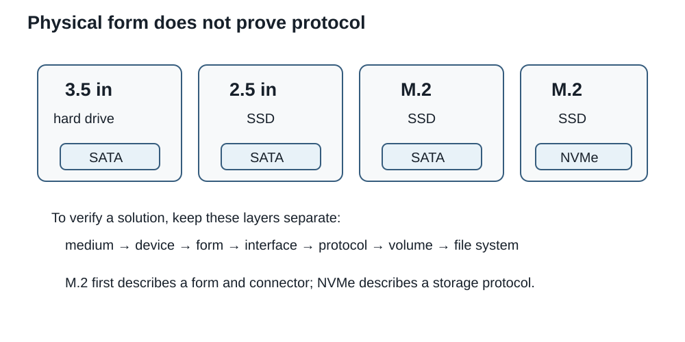

# Session 9 - From storage media to data protection: choosing a storage strategy

## Purpose of the session

In Session 8, we verified that a storage device could be installed on a platform: M.2 form factor, interface, PCIe lanes, SATA ports, and shared resources. That compatibility is only the beginning of an evaluation.

A very fast SSD can run out of space. A high-capacity HDD can slow a workload made of thousands of small files. Two identical drives may behave very differently when used separately, mirrored, or placed in RAID 0. Synchronization can reproduce a deletion on every device. A backup can exist without being practically restorable.

We therefore move from **“Will this drive work in this PC?”** to a broader question:

> Which combination of media, devices, logical organization, and protection mechanisms meets the need, budget, and risk?

This session follows the complete path of data: from magnetic or flash media to the file visible to the operating system, and then from that file to a recovery strategy after an incident. As in the other hardware-focused sessions, the goal is not to memorize a product catalogue. The goal is to understand the mechanisms well enough to **interpret a technical specification, compare options, and justify a recommendation**.

## Objectives

### Main pathway

By the end of the session and associated Lab, you should be able to:

- distinguish **medium**, **device**, **form factor**, **connector**, **interface**, **protocol**, **partition**, **volume**, and **file system**;
- explain the general path of a read or write on an HDD;
- connect seek time, rotational latency, and sequential throughput to HDD behaviour;
- explain the general roles of pages, blocks, controllers, address translation, garbage collection, wear levelling, and TRIM in an SSD;
- compare HDD, SATA SSD, and NVMe SSD options according to workload rather than a single maximum number;
- distinguish 3.5-inch, 2.5-inch, and M.2 form factors from the interfaces or protocols they may use;
- distinguish SATA, PCI Express, NVMe, and M.2 and recognize SATA data and power connectors;
- convert advertised capacity between decimal and binary units and estimate transfer time;
- interpret a partition style, partition, volume, mount point, and file system reported by Windows;
- explain striping, mirroring, and parity as mechanisms used by common RAID levels;
- calculate usable capacity and fault tolerance for RAID 0, 1, 5, 6, and 10;
- explain degraded state, rebuilding, and the limits of RAID as a protection mechanism;
- distinguish RAID, backup, synchronization, versioning, and snapshots;
- connect backup frequency, acceptable data loss, and recovery delay;
- recommend a storage and recovery strategy that considers performance, compatibility, cost, lifecycle, and available evidence.

!!! question "Guiding questions"
    1. **How is the data actually stored?** The mechanism of the medium explains some strengths and limits.
    2. **Which number describes the need?** Capacity, throughput, IOPS, latency, and endurance answer different questions.
    3. **What path must the data cross?** Form factor, interface, protocol, controller, and operating system can all impose limits.
    4. **Which incident are we trying to prevent or recover from?** RAID, backup, versioning, and synchronization address different risks.
    5. **Which evidence is still missing?** A data sheet, a `Healthy` state, or an advertised speed is not always enough to conclude.

!!! info "Scope of the session"
    **Master today:** the storage-layer model; general HDD and SSD mechanisms; 3.5-inch, 2.5-inch, and M.2 form factors; M.2/SATA/PCIe/NVMe distinctions; sequential and random performance; decimal and binary capacity; GPT and MBR as partition styles; file-system roles; RAID 0, 1, 5, 6, and 10; degraded state and rebuilding; backup, synchronization, versioning, and snapshots.

    **Recognize today:** tracks and sectors; CMR and SMR; logical and physical sectors; flash pages and blocks; address translation, garbage collection, wear levelling, and TRIM; write caches; SLC/MLC/TLC/QLC; TBW; S.M.A.R.T.; optical, removable, network, cloud, and tape storage; recovery point and recovery time objectives; the 3-2-1 rule.

    **Go further after the Lab link:** parity and XOR; write amplification; detailed NAND organization; 512e and 4Kn; checksum file systems; immutable backups and zoned storage. This section is optional.

<div class="admonition info session-9-navigation"><p class="admonition-title">Navigation guide</p>
<p>This session is deliberately detailed because it is intended to remain useful as a reference after class. For a first reading, follow this pathway:</p>
<ol>
<li><strong>Physical medium:</strong> understand why HDDs and SSDs behave differently.</li>
<li><strong>Path to the system:</strong> separate form factor, connector, interface, and protocol.</li>
<li><strong>Measurements:</strong> capacity, throughput, IOPS, latency, and endurance.</li>
<li><strong>Logical organization:</strong> disk, partition, volume, and file system.</li>
<li><strong>Availability:</strong> striping, mirroring, parity, and RAID.</li>
<li><strong>Recovery:</strong> backup, versions, snapshots, and off-site copies.</li>
</ol>
<p>Cell technologies, physical-sector details, and advanced mechanisms remain recognition or enrichment material according to the scope above.</p></div>

## The problem with one “good drive”

The **Atlas** project is a gaming and live-streaming PC. Its platform accepts a 2 TB M.2 NVMe SSD. The client also wants to keep:

- the operating system and active games;
- current video-editing projects;
- several terabytes of completed recordings;
- course work;
- irreplaceable photos;
- files synchronized between two devices.

The primary SSD may meet the speed requirement, but it does not answer every other question. How much space will be needed in two years? Are video files mostly read sequentially or rewritten in small blocks? What happens if the SSD fails? If a file is deleted? If the synchronization account is compromised? If the home is affected by theft or fire?

A recommendation must therefore separate at least three problems:

```text
performance and capacity
+ data organization
+ recovery after an incident
```

??? question "Check: are two drives automatically better than one?"
    No. Two drives may form RAID 0 with no tolerance, a mirror that reproduces deletions, or two genuinely independent copies. The number of devices does not reveal their role.

## Storage is a stack of decisions

The word “disk” is often used for several different things. A responsible evaluation separates the layers.

```text
need, data value, and risk
             ↓
retention and recovery policy
             ↓
file system, volume, and mount point
             ↓
partition and partition table
             ↓
storage device and controller
             ↓
physical medium
             ↓
interface, protocol, and system path
```

| Layer | Useful question | Example |
|---|---|---|
| Medium | How are bits preserved? | magnetic surface, NAND flash, tape |
| Device | Which controller manages the medium? | HDD, SSD, tape drive |
| Form factor | What are the dimensions and mounting requirements? | 3.5-inch, 2.5-inch, M.2 2280 |
| Connector/interface | What physical and electrical path is used? | SATA, M.2 connector, PCIe |
| Protocol | Which commands are exchanged? | ATA over SATA, NVMe over PCIe |
| Logical organization | How does space become usable? | GPT, partition, volume, NTFS |
| Protection | How do we recover after an incident? | backup, versions, off-site copy |

!!! example "One appearance, several layers"
    An M.2 2280 module may contain a SATA SSD or a PCIe/NVMe SSD. A 2.5-inch SATA SSD and a 3.5-inch SATA HDD may use connectors from the same family. Appearance therefore does not prove protocol, performance, or the device's role.

## HDD: bits on moving media

A **hard disk drive (HDD)** stores data by magnetizing surfaces on one or more platters. The platters rotate around a spindle. An actuator moves an arm that positions the read/write heads above the required area.

<figure markdown="span">
  { loading=lazy width="760" }
  <figcaption>An opened HDD shows the platters, actuator arm, and read/write heads. Photo: Matthew Field, <a href="https://commons.wikimedia.org/wiki/File:Hard_disk_platters_and_head.jpg">Wikimedia Commons</a>, <a href="https://creativecommons.org/licenses/by-sa/3.0/">CC BY-SA 3.0</a>.</figcaption>
</figure>

### Platters, tracks, and sectors

In a simplified model, each surface is divided into concentric **tracks**, which are themselves divided into **sectors**. Modern drives, however, expose **logical block addresses** to the host instead of requiring software to calculate physical geometry directly.

```text
platter surface

   ┌──────────────────────────────┐
   │       outer track            │
   │   ┌──────────────────────┐   │
   │   │     inner track      │   │
   │   │       ◉ spindle      │   │
   │   └──────────────────────┘   │
   └──────────────────────────────┘

a track → several physical sectors / blocks
```

The HDD controller translates a logical request into physical operations. The operating system does not ask the drive to move the head a certain number of millimetres and rotate a certain number of degrees; it asks for a logical block and the drive firmware determines how to retrieve it.

### The path of a read

To read data that are not already in a cache, an HDD generally must:

1. receive a request for a logical address;
2. position the heads over the appropriate area;
3. wait for rotation to bring the data under the head;
4. read the magnetic signals and convert them into digital data;
5. perform controller checks and corrections;
6. transfer the data to the host through the interface.

Three ideas therefore matter:

- **seek time:** time required to position the heads;
- **rotational latency:** delay caused by the angular position of the data;
- **transfer time:** time needed to read or write once the correct area has been reached.

These steps explain why an HDD can transfer a long file at a reasonable rate while responding much more slowly to a large number of scattered small requests.

### A rotational-latency calculation

Consider a `7,200 rpm` HDD.

```text
60 seconds ÷ 7,200 revolutions
≈ 0.00833 seconds per revolution
≈ 8.33 ms per revolution
```

If the requested angular position is random, average rotational waiting is approximately half a revolution:

```text
8.33 ms ÷ 2 ≈ 4.17 ms
```

This value **is not total access time**. Head movement, caching, queuing, correction, and transfer still matter. The calculation shows that rotating media have a physical latency that a faster host interface cannot eliminate.

??? question "Check: why can copying one large file seem fast while an application made of many small files feels slow?"
    Sequential access spreads positioning cost across a large amount of contiguous data. Random access may repeat seek and rotational waiting for small quantities of data.

### 3.5-inch and 2.5-inch form factors

The two common HDD form factors in PCs are **3.5-inch** and **2.5-inch**. The names identify standardized form-factor families; they are not exact measurements of the enclosure or platter diameter.

<figure markdown="span">
  { loading=lazy width="650" }
  <figcaption>Visual comparison of 2.5-inch and 3.5-inch hard-drive form factors. Photo: MaxVT, <a href="https://commons.wikimedia.org/wiki/File:Comparison_of_3.5_and_2.5_inch_hard_drives.jpg">Wikimedia Commons</a>, <a href="https://creativecommons.org/licenses/by-sa/3.0/">CC BY-SA 3.0</a>.</figcaption>
</figure>

| Form factor | Common context | Constraints to verify |
|---|---|---|
| 3.5-inch HDD | desktop PC, NAS, high-capacity storage | case bay, power, vibration, cooling |
| 2.5-inch HDD | older laptops, compact servers, external enclosures | drive height, bay/adapter, power, available capacity |
| 2.5-inch SSD | SATA replacement or addition in many PCs | bay, SATA data cable, SATA power |
| M.2 | compact SSD mounted directly to motherboard or adapter | length, key, interface, lanes, heatsink, shared resources |

Form factor affects mounting, but does not by itself determine interface or performance.

### SATA connectors: data and power are separate

A SATA HDD or 2.5-inch SATA SSD normally uses two connections:

- a **SATA data** connection to the motherboard or controller;
- a **SATA power** connection from the power supply or backplane.

<figure markdown="span">
  { loading=lazy width="720" }
  <figcaption>SATA data and power connectors serve different purposes. Photo: Bubba73, <a href="https://commons.wikimedia.org/wiki/File:SATA_data_and_power_connectors.jpg">Wikimedia Commons</a>, <a href="https://creativecommons.org/licenses/by-sa/4.0/">CC BY-SA 4.0</a>.</figcaption>
</figure>

An external USB drive may contain a SATA device behind a USB-to-SATA bridge. In that case, the computer sees the external USB path while the enclosure translates to the internal interface. Again, **device, visible connector, and physical medium are separate layers**.

### CMR and SMR: two ways to organize magnetic tracks

Not all HDDs arrange tracks in the same way.

With **CMR** (*conventional magnetic recording*), tracks are organized so that a track can generally be rewritten without intentionally overlapping adjacent tracks in the basic model.

**SMR** (*shingled magnetic recording*) increases density by partially overlapping tracks, somewhat like shingles on a roof. This may make some rewrites more complex because changing one track can require reorganizing a larger region. Exact behaviour depends on implementation and firmware.

<figure markdown="span">
  { loading=lazy width="720" }
  <figcaption>Visual principle of partially overlapping tracks in SMR. Illustration: WikiTapeUser, <a href="https://commons.wikimedia.org/wiki/File:SMR_HDD.png">Wikimedia Commons</a>, <a href="https://creativecommons.org/licenses/by-sa/4.0/">CC BY-SA 4.0</a>.</figcaption>
</figure>

| Technology | Possible strength | Evaluation question |
|---|---|---|
| CMR | more direct rewrite behaviour for many general-purpose workloads | capacity, cost, throughput, expected workload |
| SMR | high density and capacity for some products and workloads | does the workload involve many random rewrites or can it be mainly sequential? |

!!! warning "CMR is not automatically 'good' and SMR automatically 'bad'"
    A technology may suit a sequential archive and be less appropriate for a different workload. Verify the **exact model**, manufacturer documentation, and usage scenario rather than judging from the acronym alone.

### What to compare between two HDDs

Rotational speed is only one criterion. Depending on the need, also verify:

- capacity;
- sustained sequential throughput;
- manufacturer-intended workload;
- CMR or SMR where relevant;
- power, noise, and vibration;
- warranty;
- published workload or use limits;
- monitoring features;
- cost per terabyte;
- replacement practicality in the target system.

!!! note "Logical and physical sectors"
    A system may expose logical blocks whose size does not fully describe the drive's internal physical organization. Terms such as **512e** and **4Kn** describe some of these cases. For the main pathway, recognize that a reported block size is not always a complete description of physical geometry. Details remain enrichment material.

## SSD: flash memory managed by a controller

A **solid-state drive (SSD)** stores data in non-volatile flash memory. It has no moving head and therefore avoids the mechanical seek and rotational latency of an HDD. That does not mean it is instantaneous, that every write has the same speed, or that flash cells can be rewritten without constraints.

### Pages and blocks: read, program, erase

In a simplified NAND-flash model:

- data are read and programmed in **pages**;
- erasure occurs in larger units called **blocks**;
- a page cannot always be rewritten directly like a byte of RAM;
- before reusing some cells, the controller may need to move valid data and erase a block.

```text
NAND block
├── page 0
├── page 1
├── page 2
├── ...
└── page n

read / program → page
full reuse     → may require block erase
```

This difference between read/write granularity and erase granularity explains part of the invisible work performed by the controller.

### Address translation: the computer does not choose the cell

The operating system sends requests for **logical blocks**. The SSD maintains a translation layer, often described as an **FTL** (*flash translation layer*), that maps logical addresses to physical locations in flash.

When a logical block changes, the SSD may write the new version elsewhere and mark the old one invalid. Later, **garbage collection** gathers still-valid data and frees blocks that can be erased.

```text
logical address 42
      ↓
translation table
      ↓
available physical page

old page 42 → invalid → reclaimed later
```

The user therefore sees a relatively simple block device while the controller moves and reorganizes data internally.

### Wear levelling, correction, and spare capacity

Flash cells support a finite number of program/erase cycles. Controllers use several mechanisms to manage that limit:

- **wear levelling:** distribute writes rather than repeatedly wearing the same blocks;
- **error correction (ECC):** detect and correct some read errors;
- **bad-block management:** avoid or replace areas that become unusable;
- **over-provisioning:** reserve some flash outside user-visible capacity to help replacement, garbage collection, and wear management.

These functions are largely handled by controller firmware. Two SSDs with the same capacity and interface can therefore behave differently.

### TRIM: inform rather than immediately erase

When a file is deleted, the file system knows that some logical blocks no longer contain useful data. **TRIM** allows the system to tell the SSD that those blocks are no longer required. The controller can then treat the corresponding pages as disposable during internal management.

!!! warning "TRIM is not a secure-erase command"
    TRIM identifies logical blocks that are no longer required. It is not, by itself, proof that every corresponding physical cell was immediately erased or that a data-destruction procedure is complete.

### SLC, MLC, TLC, and QLC: density versus electrical margin

A flash cell can represent more than one bit by distinguishing several electrical levels. Common terms include:

| Term | Bits per cell in the common model | General consequence to recognize |
|---|---:|---|
| SLC | 1 | wide margin between states, high cost per capacity |
| MLC | 2 | greater density, different trade-off |
| TLC | 3 | common in many modern SSDs |
| QLC | 4 | higher density; endurance and sustained-write behaviour require attention |

Do not make a recommendation from cell type alone. Controller design, spare flash, cache, firmware, model capacity, and workload all influence real behaviour.

### Cache can make a short benchmark misleading

Many SSDs use part of their flash as a fast cache, for example by temporarily operating some TLC or QLC cells as though they stored fewer bits. A short write may therefore reach a very high rate. A long write may outgrow the cache and expose lower sustained throughput.

Performance can also change when:

- the SSD is nearly full;
- significant garbage collection is required;
- the controller becomes hot and throttles;
- reads and writes are mixed;
- devices share the same PCIe path;
- the operating system adds its own caching.

??? question "Check: does an SSD advertised at 7,000 MB/s necessarily write at 7,000 MB/s while copying 2 TB?"
    No. Verify whether the number describes read or write, workload length, cache behaviour, temperature, fill level, and sustained throughput under comparable conditions.

### Endurance: TBW is not a date of death

Client SSD endurance is often expressed as **TBW** (*terabytes written*), a quantity of writes associated with the product's specification or warranty. Some enterprise products also use **DWPD** (*drive writes per day*).

A higher value is not automatically preferable. Relate it to:

- expected write volume;
- service duration;
- warranty;
- capacity;
- cost;
- replacement practicality.

## Form factor, interface, and protocol: avoiding four common confusions

The terms **M.2**, **SATA**, **PCI Express**, and **NVMe** are often mixed together, but they do not describe the same thing.

| Term | Mainly describes | Does not prove by itself |
|---|---|---|
| 2.5-inch / 3.5-inch | physical form factor | interface or speed |
| M.2 | module form factor, connector, and keying system | SATA or NVMe; lane count; performance |
| SATA | serial storage interface; commonly carries ATA commands | device form factor; actual media speed |
| PCI Express | general interconnect with lanes and generations | that the device is an SSD or uses NVMe |
| NVMe | register interface and command set for non-volatile storage, commonly over PCIe | M.2 form factor; exact PCIe generation |

### Two M.2 SSDs can be different

<figure markdown="span">
  { loading=lazy width="520" }
  <figcaption>Two M.2 SSDs may use different interfaces despite a similar general form factor. Photo: ガラパリ, <a href="https://commons.wikimedia.org/wiki/File:M2_SATA_M2_NVMe_compare.png">Wikimedia Commons</a>, <a href="https://creativecommons.org/licenses/by-sa/4.0/">CC BY-SA 4.0</a>.</figcaption>
</figure>

In Session 8, we saw that M.2 compatibility requires checking keying, length, interface, lanes, and shared resources. The same logic applies here: **M.2 mainly describes how the module is built and connected; NVMe describes how a storage device communicates.**

### SATA 6 Gb/s is not 6 GB/s

Technical specifications may mix bits and bytes.

```text
6 Gb/s = 6 gigabits per second
6 GB/s = 6 gigabytes per second
```

Even before protocol overhead:

```text
6 Gb/s ÷ 8 = 0.75 GB/s
```

Usable data throughput is lower than this raw ceiling. The same principle applies elsewhere: signalling rate or theoretical interface bandwidth is a **ceiling**, not a promise of device throughput.

!!! warning "Interface limit is not device speed"
    A SATA HDD does not become as fast as a SATA SSD because they use the same connector. Conversely, a fast NVMe SSD may be limited by an older PCIe generation, fewer lanes, temperature, controller behaviour, or workload.

<figure markdown="span">
  { loading=lazy width="900" }
  <figcaption>C12 synthesis diagram. It is a conceptual reference; real hardware specifications must still be verified in relevant documentation.</figcaption>
</figure>

## Measuring useful performance

A single “speed” number does not describe a storage system well. Choose the measurement that matches the workload.

### Sequential throughput

**Sequential throughput** measures the quantity of data transferred when blocks are read or written in a relatively continuous order. It is especially relevant to:

- large video files;
- disk images;
- some backups;
- copying large data sets that are already organized sequentially.

### IOPS and random access

**IOPS** (*input/output operations per second*) describe how many I/O operations can be completed per second in a given scenario. The number depends on:

- block size;
- read/write ratio;
- queue depth;
- sequential or random access pattern;
- benchmark software and hardware.

`100,000 IOPS` without block size or context is therefore incomplete.

!!! example "Connecting IOPS and data quantity"
    If each operation carries `4 KiB`, then `100,000 IOPS` theoretically correspond to:

    ```text
    100,000 × 4,096 bytes
    = 409,600,000 bytes/s
    ≈ 409.6 MB/s
    ≈ 390.6 MiB/s
    ```

    This does not predict device performance. It shows that operation count and operation size must be interpreted together.

### Latency

**Latency** measures the delay between a request and its response. For an application that makes many small dependent reads, additional milliseconds or microseconds per request may matter more than a very high sequential maximum.

### Queue depth

**Queue depth** describes how many requests are waiting at once in a benchmark or workload. A server that can issue many requests in parallel is not equivalent to a desktop application that often waits for one result before requesting the next.

### Burst, cache, and sustained throughput

A specification may advertise a short-duration **burst**. A workload such as video recording or a large copy instead asks:

> What throughput can be sustained after caches and over the real duration of the task?

### The complete path matters

```text
application
   ↓
file system
   ↓
operating-system cache
   ↓
driver / request queue
   ↓
protocol
   ↓
interface and controller
   ↓
physical medium
```

A measurement observed by an application includes several layers. A value below the SSD's maximum does not prove that the SSD is defective.

### Workload decision table

| Workload | Particularly useful measurements | Common trap |
|---|---|---|
| Boot and applications | latency, random access, low-queue-depth IOPS | considering only maximum sequential throughput |
| Editing and copying large media | sustained sequential throughput, capacity | ignoring post-cache slowdown |
| Games | load times, random access, capacity | assuming twice the specification speed halves every load time |
| Archives | capacity, cost/TB, reliability, recovery | paying for latency that is not useful |
| Virtual machines or databases | latency, IOPS, read/write mix, endurance | using one sequential-read benchmark |
| Backup | sustained throughput, capacity, connection, retention | forgetting restore time |

??? question "Check: which number should be compared?"
    A video project may depend on sustained throughput and capacity. Application launches depend more on latency and scattered access. An archive may prioritize capacity, cost, and recovery. Identify the workload before selecting the metric.

## Capacity: advertised bytes, usable space, and free space

### TB and TiB

Manufacturers generally use decimal prefixes:

```text
1 TB = 10^12 bytes
```

Binary units use:

```text
1 TiB = 2^40 bytes
```

A 2 TB SSD therefore contains approximately:

```text
2,000,000,000,000 ÷ 1,099,511,627,776 ≈ 1.82 TiB
```

The difference in units is not missing data.

### Raw, usable, and free capacity

Distinguish three values:

- **advertised capacity:** number of bytes sold under the manufacturer's convention;
- **usable volume capacity:** space remaining after some reservations, partitions, and metadata;
- **free space:** the part of that volume that is not currently allocated to data.

```text
advertised capacity
- device or organizational reservations
- partitions outside the volume being studied
- file-system metadata
- existing data
= observed free space
```

This is a conceptual representation. Details vary by device, file system, and operating system.

!!! warning "Do not blame every difference on formatting"
    A difference between the value on the box and the displayed value may come from decimal/binary units, partitions, reserved space, and metadata. Identify the unit and layer before explaining the difference.

### Estimating transfer time

```text
time = data quantity ÷ effective throughput
```

For example, for `750 GB` copied at an effective `150 MB/s`:

```text
750,000 MB ÷ 150 MB/s
= 5,000 s
≈ 83 min 20 s
```

The result is a minimum estimate if `150 MB/s` is actually sustained. Small files, metadata, antivirus scanning, caching, heat, post-cache slowdown, networking, encryption, or interface sharing may increase the real time.

??? question "Check: does 2 TB displayed as about 1.82 TiB indicate lost capacity?"
    No. The two values describe approximately the same number of bytes using different units. Check the unit before concluding that capacity is missing.

## From raw disk to file

A physical device does not automatically become `C:` or `D:`. Several logical layers organize the space.

```text
device / disk
  └── partition table
        └── partition
              └── volume
                    └── file system
                          └── mount point
                                └── folders and files
```

### Partition table

A **partition table** records where partitions are located and what roles they may have.

Two common PC styles are:

| Style | General context | Points to recognize |
|---|---|---|
| MBR | older PC model and legacy BIOS boot | historical table; limited primary partitions in the standard model; constraints with very large disks |
| GPT | modern systems, especially with UEFI | GUID identifiers, many partition entries, primary and backup metadata |

On modern Windows booted in UEFI mode, the system disk normally uses GPT. Additional data disks may still use another style depending on context.

!!! note "GPT is not a file system"
    GPT and MBR describe **partitioning**. NTFS, exFAT, ext4, and APFS describe **file systems**. A GPT disk is not “formatted as NTFS” at the same descriptive level: a partition or volume on the disk may contain NTFS.

### Partition, volume, and mount point

A **partition** is a region defined in the partition table. A **volume** is logical space presented to the operating system; it may correspond directly to a partition, but more advanced storage technologies can construct volumes differently.

A **mount point** makes the volume accessible in the file-system tree. In Windows, a letter such as `C:` is a common mount point, but a volume may instead be mounted in a folder or have no drive letter.

!!! warning "A partition without a drive letter is not necessarily unused"
    A workstation may contain boot, recovery, or another operating system's partitions without drive letters. The absence of a letter is **not** permission to modify, initialize, or format the partition.

### The file system organizes data

A **file system** provides structures that manage, among other things:

- file and folder names;
- space allocation;
- metadata such as sizes and dates;
- free-space tracking;
- some permissions;
- some journalling or recovery functions.

A disk may allocate space in units larger than one byte. Actual space consumption and metadata depend on the file system and its configuration.

| File system | General context to recognize | Compatibility question |
|---|---|---|
| NTFS | Windows; permissions, journalling, large volumes/files | must other devices write to it? |
| exFAT | removable media and exchange among systems | are NTFS security or journalling features required? |
| FAT32 | very broad historical compatibility | do its size limits fit the workload? |
| ext4 | common on Linux | must client systems mount it natively? |
| APFS | common on recent Apple systems | is the environment mainly Apple? |
| UDF | optical media and some specialized exchange | which drives and operating systems must access it? |

There is no context-free “best” file system. Know which devices must read and write, expected file sizes, permissions, resilience needs, and available recovery tools.

## State and health: a measurement is not a prediction

Storage devices expose different diagnostic information. HDDs and SSDs may provide **S.M.A.R.T.** (*Self-Monitoring, Analysis and Reporting Technology*) data. Windows may also present states such as `Healthy` or `OK` through different storage layers.

These states are useful but limited:

- available attributes vary by manufacturer and interface;
- a generic state may hide detail;
- a warning may indicate a detected problem;
- lack of warning does not guarantee that a drive will not fail tomorrow;
- software health status does not replace backup.

!!! example "Fact, inference, recommendation"
    **Fact:** Windows reports `HealthStatus = Healthy` for the observed disk.

    **Reasonable inference:** this layer is not currently reporting a condition it recognizes as failed.

    **Invalid conclusion:** “the drive will not fail.”

    **Recommendation:** retain protection appropriate to the value of the data even while current health is reported as good.

## RAID: combining devices for performance or availability

**RAID** is a family of methods for combining multiple storage devices. The three basic ideas are **striping**, **mirroring**, and **parity**.

### Striping

Blocks are distributed across several devices.

```text
          drive A   drive B
block 1      A1        A2
block 2      A3        A4
block 3      A5        A6
```

Striping may allow devices to work in parallel, but by itself it creates no copy.

### Mirroring

The same data are kept on several devices.

```text
          drive A   drive B
block 1      A1        A1
block 2      A2        A2
block 3      A3        A3
```

Mirroring sacrifices capacity to keep a complete copy available after some device failures.

### Parity

**Parity** stores calculated information that can reconstruct some missing data. In distributed-parity RAID, data and parity blocks are spread among devices.

```text
          drive A   drive B   drive C
row 1       D1        D2        P1
row 2       D3        P2        D4
row 3       P3        D5        D6
```

The XOR mathematics appears in the optional section. For the main pathway, understand that parity provides fault tolerance with less duplication than a complete mirror, at the cost of extra work for some writes and rebuilds.

## RAID 0, 1, 5, 6, and 10

For `n` equal-capacity drives of size `D`:

| Level | Mechanism | Minimum | Theoretical usable capacity | General tolerance |
|---|---|---:|---:|---|
| RAID 0 | striping | 2 | `n × D` | none |
| RAID 1 | mirroring | 2 | `D` | one or more failures while a complete copy remains |
| RAID 5 | striping + one distributed parity | 3 | `(n - 1) × D` | one failure |
| RAID 6 | striping + two parity values | 4 | `(n - 2) × D` | two failures |
| RAID 10 | striping across mirrored pairs | 4, even count | `(n ÷ 2) × D` | depends on mirror pairs affected |

!!! warning "The formulas assume equal-capacity members"
    With different drive sizes, many implementations can use only the equivalent of the smallest member's capacity on each drive. Exact rules depend on the controller or RAID software. Verify the implementation documentation.

### Capacity example

Four `4 TB` drives provide `16 TB` raw capacity.

```text
RAID 0  : 4 × 4 TB       = 16 TB usable, no tolerance
RAID 5  : (4 - 1) × 4 TB = 12 TB usable, one failure tolerated
RAID 6  : (4 - 2) × 4 TB =  8 TB usable, two failures tolerated
RAID 10 : (4 ÷ 2) × 4 TB =  8 TB usable, tolerance depends on pairs
```

A four-member RAID 1 in which all members are complete mirrors would retain `4 TB` usable. Other solutions organize four drives as two mirrored pairs and stripe across them, corresponding to RAID 10. Verify the name and implementation.

### RAID 0: performance without redundancy

RAID 0 stripes data. A single member failure can make the array unusable because each file may depend on blocks spread across several drives.

The `R` in RAID therefore must not be treated as a guarantee of redundancy in RAID 0.

### RAID 1: availability through duplication

RAID 1 keeps a complete copy. If one member fails, an intact copy may allow service to continue. Usable capacity generally equals one member of the relevant size.

A mirror also reproduces logical changes such as file deletion, malware encryption, or corruption written by the system.

### RAID 5 and RAID 6: distributed parity

RAID 5 reserves the equivalent capacity of one drive for distributed parity and generally tolerates one failure. RAID 6 reserves the equivalent of two drives and generally tolerates two failures.

Writes may require more work than RAID 0 or some mirrored arrangements because parity information must remain consistent. Actual performance depends on controller, software, block size, cache, and workload.

### RAID 10: mirrored pairs and striping

RAID 10 generally combines mirrored pairs and then stripes data across those pairs.

With six drives arranged as three pairs, two failures may be tolerated **if they affect different pairs**. If both members of the same pair fail, data from that pair are lost and the array may fail.

??? question "Check: are two failures always tolerated in RAID 10?"
    No. The answer depends on which mirror pairs are affected. This is a case where the correct conclusion must remain conditional.

## Degraded state and rebuilding

After a tolerated failure, a RAID set is **degraded**. Data may remain available, but the safety margin is reduced.

A **rebuild** recreates the missing data on a replacement member from remaining copies or parity.

During this period:

- large quantities of data may be read;
- performance may decrease;
- rebuilding may take a long time on large drives;
- another failure may exceed the remaining tolerance;
- latent errors may be discovered during intensive reads.

The correct reaction is not “RAID still works, so everything is fine.” Verify status, replace the failed member according to procedure, monitor rebuilding, and confirm that a current restorable backup exists.

??? question "Check: does RAID 5 protect files during rebuilding?"
    It normally maintains service after one failure, but tolerance is reduced. Verify array state, current backup, and a restore-test result before concluding that the data are sufficiently protected.

### Hardware and software RAID

RAID may be implemented by:

- a dedicated hardware controller;
- platform firmware;
- the operating system;
- a specialized storage system.

These approaches may differ in caching, metadata, replacement procedures, portability to another machine, and monitoring. The **RAID level** describes a general organization; it does not by itself describe every behaviour of the product.

## RAID is not backup

Classify incidents to see why.

<figure markdown="span">

```text
single-drive failure ────────────→ RAID / availability
accidental deletion or overwrite → versions / backup
logical corruption ──────────────→ version or verified backup
site loss or theft ──────────────→ off-site copy
malware ─────────────────────────→ isolated copy / version / immutability as appropriate
need for rapid return point ─────→ snapshot, then verified restore
```

<figcaption>Protection mechanisms do not address the same incidents. A strong strategy connects each risk to a method and evidence of restoration. Original course diagram, CC BY 4.0.</figcaption>
</figure>

RAID can increase **availability**: service continues after certain hardware failures. Backup aims at **recovering an earlier or independent state**. These are different goals.

## Backup, synchronization, versioning, and snapshots

| Mechanism | Main purpose | Important limit |
|---|---|---|
| RAID | local availability after some failures | does not create an independent copy |
| Backup | separate recoverable copy | requires frequency, retention, and restore testing |
| Synchronization | maintain current state across locations | may propagate errors and deletions |
| Versioning | preserve selected earlier states | depends on retention duration and number of versions |
| Snapshot | create a quick return point for a volume or system | often remains in the same infrastructure |
| Off-site copy | survive loss of the local site | may depend on network, encryption, and provider |

### A backup needs a policy

A copy is not yet a strategy. Define:

- **what** is backed up;
- **how often**;
- **how long** versions are retained;
- **where** copies are kept;
- **who** can modify or delete them;
- **how** restoration works;
- **when** restoration is tested.

### Acceptable loss and recovery delay

Two continuity concepts provide useful vocabulary:

- **RPO** (*recovery point objective*): how much recent work can be lost?;
- **RTO** (*recovery time objective*): how long can we wait before service or data return?

For example, if a student can afford to lose only one hour of work, a once-daily backup does not meet that RPO. If a business must restore a service in ten minutes, a slow off-site download may protect the data without meeting the RTO by itself.

### The 3-2-1 rule

A common practical rule is **3-2-1**:

- keep three copies of important data;
- use two distinct media or systems;
- keep at least one copy off-site.

This is a starting point, not sufficient proof. It does not define retention, isolation from a compromised account, encryption, media quality, or test frequency.

!!! warning "Synchronized does not mean backed up"
    If a synchronized folder is deleted or encrypted and the change propagates immediately, every device may reproduce the new state. Versioning or an independent backup may provide rollback; verify the service's exact policy.

!!! note "Encryption and backup answer different questions"
    Encryption primarily protects confidentiality. It does not create another copy. Losing a key can even make a backup unusable, so key management is part of recovery planning.

## Other storage forms and locations

Internal HDDs and SSDs are not the only options. Distinguish **medium**, **device**, and **service location**.

| Form | Possible use | Limit to verify |
|---|---|---|
| USB flash drive or memory card | transfer, installation, mobile device | endurance, authenticity, safe removal, physical loss |
| External USB SSD/HDD | local copy, transfer, detachable backup | USB bridge, cable, power, real throughput, risk of staying connected |
| CD, DVD, Blu-ray | distribution or specialized archive | capacity, available drive, compatibility, media lifetime |
| Magnetic tape | large-scale backup and archive | drive/library cost, sequential access, procedures |
| NAS | storage available over a local network | network, authentication, internal RAID, backup of the NAS itself |
| Cloud storage | off-site access, collaboration, possible versioning | network, recurring cost, retention, privacy, egress fees |

“In the cloud” describes a service location, not automatically a backup. “On a NAS” describes network storage, not automatically an off-site copy. In both cases, verify which mechanisms are actually provided.

## Building a storage recommendation

A responsible recommendation is not a product list. It connects each choice to a requirement and evidence.

### 1. Classify the data

Ask whether the data are:

- replaceable, expensive to recreate, or irreplaceable;
- active, temporary, or archived;
- expected to grow significantly;
- confidential;
- subject to a retention requirement.

### 2. Describe the workload

- large sequential reads/writes?;
- many small random accesses?;
- high write proportion?;
- continuous operation?;
- local or network access?;
- requirements for silence, low power, or shock resistance?

### 3. Verify the complete compatibility path

```text
physical form factor
+ bay or slot
+ connector
+ interface
+ protocol
+ lanes / controller
+ power
+ operating system
```

### 4. Plan capacity and growth

A drive that is sufficient today may become too small long before it is technically worn out. Distinguish:

- required capacity now;
- estimated growth;
- operating headroom;
- future migration cost.

### 5. Choose the required level of availability

RAID is useful only when continuity after a device failure justifies cost, lost usable capacity, and complexity. For some personal data, better backup may matter more than RAID. For a server that must remain available, both may be necessary.

### 6. Design recovery

Match each important incident to a mechanism:

| Incident | Mechanism to evaluate |
|---|---|
| device failure | RAID or rapid replacement + restore |
| accidental deletion | versions or backup |
| ransomware | isolated, versioned, or immutable copy depending on threat |
| theft/fire | off-site copy |
| corruption discovered late | multiple retained versions |
| very rapid recovery needed | snapshot, replication, or standby system depending on context |

### 7. Examine lifecycle

The course competency asks students to justify choices in terms of longevity, stability, efficiency, and maintainability. For storage, ask:

| Criterion | Storage questions |
|---|---|
| **Longevity** | Will capacity and endurance remain sufficient? Will the form factor and interface remain supported for the expected period? |
| **Stability** | Is the device suitable for continuous or occasional workload? What evidence exists for health, warranty, and sustained behaviour? |
| **Efficiency** | Does useful performance justify cost, power, noise, heat, and sacrificed usable capacity? |
| **Maintainability** | Can the drive be replaced easily? Is rebuild or restore documented and tested? Can data migrate to another system? |

### 8. State limits and open questions

A technically honest conclusion may look like this:

> The available evidence provisionally supports this storage type for the active workload, but the exact model's sustained write throughput and the backup retention policy still need verification before the recommendation is finalized.

That is more useful than “buy the fastest drive.”

## Integrated synthesis

A complete strategy can be summarized as a chain of questions:

```text
data value and risks
        ↓
workload
        ↓
medium and device
        ↓
form factor + interface + protocol
        ↓
performance and capacity
        ↓
partition + volume + file system
        ↓
required availability
        ↓
backup + retention + off-site copy
        ↓
restore testing
        ↓
cost and lifecycle
```

HDD, SATA SSD, and NVMe SSD options respond differently to capacity, latency, throughput, cost, noise, power, and endurance. CMR and SMR show that one medium family can itself contain important trade-offs. RAID 0, 1, 5, 6, and 10 organize devices for different goals. Backup, synchronization, versioning, and snapshots address different incidents.

A strong solution does not merely say **where the data will be stored**. It names:

- expected workload;
- capacity and growth;
- physical and logical constraints;
- incidents considered;
- acceptable loss;
- recovery delay;
- retention;
- evidence that restoration is possible;
- cost and maintenance consequences.

## Common errors to avoid

| Plausible error | Corrective test or method |
|---|---|
| Treating M.2 as a synonym for NVMe | Identify form factor, interface, and protocol separately. |
| Assuming an M.2 SSD is automatically faster than a 2.5-inch SSD | Verify SATA/PCIe/NVMe, lanes, controller, and workload. |
| Comparing only maximum throughput | Identify sequential/random pattern, block size, latency, queue depth, and relevant sustained throughput. |
| Treating 6 Gb/s as 6 GB/s | Check bits versus bytes, then account for overhead. |
| Treating connector speed as drive speed | Treat interface bandwidth as a ceiling, then verify device measurements. |
| Choosing an HDD only from rpm | Add latency, sustained throughput, CMR/SMR, workload, noise, warranty, and cost. |
| Concluding that `Healthy` guarantees the future | Treat health as a current observation, not a prediction. |
| Treating 2 TB and 2 TiB as the same unit | Convert bytes using `10^12` and `2^40` before comparing. |
| Confusing GPT and NTFS | Separate partition table from file system. |
| Assuming a partition without a drive letter is unused | Identify its role before acting; do not modify an unknown partition. |
| Calling RAID 0 redundant | Check for copies or parity; RAID 0 provides neither. |
| Saying RAID 10 always tolerates two failures | Identify which mirror pairs are affected. |
| Calling a mirror a backup | Check independence, retention, and restore testing. |
| Assuming cloud service always includes backup and versioning | Read the service's retention, deletion, and restoration policy. |
| Recommending backup without testing | Define a test file or data set, frequency, and successful-restore criterion. |

## What to remember

- Describe storage in layers: medium, device, form factor, interface, protocol, logical organization, and protection.
- An HDD has mechanical seek and rotational costs; sequential and random access can therefore behave very differently.
- CMR and SMR are different trade-offs; verify the exact model and workload rather than judging the acronym alone.
- An SSD hides complex page/block management, address translation, garbage collection, and wear behind a simple logical-block interface.
- M.2 is mainly a form factor; SATA and PCIe describe communication paths; NVMe describes a storage interface/protocol.
- Throughput, IOPS, latency, and endurance answer different questions. A maximum value does not replace workload-based comparison.
- TB and TiB use different bases; advertised capacity, volume capacity, and free space are not synonyms.
- GPT/MBR describe partitioning; a file system organizes data in a volume.
- RAID mainly improves performance or availability; it does not replace an independent copy.
- Synchronization maintains current state; versioning keeps selected past states; a snapshot may provide quick rollback but can remain in the same system.
- A backup must be independent enough for the risk, retained long enough, and **tested by restoring data**.
- A recommendation must consider longevity, stability, efficiency, and maintainability, not just purchase-time speed.

## Put it into practice

In [Lab 9 - Evaluate a storage system and build a data-protection strategy](../labs/lab-9.md), you will inspect workstation storage without modifying it, reconstruct its logical layers, perform capacity and transfer calculations, compare technologies for workloads, analyze RAID scenarios, and extend the Atlas evolving specification with a recovery strategy.

## Go further

### Parity and XOR

For simple bits, XOR can recover one missing value when the others are known:

```text
A XOR B = P
A XOR P = B
B XOR P = A
```

In parity RAID, this principle is applied across many blocks according to the implementation. Parity enables reconstruction; it does not provide an independent copy of every block.

### Write amplification

A small logical write may cause several physical writes when flash blocks must be reorganized. The relationship between physical data written and host-requested data is often described as **write amplification**. Garbage collection, fill level, over-provisioning, and workload influence it.

### 512e, 4Kn, and alignment

Some drives use 4 KiB physical sectors while exposing 512-byte logical sectors for compatibility (**512e**). Others expose 4 KiB logical sectors directly (**4Kn**). Poorly aligned structures can require extra read-modify-write work. Modern systems generally handle alignment automatically, but documentation remains important in specialized scenarios.

### Checksums and advanced file systems

Some file systems and storage systems keep checksums on data or metadata to detect certain corruption. Depending on architecture, they may use copies or parity to repair data detected as incorrect. A checksum enables **detection**; it cannot guarantee repair if no correct copy exists.

### Immutable backups and zoned storage

An **immutable** backup limits changes for a defined period. Some modern storage systems also expose zones so the host can organize writes more predictably. These specialized mechanisms do not replace retention policy, an independent copy, and restore testing.

## Technical reference sources

- [SATA-IO - The SATA Ecosystem](https://sata-io.org/developers/sata-ecosystem)
- [SATA-IO - SATA Naming Guidelines](https://sata-io.org/developers/sata-naming-guidelines)
- [NVM Express - About NVMe](https://nvmexpress.org/about/)
- [Micron - What is an SSD?](https://www.micron.com/about/micron-glossary/solid-state-drives)
- [Seagate - CMR and SMR Hard Drives](https://www.seagate.com/ca/en/products/cmr-smr-list/)
- [Microsoft Learn - Windows Setup: Installing using the MBR or GPT partition style](https://learn.microsoft.com/en-us/windows-hardware/manufacture/desktop/windows-setup-installing-using-the-mbr-or-gpt-partition-style)
- [Microsoft Learn - File systems overview](https://learn.microsoft.com/en-us/windows-server/storage/file-server/file-system-overview)
- [Microsoft Learn - Storage Spaces overview](https://learn.microsoft.com/en-us/windows-server/storage/storage-spaces/overview)
- [Microsoft Learn - Get-PhysicalDisk](https://learn.microsoft.com/en-us/powershell/module/storage/get-physicaldisk)
- [Microsoft Learn - Get-Disk](https://learn.microsoft.com/en-us/powershell/module/storage/get-disk)
- [Microsoft Learn - Get-Partition](https://learn.microsoft.com/en-us/powershell/module/storage/get-partition)
- [Microsoft Learn - Get-Volume](https://learn.microsoft.com/en-us/powershell/module/storage/get-volume)
