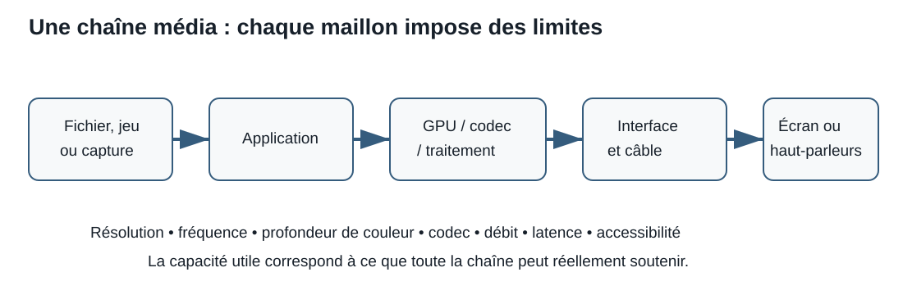

# Séance 11 - Du fichier à l’image et au son : évaluer une chaîne média

## But de la séance

À la Séance 10, nous avons étudié le système d’exploitation comme gestionnaire de processus, de mémoire, de fichiers et de périphériques. Lorsqu’une application affiche une scène 3D, lit une vidéo ou reproduit un enregistrement, elle s’appuie sur ces services, mais le système d’exploitation ne transforme pas seul les données en lumière et en son.

Une expérience média dépend d’une **chaîne complète** :

- le fichier, la scène ou le flux à traiter;
- l’application et ses interfaces de programmation;
- le système d’exploitation et les pilotes;
- le processeur graphique ou les moteurs média;
- la mémoire et le stockage;
- l’écran, le dispositif audio et leurs réglages;
- les formats, conteneurs et codecs;
- les besoins de la personne qui utilise le système.

Cette séance répond à cinq questions :

> Comment des données deviennent-elles une image ou un son perceptible?

> Quand un processeur graphique intégré suffit-il, et quand une carte graphique dédiée devient-elle pertinente?

> Pourquoi les priorités d’un système de jeu ne sont-elles pas nécessairement celles d’un poste de CAO?

> Comment interpréter les caractéristiques d’un écran, d’un système audio et d’un codec sans isoler un seul nombre?

> Comment intégrer l’accessibilité à une recommandation technique dès le départ?

## Objectifs

À la fin de la séance et du laboratoire associé, vous devriez être en mesure de :

- décrire une chaîne graphique, vidéo et audio à un niveau introductif;
- distinguer rendu graphique, décodage vidéo et affichage;
- expliquer le rôle général d’une API graphique, d’un pilote, d’un GPU, d’une mémoire vidéo et d’un moteur média;
- distinguer processeur graphique intégré et carte graphique dédiée selon la mémoire, l’énergie, la chaleur, le coût et la possibilité de mise à niveau;
- relier une charge de travail à des critères GPU pertinents;
- comparer les priorités d’un système de jeu, d’un poste de CAO et d’un poste de création média;
- distinguer dimensions en pixels, densité de pixels, mise à l’échelle, fréquence de rafraîchissement, temps de réponse et latence d’entrée;
- interpréter profondeur de couleur, gamme de couleurs (*gamut*), luminance, contraste et HDR comme des propriétés liées;
- expliquer une chaîne audio numérique incluant échantillonnage, quantification, canaux, conversion numérique-analogique et transducteur;
- distinguer conteneur, codec, encodage, décodage, compression avec perte et compression sans perte;
- vérifier si un besoin média exige une accélération matérielle particulière;
- intégrer des exigences d’accessibilité visuelle, auditive et d’interaction à une recommandation.

!!! info "Portée de la séance"
    **À maîtriser aujourd’hui :** chaîne média; image, pixel et sous-pixel; profondeur de couleur; calcul simplifié d’une image non compressée; GPU intégré et dédié; VRAM; critères de jeu, de CAO et de création; dimensions en pixels, densité, mise à l’échelle, fréquence de rafraîchissement, temps de réponse, luminance, contraste et gamut; chaîne audio; fréquence d’échantillonnage, profondeur d’échantillon et canaux; conteneur et codec; compression avec ou sans perte; accélération matérielle; exigences d’accessibilité.

    **À reconnaître aujourd’hui :** API graphiques; nuanceurs; rastérisation; moteurs spécialisés d’encodage et de décodage; fréquence de rafraîchissement variable; calibration; HDR; ADC et DAC; débit binaire; profils et niveaux d’un codec; sous-échantillonnage de chrominance; audio multicanal.

    **Pour aller plus loin après le lien du laboratoire :** équations détaillées de couleur, espaces CIE, traçage de rayons, calcul GPGPU, synchronisation fine de l’audio et de la vidéo, psychoacoustique, compression inter-image et pipelines professionnels de gestion de couleur. Cette partie est facultative.

## Le problème d’un système « puissant » qui produit une mauvaise expérience

Le projet **Atlas** vise un PC de jeu et de diffusion en continu. Une proposition comprend :

- une carte graphique coûteuse;
- un écran annoncé « 4K HDR »;
- un casque USB;
- un logiciel de diffusion en continu;
- une bibliothèque de vidéos dans plusieurs formats.

Cette liste ne prouve pas que la chaîne fonctionne bien. Plusieurs problèmes restent possibles :

- le GPU produit une fréquence d’images irrégulière à la définition choisie;
- l’écran fonctionne à une fréquence de rafraîchissement inférieure à celle attendue;
- l’application utilise un encodeur logiciel alors qu’un moteur matériel convenable est disponible;
- un fichier possède un conteneur reconnu, mais un codec non pris en charge;
- l’écran couvre un gamut annoncé sans offrir la précision requise;
- le casque est sélectionné, mais l’application emploie encore un autre microphone;
- les sous-titres, la mise à l’échelle ou les commandes accessibles sont absents.

La question responsable n’est donc pas :

> Quel composant possède le plus grand nombre?

Elle devient :

> Quel chemin complet traite le contenu, quelles exigences chaque étape doit-elle respecter et quelle preuve confirme que l’ensemble fonctionne pour la personne concernée?

## Trois chaînes qui se croisent

Le mot **média** regroupe plusieurs chemins. Ils partagent le système d’exploitation, les pilotes et certaines ressources, mais ils ne réalisent pas exactement le même travail.

### Rendu graphique interactif

Un jeu ou une application de CAO construit une scène à partir de géométrie, de textures, de lumières, de données et de commandes.

```text
application et scène
        ↓
API graphique et pilote
        ↓
commandes, données et nuanceurs
        ↓
GPU : transformation, rastérisation et calcul de pixels
        ↓
image en mémoire
        ↓
moteur d’affichage
        ↓
écran
```

L’**API graphique** fournit un vocabulaire commun entre l’application et le système. Le **pilote** adapte les demandes à la plateforme et au GPU. Le GPU traite de nombreux éléments en parallèle et produit des valeurs de pixels. Les détails exacts varient selon l’API et l’architecture; le modèle sert à suivre la responsabilité de chaque couche.

### Lecture d’une vidéo

Une vidéo déjà enregistrée ne demande pas nécessairement de reconstruire une scène 3D. Elle doit plutôt être extraite d’un conteneur, décodée et présentée.

```text
fichier ou flux
   ↓ lecture du conteneur
pistes vidéo, audio et sous-titres
   ↓ décodage par logiciel ou matériel
images et échantillons audio
   ↓ mise à l’échelle, couleur, mélange et synchronisation
écran, haut-parleurs ou casque
```

Un GPU moderne peut contenir des **moteurs média spécialisés** pour décoder ou encoder certains formats. Leur présence, les profils pris en charge et l’utilisation réelle par l’application doivent être vérifiés séparément.

### Reproduction audio

```text
fichier, microphone ou application
        ↓
décodage ou capture
        ↓
échantillons numériques et mélange audio
        ↓
pilote et périphérique audio
        ↓
DAC et amplification, au besoin
        ↓
haut-parleur ou casque
```

Lors d’une capture, le chemin peut partir d’un microphone, passer par un convertisseur analogique-numérique, puis être traité et encodé.

??? question "Vérification : une vidéo utilise-t-elle toujours le GPU de la même façon qu’un jeu?"
    Non. Un jeu construit généralement des images à partir d’une scène interactive. Une vidéo peut surtout dépendre du décodage, de la mise à l’échelle, de la conversion de couleur et de l’affichage. Les deux chemins peuvent utiliser le GPU, mais les unités sollicitées et les critères de performance diffèrent.

## Des pixels, des sous-pixels et une image numérique

Un **pixel** est une unité d’image. Sur plusieurs écrans, chaque pixel visible est réalisé à l’aide de sous-pixels dont les composantes rouge, verte et bleue peuvent être commandées séparément. L’organisation physique varie selon la technologie de la dalle; le modèle RGB ne doit donc pas être interprété comme une description universelle de chaque panneau.

<figure markdown="span">
  { loading=lazy width="760" }
  <figcaption>Un gros plan permet d’observer comment des composantes rouges, vertes et bleues contribuent aux couleurs d’un écran LCD. Photo : Luís Flávio Loureiro dos Santos, <a href="https://commons.wikimedia.org/wiki/File:LCD_RGB.jpg">Wikimedia Commons</a>, <a href="https://creativecommons.org/licenses/by/3.0/">CC BY 3.0</a>.</figcaption>
</figure>

### Profondeur de couleur

La **profondeur de couleur** indique combien de bits représentent les composantes d’un pixel ou d’un signal. Dans un modèle RGB courant :

- 8 bits par composante donnent 256 niveaux par composante et 24 bits pour RGB;
- 10 bits par composante donnent 1 024 niveaux par composante et 30 bits pour RGB;
- un canal alpha peut ajouter une information de transparence dans une image, sans créer automatiquement plus de couleurs affichables.

Un nombre de bits plus élevé peut réduire les bandes visibles dans certains dégradés et offrir plus de précision de traitement. Il n’assure toutefois pas seul une image fidèle : le fichier, le logiciel, le GPU, la chaîne d’affichage, le panneau et la calibration doivent préserver l’information.

### Calcul pédagogique d’une image non compressée

Pour une image simple où chaque pixel utilise le même nombre de bits :

```text
nombre de pixels = largeur × hauteur
bits de l’image = nombre de pixels × bits par pixel
octets de l’image = bits ÷ 8
```

Exemple pour `2 560 × 1 440` à `30 bits/pixel` :

```text
2 560 × 1 440 = 3 686 400 pixels
3 686 400 × 30 = 110 592 000 bits
110 592 000 ÷ 8 = 13 824 000 octets ≈ 13,18 Mio
```

Cette valeur représente une image brute simplifiée. Elle ne constitue pas la quantité totale de VRAM nécessaire à un jeu, car une application peut conserver plusieurs images, des tampons de profondeur, des textures, de la géométrie, des nuanceurs, des structures d’accélération, des caches et d’autres données.

??? question "Vérification : doubler chaque dimension double-t-il la quantité de pixels?"
    Non. Doubler la largeur et la hauteur multiplie le nombre de pixels par quatre. Vérifiez toujours le produit des deux dimensions.

## Dimensions en pixels, ratio et densité

Dans les fiches de produits, le mot **résolution** désigne souvent les dimensions en pixels. Pour éviter l’ambiguïté, distinguons :

- **dimensions en pixels** : par exemple `1 920 × 1 080`;
- **rapport de forme** : relation entre largeur et hauteur, par exemple `16:9`;
- **densité de pixels** : nombre de pixels par unité de longueur, souvent exprimé en ppp ou PPI;
- **mise à l’échelle** : agrandissement logique des textes et interfaces afin qu’ils demeurent utilisables.

| Désignation courante | Dimensions en pixels | Remarque |
|---|---:|---|
| Full HD | 1 920 × 1 080 | format 16:9 courant |
| QHD | 2 560 × 1 440 | environ 1,78 fois plus de pixels que Full HD |
| UHD « 4K » | 3 840 × 2 160 | format télévisuel et informatique courant |
| DCI 4K | 4 096 × 2 160 | format de cinéma numérique distinct |

Les noms commerciaux sont parfois utilisés de façon imprécise. Les dimensions exactes constituent la preuve la plus utile.

<figure markdown="span">
  { loading=lazy width="760" }
  <figcaption>La comparaison montre que les dimensions en pixels augmentent dans les deux axes; la surface en pixels croît donc rapidement. Illustration : TRauMa, <a href="https://commons.wikimedia.org/wiki/File:Digital_video_resolutions_%28VCD_to_4K%29.svg">Wikimedia Commons</a>, <a href="https://creativecommons.org/publicdomain/zero/1.0/">CC0 1.0</a>.</figcaption>
</figure>

### Densité et mise à l’échelle

Deux écrans de même taille physique peuvent avoir des dimensions en pixels différentes. Celui qui possède davantage de pixels présente une densité plus élevée. Les éléments d’interface peuvent alors sembler plus petits si le système n’applique pas une mise à l’échelle adaptée.

Pour un écran :

```text
diagonale en pixels = √(largeur² + hauteur²)
PPI = diagonale en pixels ÷ diagonale en pouces
```

Une densité plus élevée peut améliorer la finesse, mais elle ne dispense pas d’évaluer la distance d’utilisation, la mise à l’échelle, la qualité du panneau et les besoins visuels de la personne.

## Le GPU : parallélisme, mémoire et moteurs spécialisés

Un **processeur graphique**, ou **GPU**, est conçu pour exécuter efficacement de nombreux calculs liés aux images, aux scènes et à certaines charges parallèles. Une carte graphique dédiée ajoute généralement :

- le GPU;
- de la mémoire vidéo;
- des circuits d’alimentation;
- un refroidissement;
- une interface PCIe;
- des sorties d’affichage;
- parfois des moteurs spécialisés d’encodage, de décodage ou de calcul.

<figure markdown="span">
  { loading=lazy width="760" }
  <figcaption>Une carte graphique dédiée réunit le GPU, la mémoire, l’alimentation, le refroidissement et les connexions nécessaires. Photo : Nick Stathas, <a href="https://commons.wikimedia.org/wiki/File:A_Complex_Graphics_Card.jpg">Wikimedia Commons</a>, <a href="https://creativecommons.org/licenses/by-sa/4.0/">CC BY-SA 4.0</a>.</figcaption>
</figure>

### GPU intégré

Un GPU **intégré** se trouve dans le même processeur, le même boîtier ou la même puce que d’autres fonctions principales. Il utilise généralement une partie de la mémoire système et partage sa bande passante avec le processeur.

Atouts possibles :

- coût et consommation réduits;
- moins d’espace et de refroidissement requis;
- capacité suffisante pour la bureautique, plusieurs usages vidéo et certains jeux ou travaux légers;
- bonne intégration dans un portable ou un petit système.

Limites possibles :

- mémoire et bande passante partagées;
- performance soutenue limitée par l’énergie et la chaleur;
- peu ou pas de mise à niveau indépendante;
- capacité variable selon le processeur, la mémoire installée et le micrologiciel.

### GPU dédié

Un GPU **dédié** se trouve sur une carte ou un module distinct et possède généralement sa propre VRAM.

Atouts possibles :

- capacité de calcul et bande passante mémoire supérieures;
- VRAM séparée;
- refroidissement et alimentation dimensionnés pour une charge plus élevée;
- mise à niveau possible dans un PC modulaire;
- options de pilotes, de sorties et de fonctions professionnelles selon le modèle.

Limites possibles :

- coût, consommation, chaleur et bruit;
- dimensions et alimentation à vérifier;
- performance inutile si la charge ne l’exploite pas;
- dépendance aux pilotes, aux applications et aux fonctions réellement prises en charge.

!!! warning "Intégré et dédié ne sont pas des notes de qualité"
    Un GPU intégré peut être le choix le plus efficace pour un poste de bureautique ou de lecture média. Une carte dédiée peut être nécessaire pour un jeu, une scène complexe ou une application certifiée. Le besoin décide de la pertinence.

## Interpréter les caractéristiques d’un GPU

| Caractéristique | Question utile | Limite d’interprétation |
|---|---|---|
| Modèle et architecture | Quelles fonctions et quels pilotes sont pris en charge? | Le nom seul ne décrit pas la charge réelle |
| VRAM | Les données nécessaires tiennent-elles dans la mémoire vidéo? | Plus de VRAM ne corrige pas un GPU trop lent |
| Bande passante mémoire | À quelle vitesse le GPU peut-il déplacer certaines données? | Les architectures et caches diffèrent |
| Unités ou cœurs | Quelle capacité parallèle est disponible? | Les nombres ne se comparent pas directement entre familles |
| Fréquence | À quelle cadence certaines unités fonctionnent-elles? | Une fréquence plus élevée ne prouve pas une meilleure performance globale |
| Puissance de carte | L’alimentation et le refroidissement conviennent-ils? | Une valeur thermique ou électrique doit être lue selon la définition du fabricant |
| Encodeurs et décodeurs | Quels codecs, profils et nombres de flux sont accélérés? | La prise en charge dépend aussi du pilote et de l’application |
| Pilotes et certification | Le logiciel cible est-il testé ou certifié? | Une certification concerne des versions et combinaisons précises |
| Dimensions | La carte peut-elle être installée et refroidie? | La longueur seule ne décrit pas l’épaisseur ni les obstructions |

Les FLOPS, les fréquences et les nombres de cœurs peuvent aider à décrire une architecture, mais ils ne remplacent pas un essai correspondant à la charge de travail.

## Jeu, CAO et création : trois priorités différentes

### Jeu

Un système de jeu cherche souvent à produire des images rapidement et régulièrement à une définition et à un niveau de qualité donnés.

Critères fréquents :

- fréquence d’images et temps par image;
- régularité des images, pas seulement une moyenne;
- définition et qualité visuelle visées;
- latence de la chaîne;
- capacité et bande passante de VRAM;
- pilotes et prise en charge des jeux;
- consommation, chaleur, bruit et coût.

Une moyenne de `120 images/s` peut cacher des ralentissements perceptibles. Le **temps par image** et les valeurs basses observées dans un test peuvent compléter la moyenne.

### CAO et visualisation professionnelle

Un poste de conception assistée par ordinateur peut privilégier :

- la stabilité avec l’application exacte;
- une combinaison matériel-pilote certifiée par l’éditeur du logiciel;
- la précision de l’affichage et du calcul selon le besoin;
- la capacité à manipuler des modèles complexes;
- la VRAM, parfois avec correction d’erreurs selon le produit;
- le soutien, le déploiement et la durée de maintenance.

Les fabricants de GPU professionnels publient des listes de certifications d’éditeurs indépendants. Une certification est une preuve ciblée, non une déclaration universelle qu’une carte professionnelle est plus rapide dans tous les usages.

### Création vidéo et diffusion en continu

Une charge de création peut combiner :

- décodage de plusieurs flux;
- effets et rendu;
- grande quantité de VRAM;
- encodage matériel;
- gestion de couleur;
- stockage à débit soutenu;
- affichage de contrôle précis.

Pour la diffusion en continu, un encodeur matériel peut réduire une partie de la charge du processeur, mais il faut vérifier le codec, la qualité, les limites de sessions, le logiciel et la plateforme de diffusion.

??? question "Vérification : une carte de jeu coûteuse est-elle automatiquement le meilleur choix pour la CAO?"
    Non. Elle peut offrir une grande performance brute, mais une charge professionnelle peut exiger une certification, une version de pilote, un soutien ou une précision particuliers. Vérifiez l’application et la combinaison certifiée avant de recommander.

## Les écrans : une combinaison de propriétés

### Fréquence de rafraîchissement et fréquence d’images

La **fréquence de rafraîchissement**, en hertz, indique combien de fois l’écran peut actualiser son image par seconde. La **fréquence d’images** indique combien d’images l’application produit par seconde.

Ces valeurs interagissent sans être identiques :

- un écran à 60 Hz ne peut présenter que 60 rafraîchissements distincts par seconde;
- une application peut produire moins ou plus d’images que le rafraîchissement;
- une fréquence variable peut aider à synchroniser l’affichage avec la production d’images dans une plage donnée;
- le câble, le port, le GPU et l’écran doivent prendre en charge la combinaison définition-fréquence, ce qui sera approfondi à la Séance 12.

Le nombre de pixels traités par seconde fournit un indicateur simple :

```text
pixels par seconde = largeur × hauteur × rafraîchissements par seconde
```

Ainsi, `2 560 × 1 440 à 144 Hz` représente environ `531 millions de pixels/s`, tandis que `3 840 × 2 160 à 60 Hz` représente environ `498 millions de pixels/s`. Cette comparaison ne prédit pas à elle seule la performance d’un jeu, car les scènes, effets et architectures diffèrent.

### Temps de réponse et latence d’entrée

Le **temps de réponse** décrit la transition de pixels selon une méthode de mesure. La **latence d’entrée** décrit le délai entre une action et son résultat visible. Une valeur de réponse annoncée ne représente donc pas automatiquement la latence complète.

Les méthodes des fabricants peuvent différer. Les essais indépendants doivent préciser le mode, le taux de rafraîchissement, le dépassement de transition et les conditions de mesure.

### Technologie de dalle

| Technologie | Mécanisme général | Compromis à vérifier |
|---|---|---|
| LCD avec rétroéclairage LED | des cristaux liquides modulent une lumière produite derrière la dalle | contraste, angles, uniformité, temps de réponse, gradation locale |
| OLED et autres dalles émissives | chaque pixel produit sa propre lumière | noirs très faibles, luminance soutenue, rétention d’image, coût |
| mini-LED | rétroéclairage LCD utilisant de nombreuses petites zones LED | nombre et contrôle des zones, halos, coût, épaisseur |

« LED » décrit souvent le rétroéclairage d’un écran LCD, pas une catégorie opposée à LCD. Des mots comme *QLED* peuvent désigner une technologie ou une marque de mise en marché; consultez la documentation du panneau exact.

### Luminance, contraste et HDR

La **luminance** exprime la lumière produite dans une direction, souvent en `cd/m²`. Le **contraste** relie des niveaux clairs et foncés, mais la méthode de mesure doit être connue.

Le **HDR** vise une plage plus étendue de luminance et de couleur. Une chaîne HDR exige notamment :

- un contenu et un format appropriés;
- un système et une application capables de le traiter;
- une sortie et une liaison suffisantes;
- un écran dont la luminance, le niveau de noir, la couleur et le traitement conviennent.

Un logo ou le mot « HDR » ne suffit pas. Une certification publiée, comme les niveaux VESA DisplayHDR, fournit des critères plus précis, mais elle doit être lue selon le niveau exact et le besoin.

### Gamut, précision et calibration

Le **gamut** décrit l’ensemble des couleurs qu’un système peut représenter. Des références fréquentes comprennent sRGB, Display P3, DCI-P3 et Adobe RGB. Un pourcentage n’est interprétable que si la référence et la méthode sont indiquées.

La **précision de couleur** décrit la proximité entre les valeurs demandées et les couleurs mesurées. La **calibration** ajuste ou caractérise une chaîne. Une large couverture de gamut n’assure donc pas une bonne précision sans mesure, profil et conditions appropriées.

## L’audio : de l’air aux nombres, puis des nombres à l’air

<figure markdown="span">

```text
microphone → ADC → échantillons → traitement/codec
                                      ↓
haut-parleur ← amplification ← DAC ← lecture/mélange
```

<figcaption>La capture et la reproduction audio relient des transducteurs, des conversions analogique-numérique et numérique-analogique, puis du traitement logiciel. Diagramme original du cours, CC BY 4.0.</figcaption>
</figure>

### Capture

Un microphone transforme des variations de pression acoustique en signal électrique. Un convertisseur analogique-numérique, ou **ADC**, mesure ce signal et produit des échantillons numériques.

### Traitement

Le système peut ensuite :

- mélanger plusieurs sources;
- appliquer un gain ou des effets;
- convertir une fréquence d’échantillonnage;
- encoder ou transmettre le résultat;
- synchroniser l’audio avec une vidéo.

### Reproduction

Un convertisseur numérique-analogique, ou **DAC**, transforme des échantillons numériques en signal analogique. Un amplificateur peut fournir l’énergie nécessaire, puis un transducteur dans un haut-parleur ou un casque produit des variations de pression.

### Caractéristiques numériques

| Caractéristique | Décrit | Question d’évaluation |
|---|---|---|
| Fréquence d’échantillonnage | nombre d’échantillons par seconde | correspond-elle à la source, à l’application et au périphérique? |
| Profondeur d’échantillon | nombre de bits disponibles par échantillon non compressé | quelle plage et quelle précision de traitement sont nécessaires? |
| Canaux | chemins audio distincts, par exemple mono ou stéréo | la capture, le contenu et la reproduction utilisent-ils la même disposition? |
| Débit binaire | quantité de données encodées par seconde | s’agit-il d’audio brut ou compressé, constant ou variable? |
| Latence | délai du chemin de capture ou de lecture | le besoin est-il conversationnel, musical, de jeu ou de production? |

Pour de l’audio PCM non compressé :

```text
débit brut = fréquence d’échantillonnage × bits par échantillon × canaux
```

Exemple :

```text
48 000 échantillons/s × 24 bits × 2 canaux
= 2 304 000 bit/s
= 2,304 Mbit/s avant emballage et métadonnées
```

Une valeur plus élevée n’est pas automatiquement audible ou utile. Elle augmente les exigences de stockage, de traitement et de transfert; le besoin, le bruit, les transducteurs et l’environnement restent déterminants.

!!! warning "La carte son n’est pas toute la chaîne"
    La qualité d’une capture dépend aussi du microphone, de la position, de la pièce, du gain et du bruit. La qualité d’écoute dépend aussi du casque ou des haut-parleurs, de l’amplification, de l’environnement et des réglages.

## Conteneurs et codecs

Un **conteneur** organise une ou plusieurs pistes et leurs métadonnées. Il peut contenir :

- une piste vidéo;
- une ou plusieurs pistes audio;
- des sous-titres ou légendes;
- des chapitres;
- des informations de langue et de synchronisation.

Un **codec** définit une méthode pour encoder et décoder un type de contenu. Le nom du fichier ou son extension ne suffit donc pas toujours à connaître le codec utilisé.

```text
conteneur
├── piste vidéo encodée avec un codec
├── piste audio encodée avec un codec
├── piste de légendes
└── métadonnées
```

Exemples à reconnaître :

| Élément | Exemples |
|---|---|
| Conteneurs | MP4, Matroska/MKV, WebM, MOV, Ogg |
| Codecs vidéo | H.264/AVC, H.265/HEVC, VP9, AV1 |
| Codecs audio | AAC, Opus, MP3, FLAC |

Les combinaisons possibles dépendent des spécifications du conteneur et de la prise en charge du logiciel.

### Compression avec ou sans perte

Une compression **sans perte** permet de reconstruire exactement les données encodées. Une compression **avec perte** retire ou approxime certaines informations afin de réduire davantage le débit ou la taille.

Le choix dépend :

- de l’archivage ou de la distribution;
- du débit disponible;
- de la qualité visée;
- du temps d’encodage;
- de la compatibilité;
- des licences et du soutien logiciel;
- de la latence.

### Accélération matérielle

Un processeur ou un GPU peut contenir un bloc capable d’encoder ou de décoder certains codecs. Il faut vérifier :

1. le codec;
2. le profil, le niveau, la profondeur et le sous-échantillonnage concernés;
3. la définition et la fréquence maximales;
4. l’encodage, le décodage ou les deux;
5. le nombre de flux simultanés, lorsqu’il est publié;
6. la prise en charge par le pilote et l’application.

Un fichier qui ne se lit pas peut donc présenter plusieurs causes : conteneur non reconnu, codec absent, profil non pris en charge, fichier endommagé, pilote, droits numériques ou capacité insuffisante.

??? question "Vérification : deux fichiers .mp4 utilisent-ils nécessairement le même codec?"
    Non. MP4 décrit un conteneur. Les pistes peuvent employer des codecs, profils et paramètres différents. Inspectez les métadonnées ou la documentation avant de conclure.

## L’accessibilité est une exigence technique

Une chaîne média réussie ne se mesure pas seulement par la fidélité ou la vitesse. Elle doit permettre à la personne concernée de percevoir le contenu et d’utiliser les commandes.

### Exigences visuelles

Selon le besoin :

- mise à l’échelle sans perte de fonction;
- taille et distance d’affichage adaptées;
- contraste suffisant;
- information qui ne dépend pas uniquement de la couleur;
- texte réel plutôt que texte enfermé inutilement dans une image;
- possibilité de réduire le mouvement ou d’éviter les clignotements problématiques;
- support d’un lecteur d’écran ou d’une loupe, lorsque requis;
- réglages de hauteur, d’inclinaison ou de position.

### Exigences auditives

Selon le besoin :

- légendes qui comprennent la parole et les sons importants;
- transcription d’un contenu audio;
- indication du locuteur;
- contrôle indépendant du volume;
- option mono lorsque la séparation stéréo ferait perdre de l’information;
- signal visuel ou haptique pour une alerte sonore;
- description audio lorsque l’information visuelle essentielle n’est pas déjà exprimée.

### Exigences d’interaction

Les commandes de lecture, de volume, de piste et de légendes doivent pouvoir être utilisées selon les moyens d’entrée disponibles. Les périphériques spécialisés seront approfondis à la Séance 12.

Les règles WCAG concernent principalement le contenu Web, mais plusieurs principes — légendes, couleur non exclusive, redimensionnement et contrôle du mouvement — fournissent une méthode utile pour formuler des exigences média vérifiables.

!!! warning "Ne pas deviner le besoin"
    Une étiquette comme « accessible » ne prouve pas qu’un produit convient. Demandez quels obstacles doivent être réduits, quelles fonctions sont utilisées et comment la personne souhaite interagir avec le système.

## Méthode intégrée d’évaluation

Pour évaluer une chaîne média, suivez cet ordre :

1. **Définir le contenu et l’action** : jeu interactif, CAO, montage, lecture, capture ou diffusion.
2. **Définir la qualité cible** : dimensions en pixels, fréquence, couleur, audio, latence et durée.
3. **Nommer les exigences d’accessibilité** : perception, mise à l’échelle, légendes, commandes et périphériques.
4. **Tracer le chemin** : application, API, pilote, GPU ou moteur média, mémoire, codec, écran et audio.
5. **Vérifier chaque compatibilité** : fonction, version, profil, capacité, énergie et connexion.
6. **Comparer les compromis** : performance, stabilité, coût, chaleur, bruit, énergie et soutien.
7. **Conserver les preuves** : documentation officielle, observation, calcul et essai correspondant à la charge.
8. **Formuler une recommandation provisoire** : décision défendable, limites et question ouverte.

### Exemple : Atlas à 1 440p avec diffusion en continu

Le client veut jouer à `2 560 × 1 440` avec une fréquence élevée tout en diffusant la partie.

Une évaluation doit vérifier :

- la performance du GPU dans le jeu et aux réglages visés;
- la VRAM et la régularité des temps par image;
- l’encodeur disponible et le codec accepté par la plateforme;
- la charge du processeur et du stockage;
- la définition et la fréquence réellement acceptées par l’écran;
- le microphone, la surveillance audio et la latence;
- les légendes ou autres exigences de communication;
- les ports et câbles, qui seront évalués à la Séance 12.

Une seule fiche de carte graphique ne peut pas confirmer toute la chaîne.

## Erreurs fréquentes à éviter

### Confondre dimensions en pixels et densité

`3 840 × 2 160` décrit un nombre de pixels. La densité dépend aussi de la taille physique.

### Calculer une image brute et l’appeler « VRAM requise »

Le calcul d’une image fournit un minimum pédagogique. Les applications conservent beaucoup d’autres données.

### Comparer des cœurs ou des FLOPS entre architectures sans contexte

Les définitions, les unités spécialisées, les fréquences, les pilotes et les charges diffèrent.

### Supposer qu’une carte professionnelle est toujours plus rapide

Elle peut privilégier certification, stabilité, mémoire, soutien et précision plutôt que performance de jeu par dollar.

### Confondre fréquence d’images et rafraîchissement

Le GPU produit des images; l’écran se rafraîchit. La relation dépend de la synchronisation et de la chaîne.

### Lire « HDR » comme une preuve complète

Vérifiez luminance, niveau de noir, gamut, profondeur, certification et prise en charge de bout en bout.

### Confondre conteneur et codec

Une extension de fichier ne décrit pas nécessairement l’encodage des pistes.

### Traiter l’accessibilité comme un ajout final

Les exigences d’affichage, d’audio, de contenu et de contrôle influencent le choix initial du système.

## Ce qu’il faut retenir

- Une expérience média est une chaîne de logiciels, pilotes, traitement, mémoire, formats et périphériques.
- Le rendu 3D, la lecture vidéo et la reproduction audio utilisent des chemins liés mais différents.
- Un GPU intégré partage généralement la mémoire système; une carte dédiée possède généralement sa VRAM, son alimentation et son refroidissement.
- Les priorités d’un jeu, de la CAO et de la création média ne sont pas identiques.
- Les dimensions en pixels, la densité, la mise à l’échelle, le rafraîchissement et la réponse décrivent des propriétés différentes.
- Profondeur, gamut, précision, luminance, contraste et HDR doivent être évalués ensemble.
- Une chaîne audio relie capture, échantillons, traitement, conversion et transducteurs.
- Un conteneur organise des pistes; un codec encode et décode leur contenu.
- L’accélération matérielle doit être vérifiée pour le codec, le profil, la définition, le pilote et l’application.
- L’accessibilité est un ensemble d’exigences observables et vérifiables, pas une étiquette générale.
- Une recommandation solide trace le chemin complet et nomme les preuves manquantes.

<figure markdown="span">
  { loading=lazy width="900" }
  <figcaption>Schéma de synthèse créé pour C12. Il sert de repère conceptuel; les spécifications réelles doivent toujours être vérifiées dans la documentation du matériel.</figcaption>
</figure>

## Passer à la pratique

Le [Laboratoire 11 - Observer et évaluer une chaîne graphique et audio](../laboratoires/laboratoire-11.md) vous demande d’observer le poste, d’effectuer des calculs, de comparer des options GPU et écran, d’interpréter une matrice de codecs et d’intégrer des exigences d’accessibilité au cahier des charges Atlas.

## Pour aller plus loin

### Sous-échantillonnage de chrominance

Certains formats représentent la luminance avec plus de détail spatial que les composantes de couleur. Des notations comme `4:4:4`, `4:2:2` et `4:2:0` décrivent cette organisation. Leur effet dépend du contenu, du traitement et de l’usage; un texte informatique peut réagir différemment d’une vidéo naturelle.

### Gestion de couleur

Une chaîne professionnelle peut utiliser des profils ICC, des espaces de travail, une calibration matérielle et des instruments de mesure. Un profil ne répare pas un écran incapable de produire le gamut ou la luminance requis.

### Mesurer les temps par image

À `60 images/s`, chaque image dispose d’environ `16,67 ms`. À `120 images/s`, elle dispose d’environ `8,33 ms`. Une distribution irrégulière des temps peut être perceptible même lorsque la moyenne semble élevée.

### Sources techniques utiles

- [Pipeline graphique Direct3D](https://learn.microsoft.com/fr-fr/windows/win32/direct3d11/overviews-direct3d-11-graphics-pipeline)
- [Architecture audio de Windows](https://learn.microsoft.com/fr-fr/windows-hardware/drivers/audio/windows-audio-architecture)
- [Applications certifiées AMD Radeon PRO](https://www.amd.com/en/products/graphics/workstations/radeon-pro/certified-applications.html)
- [Certifications ISV NVIDIA RTX](https://www.nvidia.com/en-us/products/workstations/isv-certifications/)
- [WCAG 2.2 du W3C](https://www.w3.org/TR/WCAG22/)
- [Critères VESA DisplayHDR](https://displayhdr.org/performance-criteria/)
