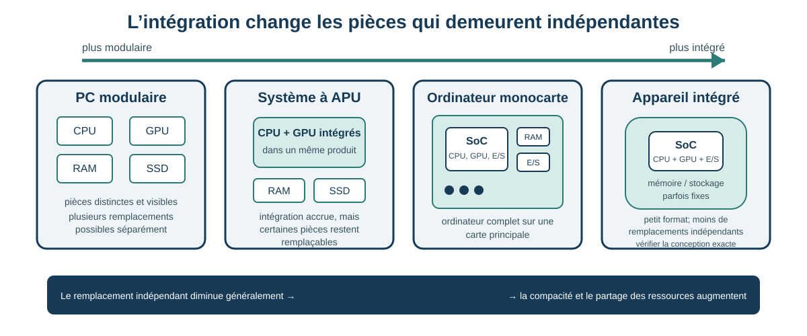

# Séance 13 - Du PC modulaire au système intégré : évaluer une solution SoC

## But de la séance

À la Séance 1, vous avez commencé le cours par une question volontairement large : **où sont les ordinateurs autour de nous?** Vous avez peut-être retenu un téléphone intelligent, une montre, une console, un téléviseur, une calculatrice ou un autre appareil qui ne ressemble pas à un PC de bureau.

Depuis, nous avons fait presque le mouvement inverse. Des Séances 4 à 12, nous avons séparé l'ordinateur en fonctions visibles et étudiables : processeur, mémoire vive, stockage, circuit graphique, carte mère, contrôleurs, connecteurs et périphériques. Le PC modulaire est particulièrement utile pour apprendre ces fonctions parce qu'elles y demeurent souvent physiquement distinctes.

Cette séance **referme cette boucle**. Comment peut-on retrouver autant de fonctions informatiques dans un téléphone, une montre, un routeur, un téléviseur intelligent ou un petit système embarqué? Une réponse majeure est **l'intégration** : plusieurs fonctions autrefois réparties entre différentes puces ou cartes peuvent être réunies dans une même puce, un même module ou une même carte.

Les solutions de type SoC ne sont donc pas une exception exotique au modèle du PC. Elles sont **omniprésentes dans l'informatique contemporaine**, particulièrement dans les téléphones intelligents, tablettes, montres, téléviseurs, équipements réseau, consoles, véhicules, appareils électroménagers et systèmes embarqués. Le PC modulaire reste une architecture importante, mais il n'est qu'une manifestation parmi plusieurs formes possibles de l'ordinateur.

Nous allons comparer des degrés d'intégration plutôt que chercher une architecture universellement supérieure. Une solution compacte peut réduire l'espace, la consommation ou le coût pour un besoin donné. La même intégration peut aussi limiter la réparation, l'extension et la mise à niveau.

!!! question "Retour à la Séance 1"
    Reprenez mentalement votre liste « où sont les ordinateurs? ». Pour chaque objet très compact, demandez-vous maintenant : **quelles fonctions que nous avons étudiées séparément doivent être intégrées pour que cet appareil puisse exister sous cette forme?**

## Objectifs

À la fin de la séance et du laboratoire associé, vous devriez être en mesure de :

- expliquer le concept de **système sur puce (SoC)**;
- expliquer pourquoi les solutions fortement intégrées sont courantes dans les appareils informatiques du quotidien;
- distinguer une puce, un système sur module, un ordinateur monocarte, un microcontrôleur et un ordinateur modulaire;
- utiliser une **APU d'AMD** comme pont conceptuel entre un processeur avec circuit graphique intégré et une solution plus fortement intégrée;
- expliquer pourquoi **Arm** désigne une architecture de jeu d'instructions et non un format physique;
- comparer une plateforme intégrée et une plateforme modulaire selon un besoin;
- évaluer le format, le coût complet, la consommation, la chaleur, la compatibilité, la réparabilité et la mise à niveau;
- expliquer comment l'intégration peut modifier le cycle de remplacement d'un appareil;
- formuler une recommandation provisoire qui distingue les faits, les inférences et les preuves manquantes.

!!! info "Portée de la séance"
    **À maîtriser aujourd'hui :** système sur puce, ordinateur monocarte, système embarqué, degré d'intégration, plateforme modulaire, coût complet, réparabilité, mise à niveau et cycle de remplacement.

    **À reconnaître aujourd'hui :** ubiquité des SoC dans les appareils courants; système sur module; microcontrôleur; APU; Arm; Apple Silicon et Raspberry Pi.

    **Pour aller plus loin :** petites puces interconnectées (*chiplets*), accélérateurs spécialisés, architectures de mémoire avancées et conception électronique détaillée.

## Problème d'ouverture : trois clients, trois besoins

Considérons trois clients :

1. un commerce veut un système compact et silencieux pour l'affichage numérique;
2. une personne veut un PC de jeu et de diffusion en continu qu'elle pourra améliorer pendant plusieurs années;
3. une équipe veut un petit système pour lire des capteurs et commander un appareil.

Les trois solutions contiennent du calcul, de la mémoire, du stockage et des interfaces. Pourtant, elles ne demandent pas le même degré d'intégration.

```text
petit format et faible consommation
                  ↕ compromis
remplacement, extension et mise à niveau
```

La question utile n'est donc pas « Quelle architecture est la meilleure? », mais plutôt :

> Quelle architecture répond au besoin, et quelles contraintes crée-t-elle pendant toute la durée d'utilisation?

## Repartir du PC modulaire

Dans un PC de bureau modulaire, plusieurs fonctions peuvent être réparties entre des composants distincts :

```text
processeur
+ carte mère et contrôleurs
+ modules de mémoire vive
+ carte graphique ou circuit graphique intégré
+ stockage
+ contrôleur réseau
+ alimentation et refroidissement
```

Cette séparation peut faciliter le diagnostic, le remplacement et la mise à niveau. Elle peut aussi exiger plus d'espace, de connecteurs, de câblage, de capacité d'alimentation ou de refroidissement, surtout dans une plateforme à haute performance.

!!! question "Vérification : modulaire signifie-t-il automatiquement réparable?"
    Non. La présence de pièces distinctes peut faciliter le remplacement, mais la disponibilité des pièces, la documentation, les outils, la garantie et la conception du boîtier restent déterminantes.

## L'APU d'AMD comme pont conceptuel

AMD utilise le terme **APU** pour certains produits qui réunissent des cœurs de processeur et un circuit graphique dans le même produit.

```text
processeur séparé + carte graphique séparée
                  ↓
processeur avec circuit graphique intégré
                  ↓
intégration plus large dans un système sur puce
```

L'APU sert ici de **pont conceptuel**. Elle montre qu'une fonction autrefois portée par une carte distincte peut être intégrée au processeur.

<figure markdown="span">
  { loading=lazy width="480" }
  <figcaption>Un AMD A4-5300 : l'emballage ressemble à celui d'un processeur de bureau classique, mais le produit réunit des cœurs de processeur et un circuit graphique intégré. Photo : Trio3D, <a href="https://commons.wikimedia.org/wiki/File:AMD_A4-5300.png">Wikimedia Commons</a>, <a href="https://creativecommons.org/licenses/by-sa/3.0/">CC BY-SA 3.0</a>.</figcaption>
</figure>

!!! warning "APU et SoC ne sont pas des synonymes universels"
    Le terme APU appartient à la terminologie commerciale d'AMD. Pour un produit précis, consultez la documentation afin de déterminer quelles fonctions sont réellement intégrées.

## Qu'est-ce qu'un système sur puce?

Un **système sur puce**, ou **SoC**, intègre plusieurs fonctions majeures sur une même puce. Selon le produit, il peut comprendre :

- des cœurs de processeur;
- un circuit graphique;
- des contrôleurs de mémoire;
- des contrôleurs d'entrées-sorties et de stockage;
- des fonctions réseau;
- des moteurs multimédias;
- des accélérateurs spécialisés;
- des fonctions de sécurité.

Le mot *système* ne signifie pas que l'ordinateur complet tient dans la puce. Le SoC appartient encore à une carte ou à un appareil qui peut comprendre de la mémoire, du stockage, une alimentation, des connecteurs et d'autres composants.

Certaines architectures commerciales regroupent plusieurs puces interconnectées dans un même boîtier de circuit intégré. À ce niveau du cours, retenez surtout ceci : **la documentation du produit doit établir ce qui est intégré, où cela se trouve et ce qui reste remplaçable.**

<figure markdown="span">
  { loading=lazy width="460" }
  <figcaption>L'Apple M1 constitue un exemple moderne de SoC à grande échelle : processeur, graphique et plusieurs moteurs spécialisés sont réunis dans une même conception intégrée. Illustration : Henriok, <a href="https://commons.wikimedia.org/wiki/File:Apple_M1.jpg">Wikimedia Commons</a>, <a href="https://creativecommons.org/publicdomain/zero/1.0/">CC0 1.0</a>.</figcaption>
</figure>



La figure représente un **continuum conceptuel**, pas quatre catégories rigides. Un appareil réel peut se situer entre deux exemples, et un haut degré d'intégration ne permet pas à lui seul de conclure sur sa performance ou sa réparabilité. Il faut examiner le produit précis.

## Du téléphone dans votre poche au SoC sur la carte

Le téléphone intelligent rend l'intégration particulièrement concrète. Un appareil qui tient dans une poche doit réunir calcul, graphisme, traitement photo/vidéo, communication, gestion de l'énergie, mémoire, stockage, capteurs et de nombreuses interfaces dans un volume très réduit.

<figure markdown="span">
  { loading=lazy width="430" }
  <figcaption>Le téléphone intelligent est l'une des manifestations les plus familières d'une plateforme fortement intégrée. Photo : Bisasco baby, <a href="https://commons.wikimedia.org/wiki/File:Smart_phone_device.jpg">Wikimedia Commons</a>, <a href="https://creativecommons.org/licenses/by/4.0/">CC BY 4.0</a>.</figcaption>
</figure>

Mais **le téléphone n'est pas le SoC**. Le SoC n'est qu'un composant de la carte principale, aux côtés de mémoire, stockage, circuits radio, gestion de l'alimentation et autres composants spécialisés.

<figure markdown="span">
  { loading=lazy width="760" }
  <figcaption>Une carte principale de téléphone montre ce que « fortement intégré » signifie au niveau matériel : beaucoup de fonctions sont concentrées sur une très petite carte. Le SoC reste un composant de cet ensemble, pas l'appareil complet. Photo : IGeeksBlog, <a href="https://commons.wikimedia.org/wiki/File:IPhone_3Gs_Motherboard.jpg">Wikimedia Commons</a>, <a href="https://creativecommons.org/licenses/by-sa/4.0/">CC BY-SA 4.0</a>.</figcaption>
</figure>

!!! example "Retour aux ordinateurs invisibles de la Séance 1"
    Un téléphone ou une montre intelligente n'a pas besoin de ressembler à un PC pour répondre à notre définition de travail d'un ordinateur. L'intégration explique **comment** les fonctions étudiées séparément pendant le cours peuvent tenir dans ces formes familières.

## Distinguer puce, module, carte et appareil

| Terme | Niveau physique principal | Idée à retenir |
|---|---|---|
| **SoC** | puce | plusieurs fonctions majeures sont intégrées sur une même puce |
| **Système sur module (SoM)** | module | un SoC et des composants de soutien sont placés sur un module destiné à une carte porteuse |
| **Ordinateur monocarte (SBC)** | carte | un ordinateur presque complet est réuni sur une seule carte principale |
| **Microcontrôleur** | puce | un petit système intégré est conçu surtout pour la commande et les entrées-sorties |
| **Système embarqué** | appareil ou sous-système | l'ordinateur est intégré à un produit ou conçu pour une fonction déterminée |
| **Mini-PC** | appareil complet | sa petite taille ne prouve pas à elle seule qu'il repose sur un SoC |
| **PC modulaire** | plateforme | plusieurs composants importants peuvent être remplacés séparément |

Un Raspberry Pi est un **ordinateur monocarte**. Il contient un SoC, mais la carte complète comprend également des connecteurs, des circuits de soutien et un chemin de stockage.

<figure>
  
  <figcaption>Le Raspberry Pi 4 est un ordinateur monocarte : le SoC n'est qu'un des composants de la carte. Photo : Michael H. (« Laserlicht »), <a href="https://commons.wikimedia.org/wiki/File:Raspberry_Pi_4_Model_B_-_Side.jpg">Wikimedia Commons</a>, licence <a href="https://creativecommons.org/licenses/by-sa/4.0/">CC BY-SA 4.0</a>.</figcaption>
</figure>

??? question "Vérification : SoC, SoM ou SBC?"
    - Une puce qui réunit processeur, graphique et contrôleurs : **SoC**.
    - Un petit module qui porte le SoC et la mémoire, puis se branche sur une carte porteuse : **SoM**.
    - Une carte qui offre processeur, mémoire, ports et stockage amorçable : **SBC**.

## Arm n'est pas un format physique

**Arm** désigne une famille d'architectures de jeu d'instructions. Cette notion décrit les instructions qu'un processeur peut exécuter et certains principes de son architecture. Elle ne détermine pas la taille de l'appareil.

Un appareil Arm peut être :

- un téléphone;
- un ordinateur portable;
- un serveur;
- un ordinateur monocarte;
- un système embarqué;
- un microcontrôleur.

Deux appareils Arm peuvent donc avoir des performances, des interfaces, des systèmes d'exploitation et des usages très différents.

## Deux familles de cas : Apple Silicon et Raspberry Pi

### Apple Silicon

Les systèmes Apple Silicon intègrent plusieurs fonctions de calcul, de graphisme, de traitement multimédia et de contrôle. Selon le modèle, cette intégration peut améliorer l'efficacité énergétique et réduire l'espace requis. Elle peut aussi limiter le remplacement séparé de la mémoire ou d'autres sous-systèmes.

Une recommandation responsable vérifie le modèle étudié et distingue :

- la performance pour la charge de travail;
- la compatibilité des logiciels et périphériques;
- la mémoire et le stockage choisis à l'achat;
- la durée du soutien logiciel;
- les options de réparation et de remplacement.

### Raspberry Pi

Les modèles Raspberry Pi visent d'autres besoins. Leur petit format, leurs broches d'entrées-sorties et leur écosystème peuvent convenir à l'apprentissage, au prototypage, à l'affichage numérique, à de petits services ou à des systèmes embarqués.

Un Raspberry Pi ne remplace pas automatiquement un PC. Sa pertinence dépend du modèle, du système d'exploitation, des logiciels, des périphériques, du stockage, du refroidissement et de la performance attendue.

## Ce que l'intégration peut apporter

Une intégration plus poussée peut offrir :

- un format plus petit;
- moins de puces et d'interconnexions séparées;
- une consommation réduite pour une charge adaptée;
- moins de chaleur ou un refroidissement plus simple dans certains cas;
- une fabrication plus compacte;
- un coût complet plus faible pour certains usages;
- une meilleure portabilité;
- une plateforme adaptée à un produit spécialisé.

Ces avantages sont **possibles**, pas automatiques. Ils doivent être vérifiés pour le modèle et le besoin.

## Ce que l'intégration peut limiter

Une solution intégrée peut imposer :

- une mémoire soudée ou fixe;
- un stockage difficile ou impossible à remplacer;
- peu d'emplacements d'extension;
- moins de ports;
- une dépendance à des adaptateurs ou à une station d'accueil;
- des limites thermiques sous charge prolongée;
- des limites de compatibilité logicielle;
- une dépendance envers le fabricant pour la réparation ou le soutien;
- le remplacement de la carte principale ou de l'appareil lorsqu'un sous-système devient insuffisant.

## Observer, documenter et mesurer : trois preuves différentes

Le Laboratoire 13 peut utiliser du matériel physique, une simulation Velxio ou un dossier statique. Ces modalités ne fournissent pas les mêmes preuves.

| Élément | Matériel physique | Velxio préparé | Dossier statique |
|---|---|---|---|
| Forme et connecteurs réels | observables | représentés | documentés par image |
| Comportement d'un programme | observable | simulé ou émulé | décrit dans une transcription |
| Chaleur et consommation réelles | parfois mesurables | non établies | seulement documentées |
| Réparabilité et remplacement | inspection + documentation | non établis | documentation requise |
| Performance soutenue | mesure contrôlée requise | non établie | résultat documenté seulement |

Une simulation peut démontrer une relation logique entre un programme et une entrée-sortie. Elle ne prouve pas la chaleur, la consommation, la durabilité ou la performance d'un appareil réel.

## Format, coût complet et cycle de remplacement

Un faible prix d'achat ne garantit pas le coût complet le plus faible. Il faut parfois ajouter :

- une alimentation;
- un boîtier;
- un support de stockage;
- un adaptateur vidéo;
- un concentrateur USB;
- une licence logicielle;
- du temps d'intégration et de soutien.

Le **cycle de remplacement** dépend aussi de la modularité.

```text
PC modulaire
mémoire insuffisante → ajouter ou remplacer la mémoire
SSD défaillant       → remplacer le SSD
nouveau besoin GPU    → remplacer la carte graphique

système très intégré
mémoire fixe insuffisante
        ↓
remplacer la carte principale ou l'appareil
```

Il faut distinguer :

- la durée de vie technique;
- la durée du soutien logiciel;
- la performance utile pour la charge de travail;
- la réparabilité;
- la possibilité d'une mise à niveau partielle;
- le coût sur toute la période d'utilisation.

### Exemple résolu : coût pédagogique simplifié

Supposons deux systèmes destinés à l'affichage numérique pendant quatre ans.

| Élément | Système intégré | PC modulaire compact |
|---|---:|---:|
| Prix d'achat | 300 $ | 520 $ |
| Accessoires obligatoires | 110 $ | 30 $ |
| Coût énergétique estimé | 80 $ | 150 $ |
| Remplacement prévu | 300 $ | 90 $ |
| **Total pédagogique simplifié** | **790 $** | **790 $** |

Les deux totaux sont identiques dans ce modèle, mais les risques ne le sont pas. Le système intégré exige un remplacement complet dans le scénario fourni; le PC modulaire exige seulement le remplacement du stockage. Une recommandation doit donc expliquer les hypothèses, pas seulement comparer le total final.

## Méthode d'évaluation d'une plateforme

1. **Définir le besoin.** Charge de travail, espace, budget, durée d'utilisation et contraintes.
2. **Identifier le niveau d'intégration.** Quelles fonctions sont sur la puce, le module, la carte ou dans un composant séparé?
3. **Vérifier la compatibilité.** Logiciels, système d'exploitation, périphériques, stockage et réseau.
4. **Comparer les critères.** Format, ports, consommation, chaleur, performance et coût complet.
5. **Examiner le cycle de vie.** Soutien, diagnostic, réparation, mise à niveau et remplacement.
6. **Distinguer les énoncés.** Fait observé, inférence, recommandation et preuve encore nécessaire.

??? question "Vérification : quelle preuve manque?"
    Une photographie montre que la mémoire ne se trouve pas dans un module DIMM visible. Elle ne prouve pas, à elle seule, la capacité maximale, la méthode d'intégration ni la politique de réparation. Il faut consulter la documentation du modèle.

## Synthèse intégrée

Reprenons d'abord la question de la Séance 1 : les ordinateurs ne disparaissent pas lorsqu'ils cessent de ressembler à un PC. Dans beaucoup d'appareils familiers, **l'intégration rend simplement leurs composants moins visibles et moins indépendants**.

Reprenons ensuite les trois clients.

- Pour l'affichage numérique, un système intégré peut être pertinent si le logiciel, les ports, la température de fonctionnement et le soutien sont vérifiés.
- Pour le PC de jeu et de diffusion en continu, la possibilité de remplacer le circuit graphique, le stockage ou la mémoire peut avoir plus de valeur que le petit format.
- Pour la lecture de capteurs, un ordinateur monocarte ou un microcontrôleur peut mieux répondre au besoin, mais ces deux catégories ne fournissent pas le même système d'exploitation ni les mêmes ressources.

Une forte intégration déplace les compromis. La bonne recommandation dépend du besoin, de la période d'utilisation et des preuves disponibles.

## Erreurs fréquentes à éviter

- **Confondre le SoC et l'ordinateur complet.** Vérifiez si l'énoncé décrit une puce, un module, une carte ou un appareil.
- **Croire que les SoC sont réservés aux cartes de développement.** Les téléphones, tablettes, montres et de nombreux appareils embarqués reposent eux aussi sur des conceptions fortement intégrées.
- **Présenter APU et SoC comme des synonymes.** Consultez l'organisation documentée du produit.
- **Croire qu'Arm signifie petit ou peu puissant.** Arm décrit une architecture de jeu d'instructions.
- **Supposer qu'une plateforme intégrée coûte toujours moins cher.** Calculez les accessoires, l'énergie et le remplacement prévus.
- **Supposer qu'un composant soudé ne tombera pas en panne.** L'intégration change surtout les options de réparation.
- **Employer « évolutif » sans preuve.** Nommez les pièces réellement remplaçables et les limites documentées.

## Ce qu'il faut retenir

- Un système sur puce intègre plusieurs fonctions majeures sur une même puce.
- Les SoC et autres plateformes fortement intégrées sont courants dans les téléphones, tablettes, montres, équipements réseau, téléviseurs et systèmes embarqués qui nous entourent.
- Un système sur module, un ordinateur monocarte et un appareil complet se situent à des niveaux physiques différents.
- Une APU sert de pont conceptuel, mais APU et SoC ne sont pas des synonymes universels.
- Arm est une architecture de jeu d'instructions, pas un format physique.
- L'intégration peut améliorer le format, l'efficacité et le coût pour certains besoins.
- Elle peut réduire l'extension, la réparabilité et la mise à niveau.
- Le coût complet et le cycle de remplacement doivent être évalués avec les besoins du client.
- Une recommandation responsable distingue les faits, les inférences et les preuves manquantes.

## Passer à la pratique

Le [Laboratoire 13](../laboratoires/laboratoire-13.md) vous demandera de comparer des plateformes intégrées et modulaires à partir d'un dossier de preuves complet. Une observation physique ou un projet Velxio pourra enrichir l'activité sans devenir la seule voie d'accès au travail exigé.
