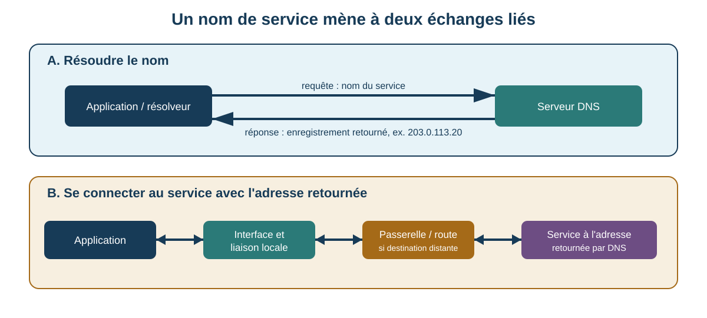

# Séance 14 - De l'interface réseau au service : suivre deux échanges

## But de la séance

À la Séance 12, nous avons distingué le connecteur 8P8C de la technologie Ethernet. À la Séance 13, nous avons vu qu'un contrôleur réseau peut être intégré à une carte mère, à un système sur puce ou à un ordinateur complet.

Nous allons maintenant suivre les données **au-delà du connecteur et de l'adaptateur**. Une application qui communique avec un service nommé dépend d'une chaîne de responsabilités : liaison locale, adressage, décision de routage, résolution de noms, transport et service d'application.

Une communication avec un service nommé demande souvent **deux échanges liés mais distincts** :

1. résoudre le nom avec DNS;
2. communiquer avec l'adresse obtenue au moyen d'IP et d'un protocole de transport.

Chacun de ces échanges est lui-même encapsulé dans plusieurs couches. Un problème « d'Internet » peut donc se trouver dans un câble, une liaison Wi-Fi, une adresse, une route, DNS, TCP, UDP ou l'application finale.

Cette séance répond à cinq questions :

> Comment une donnée passe-t-elle d'une application à une trame Ethernet ou Wi-Fi, puis remonte-t-elle les couches à destination?

> Comment un poste décide-t-il d'envoyer directement à une machine locale ou de remettre le paquet à une passerelle?

> Quel rôle jouent les adresses MAC, IP et les ports logiques, et pourquoi ne sont-elles pas interchangeables?

> Pourquoi DNS, DHCP, TCP, UDP et ICMP répondent-ils à des problèmes différents?

> Quelles preuves permettent de localiser une panne sans modifier la configuration du poste?

## Objectifs

### Parcours principal

À la fin de la séance et du laboratoire associé, vous devriez être en mesure de :

- distinguer carte ou adaptateur réseau, interface réseau, support physique et liaison;
- expliquer le rôle général d'un commutateur, d'un point d'accès et d'un routeur;
- expliquer l'encapsulation simple `données d'application → transport → IP → trame → signal`;
- distinguer une trame Ethernet, un paquet IP, un segment TCP et un datagramme UDP;
- expliquer les rôles d'une adresse MAC, d'une adresse IPv4, d'un préfixe et d'un port logique;
- interpréter une adresse IPv4 avec son préfixe et déterminer si une destination simple est locale ou distante;
- expliquer comment ARP permet de retrouver une adresse MAC à partir d'une adresse IPv4 sur une liaison Ethernet;
- expliquer pourquoi une destination IP distante peut être placée dans une trame dont l'adresse MAC de destination est celle de la passerelle;
- expliquer le rôle d'une route par défaut et reconnaître qu'une machine peut posséder plusieurs routes et interfaces;
- décrire le dialogue DHCP de base et distinguer configuration automatique de connectivité prouvée;
- distinguer le résolveur DNS, le serveur DNS et le service final;
- reconnaître les rôles des enregistrements DNS A, AAAA et CNAME et du TTL à un niveau introductif;
- distinguer les services de TCP et d'UDP sans les réduire à « fiable » et « rapide »;
- expliquer le rôle des ports source et destination dans une communication de transport;
- expliquer ce que `ping`, `tracert`, `Resolve-DnsName` et un test de port TCP peuvent ou ne peuvent pas prouver;
- comparer des caractéristiques de base des réseaux filaires et sans fil selon un besoin;
- interpréter des sorties réseau simples et distinguer observation, inférence et preuve manquante;
- appliquer une méthode de diagnostic par couches en choisissant le prochain test le plus précis;
- formuler une recommandation réseau qui tient compte de la compatibilité, de la stabilité, de l'efficacité et de la maintenabilité.

!!! question "Questions directrices"
    1. **Quelle couche porte maintenant la donnée?** Application, transport, IP, liaison ou support physique?
    2. **La destination est-elle locale ou distante?** Le préfixe détermine la prochaine étape.
    3. **Quelle adresse est utilisée à cette couche?** MAC, IP et port logique ne désignent pas la même chose.
    4. **Quel service est réellement testé?** Une réponse DNS n'est pas une réponse HTTP; un `ping` n'est pas un test de port TCP.
    5. **Quelle conclusion les preuves permettent-elles réellement?** Un test positif ou négatif confirme certaines responsabilités, pas toute la chaîne.

!!! info "Portée de la séance"
    **À maîtriser aujourd'hui :** adaptateur et interface; support et liaison; commutateur, point d'accès et routeur; encapsulation; trame, paquet, segment et datagramme; adresse MAC; adresse IPv4 et préfixe; destination locale ou distante; ARP; passerelle et route par défaut; DHCP; DNS; ports logiques; TCP; UDP; ICMP; `ping`; `tracert`; diagnostic par couches; comparaison filaire/sans fil.

    **À reconnaître aujourd'hui :** adresse de bouclage; IPv4 local au lien `169.254.0.0/16`; plages IPv4 privées; adresses réservées à la documentation; IPv6 et ses adresses de 128 bits; `::1`; adresse IPv6 locale au lien; table de routage; SSID; débit PHY Wi-Fi; adresses MAC administrées localement ou aléatoires.

    **Pour aller plus loin après le lien du laboratoire :** calculs généraux de sous-réseau; détails des en-têtes Ethernet/IP/TCP/UDP; découverte des voisins IPv6; NAT; VLAN; MTU et fragmentation; DNS récursif détaillé et DNS chiffré; routage dynamique. Cette partie est facultative.

<div class="admonition info session-14-navigation"><p class="admonition-title">Repères de navigation</p>
<p>Cette séance est volontairement détaillée parce qu'elle doit rester utile comme référence. Pour une première lecture, suivez le parcours suivant :</p>
<ol>
<li><strong>Chaîne de communication :</strong> encapsulation et rôle de chaque couche.</li>
<li><strong>Liaison locale :</strong> Ethernet, Wi-Fi, commutateur, point d'accès et adresse MAC.</li>
<li><strong>Adresse logique :</strong> IPv4, préfixe, ARP et passerelle.</li>
<li><strong>Configuration et noms :</strong> DHCP puis DNS.</li>
<li><strong>Transport :</strong> ports, TCP et UDP.</li>
<li><strong>Diagnostic :</strong> ICMP, <code>ping</code>, <code>tracert</code> et choix du prochain test.</li>
</ol>
<p>Les calculs généraux de sous-réseau, NAT, VLAN et les détails d'en-tête restent en approfondissement.</p></div>

## Problème d'ouverture : « le réseau ne fonctionne pas »

Sur un poste de laboratoire, une application ne parvient pas à joindre `service.test`.

Les observations sont les suivantes :

```text
interface Ethernet : Up
vitesse de liaison : 1 Gbit/s
adresse IPv4       : 192.168.10.25/24
passerelle         : 192.168.10.1
serveur DNS        : 192.168.10.53
```

Puis :

```powershell
Resolve-DnsName service.test
```

échoue, tandis qu'un test contrôlé vers une adresse IP fournie par l'enseignant réussit.

Il serait tentant de conclure : « le câble est bon, donc le réseau fonctionne et DNS est cassé ». La première partie est trop large. Une liaison active constitue une preuve utile, mais elle ne vérifie pas la route vers toutes les destinations, le service final, le bon port, l'authentification ou l'application.

Nous avons besoin d'une méthode qui sépare les responsabilités et qui demande, à chaque étape :

> Qu'est-ce que ce résultat confirme, et qu'est-ce qu'il laisse encore inconnu?

## Une communication est une pile, pas un seul tuyau

Lorsqu'une application envoie des données, chaque couche ajoute les informations nécessaires à son propre travail.

```text
données de l'application
        ↓
TCP : segment        ou        UDP : datagramme
        ↓
IP : paquet / datagramme IP
        ↓
Ethernet ou Wi-Fi : trame
        ↓
bits, signaux électriques, lumière ou ondes radio
```

À destination, le processus est inversé : la liaison remet le contenu à IP, IP au protocole de transport approprié, puis le transport à l'application.

### Vocabulaire à garder séparé

| Unité | Couche | Contient notamment |
|---|---|---|
| Données d'application | application | requête DNS, HTTP, fichier, message, etc. |
| Segment TCP | transport | ports, numéros de séquence, accusés de réception, indicateurs |
| Datagramme UDP | transport | ports, longueur, somme de contrôle |
| Paquet IP | Internet | adresses IP source/destination, protocole supérieur, limite de sauts |
| Trame Ethernet | liaison | adresses MAC source/destination, type, données, contrôle d'erreur |

!!! warning "Les mots ne sont pas interchangeables"
    Dire « paquet » pour toute donnée réseau peut être acceptable dans une conversation générale, mais pendant le diagnostic le vocabulaire permet d'identifier la responsabilité. Une adresse MAC appartient à la livraison locale; une adresse IP appartient au paquet routé; un port appartient au transport.

### Encapsulation : les informations s'emboîtent

Dans un exemple simplifié avec TCP sur IPv4 sur Ethernet :

```text
┌────────────────────────────────────────────┐
│ trame Ethernet                             │
│  ┌──────────────────────────────────────┐  │
│  │ paquet IPv4                           │  │
│  │  ┌────────────────────────────────┐  │  │
│  │  │ segment TCP                    │  │  │
│  │  │  ┌──────────────────────────┐  │  │  │
│  │  │  │ données de l'application│  │  │  │
│  │  │  └──────────────────────────┘  │  │  │
│  │  └────────────────────────────────┘  │  │
│  └──────────────────────────────────────┘  │
└────────────────────────────────────────────┘
```

Le même paquet IP peut être transporté par des trames de liaison différentes lorsqu'il traverse plusieurs réseaux. C'est l'une des raisons pour lesquelles **adresse MAC et adresse IP ne jouent pas le même rôle**.

## Adaptateur, interface, support et liaison

Une **carte ou un adaptateur réseau** est le matériel qui permet au système de communiquer. Il peut être :

- intégré à la carte mère ou au SoC;
- installé en PCI Express;
- branché par USB;
- intégré à un portable ou un téléphone;
- présenté au système par une machine virtuelle ou un commutateur virtuel.

Le système d'exploitation expose cette capacité sous la forme d'une **interface réseau**. Une machine peut donc afficher plusieurs interfaces simultanément : Ethernet, Wi-Fi, VPN, ponts, interfaces de machines virtuelles et interfaces désactivées.

Une interface visible ne prouve pas qu'une **liaison** fonctionne. Une liaison signifie qu'un chemin de communication local est établi selon la technologie concernée.

<figure markdown="span">
  { loading=lazy width="680" }
  <figcaption>Cette carte réseau historique rappelle qu'un adaptateur est un composant matériel et que plusieurs supports physiques peuvent exister. Photo : Nixdorf, <a href="https://commons.wikimedia.org/wiki/File:Network_card.jpg">Wikimedia Commons</a>, <a href="https://creativecommons.org/licenses/by-sa/3.0/">CC BY-SA 3.0</a>.</figcaption>
</figure>

### Interface physique ou virtuelle?

Considérez cette sortie :

```text
Name       Description                  Status   LinkSpeed
Ethernet   Intel(R) Ethernet Adapter    Up       1 Gbps
vEthernet  Hyper-V Virtual Ethernet     Up       10 Gbps
```

Le nombre `10 Gbps` ne prouve pas qu'un câble physique de 10 Gbit/s relie la machine au réseau. Une interface virtuelle peut représenter un chemin logiciel à l'intérieur de l'hôte.

!!! question "Vérification : quelle interface utiliser pour décrire la liaison physique?"
    Il faut identifier l'adaptateur physique correspondant au câble ou à la radio réellement utilisés. L'état d'une interface virtuelle peut être pertinent pour une machine virtuelle, mais il ne remplace pas l'observation du chemin physique de l'hôte.

## Ethernet : une liaison locale à trames

Ethernet est une famille de technologies normalisées par IEEE 802.3. Elle définit notamment des fonctions de contrôle d'accès au support et de nombreuses couches physiques pour différents médias et débits.

Dans un réseau de bureau moderne, un poste Ethernet est généralement relié par une liaison point à point à un **commutateur**.

<figure markdown="span">
  { loading=lazy width="760" }
  <figcaption>Un commutateur relie plusieurs liaisons Ethernet locales. Photo : Raysonho @ Open Grid Scheduler / Grid Engine, <a href="https://commons.wikimedia.org/wiki/File:EthernetSwitch.jpg">Wikimedia Commons</a>, <a href="https://creativecommons.org/publicdomain/zero/1.0/">CC0 1.0</a>.</figcaption>
</figure>

### Une trame Ethernet simplifiée

Au niveau MAC, une trame Ethernet peut être représentée ainsi :

```text
┌──────────────┬──────────────┬───────────┬──────────────┬─────┐
│ MAC dest.    │ MAC source   │ type      │ données      │ FCS │
│ 6 octets     │ 6 octets     │ 2 octets  │              │     │
└──────────────┴──────────────┴───────────┴──────────────┴─────┘
```

Ce schéma est volontairement simplifié : il ne montre pas tous les éléments transmis sur le support physique ni les variantes possibles. Pour le diagnostic de cette séance, trois idées suffisent :

- la trame indique une destination locale;
- elle indique une source locale;
- son contenu peut être un paquet IPv4, IPv6, ARP ou un autre protocole.

### L'adresse MAC

Une adresse MAC Ethernet courante contient `48 bits`, soit `6 octets`. Elle est souvent affichée en hexadécimal :

```text
00-11-22-33-44-55
```

ou :

```text
00:11:22:33:44:55
```

Une adresse MAC sert à la livraison **sur la liaison locale**. Elle ne constitue pas une identité absolue de l'ordinateur :

- une machine peut avoir plusieurs interfaces et donc plusieurs adresses;
- une interface virtuelle peut posséder une adresse MAC;
- une adresse peut être administrée localement;
- certains systèmes changent ou randomisent des adresses pour la confidentialité.

L'adresse de diffusion Ethernet :

```text
FF:FF:FF:FF:FF:FF
```

permet d'envoyer une trame à toutes les stations du même domaine de diffusion de liaison. ARP utilise notamment cette possibilité pour poser certaines questions locales.

### Ce que fait un commutateur

Dans notre modèle simplifié, un commutateur Ethernet :

1. reçoit une trame sur un port;
2. apprend l'association entre l'adresse MAC source et ce port;
3. consulte l'adresse MAC de destination;
4. transmet la trame vers le port approprié lorsqu'il connaît cette association;
5. diffuse la trame sur plusieurs ports lorsque la destination est une diffusion ou lorsque l'emplacement d'une destination n'est pas encore connu.

Le commutateur ne décide pas normalement quel chemin IP emprunter vers Internet. Cette responsabilité appartient au routage.

!!! warning "Commutateur et routeur ne sont pas des synonymes"
    Un appareil commercial peut intégrer commutation, routage, Wi-Fi, DHCP et d'autres fonctions dans le même boîtier. Les **fonctions** doivent tout de même être distinguées : le commutateur livre des trames dans la liaison locale; le routeur choisit un prochain saut pour des paquets IP entre réseaux.

## Wi-Fi : une liaison locale sur un support radio partagé

Wi-Fi appartient à la famille IEEE 802.11. Comme Ethernet, il possède une couche MAC et des couches physiques, mais son support est radio et son comportement n'est pas identique à celui d'une liaison Ethernet commutée.

Un poste Wi-Fi communique généralement avec un **point d'accès**. Le point d'accès peut ensuite relier le trafic au réseau local filaire ou à une autre infrastructure.

<figure markdown="span">
  { loading=lazy width="650" }
  <figcaption>Un point d'accès fournit une liaison radio aux stations sans fil. Photo : Pjpearce, <a href="https://commons.wikimedia.org/wiki/File:Wireless_access_point.jpg">Wikimedia Commons</a>, <a href="https://creativecommons.org/publicdomain/zero/1.0/">CC0 1.0</a>.</figcaption>
</figure>

### Point d'accès, routeur et « routeur Wi-Fi »

Un **point d'accès** fournit la fonction de liaison sans fil. Un **routeur** relie des réseaux IP. Un appareil domestique appelé « routeur Wi-Fi » combine souvent :

```text
routeur
+ commutateur Ethernet
+ point d'accès Wi-Fi
+ serveur DHCP
+ parfois pare-feu, NAT et autres services
```

Cette intégration explique pourquoi un seul boîtier peut sembler « faire tout le réseau », mais le diagnostic devient plus précis lorsqu'on sépare ses fonctions.

### Pourquoi le débit Wi-Fi varie

Le débit utile d'une connexion sans fil dépend notamment :

- de la norme et des capacités communes de la station et du point d'accès;
- de la bande et du canal utilisés;
- de la largeur de canal;
- de la qualité du signal;
- de la distance et des obstacles;
- des interférences;
- du nombre d'appareils qui partagent le support;
- de la retransmission de trames perdues;
- du chiffrement et des surcharges de protocole;
- de la charge du réseau en amont.

La valeur affichée comme **vitesse de liaison** ou **débit PHY** n'est donc pas une réservation de débit pour l'application.

!!! example "Deux ordinateurs affichent la même vitesse Wi-Fi"
    Ils peuvent tout de même obtenir des débits d'application différents si l'un subit davantage d'interférences, partage le canal avec plus de stations ou utilise un chemin réseau en amont plus chargé.

### SSID et adresse MAC

Le **SSID** est un nom utilisé pour identifier un réseau Wi-Fi auprès des utilisateurs et stations. Il ne remplace pas l'adresse IP. Les points d'accès et stations utilisent aussi des adresses de liaison; le format des trames 802.11 comporte toutefois des particularités qui dépassent le parcours principal.

## IPv4 : une adresse logique de 32 bits

Une adresse IPv4 contient `32 bits`, généralement écrits sous la forme de quatre octets décimaux :

```text
192.168.10.25
```

L'adresse seule n'est pas suffisante. Le **préfixe** indique quelle partie des bits sert à reconnaître le réseau local.

```text
192.168.10.25/24
```

signifie que les `24` premiers bits appartiennent au préfixe utilisé pour la décision de routage.

### Relier le préfixe au binaire

La notation `/24` correspond au masque :

```text
11111111.11111111.11111111.00000000
255.255.255.0
```

Le poste compare les bits du préfixe de sa propre adresse avec ceux de la destination.

Dans cet exemple :

```text
poste :        192.168.10.25/24
hôte local :   192.168.10.80
hôte distant : 192.168.11.5
```

`192.168.10.80` partage le même préfixe `/24`; `192.168.11.5` ne le partage pas.

### Un préfixe qui ne tombe pas sur une limite d'octet

Pour montrer que `/24` n'est pas une règle spéciale, examinons :

```text
adresse : 192.168.10.130/26
masque  : 255.255.255.192
```

Le dernier octet donne :

```text
130      = 10000010
192      = 11000000   ← les deux premiers bits appartiennent au préfixe
ET binaire
           10000000 = 128
```

Le préfixe de réseau est donc :

```text
192.168.10.128/26
```

`192.168.10.180` appartient à ce préfixe, tandis que `192.168.10.200` appartient au bloc suivant.

!!! note "Pas besoin de faire tous les sous-réseaux aujourd'hui"
    Le parcours principal exige surtout de comprendre **pourquoi le préfixe est nécessaire** et de classifier des exemples fournis. Les calculs généraux de sous-réseau sont placés en approfondissement.

## Quelques plages IPv4 à reconnaître

Les exemples du cours utilisent volontairement des adresses qui ne doivent pas représenter de véritables hôtes Internet publics.

| Préfixe | Rôle à reconnaître |
|---|---|
| `10.0.0.0/8` | usage privé |
| `172.16.0.0/12` | usage privé |
| `192.168.0.0/16` | usage privé |
| `169.254.0.0/16` | adresse locale au lien / autoconfiguration IPv4 |
| `127.0.0.0/8` | bouclage IPv4 |
| `192.0.2.0/24` | documentation TEST-NET-1 |
| `198.51.100.0/24` | documentation TEST-NET-2 |
| `203.0.113.0/24` | documentation TEST-NET-3 |

Une adresse privée n'est pas « fausse » : elle est parfaitement utilisable dans un réseau privé, mais elle n'est pas destinée à être routée comme une adresse publique globale sur Internet.

!!! question "Pourquoi le cours utilise-t-il 203.0.113.20?"
    Le préfixe `203.0.113.0/24` est réservé à la documentation. Il permet de montrer une adresse distante sans pointer vers un serveur réel appartenant à une organisation externe.

## Local ou distant : la décision qui change la trame

Supposons :

```text
poste         192.168.10.25/24
MAC poste     00:11:22:33:44:55
passerelle    192.168.10.1
MAC passerelle AA:AA:AA:AA:AA:AA
hôte local    192.168.10.80
MAC hôte      66:77:88:99:AA:BB
hôte distant  203.0.113.20
```

Le **paquet IP** vise toujours l'adresse IP de la destination finale. Ce qui change est la destination **de la trame locale**.

### Destination locale

Pour `192.168.10.80` :

```text
paquet IPv4
source IP      192.168.10.25
destination IP 192.168.10.80

trame Ethernet
source MAC      00:11:22:33:44:55
destination MAC 66:77:88:99:AA:BB
```

Le poste envoie directement vers la MAC de l'hôte local.

### Destination distante

Pour `203.0.113.20` :

```text
paquet IPv4
source IP      192.168.10.25
destination IP 203.0.113.20

trame Ethernet sur le premier lien
source MAC      00:11:22:33:44:55
destination MAC AA:AA:AA:AA:AA:AA  ← passerelle
```

L'adresse IP de destination reste `203.0.113.20`, mais la première trame est adressée à la passerelle locale, parce que c'est elle qui doit recevoir le paquet pour le router plus loin.

!!! question "Vérification : la passerelle remplace-t-elle l'adresse IP de destination?"
    Pas dans ce modèle de routage simple. La passerelle reçoit une trame qui lui est destinée au niveau liaison, retire cette enveloppe locale, examine l'adresse IP de destination du paquet, puis choisit le prochain saut. NAT peut modifier certaines adresses IP dans d'autres scénarios; nous le plaçons en approfondissement.

## ARP : trouver la MAC du prochain saut IPv4

Le poste connaît peut-être l'adresse IP du prochain saut, mais il lui faut encore une adresse de liaison pour construire la trame Ethernet.

**ARP** (*Address Resolution Protocol*) sert à associer une adresse IPv4 locale à une adresse matérielle de liaison comme une adresse MAC Ethernet.

### Cas local

Pour joindre `192.168.10.80`, le poste demande essentiellement :

> Qui possède 192.168.10.80? Indiquez-moi votre adresse de liaison.

Si l'association n'est pas déjà connue, une requête ARP est diffusée sur le réseau local. L'hôte concerné répond avec son adresse MAC. Le poste peut alors construire la trame.

### Cas distant

Pour joindre `203.0.113.20`, le poste **ne cherche pas la MAC de 203.0.113.20**. Cette machine n'est pas sur la liaison locale.

Il cherche la MAC de son **prochain saut**, ici `192.168.10.1`.

```text
destination IP distante
        ↓
décision de routage
        ↓
prochain saut = 192.168.10.1
        ↓
ARP : quelle MAC possède 192.168.10.1?
        ↓
trame vers la MAC de la passerelle
```

Cette distinction est fondamentale pour comprendre le rôle différent de MAC et IP.

### Cache ARP

Le système conserve temporairement certaines associations IP↔MAC afin de ne pas rediffuser la même question pour chaque paquet. Une entrée présente constitue une observation utile, mais elle n'est pas une preuve que l'hôte répond actuellement à tous les services.

## Commutateur local, puis routeur

Suivons le premier saut d'un paquet distant.

```text
poste
  │ trame dest. MAC = passerelle
  ▼
commutateur
  │ transfère la trame selon la MAC
  ▼
routeur / passerelle
  │ retire la trame locale
  │ examine l'IP destination
  │ décrémente la limite de sauts
  │ choisit une route
  ▼
nouveau lien
  │ nouvelle trame adaptée à ce lien
  ▼
prochain saut
```

Le **paquet IP** traverse plusieurs routeurs. Les **trames de liaison** servent seulement sur leur lien local et sont remplacées à mesure que le paquet progresse.

## Routage : choisir un prochain saut

Un hôte possède une **table de routage**. Elle contient des préfixes de destination et indique par quelle interface ou quel prochain saut les joindre.

Un modèle très simplifié peut ressembler à :

```text
192.168.10.0/24  → directement par Ethernet
0.0.0.0/0        → passerelle 192.168.10.1
```

`0.0.0.0/0` est une **route par défaut** : elle peut être utilisée lorsqu'aucune route plus précise ne correspond à la destination.

### Pourquoi « la passerelle par défaut » n'est pas toute la table

Une machine peut aussi posséder :

- une route de bouclage;
- des routes locales;
- une interface VPN;
- des interfaces virtuelles;
- plusieurs cartes réseau;
- des routes ajoutées par un logiciel.

La présence d'une passerelle par défaut ne garantit donc pas que chaque destination utilise toujours cette interface. Le système choisit la route la plus appropriée selon sa table et ses règles.

!!! note "La route la plus précise"
    Une route qui correspond à davantage de bits du préfixe est généralement préférée à une route plus générale. Le calcul détaillé et les métriques de routage restent hors du parcours principal.

## DHCP : obtenir une configuration, pas « Internet »

**DHCP** (*Dynamic Host Configuration Protocol*) permet à un client d'obtenir automatiquement des paramètres réseau.

Un bail DHCP peut fournir notamment :

- une adresse IPv4;
- un masque ou préfixe;
- une passerelle par défaut;
- un ou plusieurs serveurs DNS;
- une durée de bail;
- d'autres options définies pour le réseau.

### Le dialogue de base

Lorsqu'un client ne possède pas encore de configuration, un échange courant peut être résumé :

```text
client                         serveur DHCP
  │ DHCPDISCOVER  ───────────────→ │
  │ ←────────────── DHCPOFFER      │
  │ DHCPREQUEST   ───────────────→ │
  │ ←────────────── DHCPACK        │
```

On retient souvent **DORA** : Discover, Offer, Request, Acknowledge.

Des agents relais peuvent transporter certaines demandes entre sous-réseaux lorsque le serveur DHCP n'est pas sur le même segment. Les renouvellements ultérieurs ne suivent pas nécessairement exactement le même chemin initial.

### Ce qu'un bail prouve et ne prouve pas

Si un poste possède :

```text
192.168.10.25/24
passerelle 192.168.10.1
DNS 192.168.10.53
```

et que ces valeurs proviennent de DHCP, cela soutient qu'un processus de configuration a réussi. Cela ne prouve pas que :

- le serveur DNS répond maintenant;
- la passerelle rejoint Internet;
- le service demandé fonctionne;
- le câble n'a pas été débranché depuis l'obtention du bail.

### `169.254.0.0/16` et APIPA

Sur Windows, lorsqu'une interface configurée pour DHCP ne peut pas obtenir de bail utilisable, le système peut s'attribuer une adresse IPv4 dans `169.254.0.0/16` au moyen de l'autoconfiguration locale au lien.

Cette observation soutient l'idée que la configuration DHCP attendue n'a pas été obtenue. Elle **ne localise pas automatiquement la cause** : liaison, authentification, serveur, relais ou autre problème peuvent être impliqués.

## DNS : transformer un nom en information exploitable

Les utilisateurs préfèrent des noms comme :

```text
service.test
```

Les communications IP utilisent des adresses. **DNS** (*Domain Name System*) fournit une base de données distribuée qui associe des noms à différents types d'enregistrements.

### Client, résolveur et serveurs

Dans un modèle introductif :

```text
application
   ↓ demande de résolution
résolveur du système
   ↓
serveur DNS configuré / résolveur récursif
   ↓ au besoin
autres serveurs DNS
   ↓
réponse
```

Le serveur configuré peut répondre depuis son **cache**. Il n'a pas nécessairement besoin de contacter un serveur faisant autorité pour chaque demande.

### Quelques enregistrements à reconnaître

| Type | Rôle général |
|---|---|
| `A` | associe un nom à une adresse IPv4 |
| `AAAA` | associe un nom à une adresse IPv6 |
| `CNAME` | indique un alias vers un nom canonique |
| `MX` | indique des serveurs de courrier pour un domaine |
| `NS` | indique des serveurs de noms pour une zone |

Le parcours principal exige surtout de reconnaître `A`, `AAAA` et `CNAME`.

### TTL et cache

Un enregistrement DNS contient souvent un **TTL** (*time to live*) qui indique combien de temps le résultat peut être conservé en cache selon les règles DNS.

Une modification effectuée sur un serveur DNS peut donc ne pas être observée immédiatement par tous les résolveurs si une ancienne réponse est encore valide dans leur cache.

!!! warning "TTL DNS et TTL IP ne sont pas la même chose"
    Le TTL d'un enregistrement DNS concerne la durée de mise en cache. Le champ TTL d'un paquet IPv4 limite le nombre de sauts qu'il peut traverser en pratique. Les deux utilisent le même acronyme historique, mais répondent à des problèmes différents.

## Deux échanges pour joindre un service nommé

Pour `service.test`, séparons clairement les responsabilités.

### Échange A : résolution DNS

```text
application
→ résolveur
→ serveur DNS 192.168.10.53
→ réponse : A 203.0.113.20
```

Cette requête DNS est elle-même transportée par UDP ou TCP selon le cas, dans IP, puis sur une liaison locale.

### Échange B : connexion au service

Après avoir obtenu `203.0.113.20` :

```text
application
→ protocole de transport et port
→ paquet IP vers 203.0.113.20
→ route / passerelle
→ réseau distant
→ service
```

Le serveur DNS ne devient pas un « arrêt obligatoire » sur ce deuxième chemin.



??? question "Vérification : une résolution DNS réussie prouve-t-elle que le service fonctionne?"
    Non. Elle prouve qu'une réponse DNS utilisable a été obtenue. Le service peut encore être indisponible, filtré, mal configuré, inaccessible sur le port demandé ou incompatible avec l'application.

??? question "Et si DNS échoue mais que l'adresse IP fonctionne?"
    Les preuves soutiennent alors un problème lié au nom ou à sa résolution. Elles ne prouvent pas que toutes les autres destinations ou tous les services fonctionnent.

## Ports logiques : livrer au bon processus

Une adresse IP permet d'atteindre un hôte ou une interface logique. Plusieurs applications peuvent communiquer simultanément sur cet hôte. Les protocoles de transport utilisent des **ports** pour différencier les points de communication.

TCP et UDP utilisent des numéros de port sur `16 bits`, donc des valeurs de `0` à `65 535`.

Un échange peut être décrit par :

```text
IP source + port source
IP destination + port destination
protocole de transport
```

Par exemple :

```text
192.168.10.25:51842  →  203.0.113.20:443  TCP
```

Le port source du client est souvent choisi temporairement par le système; le port de destination correspond au service demandé selon la configuration et le protocole d'application.

!!! warning "Un port logique n'est pas une prise"
    « Port 443 » ne désigne aucun connecteur physique. Le même mot *port* est utilisé pour une prise Ethernet et pour un identifiant de transport; le contexte doit être explicite.

## TCP : une connexion et un flux d'octets ordonné

**TCP** fournit aux applications un service de flux d'octets fiable et ordonné. Il utilise notamment :

- des numéros de séquence;
- des accusés de réception;
- des retransmissions en cas de pertes détectées;
- une somme de contrôle;
- le contrôle de flux;
- le contrôle de congestion;
- des états de connexion.

### Établissement simplifié d'une connexion

Avant l'échange normal de données, une connexion TCP utilise typiquement une poignée de main en trois étapes :

```text
client                         serveur
  │ SYN        ─────────────────→ │
  │ ←──────────────── SYN + ACK   │
  │ ACK        ─────────────────→ │
  │                                │
  │      données TCP ensuite       │
```

Le but n'est pas de mémoriser tous les drapeaux aujourd'hui, mais de comprendre qu'un test TCP vérifie autre chose qu'un `ping`.

### Refus, délai et réussite ne signifient pas la même chose

- une **connexion réussie** soutient qu'un service TCP accepte la connexion sur cette adresse et ce port;
- une **connexion refusée** indique qu'une réponse négative a été reçue quelque part dans le chemin, souvent parce qu'aucun service n'écoute ou qu'une politique rejette explicitement la demande;
- un **délai dépassé** peut venir d'un filtrage, d'une route, d'une panne ou d'une absence de réponse; il fournit moins d'information sur la localisation précise.

La formulation doit rester proportionnelle aux preuves.

## UDP : des datagrammes sans connexion TCP

**UDP** fournit un service de datagrammes plus simple. Son en-tête contient notamment :

- un port source;
- un port destination;
- une longueur;
- une somme de contrôle.

UDP ne fournit pas lui-même :

- une poignée de main de connexion comme TCP;
- la retransmission automatique des datagrammes perdus;
- la remise en ordre automatique;
- le même contrôle de flux que TCP.

Cela ne signifie pas qu'une application utilisant UDP est nécessairement « non fiable ». Une application peut ajouter ses propres numéros de séquence, accusés, corrections ou mécanismes de reprise.

### Pourquoi utiliser UDP?

Une application peut préférer des datagrammes lorsqu'elle veut :

- conserver des limites de messages;
- éviter l'établissement d'une connexion TCP;
- contrôler elle-même la reprise;
- accepter qu'une petite perte soit préférable à l'attente d'une ancienne donnée;
- construire un protocole moderne au-dessus d'UDP, comme QUIC.

La performance dépend toujours de l'application, du réseau et de l'implémentation. « UDP = rapide » est donc trop vague.

## ICMP : messages de contrôle et diagnostic IP

**ICMP** n'est ni TCP ni UDP. Il transporte des messages de contrôle associés au fonctionnement d'IP.

Parmi les types utiles à reconnaître :

- Echo Request;
- Echo Reply;
- Destination Unreachable;
- Time Exceeded.

### `ping`

`ping` utilise normalement ICMP Echo Request et Echo Reply pour IPv4.

Un `ping` réussi soutient notamment :

- qu'un échange IP aller-retour a été possible pour ces messages;
- que la destination ou un appareil répond en ICMP;
- qu'une certaine latence aller-retour a été mesurée pour ces paquets.

Il **ne prouve pas** :

- qu'un service Web répond;
- qu'un port TCP est ouvert;
- que DNS fonctionne;
- que chaque type de trafic empruntera exactement le même chemin;
- que tous les paquets futurs réussiront.

Un `ping` qui échoue ne prouve pas non plus que l'hôte est éteint : ICMP peut être filtré.

## `tracert` : exploiter la limite de sauts

Dans IPv4, le champ **TTL** est décrémenté par les routeurs. Lorsqu'il atteint zéro pendant le transfert, le paquet est abandonné et un routeur peut envoyer un message ICMP **Time Exceeded**.

Sous Windows, `tracert` exploite ce comportement en envoyant des demandes avec des TTL croissants :

```text
TTL 1 → premier routeur répond Time Exceeded
TTL 2 → deuxième routeur peut répondre
TTL 3 → troisième routeur peut répondre
...
```

!!! note "TTL ne mesure pas une durée en secondes dans ce diagnostic"
    Historiquement le champ s'appelle *Time To Live*, mais dans le routage IP moderne il agit pratiquement comme une limite de sauts parce que chaque routeur le décrémente.

### Pourquoi un astérisque ne signifie pas automatiquement une panne

Considérez :

```text
1  192.168.10.1
2  *  *  *
3  198.51.100.8
4  203.0.113.20
```

Le deuxième saut ne répond pas aux messages attendus, mais les sauts suivants apparaissent. Le routeur peut transmettre les paquets sans envoyer la réponse ICMP utilisée par `tracert`.

La conclusion correcte est donc :

> Le deuxième saut n'a pas fourni la réponse attendue à ce test.

et non :

> Le deuxième routeur est en panne.

## Lire les sorties comme des preuves limitées

### État de l'interface

```text
Name      InterfaceDescription        Status  LinkSpeed
Ethernet  Intel(R) Ethernet Adapter    Up      1 Gbps
Wi-Fi     Wireless Adapter             Down    0 bps
```

**Observation :** l'interface Ethernet est `Up` et rapporte `1 Gbps`.

**Inférence raisonnable :** une liaison Ethernet a été établie à la vitesse indiquée par cette couche.

**Non prouvé :** DHCP, DNS, passerelle, Internet ou service distant.

### Configuration IP

```text
IPv4Address : 192.168.10.25
PrefixLength: 24
Gateway     : 192.168.10.1
DNSServer   : 192.168.10.53
DHCP        : Enabled
```

**Observation :** ces valeurs sont configurées ou rapportées.

**Non prouvé :** que la passerelle ou le DNS répondent actuellement.

### Résolution DNS

```text
Name         Type TTL Section IPAddress
service.test A    300 Answer  203.0.113.20
```

**Observation :** une réponse de type `A` associe le nom à `203.0.113.20` avec un TTL rapporté de 300.

**Non prouvé :** que le service final accepte une connexion.

### Test TCP d'un port

Un outil comme :

```powershell
Test-NetConnection 203.0.113.20 -Port 443
```

peut tester l'établissement d'une connexion TCP vers le port indiqué.

Si on utilise directement l'adresse IP, le test isole mieux la connexion TCP d'une éventuelle résolution DNS. Si on utilise un nom, la résolution de ce nom devient une dépendance supplémentaire.

### Route observée

```text
1  192.168.10.1
2  *  *  *
3  198.51.100.8
4  203.0.113.20
```

**Observation :** plusieurs routeurs ont retourné des réponses compatibles avec le mécanisme de `tracert`.

**Non prouvé :** que le chemin inverse est identique, que chaque routeur répond à toutes les sondes ou que le service d'application fonctionne.

## Une petite boîte à outils de diagnostic

| Outil ou observation | Question ciblée | Ne prouve pas à lui seul |
|---|---|---|
| voyant / état de liaison | existe-t-il une liaison locale? | configuration IP ou service distant |
| `Get-NetAdapter` | quelles interfaces et quels états sont rapportés? | quel chemin une application choisira réellement |
| `Get-NetIPConfiguration` | quelles adresses, passerelles et DNS sont configurés? | que ces systèmes répondent |
| `ping <IP>` | ICMP Echo aller-retour fonctionne-t-il? | TCP, UDP ou application |
| `Resolve-DnsName <nom>` | quelle réponse DNS est obtenue? | disponibilité du service final |
| `tracert -d <IP>` | quels sauts répondent aux sondes TTL? | chemin complet garanti ou service final |
| `Test-NetConnection <IP> -Port n` | une connexion TCP vers ce port réussit-elle? | bon fonctionnement de l'application au-dessus de TCP |

!!! warning "Un outil peut tester plusieurs couches à la fois"
    `ping nom.exemple` doit résoudre le nom avant d'envoyer les messages ICMP. Pour isoler DNS de la connectivité IP, utilisez un test avec une adresse fournie ou une transcription contrôlée. La méthode consiste à **réduire les dépendances du test** lorsque cela aide le diagnostic.

## Filaire ou sans fil? Évaluer selon le besoin

| Critère | Réseau filaire | Réseau sans fil |
|---|---|---|
| Mobilité | faible une fois le câble installé | élevée |
| Support | cuivre ou fibre selon la technologie | radio |
| Interférences | généralement plus prévisibles sur une liaison installée correctement | dépend fortement de l'environnement radio |
| Débit de liaison | souvent stable sur une liaison dédiée | varie avec signal, partage et modulation |
| Latence | généralement prévisible sur le LAN | peut varier avec contention et retransmissions |
| Installation | câblage, prises, commutateur | couverture, position des AP, canaux, alimentation |
| Sécurité | contrôle physique du port utile mais insuffisant seul | authentification/chiffrement radio indispensables |
| Diagnostic | liaison physique et compteurs souvent directs | ajoute signal, canal, association et roaming |
| Mobilité de l'utilisateur | câble contraignant | principal avantage |

### Exemple : poste fixe de diffusion en continu

Une liaison Ethernet peut être recommandée si la stabilité, la prévisibilité et la réduction des variables radio priment et qu'un câble est disponible.

Cette recommandation n'est pas universelle : un réseau Wi-Fi bien conçu peut offrir une excellente performance, tandis qu'un câble ou un port Ethernet défectueux peut être mauvais. Il faut comparer la **solution réelle**, pas seulement l'étiquette « filaire » ou « sans fil ».

### Exemple : portable utilisé dans plusieurs locaux

Le Wi-Fi répond naturellement au besoin de mobilité, mais l'évaluation doit inclure :

- couverture dans les lieux utilisés;
- capacité de l'adaptateur;
- normes prises en charge par le point d'accès et le client;
- sécurité du réseau;
- stabilité du pilote;
- comportement lors des déplacements;
- solution de rechange si la radio est insuffisante.

## Méthode de diagnostic par couches

Le meilleur premier test n'est pas toujours `ping`. Il dépend de ce qui a déjà été confirmé.

### Étape 1 — définir le symptôme

« Internet ne marche pas » est trop vague. Demandez :

- aucun réseau n'est visible?;
- la liaison Ethernet est `Down`?;
- aucune adresse IP utilisable?;
- un nom ne se résout pas?;
- une seule application échoue?;
- un seul service ou port échoue?;
- le problème est lent, intermittent ou total?

### Étape 2 — confirmer le support et la liaison

Vérifiez :

- câble, port ou signal;
- état `Up/Down`;
- interface physique attendue;
- vitesse négociée ou qualité radio pertinente.

### Étape 3 — confirmer la configuration logique

Vérifiez :

- adresse IP;
- préfixe;
- passerelle;
- DNS;
- présence d'une adresse locale au lien inattendue;
- interface réellement utilisée.

### Étape 4 — décider local ou distant

Le préfixe détermine si le prochain saut est l'hôte local ou une passerelle.

### Étape 5 — tester la responsabilité la plus proche non confirmée

Exemples :

- liaison active mais `169.254.x.x` → investiguer l'obtention de configuration;
- IP et passerelle plausibles, DNS échoue → isoler la résolution;
- DNS réussit, route atteint la destination, TCP refusé → examiner service/port/politique;
- `ping` échoue mais TCP réussit → ne pas diagnostiquer une panne générale de l'hôte.

### Étape 6 — conserver l'incertitude

Écrivez :

> Le test confirme X. Il ne confirme pas Y. Le prochain test cible Z.

Cette formulation produit un diagnostic traçable et évite les conclusions trop larges.

## Scénarios intégrés

### Scénario A — interface `Down`

```text
Ethernet : Down
IPv4     : aucune
```

La première responsabilité non confirmée est la liaison ou l'interface. Tester DNS ne serait pas utile avant de résoudre ce niveau.

### Scénario B — adresse `169.254.x.x`

```text
Ethernet : Up
IPv4     : 169.254.34.8/16
Gateway  : aucune
```

La liaison paraît présente, mais le poste n'a pas obtenu la configuration IPv4 habituelle attendue. DHCP, un relais, l'authentification ou une autre dépendance doit être vérifié.

### Scénario C — DNS échoue, IP contrôlée réussit

```text
Ethernet : Up
IPv4     : 192.168.10.25/24
Gateway  : 192.168.10.1
DNS      : 192.168.10.53
Resolve-DnsName service.test : délai dépassé
Test contrôlé vers 203.0.113.20 : réussi
```

Les preuves rendent la résolution DNS prioritaire. Elles ne justifient pas de dire que « tout sauf DNS fonctionne ».

### Scénario D — connexion TCP refusée

```text
DNS    : service.test → 203.0.113.20
Route  : destination atteinte dans la transcription
TCP    : port demandé refusé
```

La résolution et une partie du chemin IP sont soutenues. Il faut maintenant vérifier le service, le port attendu et les politiques de filtrage, sans supposer que le matériel local est fautif.

## Évaluer une solution réseau comme un composant

Le cours ne demande pas seulement de diagnostiquer. Il faut aussi **évaluer** des solutions.

### Besoin

Commencez par préciser :

- mobilité ou poste fixe?;
- débit utile nécessaire?;
- sensibilité à la latence ou aux interruptions?;
- distance et environnement physique?;
- réseau existant et ports disponibles?;
- exigences de sécurité?;
- système d'exploitation et pilotes?;
- budget et durée d'utilisation?

### Compatibilité

Pour un adaptateur Ethernet ou Wi-Fi, vérifiez :

```text
format ou interface matérielle
+ pilote et système d'exploitation
+ normes prises en charge
+ capacité commune avec le réseau
+ connectique, antennes ou câblage
+ sécurité et authentification requises
```

Un adaptateur capable d'un débit nominal plus élevé n'améliore pas automatiquement le réseau si le commutateur, le point d'accès, le câble, le signal ou le service en amont constitue la limite.

### Cycle de vie

| Critère | Question réseau |
|---|---|
| **Longévité** | Les normes, débits, pilotes et mécanismes de sécurité resteront-ils adaptés pendant la durée prévue? |
| **Stabilité** | La liaison reste-t-elle prévisible dans l'environnement réel? Les pilotes et le matériel sont-ils suffisamment éprouvés? |
| **Efficacité** | Le gain de performance ou de mobilité justifie-t-il coût, énergie, câblage, couverture et complexité? |
| **Maintenabilité** | Peut-on remplacer l'adaptateur, le câble ou l'AP? Les pilotes et outils de diagnostic restent-ils disponibles? |

### Exemple de recommandation provisoire

> Pour un poste fixe de diffusion en continu, une liaison Ethernet est provisoirement préférable parce qu'elle réduit les variables liées au support radio et répond au besoin de stabilité. Il faut toutefois vérifier le débit du port du commutateur, la catégorie et l'état du câblage, ainsi que le pilote de l'adaptateur avant de finaliser la recommandation.

Cette conclusion nomme à la fois les preuves et ce qui reste à vérifier.

## Synthèse intégrée : suivre les deux échanges et les couches

Une communication avec un service nommé n'est pas une ligne droite unique.

### Échange A — obtenir l'adresse

```text
nom
 ↓
résolveur DNS
 ↓
serveur DNS
 ↓
enregistrement A/AAAA/CNAME
```

Ce dialogue dépend lui-même d'un transport, d'IP et d'une liaison.

### Échange B — joindre le service

```text
adresse obtenue
 ↓
port + TCP/UDP
 ↓
paquet IP
 ↓
décision locale ou distante
 ↓
ARP vers l'hôte ou la passerelle
 ↓
trame Ethernet / liaison Wi-Fi
 ↓
commutateur / point d'accès
 ↓
routeur si destination distante
 ↓
service
```

### Ce qui change à un routeur

Dans un chemin IPv4 simple sans NAT :

- la trame locale reçue est retirée;
- le routeur examine l'adresse IP de destination;
- le TTL est décrémenté;
- une route est choisie;
- une nouvelle trame est construite pour le prochain lien.

Cette distinction explique pourquoi :

- la MAC de destination peut changer à chaque liaison;
- l'adresse IP de destination continue d'identifier la destination finale;
- `tracert` peut révéler des routeurs intermédiaires;
- DNS reste un échange séparé du service demandé.

## Erreurs fréquentes à éviter

| Erreur plausible | Test ou méthode corrective |
|---|---|
| Croire qu'une interface `Up` prouve qu'Internet fonctionne | Nommer seulement la liaison confirmée; tester ensuite la configuration et le prochain niveau. |
| Choisir `vEthernet` comme interface physique parce qu'elle affiche 10 Gbit/s | Identifier l'adaptateur physique et le chemin réellement utilisé. |
| Confondre trame, paquet et segment | Identifier la couche et les adresses qui appartiennent à cette couche. |
| Croire qu'une adresse MAC identifie définitivement l'ordinateur | Raisonner par interface; tenir compte des interfaces virtuelles et adresses administrées localement. |
| Chercher la MAC d'un serveur Internet distant | Résoudre la MAC du **prochain saut local**, généralement la passerelle. |
| Lire une adresse IP sans son préfixe | Utiliser adresse + préfixe pour décider local ou distant. |
| Croire que la passerelle remplace toujours l'adresse IP de destination | Séparer adresse IP du paquet et adresse MAC de la trame. |
| Croire que DHCP « donne Internet » | Traiter DHCP comme un service de configuration; vérifier ensuite route, DNS et service. |
| Placer DNS comme un saut obligatoire vers le service final | Dessiner deux échanges distincts. |
| Confondre TTL DNS et TTL IP | DNS : durée de cache; IP : limite de sauts. |
| Appeler « port réseau » sans préciser physique ou logique | Écrire « port du commutateur » ou « port TCP/UDP » selon le contexte. |
| Présenter TCP comme « lent mais fiable » et UDP comme « rapide mais non fiable » | Décrire les mécanismes réels puis relier le choix à l'application. |
| Conclure qu'un échec de `ping` prouve que l'hôte est hors ligne | Tester le service visé; ICMP peut être filtré. |
| Conclure qu'un astérisque `tracert` prouve une panne de route | Vérifier si des sauts ultérieurs répondent et limiter la conclusion au test ICMP. |
| Confondre vitesse de liaison et débit d'application | Examiner le chemin complet et la charge réelle. |
| Supposer qu'un « routeur Wi-Fi » n'a qu'une seule fonction | Séparer point d'accès, commutation, routage, DHCP et autres services. |

## Ce qu'il faut retenir

- Une communication réseau est **encapsulée** : application, transport, IP, liaison et support jouent des rôles distincts.
- La carte ou l'adaptateur est le composant; l'interface est sa représentation utilisable par le système; une interface peut être physique ou virtuelle.
- Un commutateur transfère des trames dans une liaison locale; un routeur transfère des paquets IP entre réseaux; un point d'accès fournit une liaison Wi-Fi.
- Une adresse MAC sert à la livraison locale. Une adresse IP sert à la communication logique routée. Un port TCP/UDP identifie un point de communication d'application.
- Une adresse IPv4 doit être interprétée avec son préfixe pour décider si la destination est locale ou distante.
- ARP permet à IPv4 de retrouver la MAC du prochain saut sur une liaison locale. Pour une destination distante, ce prochain saut est normalement la passerelle, pas le serveur final.
- Une route par défaut est une route de dernier recours; un hôte peut posséder plusieurs routes et interfaces.
- DHCP fournit une configuration. Une configuration plausible ne prouve pas que DNS, la passerelle ou le service final répondent.
- DNS fournit des enregistrements et peut répondre depuis un cache. La résolution de nom constitue un échange distinct de la connexion au service.
- TCP fournit un flux d'octets ordonné avec mécanismes de fiabilité et connexion; UDP fournit des datagrammes avec moins de mécanismes intégrés. Le choix dépend de l'application.
- ICMP sert notamment au contrôle et au diagnostic. `ping` et `tracert` ne testent pas directement un service TCP ou UDP.
- Un diagnostic responsable confirme une responsabilité à la fois et choisit le prochain test qui réduit le plus précisément l'incertitude.
- Une recommandation réseau doit considérer compatibilité, stabilité, efficacité et maintenabilité, pas seulement le plus grand nombre de Gbit/s annoncé.

## Passer à la pratique

Dans le [Laboratoire 14 - Observer et diagnostiquer deux échanges réseau](../laboratoires/laboratoire-14.md), vous allez interpréter l'état d'interfaces physiques et virtuelles, une configuration IPv4, des décisions local/distant, une résolution DNS, des tests ICMP et une connexion au service. Vous appliquerez ensuite la méthode par couches à des scénarios stables et formulerez des exigences réseau pour le cahier des charges Atlas.

## Pour aller plus loin

### IPv6 : reconnaître le successeur d'IPv4

IPv6 utilise des adresses de `128 bits`, généralement écrites en groupes hexadécimaux séparés par des deux-points :

```text
2001:db8:1234:5678::25
```

Les zéros consécutifs peuvent être compressés avec `::` selon les règles de notation. L'adresse de bouclage IPv6 est :

```text
::1
```

Les adresses locales au lien appartiennent au préfixe `fe80::/10`. IPv6 utilise la **découverte des voisins** par ICMPv6 plutôt qu'ARP pour les fonctions correspondantes.

Le parcours principal n'exige pas de calcul de sous-réseau IPv6.

### Sous-réseaux IPv4 généraux

Pour un préfixe quelconque, une opération ET bit à bit entre l'adresse et le masque permet de déterminer le préfixe réseau. Les calculs de plage, diffusion et nombre d'hôtes peuvent ensuite être construits. Ce cours n'exige pas aujourd'hui la maîtrise complète de cette planification.

### NAT

La **traduction d'adresses réseau** peut modifier des adresses et parfois des ports lorsqu'un paquet traverse un équipement intermédiaire. Elle est fréquente entre réseaux IPv4 privés et Internet, mais elle n'est pas nécessaire pour comprendre la logique de base local/passerelle enseignée dans le parcours principal.

### VLAN

Un réseau commuté peut être divisé logiquement en plusieurs domaines de diffusion au moyen de VLAN. Deux prises du même commutateur physique ne sont donc pas nécessairement dans la même liaison logique. Les détails de balisage 802.1Q dépassent cette séance.

### MTU et fragmentation

Chaque liaison possède une taille maximale de paquet ou de trame qu'elle peut transporter selon son protocole. La **MTU** influence la taille des paquets IP. Des problèmes de MTU peuvent produire des symptômes où de petites communications fonctionnent tandis que de plus grandes échouent. Les mécanismes précis diffèrent entre IPv4 et IPv6.

### DNS récursif et DNS chiffré

Un résolveur récursif peut parcourir la hiérarchie DNS en consultant des serveurs racine, de domaine de premier niveau et faisant autorité, tout en mettant les réponses en cache. Des mécanismes modernes comme DNS over TLS et DNS over HTTPS chiffrent le transport entre certains clients et résolveurs; ils ne changent pas le rôle fondamental des enregistrements DNS.

## Sources techniques de référence

- [IEEE 802.3 - Standard for Ethernet](https://standards.ieee.org/ieee/802.3/10422/)
- [IEEE 802.11-2024 - Wireless LAN MAC and PHY specifications](https://standards.ieee.org/ieee/802.11/10548/)
- [RFC 791 - Internet Protocol](https://www.rfc-editor.org/rfc/rfc791.html)
- [RFC 826 - Address Resolution Protocol](https://www.rfc-editor.org/rfc/rfc826.html)
- [RFC 2131 - Dynamic Host Configuration Protocol](https://www.rfc-editor.org/rfc/rfc2131.html)
- [RFC 1034 - Domain Names: Concepts and Facilities](https://www.rfc-editor.org/rfc/rfc1034.html)
- [RFC 1035 - Domain Names: Implementation and Specification](https://www.rfc-editor.org/rfc/rfc1035.html)
- [RFC 9293 - Transmission Control Protocol](https://www.rfc-editor.org/rfc/rfc9293.html)
- [RFC 768 - User Datagram Protocol](https://www.rfc-editor.org/rfc/rfc768.html)
- [RFC 792 - Internet Control Message Protocol](https://www.rfc-editor.org/rfc/rfc792.html)
- [RFC 8200 - Internet Protocol, Version 6 (IPv6)](https://www.rfc-editor.org/rfc/rfc8200.html)
- [IANA - IPv4 Special-Purpose Address Space](https://www.iana.org/assignments/iana-ipv4-special-registry/iana-ipv4-special-registry.xhtml)
- [Microsoft Learn - How to use TRACERT to troubleshoot TCP/IP problems](https://learn.microsoft.com/en-us/troubleshoot/windows-server/networking/trace-route-troubleshoot-tcp-ip-problems)
- [Microsoft Learn - Resolve-DnsName](https://learn.microsoft.com/en-us/powershell/module/dnsclient/resolve-dnsname)
- [Microsoft Learn - Test-NetConnection](https://learn.microsoft.com/en-us/powershell/module/nettcpip/test-netconnection)
