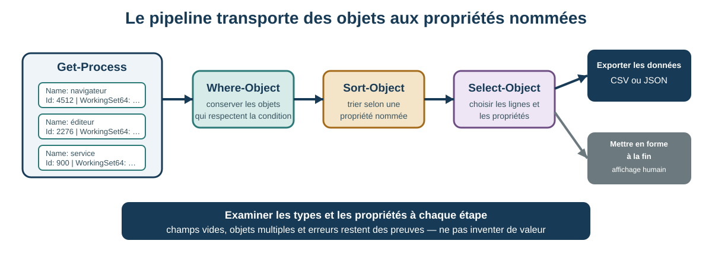

# Séance 15 - De la commande au script : automatiser avec PowerShell

## But de la séance

Dans plusieurs laboratoires, vous avez déjà utilisé PowerShell pour observer le processeur, la mémoire, le stockage, les périphériques et le réseau. Jusqu'ici, PowerShell a surtout été un outil d'inspection : une commande répondait à une question précise.

Cette séance marque une transition. Vous vous préparez à travailler avec des systèmes Windows et Windows Server où PowerShell devient aussi un **outil d'administration et d'automatisation**. Une ou un administrateur ne veut pas répéter manuellement la même série de commandes sur dix postes, recopier des résultats à la main ou dépendre de sa mémoire pour effectuer toujours les mêmes vérifications.

Un **script** conserve une procédure afin qu'elle puisse être relue, modifiée, répétée et vérifiée.

La question centrale est donc :

> **Comment passer de commandes interactives à un petit script PowerShell reproductible, tout en comprenant ce qu'il observe, ce qu'il pourrait modifier et dans quel contexte d'autorisation il s'exécute?**

Les postes de laboratoire utilisent Windows Server 2022 et peuvent permettre une élévation administrative. Les activités exigées dans cette séance restent volontairement non destructives et ne nécessitent pas l'élévation. L'objectif est d'apprendre la méthode avant d'utiliser plus tard PowerShell pour administrer des services, des comptes, des rôles serveur, le réseau et d'autres composants du système.

## Objectifs

À la fin de la séance et du laboratoire associé, vous devriez être en mesure de :

- distinguer terminal, shell, commande, applet de commande, pipeline et script;
- expliquer la place de PowerShell dans l'administration de Windows et Windows Server;
- distinguer une session PowerShell ordinaire d'une session élevée;
- reconnaître qu'une élévation augmente les actions autorisées sans changer le langage PowerShell;
- utiliser `Get-Command` et `Get-Help` pour découvrir une commande;
- examiner le type, les propriétés et les méthodes d'un objet avec `Get-Member`;
- expliquer que le pipeline PowerShell transmet généralement des objets structurés;
- filtrer, trier et sélectionner des objets et leurs propriétés;
- utiliser des variables et des commentaires;
- créer un fichier `.ps1`, l'inspecter, l'exécuter, le modifier et le réexécuter;
- compléter un objet de rapport à partir d'un modèle;
- utiliser une condition `if` fournie pour traiter une valeur non rapportée;
- exporter des données en CSV et JSON puis les réimporter pour vérifier leur structure;
- distinguer les opérations d'observation des opérations susceptibles de modifier le système;
- traiter les erreurs et les limites comme des preuves utiles plutôt que comme une invitation à contourner une politique.

!!! info "Portée de la séance"
    **À maîtriser aujourd'hui :** terminal, shell, script `.ps1`, objet, type, propriété, pipeline, filtre, tri, sélection, variable, commentaire, objet personnalisé, export, vérification, exécution d'un script et distinction entre session ordinaire et session élevée.

    **À maîtriser avec un modèle fourni :** condition `if`, propriété calculée et traitement d'une valeur non rapportée.

    **À reconnaître aujourd'hui :** méthode, boucle `foreach`, `try`/`catch`, paramètres d'erreur, verbes de modification comme `Set`, `New`, `Remove`, `Start` et `Stop`, politique d'exécution et automatisation à distance.

    **Pour aller plus loin après le lien du laboratoire :** Windows PowerShell 5.1 et PowerShell 7, fonctions, boucles, gestion d'erreurs plus complète, modules, remoting et principes de scripts administratifs répétables.

## Problème d'ouverture : dix postes, une méthode

Vous devez relever le processeur, la mémoire, le stockage, le système d'exploitation et le réseau de dix postes Windows.

Une collecte manuelle peut produire :

- des champs oubliés;
- des unités différentes;
- des noms de colonnes incohérents;
- des erreurs de copie;
- des commandes exécutées dans un ordre différent;
- une démarche difficile à reproduire ou à auditer.

Un script peut appliquer la même procédure à chaque poste. Mais l'automatisation ne rend pas automatiquement une procédure correcte. Un mauvais script peut répéter une mauvaise hypothèse dix fois plus vite.

La compétence importante est donc double :

```text
rendre la procédure reproductible
               +
conserver une interprétation prudente des résultats
```

## PowerShell dans le travail d'administration

PowerShell a été conçu pour l'administration et l'automatisation. Les mêmes principes que nous utilisons aujourd'hui pour **observer** un poste servent plus tard à administrer Windows et Windows Server.

Quelques familles de tâches typiques sont :

| Besoin administratif | Exemples d'outils PowerShell à rencontrer |
|---|---|
| Examiner les processus et services | `Get-Process`, `Get-Service` |
| Interroger le matériel et Windows | `Get-CimInstance` |
| Examiner le réseau | `Get-NetAdapter`, `Get-NetIPConfiguration` |
| Lire des journaux | `Get-WinEvent` |
| Gérer des services | `Start-Service`, `Stop-Service`, `Set-Service` |
| Gérer des comptes ou groupes | cmdlets de comptes locaux ou d'Active Directory selon l'environnement |
| Administrer des rôles serveur | modules propres aux rôles installés |
| Administrer plusieurs machines | PowerShell Remoting, sessions et commandes à distance |

La plupart de ces tâches avancées ne sont **pas** exigées dans C12. Elles montrent cependant pourquoi il est utile de comprendre les objets, le pipeline, les scripts et le contexte d'exécution dès maintenant.

!!! warning "Reconnaître une commande n'est pas une permission de l'exécuter"
    Dans cette séance, nous pouvons nommer des cmdlets qui modifient un système afin de reconnaître leur rôle futur. N'exécutez pas une commande de modification simplement parce qu'elle apparaît dans la documentation ou dans un exemple.

## Terminal, shell, commande et script

| Terme | Rôle |
|---|---|
| **Terminal** | application ou fenêtre qui affiche et transmet l'entrée-sortie d'un shell |
| **Shell** | programme qui lit des commandes et lance des opérations |
| **Commande** | instruction donnée au shell |
| **Applet de commande** (*cmdlet*) | commande PowerShell spécialisée, souvent nommée sous la forme verbe-nom |
| **Pipeline** | chaîne de traitement qui transmet des objets d'une commande à l'autre |
| **Script** | fichier ou bloc qui conserve des instructions pour les réexécuter |

Windows PowerShell 5.1 utilise généralement `powershell.exe`. PowerShell 7 utilise `pwsh.exe`. Les deux partagent une grande partie du langage, mais leurs modules, certaines fonctionnalités et certains comportements peuvent différer.

<figure markdown="span">
  { loading=lazy width="820" }
  <figcaption>Windows Terminal est une application de terminal capable d'héberger différents shells. La fenêtre n'est donc pas le shell lui-même. Capture : Ghettoblaster, <a href="https://commons.wikimedia.org/wiki/File:Windows_Terminal_Preview_Screenshot.png">Wikimedia Commons</a>, <a href="https://creativecommons.org/publicdomain/zero/1.0/">CC0 1.0</a>.</figcaption>
</figure>

!!! question "Vérification : terminal ou shell?"
    Ouvrir Windows Terminal puis choisir un profil PowerShell ne signifie pas que « Windows Terminal est PowerShell ». Le terminal fournit l'interface; PowerShell est le shell et le langage exécuté dans cette interface.

## Session ordinaire et session élevée

Windows peut exécuter PowerShell avec les droits normaux de votre compte ou dans un processus **élevé** après approbation du contrôle de compte d'utilisateur (UAC).

L'élévation ne transforme pas PowerShell en un autre langage :

```text
même langage PowerShell
+ mêmes principes d'objets et de pipeline
+ davantage d'opérations autorisées par Windows
= davantage de conséquences possibles
```

Certaines tâches d'administration nécessitent une élévation. D'autres n'en ont pas besoin. Une bonne pratique consiste à utiliser le niveau de privilège nécessaire à la tâche, pas le niveau maximal disponible par habitude.

!!! note "Accès administrateur disponible ≠ élévation requise"
    Vous pourrez disposer d'un accès administrateur sur les postes Windows Server 2022. Les activités exigées aujourd'hui sont toutefois conçues pour fonctionner sans élévation. Si une commande d'observation fonctionne dans une session ordinaire, il n'y a aucun avantage pédagogique à l'exécuter avec plus de privilèges.

## Lire les verbes comme un premier indice

Les cmdlets PowerShell suivent souvent une convention **verbe-nom**.

```text
Get-Process
Get-Service
Set-Service
Start-Service
Stop-Service
Remove-Item
```

Le verbe donne un premier indice :

- `Get` est souvent associé à la lecture ou à l'observation;
- `Set`, `New`, `Remove`, `Start`, `Stop`, `Enable` ou `Disable` indiquent souvent une action qui peut changer un état.

Mais **le nom du verbe n'est pas une analyse de sécurité complète**. Avant une commande inconnue :

1. identifiez-la avec `Get-Command`;
2. consultez `Get-Help` et la documentation officielle;
3. vérifiez ses paramètres;
4. déterminez ce qu'elle lit ou modifie;
5. vérifiez si la tâche demande une élévation;
6. n'exécutez la modification que si elle fait partie du travail demandé.

## Pourquoi PowerShell travaille avec des objets

Une différence fondamentale avec de nombreux shells historiques est que PowerShell transmet généralement des **objets structurés**, pas uniquement du texte affiché.

Un objet peut contenir :

- un type;
- des propriétés;
- des méthodes;
- une représentation d'affichage qui ne montre qu'une partie de ses données.

```text
objet
├── type
├── propriétés : valeurs descriptives
└── méthodes : actions possibles
```

Cette structure est particulièrement utile pour l'administration : une commande peut produire des objets service, processus, disque ou interface réseau, puis une autre commande peut filtrer directement une propriété de ces objets.

## Découvrir une commande

### `Get-Command`

```powershell
Get-Command Get-Service
Get-Command -Verb Get -Noun Service
```

`Get-Command` aide à trouver ce qui existe dans l'environnement courant.

### `Get-Help`

```powershell
Get-Help Get-Service
Get-Help Get-Service -Examples
Get-Help Get-Service -Full
```

L'aide locale peut être incomplète ou plus ancienne que la documentation en ligne. Elle reste un bon premier arrêt pour comprendre les paramètres et les exemples.

!!! question "Avant d'exécuter une commande inconnue"
    Si vous trouvez `Restart-Service`, quel est le prochain geste responsable? Consultez son aide et déterminez son effet et ses paramètres avant de l'exécuter. Le nom suggère une modification, mais la documentation confirme ce que la commande fera réellement.

## Examiner un objet avec `Get-Member`

```powershell
Get-Process | Get-Member
```

`Get-Member` révèle le type des objets et leurs membres.

- une **propriété** décrit une valeur, comme `Name`, `Id` ou `WorkingSet64`;
- une **méthode** représente une action possible.

!!! warning "Observer une méthode sans l'exécuter"
    Dans ce cours, relevez le nom d'une méthode pour reconnaître le concept, mais ne l'appelez pas sur un processus ou un objet système simplement pour « voir ce qui arrive ».

La table affichée à l'écran ne représente pas nécessairement toutes les propriétés de l'objet.

## Le pipeline : transmettre des objets

```powershell
Get-Process |
    Sort-Object WorkingSet64 -Descending |
    Select-Object -First 10 Name, Id, WorkingSet64
```

1. `Get-Process` produit des objets processus;
2. `Sort-Object` les trie selon `WorkingSet64`;
3. `Select-Object` conserve les dix premiers et choisit certaines propriétés.



### Filtrer avec `Where-Object`

```powershell
Get-Process |
    Where-Object WorkingSet64 -gt 100MB
```

Le filtre conserve les objets dont la propriété `WorkingSet64` dépasse la valeur indiquée.

### Propriété calculée : lire un modèle fourni

```powershell
Get-Process |
    Select-Object Name,
        @{Name='MemoireMiB'; Expression={[math]::Round($_.WorkingSet64 / 1MB, 1)}}
```

Dans le bloc `Expression`, `$_` représente l'objet actuellement traité. Vous n'avez pas à mémoriser cette syntaxe complète; vous devez pouvoir expliquer le modèle et modifier prudemment un nom ou une valeur fourni.

## Données et mise en forme

```powershell
Get-Process | Format-Table Name, Id
```

`Format-Table` prépare un affichage destiné à une personne. Il ne devrait généralement pas précéder une commande d'exportation de données.

Préférez :

```powershell
Get-Process |
    Select-Object Name, Id |
    Export-Csv -Path .\processus.csv -NoTypeInformation -Encoding UTF8
```

Le principe est : **transformer les données d'abord, formater la présentation à la fin**.

## Les variables et les commentaires

Une variable conserve une valeur ou une collection :

```powershell
$Processus = Get-Process
$Processus.Count
```

Des noms descriptifs facilitent la relecture :

```powershell
$SystemeExploitation
$MemoireTotaleOctets
$AdaptateurActif
```

Un commentaire commence par `#` :

```powershell
# Recueillir les renseignements de base du poste
$Ordinateur = Get-CimInstance Win32_ComputerSystem
```

Un bon commentaire explique l'intention, une hypothèse ou une raison. Il ne répète pas simplement le code en français.

## Votre premier fichier `.ps1` : un parcours complet

Lire « placez vos commandes dans un fichier `.ps1` » n'est pas la même chose que savoir créer et exécuter un script. Voici le parcours complet.

### Étape 1 — créer un dossier de travail

```powershell
$Dossier = Join-Path $HOME 'C12-PowerShell'
New-Item -ItemType Directory -Path $Dossier -Force
Set-Location $Dossier
Get-Location
```

Le script restera dans votre espace utilisateur plutôt que dans un dossier système.

### Étape 2 — créer le fichier dans un éditeur de texte

```powershell
notepad.exe .\mon-premier-script.ps1
```

Si Windows demande de créer le fichier, acceptez. Dans l'éditeur, saisissez :

```powershell
# Produire un résumé minimal de cette session PowerShell
$NomPoste = $env:COMPUTERNAME
$VersionPS = $PSVersionTable.PSVersion
$Moment = Get-Date

[pscustomobject]@{
    Poste = $NomPoste
    PowerShell = $VersionPS.ToString()
    ExecuteA = $Moment
}
```

Enregistrez le fichier comme **texte brut** avec l'extension `.ps1`, puis fermez l'éditeur.

### Étape 3 — vérifier ce qui a réellement été enregistré

```powershell
Get-ChildItem .\mon-premier-script.ps1
Get-Content .\mon-premier-script.ps1
```

Cette étape permet de confirmer le nom du fichier et son contenu avant de l'exécuter.

!!! warning "Attention à `.ps1.txt`"
    Selon l'éditeur et les options d'affichage de Windows, un fichier peut sembler nommé `mon-premier-script.ps1` alors que son nom réel se termine par `.ps1.txt`. `Get-ChildItem` permet de vérifier ce que PowerShell voit réellement.

### Étape 4 — exécuter le script explicitement

```powershell
.\mon-premier-script.ps1
```

Pourquoi `\.\`?

PowerShell ne recherche pas automatiquement le dossier courant comme emplacement de commande de la même façon que certains shells historiques. `.` signifie **le dossier courant**, et `\` introduit le chemin vers le fichier.

```text
.\mon-premier-script.ps1
│ └─────────────── fichier
└─ dossier courant
```

### Étape 5 — modifier, sauvegarder et réexécuter

Rouvrez le fichier :

```powershell
notepad.exe .\mon-premier-script.ps1
```

Ajoutez par exemple une propriété :

```powershell
Utilisateur = $env:USERNAME
```

Sauvegardez, puis réexécutez :

```powershell
.\mon-premier-script.ps1
```

Vous venez de suivre le cycle fondamental :

```text
écrire
→ inspecter
→ exécuter
→ observer le résultat ou l'erreur
→ modifier
→ réexécuter
```

### Étape 6 — si le script ne s'exécute pas

Ne commencez pas par changer la configuration du système.

1. lisez le message exact;
2. vérifiez le nom et le chemin du fichier;
3. vérifiez `Get-ExecutionPolicy -List`;
4. conservez l'erreur dans votre compte rendu;
5. utilisez la solution de rechange indiquée par l'enseignant si une politique gérée bloque l'exécution.

Une politique d'exécution PowerShell est une **fonction de sécurité et de prévention des erreurs**, mais Microsoft précise qu'elle n'est pas une frontière de sécurité qui empêche un utilisateur autorisé de toutes les actions possibles. Dans un environnement administré, elle doit être respectée plutôt que contournée.

## Du prototype interactif au script administrable

La démarche recommandée est :

```text
1 commande interactive
       ↓ vérifier
ajouter un filtre ou une transformation
       ↓ vérifier
stocker dans une variable
       ↓ vérifier
assembler dans un fichier .ps1
       ↓ exécuter et relire
ajouter sortie, validation et commentaires
       ↓
script reproductible
```

Cette méthode évite de copier un long script opaque puis de tenter de comprendre plusieurs erreurs simultanément.

## Construire un objet de rapport

```powershell
$Ordinateur = Get-CimInstance Win32_ComputerSystem
$Systeme = Get-CimInstance Win32_OperatingSystem

$Rapport = [pscustomobject]@{
    NomPoste = $env:COMPUTERNAME
    Fabricant = $Ordinateur.Manufacturer
    Modele = $Ordinateur.Model
    Systeme = $Systeme.Caption
    MemoireGiB = [math]::Round($Ordinateur.TotalPhysicalMemory / 1GB, 1)
}

$Rapport
```

`[pscustomobject]` crée un objet dont les propriétés sont choisies pour le rapport. Le script peut ensuite exporter **cet objet structuré** au lieu d'essayer de récupérer du texte mis en forme à l'écran.

## Décrire une valeur non rapportée

Un champ vide ne prouve pas qu'une composante est absente.

```powershell
if ([string]::IsNullOrWhiteSpace($Ordinateur.Model)) {
    $Modele = 'Non rapporté'
}
else {
    $Modele = $Ordinateur.Model
}
```

La condition choisit un chemin selon un test. `Non rapporté` décrit la preuve disponible sans inventer une conclusion.

## Une solution de rechange complète

Certaines commandes peuvent être absentes ou restreintes.

```powershell
$NomAdaptateur = 'Non rapporté'

if (Get-Command Get-NetAdapter -ErrorAction SilentlyContinue) {
    $Adaptateur = Get-NetAdapter |
        Where-Object Status -eq 'Up' |
        Select-Object -First 1

    if ($null -ne $Adaptateur) {
        $NomAdaptateur = $Adaptateur.Name
    }
}
```

Vous utiliserez des modèles de ce type au laboratoire. L'objectif est d'apprendre à les **lire, vérifier et adapter**, pas de concevoir immédiatement une infrastructure complète de gestion d'erreurs.

## Exporter et réimporter

### CSV

```powershell
$Rapport |
    Export-Csv -Path .\rapport-systeme.csv -NoTypeInformation -Encoding UTF8

$CsvRelu = Import-Csv .\rapport-systeme.csv
$CsvRelu
$CsvRelu | Get-Member
```

CSV convient bien aux données tabulaires. Après `Import-Csv`, les valeurs sont généralement relues comme du texte.

### JSON

```powershell
$Rapport |
    ConvertTo-Json |
    Set-Content -Path .\rapport-systeme.json -Encoding UTF8

$JsonRelu = Get-Content -Raw .\rapport-systeme.json |
    ConvertFrom-Json

$JsonRelu | Get-Member
$JsonRelu
```

JSON conserve plus naturellement une structure de propriétés. Dans les deux cas, **une commande sans erreur ne prouve pas que le fichier contient ce que vous vouliez**. Réimportez et vérifiez.

## Erreurs : signal, contexte et prochaine action

Une erreur PowerShell peut indiquer :

- un nom de commande inconnu;
- un paramètre invalide;
- un fichier ou chemin absent;
- un objet qui n'a pas la propriété attendue;
- une permission insuffisante;
- une politique d'exécution;
- un module ou une fonctionnalité absente;
- une panne réelle du système interrogé.

Le bon réflexe n'est pas « obtenir une console administrateur et réessayer ». Il faut d'abord demander :

> **Quelle hypothèse cette erreur vient-elle de réfuter?**

Par exemple, `Access is denied` peut indiquer que l'opération exige un autre contexte d'autorisation. Cela ne prouve pas que l'élévation est toujours la bonne solution; la commande elle-même pourrait être inappropriée au travail demandé.

## Vers les scripts d'administration : répétabilité et conséquences

Un script administratif peut être exécuté plusieurs fois. Il faut donc penser à ce qui se passe **au deuxième passage**.

Considérez ces deux intentions :

```text
« créer le dossier C:\Rapports »
« s'assurer que le dossier C:\Rapports existe »
```

La deuxième formulation invite à vérifier l'état avant d'agir. Cette propriété est liée à l'idée d'**idempotence** : lorsque c'est possible, une procédure d'administration devrait produire un état prévisible même si elle est réexécutée.

Vous n'avez pas à maîtriser ce concept aujourd'hui. Retenez plutôt la question professionnelle :

> Si ce script est exécuté une deuxième fois, que va-t-il changer?

## Synthèse intégrée

PowerShell permet de transformer une observation manuelle en procédure reproductible :

```text
besoin administratif
→ choisir le contexte de privilèges approprié
→ découvrir et comprendre les commandes
→ produire des objets
→ inspecter leurs propriétés
→ filtrer, trier et sélectionner
→ tester les étapes interactivement
→ enregistrer les étapes dans un .ps1
→ produire une sortie structurée
→ réimporter et vérifier
→ conserver erreurs et limites
```

L'automatisation améliore la cohérence et l'échelle. Elle augmente aussi l'importance de vérifier la commande **avant** de la répéter.

## Erreurs fréquentes à éviter

- **Confondre le terminal et PowerShell.** Identifiez l'application de terminal et le shell qu'elle héberge.
- **Croire que le pipeline transmet seulement le texte affiché.** Examinez les objets avec `Get-Member`.
- **Exécuter une méthode simplement parce qu'elle apparaît dans `Get-Member`.** Reconnaissez-la avant de décider si elle est appropriée.
- **Utiliser `Format-Table` avant l'exportation.** Transformez et exportez les données, puis formatez l'affichage.
- **Copier un long script sans tester les étapes.** Construisez et vérifiez progressivement.
- **Enregistrer accidentellement un fichier `.ps1.txt`.** Vérifiez le nom avec `Get-ChildItem`.
- **Taper seulement le nom du script et supposer que PowerShell cherchera le dossier courant.** Utilisez un chemin explicite comme `.\script.ps1`.
- **Interpréter une valeur vide comme une absence.** Indiquez « Non rapporté » et cherchez une autre preuve.
- **Utiliser l'élévation comme première solution à toute erreur.** Identifiez d'abord la cause et l'effet de la commande.
- **Modifier la politique d'exécution pour faire fonctionner un exercice.** Respectez la politique gérée et utilisez la solution de rechange prévue.
- **Supposer qu'un script PowerShell 7 fonctionne nécessairement en Windows PowerShell 5.1.** Vérifiez version, modules et syntaxe.

## Ce qu'il faut retenir

- PowerShell est un shell et un langage d'automatisation orienté vers l'administration des systèmes.
- Un terminal peut héberger PowerShell; le terminal et le shell sont deux couches différentes.
- Une session élevée possède davantage d'autorité, mais utilise le même langage PowerShell.
- L'accès administrateur ne signifie pas qu'il faut travailler constamment avec élévation.
- `Get-Command`, `Get-Help` et `Get-Member` soutiennent la découverte et l'inspection.
- Le pipeline transmet généralement des objets structurés.
- `Where-Object`, `Sort-Object` et `Select-Object` transforment une collection.
- Un fichier `.ps1` est un fichier texte contenant des instructions PowerShell; créez-le, inspectez-le, exécutez-le avec un chemin explicite, puis améliorez-le par petites étapes.
- `[pscustomobject]` permet de construire une sortie structurée adaptée à un rapport.
- Une valeur non rapportée doit rester une incertitude, pas devenir une conclusion inventée.
- Les exports doivent être réimportés et vérifiés.
- Une erreur doit être interprétée avant de changer les permissions ou la configuration.
- Les mêmes fondations serviront plus tard à l'administration de Windows Server, des services, des comptes, du réseau et de plusieurs machines.

## Passer à la pratique

Le [Laboratoire 15](../laboratoires/laboratoire-15.md) vous demandera d'appliquer cette progression : examiner l'environnement, construire et expliquer des pipelines, recueillir des objets système, compléter un rapport structuré, exporter et réimporter les résultats, puis assembler les blocs testés dans un fichier `rapport-systeme.ps1`.

## Pour aller plus loin

### Windows PowerShell 5.1 et PowerShell 7

Windows PowerShell 5.1 et PowerShell 7 peuvent coexister. PowerShell 7 utilise `pwsh.exe` et évolue séparément de Windows PowerShell. Comparez toujours :

```powershell
$PSVersionTable
```

avant d'attribuer une différence au script lui-même.

### Boucles

Une boucle permet d'appliquer une opération à plusieurs objets :

```powershell
foreach ($Service in Get-Service | Select-Object -First 5) {
    $Service.Name
}
```

Le principe est important pour l'administration à grande échelle, mais vous n'avez pas à construire des scripts complexes avec `foreach` dans le parcours exigé.

### Gestion d'erreurs

PowerShell offre notamment `-ErrorAction` et `try`/`catch` pour contrôler certains comportements d'erreur. Ces outils deviennent importants lorsqu'un script doit poursuivre proprement une collecte sur plusieurs machines.

### Fonctions, modules et remoting

À mesure qu'un script grandit, des **fonctions** permettent de regrouper des opérations réutilisables. Les **modules** regroupent des commandes liées à un produit ou un rôle. **PowerShell Remoting** permet d'exécuter des commandes dans des sessions sur d'autres machines lorsque l'environnement est configuré pour le permettre.

Ces mécanismes seront plus pertinents dans les cours d'administration ultérieurs. C12 fournit le socle : comprendre les commandes, les objets, le pipeline, le contexte d'exécution et la transformation d'une procédure testée en script reproductible.

## Sources techniques de référence

- [Microsoft Learn - PowerShell documentation](https://learn.microsoft.com/powershell/)
- [Microsoft Learn - about Execution Policies](https://learn.microsoft.com/powershell/module/microsoft.powershell.core/about/about_execution_policies)
- [Microsoft Learn - PowerShell 101](https://learn.microsoft.com/powershell/scripting/learn/ps101/)
- [Microsoft Learn - about Scripts](https://learn.microsoft.com/powershell/module/microsoft.powershell.core/about/about_scripts)
- [Microsoft Learn - Get-Command](https://learn.microsoft.com/powershell/module/microsoft.powershell.core/get-command)
- [Microsoft Learn - Get-Help](https://learn.microsoft.com/powershell/module/microsoft.powershell.core/get-help)
- [Microsoft Learn - Get-Member](https://learn.microsoft.com/powershell/module/microsoft.powershell.utility/get-member)
