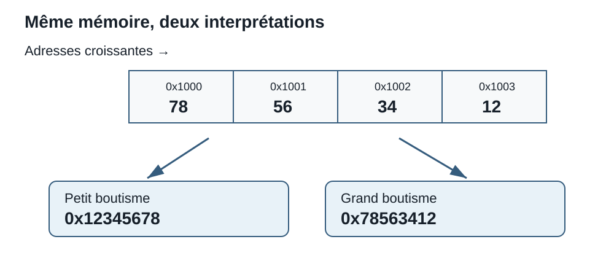

# Séance 3 - Représentation interne des données et boutisme

## But de la séance

À la Séance 2, nous avons appris à écrire une même valeur en bases 2, 10 et 16. Une suite de bits ne précise toutefois pas, à elle seule, ce qu'elle représente.

Par exemple, l'octet `11110000` peut être interprété comme :

- l'entier non signé `240`;
- l'entier signé `-16` en complément à deux;
- une composante de couleur;
- une partie d'un nombre à virgule, d'un caractère, d'un son ou d'une instruction.

Le système doit connaître la **largeur**, le **type**, l'**encodage** et parfois l'**ordre des octets**. Cette séance étudie ces conventions et introduit IEEE 754 simple précision. La procédure complète d'encodage et de décodage se trouve dans une autoformation obligatoire après le lien du laboratoire.

## Objectifs

### Parcours principal

À la fin du parcours principal, vous devriez être en mesure de :

- distinguer un bit d'un octet et les préfixes décimaux des préfixes binaires;
- déterminer la capacité et la plage d'un entier de largeur fixe, puis encoder ou décoder des entiers non signés et signés en complément à deux;
- expliquer les rôles du signe, de l'exposant et de la fraction dans IEEE 754 simple précision;
- distinguer un caractère, un point de code Unicode et son encodage en octets;
- reconstruire une valeur multi-octet en gros-boutiste ou en petit-boutiste;
- choisir une interprétation à partir de la largeur, du type, de l'encodage et de l'ordre des octets;
- montrer une démarche vérifiable plutôt qu'un résultat isolé.

### Autoformation obligatoire

Après l'autoformation obligatoire, vous devriez également être en mesure de construire et de décoder un nombre IEEE 754 normalisé, fini et de simple précision.

!!! info "Portée de la séance"
    **À maîtriser aujourd'hui :** unités, largeur fixe, plages, entiers non signés, complément à deux, organisation générale d'IEEE 754, texte, Unicode, UTF-8, boutisme et choix d'une interprétation.

    **En autoformation obligatoire après le lien du laboratoire :** fractions binaires, construction, approximation, arrondi et décodage IEEE 754 simple précision.

    **Non exigé :** construction manuelle du zéro signé, des valeurs subnormales, des infinis, des valeurs `NaN` et du format 64 bits.

## Les bits ont besoin d'un contexte

Une configuration de bits ne contient pas automatiquement son type. Le programme, le format de fichier ou le protocole fournit les règles d'interprétation.

| Information nécessaire | Question correspondante |
|---|---|
| Largeur | Combien de bits ou d'octets appartiennent à la valeur? |
| Type | S'agit-il d'un entier, d'un réel, d'un caractère ou d'autre chose? |
| Convention | L'entier est-il signé? Quel encodage représente le texte? |
| Ordre des octets | Quel octet d'une valeur multi-octet vient en premier? |

!!! question "Une configuration, plusieurs sens"
    Considérez `01000001`.

    1. Quelle est sa valeur comme entier non signé?
    2. Quel caractère ASCII utilise ce code?
    3. Ces deux interprétations se contredisent-elles?
    4. Quelle information permettrait de choisir la bonne interprétation?

La réponse à la troisième question est non. Les bits sont identiques; les règles utilisées pour les lire sont différentes.

## Bits, octets et préfixes

Un **bit**, symbole `b`, est un chiffre binaire. Un **octet**, symbole `B` dans plusieurs documents techniques anglophones, contient huit bits.

`1 octet = 8 bits`

La majuscule est importante :

- `100 Mb/s` décrit normalement cent mégabits par seconde;
- `100 MB` décrit normalement cent mégaoctets.

### Préfixes décimaux et binaires

Deux familles de préfixes coexistent.

| Famille | Symbole | Multiplicateur | Exemple |
|---|---|---:|---:|
| Décimale, SI | kB | 103 = 1 000 octets | 1 kB = 1 000 octets |
| Décimale, SI | MB | 106 = 1 000 000 octets | 1 MB = 1 000 kB |
| Décimale, SI | GB | 109 = 1 000 000 000 octets | 1 GB = 1 000 MB |
| Binaire, IEC | KiB | 210 = 1 024 octets | 1 KiB = 1 024 octets |
| Binaire, IEC | MiB | 220 = 1 048 576 octets | 1 MiB = 1 024 KiB |
| Binaire, IEC | GiB | 230 = 1 073 741 824 octets | 1 GiB = 1 024 MiB |

!!! warning "Ko, Mo et Go peuvent être ambigus"
    En français, des documents et interfaces utilisent parfois `Ko`, `Mo` et `Go` pour des multiples de 1 024, même si les préfixes IEC précis sont `Kio`, `Mio` et `Gio`. D'autres utilisent les mêmes abréviations pour les multiples décimaux.

    Lorsque la convention n'est pas explicitée, demandez-la. Dans une démarche, écrivez le multiplicateur utilisé.

## La largeur fixe

Une valeur conservée dans un système possède une largeur déterminée. Une largeur de `n` bits fournit exactement 2n configurations.

| Largeur | Configurations | Chiffres hexadécimaux |
|---:|---:|---:|
| 4 bits | 16 | 1 |
| 8 bits | 256 | 2 |
| 16 bits | 65 536 | 4 |
| 32 bits | 4 294 967 296 | 8 |

Une représentation minimale peut omettre les zéros situés complètement à gauche. Une représentation de largeur fixe doit les conserver.

`45``10` = `101101``2`

Sur huit bits : `00101101``2`

La largeur ne change pas la valeur lorsque celle-ci entre dans le contenant. Elle précise les positions disponibles et permet de déterminer la plage représentable.

## Les entiers non signés

Dans un entier **non signé**, toutes les configurations représentent zéro ou une valeur positive.

Pour `n` bits :

`minimum = 0`

`maximum = 2``n`` - 1`

| Largeur | Minimum | Maximum |
|---:|---:|---:|
| 4 bits | 0 | 15 |
| 8 bits | 0 | 255 |
| 16 bits | 0 | 65 535 |

Pour encoder un entier non signé :

1. vérifiez qu'il se trouve dans la plage permise;
2. convertissez-le en binaire;
3. ajoutez des zéros à gauche jusqu'à la largeur imposée;
4. regroupez par quatre si une réponse hexadécimale est demandée.

Exemple sur huit bits :

`150``10` = `10010110``2` = `96``16`

!!! warning "Une valeur hors plage n'a pas de représentation valide dans cette largeur"
    `300` ne peut pas être représenté comme entier non signé sur huit bits, car la plage se termine à `255`.

    Certains systèmes ou langages peuvent tronquer ou ramener une valeur dans la plage. Ce comportement ne transforme pas `300` en une représentation huit bits exacte. Les opérations, retenues et débordements seront étudiés à la Séance 5.

## Les entiers signés

Un entier **signé** doit représenter des valeurs négatives, zéro et des valeurs positives. Les systèmes modernes utilisent couramment le **complément à deux**.

Pour `n` bits :

`minimum = -2``n - 1`

`maximum = 2``n - 1`` - 1`

| Largeur | Minimum | Maximum |
|---:|---:|---:|
| 4 bits | -8 | 7 |
| 8 bits | -128 | 127 |
| 16 bits | -32 768 | 32 767 |

La plage négative contient une valeur de plus que la plage positive. Sur huit bits, `-128` existe, mais `+128` n'existe pas comme entier signé.

??? info "Pourquoi ne pas conserver simplement un signe séparé?"
    Une convention pourrait réserver le bit de gauche à un signe et conserver la grandeur dans les autres bits. Cette méthode créerait toutefois deux représentations de zéro, `00000000` et `10000000`, et demanderait des règles différentes pour plusieurs additions.

    Le complément à deux organise plutôt les configurations comme un compteur qui revient au début après sa valeur maximale. Sur huit bits, ajouter `1` à `11111111` produit `00000000`; la configuration `11111111` joue donc naturellement le rôle de `-1`. Inverser les bits d'une grandeur puis ajouter `1` permet de trouver la configuration négative correspondante. Cette convention conserve un seul zéro et permet au même circuit d'addition d'être utilisé pour les entiers positifs et négatifs.

### Le bit le plus significatif

Dans une représentation en complément à deux, le bit situé complètement à gauche permet de reconnaître le signe :

- `0` indique une valeur positive ou nulle;
- `1` indique une valeur négative.

Il ne faut toutefois pas simplement retirer ce bit et convertir le reste. Une façon directe d'interpréter un entier signé consiste à donner au bit de gauche la valeur négative `-2``n - 1`, tandis que les autres positions conservent leurs valeurs positives.

Sur huit bits :

`11110000``2` = `-128 + 64 + 32 + 16 = -16`

La même configuration interprétée sans signe vaut plutôt `240`.

## Produire un complément à deux

Pour représenter un entier négatif sur une largeur imposée :

1. vérifiez que la valeur entre dans la plage signée;
2. convertissez sa valeur absolue en binaire;
3. complétez avec des zéros jusqu'à la largeur imposée;
4. inversez chaque bit;
5. ajoutez `1` au résultat, en conservant exactement la largeur imposée.

Exemple : représenter `-37` sur huit bits.

| Étape | Résultat |
|---|---|
| Valeur absolue de 37 | `00100101` |
| Bits inversés | `11011010` |
| Ajouter 1 | `11011011` |
| Hexadécimal | `DB` |

Donc :

`-37``10` = `11011011``2` = `DB``16` sur huit bits signés.

### Décoder une valeur négative

Pour décoder une configuration signée dont le bit de gauche vaut `1`, vous pouvez :

- utiliser directement le poids négatif du bit de gauche; ou
- inverser les bits, ajouter `1`, convertir la grandeur obtenue, puis appliquer le signe négatif.

Exemple : `10010110` sur huit bits signés.

| Étape | Résultat |
|---|---|
| Bits reçus | `10010110` |
| Bits inversés | `01101001` |
| Ajouter 1 | `01101010` |
| Grandeur décimale | `106` |
| Valeur signée | `-106` |

!!! question "Même octet, deux entiers"
    Interprétez `10001101` comme :

    1. un entier non signé de huit bits;
    2. un entier signé de huit bits.

    Expliquez pourquoi les réponses diffèrent même si aucun bit n'a changé.

## Comment représenter des valeurs fractionnaires ou décimales?

Jusqu'ici, nous avons surtout représenté des entiers comme `-3`, `0` et `42`. De nombreuses quantités du monde réel se trouvent toutefois entre deux entiers : `12,34 $`, une taille de `1,72 m`, une masse de `68,4 kg` ou la fraction `1/3`.

Ces valeurs n'ont pas toutes les mêmes besoins :

| Type de valeur | Exemple | Besoin de représentation |
|---|---|---|
| Profondeur fixe | `12,34 $` dans un compte bancaire | Le système peut réserver exactement deux chiffres pour les cents. |
| Profondeur variable | une taille ou une masse | `1,7 m`, `1,72 m` et `1,723 m` peuvent convenir selon la précision de la mesure. |
| Profondeur infinie | `1/3 = 0,333...` | Aucun nombre fini de chiffres décimaux ne représente exactement la valeur. Il faut l'arrondir ou conserver la fraction sous une autre forme. |

Une première solution consiste à décider à l'avance combien de positions se trouvent à droite du séparateur. Par exemple, le nombre entier `1234` pourrait représenter `12,34 $` si les deux dernières positions désignent toujours les cents. Il s'agit d'une représentation à **virgule fixe**. Elle convient bien lorsque toutes les valeurs utilisent la même profondeur, mais elle devient moins pratique lorsque leur taille ou la précision nécessaire varie beaucoup.

Une autre solution s'inspire de la notation scientifique. Dans `1,72 × 10``0` et `1,72 × 10``6`, les mêmes chiffres significatifs peuvent décrire des valeurs d'ordres de grandeur très différents parce qu'un exposant déplace le séparateur. Une représentation à **virgule flottante** conserve de façon comparable des chiffres significatifs et un exposant.

La mémoire demeure finie : une virgule flottante ne peut donc pas conserver une infinité de chiffres. Elle représente exactement certaines valeurs et en rapproche d'autres. Nous présentons maintenant l'organisation générale d'IEEE 754. Les positions fractionnaires et les procédures complètes seront travaillées dans l'autoformation obligatoire.

!!! note "Point ou virgule?"
    En français, on écrit habituellement `3,5`. Les langages de programmation, les formats techniques et plusieurs outils informatiques utilisent plutôt le point : `3.5`. Dans les exemples binaires de ce cours, le point sépare également la partie entière de la partie fractionnaire. Il ne représente pas une multiplication.

## IEEE 754 simple précision

Le format IEEE 754 **simple précision** utilise 32 bits pour représenter un nombre à virgule flottante.

| Champ | Largeur | Rôle |
|---|---:|---|
| Signe | 1 bit | `0` positif, `1` négatif |
| Exposant décalé | 8 bits | Exposant réel + 127 |
| Fraction | 23 bits | Bits situés après le `1` initial de la forme normalisée |

Disposition :

`S EEEEEEEE FFFFFFFFFFFFFFFFFFFFFFF`

Pour les nombres normalisés étudiés ici, la forme mathématique est :

`(-1)``S`` × 1.F × 2``E - 127`

Le `1` placé avant la fraction est implicite : il n'est pas conservé dans les 23 bits du champ fraction.

??? info "Pourquoi un 1 implicite et un exposant décalé?"
    Un nombre binaire normalisé non nul commence toujours par `1`. Il n'existe aucun autre chiffre binaire possible à cette position. IEEE 754 peut donc omettre ce `1` prévisible et consacrer les 23 bits du champ aux chiffres qui le suivent; le `1` est replacé lors du décodage.

    L'exposant réel peut être négatif ou positif. Au lieu de lui appliquer le complément à deux, le format ajoute `127` et conserve un exposant décalé non signé. Par exemple, l'exposant réel `-3` devient `124`, tandis que `+3` devient `130`. Les configurations extrêmes du champ restent ainsi disponibles pour le zéro, les valeurs subnormales, les infinis et les valeurs `NaN`.

!!! note "Limite de l'introduction IEEE 754"
    Nous travaillons avec les nombres normalisés de simple précision. Le zéro signé, les valeurs subnormales, les infinis, les valeurs `NaN` et le format 64 bits seront distingués dans la documentation, mais leur construction manuelle n'est pas exigée ici.

!!! danger "IMPORTANT — préparation obligatoire à l'examen"
    IEEE 754 peut être évalué à l'examen final. Vous devez compléter l'autoformation et les exercices autocorrigés du Laboratoire 3 avant la séance de révision de l'examen.

    La portée exigée est limitée aux valeurs **finies, normalisées et de simple précision**. La construction manuelle du zéro signé, des valeurs subnormales, des infinis, des valeurs `NaN` et du format 64 bits n'est pas exigée.

## Représenter du texte

À la Séance 1, le routeur interactif manipulait des lettres comme `A`, `B` ou `C`. Nous avions choisi ces symboles pour observer des instructions et des états sans encore demander comment une lettre devient des bits.

Un seul octet offre 256 configurations. Cela suffit pour les lettres latines non accentuées, les chiffres et plusieurs symboles, mais les systèmes d'écriture humains comprennent bien plus que quelques centaines de caractères. Unicode répertorie aujourd'hui bien au-delà de cent mille caractères : alphabets, syllabaires, idéogrammes, signes scientifiques, symboles historiques et pictogrammes. Une convention d'encodage doit relier chacun de ces caractères abstraits à une séquence d'octets.

Un caractère abstrait n'est pas la même chose que son code ou que les octets utilisés pour l'enregistrer.

| Niveau | Exemple pour A |
|---|---|
| Caractère | `A` |
| Point de code Unicode | `U+0041` |
| Octet UTF-8 | `41``16` |

### ASCII et Unicode

ASCII définit 128 codes, de `0` à `127`, notamment :

- lettres latines non accentuées;
- chiffres;
- ponctuation;
- espace et caractères de contrôle comme la tabulation et le saut de ligne.

Unicode attribue des points de code à un ensemble beaucoup plus vaste de caractères. UTF-8 transforme ces points de code en séquences d'un à quatre octets.

Les 128 premiers codes UTF-8 sont identiques à ASCII. Ainsi :

- `A` devient l'octet `41`;
- le saut de ligne `LF` devient `0A`;
- `é` devient les deux octets `C3 A9` en UTF-8.

!!! warning "Un caractère n'occupe pas toujours un octet"
    Cette règle fonctionne pour les caractères ASCII encodés en UTF-8, mais pas pour tout Unicode. Comptez les octets de l'encodage demandé, pas seulement les caractères visibles.

## Images, sons et autres données

Le même principe s'étend au reste de l'information numérique :

- une image associe des valeurs à des pixels et à leurs composantes de couleur;
- un son associe des valeurs à des échantillons pris dans le temps;
- une instruction associe une configuration de bits à une opération;
- un format de fichier précise comment lire ses différentes zones.

Cette séance ne demande pas de mémoriser les formats d'image ou de son. L'idée importante est que les bits prennent un sens grâce à une convention connue.

## Le boutisme : l'ordre des octets

Une valeur de plus d'un octet doit préciser quel octet vient en premier.

Considérons la valeur de 32 bits :

`0x12345678`

Ses quatre octets sont `12`, `34`, `56` et `78`.

| Convention | Ordre des octets, de la première position à la dernière |
|---|---|
| Gros-boutiste, *big-endian* | `12 34 56 78` |
| Petit-boutiste, *little-endian* | `78 56 34 12` |

En gros-boutiste, l'octet le plus significatif vient en premier. En petit-boutiste, l'octet le moins significatif vient en premier.

### Où rencontre-t-on ces conventions aujourd'hui?

Les ordinateurs personnels contemporains utilisent presque tous l'ordre petit-boutiste. Les processeurs x86-64 l'utilisent, et les systèmes ARM présents dans de nombreux portables, téléphones et appareils personnels fonctionnent habituellement dans ce mode. Pour une personne qui inspecte la mémoire d'un PC moderne, le petit-boutisme constitue donc le cas le plus fréquent.

Le gros-boutisme reste toutefois important :

- les protocoles Internet emploient traditionnellement un **ordre réseau** gros-boutiste pour plusieurs valeurs multi-octets;
- les environnements d'ordinateurs centraux IBM utilisent une architecture gros-boutiste;
- certains microcontrôleurs, systèmes embarqués, périphériques et formats de données imposent un ordre gros-boutiste;
- des processeurs ou outils peuvent prendre en charge plusieurs modes, même si un produit particulier en choisit un par défaut.

Il ne faut donc pas deviner l'ordre à partir du type d'appareil seulement. La documentation du processeur, du protocole ou du format demeure l'autorité.

!!! warning "Le boutisme ne renverse pas les bits dans chaque octet"
    L'octet `78` reste `01111000`. Le petit-boutisme change la position des octets dans une valeur multi-octet; il ne transforme pas `78` en `1E` et ne lit pas les bits de droite à gauche.

### Ce qui change et ce qui ne change pas

- Une valeur d'un seul octet n'est pas affectée par le boutisme.
- Une valeur de 16, 32 ou 64 bits peut être affectée.
- Le protocole ou le format doit préciser l'ordre attendu.
- Les octets d'un texte UTF-8 suivent l'ordre défini par UTF-8; on ne renverse pas un fichier texte entier parce que le processeur est petit-boutiste.

Les adresses mémoire et l'emplacement précis des valeurs seront étudiés à la Séance 4. Pour le moment, nous nous concentrons sur la reconstruction correcte d'une valeur à partir d'une suite d'octets.

<figure markdown="span">
  { loading=lazy width="900" }
  <figcaption>Schéma de synthèse créé pour C12. Il sert de repère conceptuel; les spécifications réelles doivent toujours être vérifiées dans la documentation du matériel.</figcaption>
</figure>

## Synthèse intégrée : choisir la bonne interprétation

| Situation | Questions à poser |
|---|---|
| Entier de largeur fixe | Combien de bits? Signé ou non signé? |
| Nombre à virgule | Quel format et quelle précision? |
| Texte | Quel encodage? Combien d'octets par caractère? |
| Valeur multi-octet | Gros-boutiste ou petit-boutiste? |
| Valeur inconnue | Quel programme, format ou protocole définit son sens? |

## Erreurs fréquentes à éviter

### Oublier de vérifier la plage

La conversion binaire d'une grandeur ne prouve pas qu'elle entre dans la largeur et le type demandés.

### Appliquer le complément à deux à un entier non signé

Le complément à deux est une convention pour les entiers signés. Une valeur négative ne possède pas de représentation non signée valide.

### Oublier le 1 implicite en IEEE 754

Pour un nombre normalisé, le champ fraction conserve seulement les bits après le premier `1`. Le décodage doit replacer ce `1`.

### Utiliser l'exposant réel directement

Le champ de huit bits conserve `e + 127`, pas simplement `e`.

### Confondre un point de code et ses octets

`U+00E9` identifie le caractère `é`; les octets UTF-8 correspondants sont `C3 A9`.

### Renverser les bits au lieu des octets

Le boutisme réordonne les octets complets d'une valeur multi-octet.

## Ce qu'il faut retenir

- Les bits ont besoin d'un type et d'une convention pour prendre un sens.
- La largeur fixe détermine la capacité et la plage.
- Un entier non signé de `n` bits va de `0` à `2ⁿ - 1`.
- Un entier signé en complément à deux va de `-2ⁿ⁻¹` à `2ⁿ⁻¹ - 1`.
- Les fractions binaires utilisent des puissances négatives de deux.
- IEEE 754 simple précision utilise 1 bit de signe, 8 bits d'exposant décalé et 23 bits de fraction.
- Certaines fractions décimales doivent être approximées en binaire.
- UTF-8 peut utiliser plusieurs octets pour un seul caractère.
- Le boutisme détermine l'ordre des octets, pas l'ordre des bits dans un octet.

## Passer à la pratique

[Poursuivre avec le Laboratoire 3 - Interpréter les représentations internes](../laboratoires/laboratoire-3.md)

## Autoformation obligatoire : IEEE 754 simple précision

Cette autoformation fait partie de la préparation à l'examen. Elle est réalisée en dehors du parcours principal de la séance afin de protéger le temps consacré aux entiers, au complément à deux, au texte et au boutisme.

Complétez les activités autocorrigées correspondantes dans le Laboratoire 3 et conservez votre démarche. Apportez vos questions en classe avant la séance de révision de l'examen.

!!! danger "IMPORTANT — contenu potentiellement évalué"
    Vous devez savoir construire et décoder des valeurs IEEE 754 **finies, normalisées et de simple précision**, y compris lorsqu'il faut d'abord remettre des octets dans l'ordre logique.

### Les positions fractionnaires en binaire

La numération positionnelle continue à droite du séparateur. Les exposants deviennent négatifs.

| Position | 20 | 2-1 | 2-2 | 2-3 | 2-4 |
|---:|---:|---:|---:|---:|---:|
| Valeur | 1 | 1/2 | 1/4 | 1/8 | 1/16 |

Par exemple :

`10.101``2` = `2 + 1/2 + 1/8 = 2.625``10`

#### Convertir une fraction décimale

Pour convertir une partie fractionnaire décimale en binaire :

1. multipliez la fraction par `2`;
2. conservez la partie entière obtenue, `0` ou `1`;
3. recommencez avec la nouvelle partie fractionnaire;
4. lisez les parties entières dans l'ordre où elles ont été produites.

Exemple avec `0.625` :

| Calcul | Bit produit | Nouvelle fraction |
|---|:---:|---:|
| 0.625 × 2 = 1.25 | 1 | 0.25 |
| 0.25 × 2 = 0.5 | 0 | 0.5 |
| 0.5 × 2 = 1.0 | 1 | 0 |

Donc `0.625``10` = `0.101``2`.

Certaines fractions ne se terminent pas. Par exemple, `0.1` en base 10 produit une suite binaire répétitive. Une largeur fixe doit alors conserver une approximation.

### Construire un IEEE 754 de 32 bits

Procédure complète :

1. déterminez le bit de signe;
2. convertissez la partie entière en binaire;
3. convertissez la partie fractionnaire en binaire;
4. réunissez les deux parties et normalisez sous la forme `1.F × 2``e`;
5. calculez l'exposant décalé `E = e + 127`, puis écrivez-le sur huit bits;
6. retirez le `1` initial et complétez ou arrondissez la fraction à 23 bits;
7. assemblez le signe, l'exposant et la fraction;
8. regroupez les 32 bits par quatre pour produire huit chiffres hexadécimaux.

#### Exemple complet : -13.25

**1. Signe**

La valeur est négative : `S = 1`.

**2 et 3. Conversion binaire**

`13``10` = `1101``2`

`0.25``10` = `0.01``2`

Donc `13.25``10` = `1101.01``2`.

**4. Normalisation**

`1101.01``2` = `1.10101 × 2``3`

L'exposant réel est `e = 3`.

**5. Exposant décalé**

`E = 3 + 127 = 130`

`130``10` = `10000010``2`

**6. Fraction sur 23 bits**

Nous retirons le `1` initial de `1.10101` :

`10101000000000000000000`

**7. Assemblage**

`1 10000010 10101000000000000000000`

Sans espaces :

`11000001010101000000000000000000`

**8. Hexadécimal**

`1100 0001 0101 0100 0000 0000 0000 0000`

`C1540000``16`

Donc la représentation IEEE 754 simple précision de `-13.25` est `0xC1540000`.

### Approximation et arrondi

Lorsque la fraction binaire se termine avant 23 bits, ajoutez des zéros à droite. Lorsqu'elle continue, il faut choisir la valeur représentable la plus proche selon la règle d'arrondi demandée.

Le mode IEEE 754 habituel est **au plus proche, égalité vers le bit pair**. Il faut donc conserver des bits supplémentaires avant de décider si la fraction de 23 bits doit être augmentée. La règle simplifiée « le prochain bit vaut 1, donc toujours arrondir vers le haut » échoue dans certains cas d'égalité exacte.

Pour une démarche vérifiable :

1. produisez plus de 23 bits de fraction;
2. séparez les 23 bits conservés des bits rejetés;
3. indiquez la règle d'arrondi appliquée;
4. montrez toute retenue causée par l'arrondi;
5. acceptez que la valeur reconstruite puisse différer légèrement de la valeur décimale originale.

!!! question "Pourquoi 0.1 pose-t-il problème?"
    `0.1` possède une écriture finie en base 10, mais une écriture répétitive en base 2. Un champ de 23 bits ne peut pas conserver une suite infinie. Le système enregistre donc une valeur binaire voisine.

    Cette approximation explique certains résultats surprenants dans les calculs financiers, les comparaisons d'égalité et les accumulations répétées.

### Décoder un IEEE 754

Pour revenir d'une représentation de 32 bits vers la valeur décimale :

1. convertissez l'hexadécimal en 32 bits, si nécessaire;
2. séparez le signe, les huit bits d'exposant et les 23 bits de fraction;
3. convertissez l'exposant en base 10 et soustrayez `127`;
4. replacez le `1` implicite devant la fraction;
5. appliquez la puissance de deux en déplaçant le séparateur ou en développant les positions;
6. appliquez le signe.

#### Exemple : 0x41280000

`0x41280000` = `01000001001010000000000000000000``2`

Séparation :

`0 10000010 01010000000000000000000`

- signe : `0`, donc positif;
- exposant stocké : `10000010``2` = `130`;
- exposant réel : `130 - 127 = 3`;
- significande : `1.0101``2`.

`1.0101 × 2``3` = `1010.1``2`

`1010.1``2` = `8 + 2 + 1/2 = 10.5``10`

Donc `0x41280000` représente `10.5`.

!!! warning "Comparer des résultats à virgule flottante en programmation"
    Dans un cours de programmation, vous pourriez calculer une valeur qui devrait mathématiquement être `0.3`, puis découvrir que sa représentation conservée est légèrement supérieure ou inférieure. Une comparaison qui demande si deux résultats à virgule flottante sont **exactement égaux** peut alors échouer même si les valeurs sont suffisamment proches pour le problème étudié.

    La solution habituelle consiste à comparer l'écart entre les valeurs avec une **tolérance** appropriée, ou à utiliser une fonction de comparaison approximative fournie par le langage ou sa bibliothèque. La tolérance doit tenir compte de l'échelle et des exigences du problème; il ne faut pas choisir une constante au hasard pour tous les calculs.
