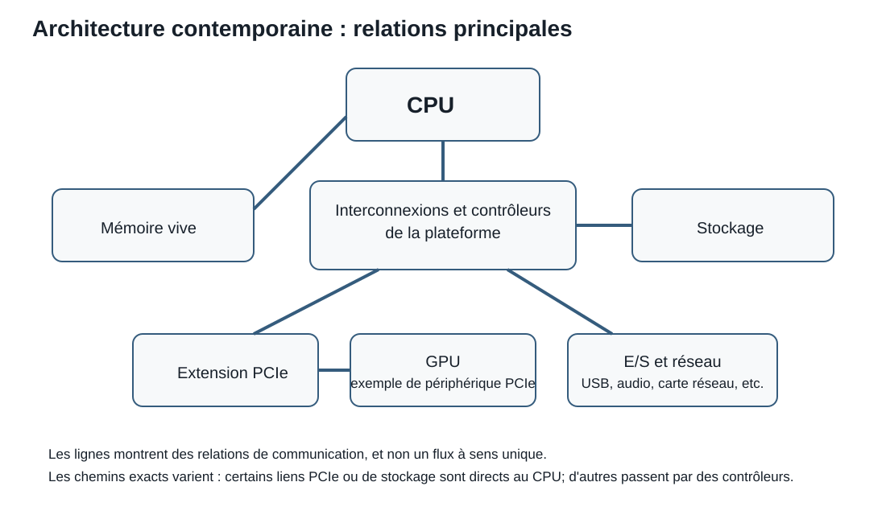

# Séance 4 - Mémoire adressable et architecture des micro-ordinateurs

## But de la séance

À la Séance 1, nous avons décrit un ordinateur comme un système qui représente de l'information, conserve un état et suit des instructions. À la Séance 3, nous avons vu qu'une même suite de bits peut représenter un entier, un réel, du texte ou autre chose selon le type et la convention.

### Une énigme pour commencer

Vous appuyez sur la touche `C` et, presque aussitôt, la lettre apparaît à l'écran. Mais où est passée l'information entre ces deux événements?

- Le clavier a-t-il envoyé directement la lettre à l'écran?
- Le processeur conserve-t-il lui-même tous les caractères?
- Où les bits représentant `C` ont-ils attendu?
- Comment les différents composants ont-ils su où les envoyer?

Formulez une première hypothèse. Nous reprendrons le même trajet à la fin de la séance avec un vocabulaire plus précis.

Il faut d'abord situer les bits dans une machine réelle :

> Où une valeur est-elle conservée, comment le processeur la retrouve-t-il et par quels chemins se déplace-t-elle?

Cette séance relie les représentations internes à l'organisation physique d'un micro-ordinateur. Elle distingue les couches visibles d'un composant, introduit la mémoire adressable et explique le rôle de la hiérarchie mémoire, des contrôleurs et des bus.

## Objectifs

À la fin de cette séance, vous devriez être en mesure de :

- distinguer les couches physiques d'un composant et les rôles généraux d'un CPU, d'un GPU, d'un microcontrôleur, d'un SoC et d'un SoM;
- classer registres, cache, RAM et stockage secondaire dans une hiérarchie, puis expliquer la volatilité de la RAM;
- distinguer une adresse mémoire du contenu conservé et suivre les adresses hexadécimales de cases consécutives;
- déterminer et interpréter les cases occupées par une valeur multi-octet selon sa largeur, son type et son boutisme;
- distinguer les rôles des bus d'adresses, de données et de contrôle ainsi que ceux des contrôleurs et interfaces;
- suivre une lecture simplifiée entre la mémoire et un registre du processeur;
- expliquer, dans un modèle introductif, le trajet d'une information depuis une touche du clavier jusqu'à l'affichage.

!!! question "Questions directrices"
    1. **Qu'est-ce que c'est physiquement?** Une carte, un boîtier, une puce ou un connecteur?
    2. **Où l'information est-elle conservée?** Dans un registre, la cache, la RAM ou le stockage?
    3. **Comment se déplace-t-elle?** Par quelles interconnexions, sous le contrôle de quels composants?

!!! info "Portée de la séance"
    **À maîtriser aujourd'hui :** PCB, boîtier, puce, CPU, registre, RAM, stockage, adresse, contenu, largeur, boutisme et rôles des trois bus.

    **À reconnaître aujourd'hui :** GPU, MCU, SoC, SoM, PCIe, USB, SATA, NVMe, *northbridge* et *southbridge*. Ces termes seront approfondis lorsqu'ils deviendront nécessaires.

    **Non exigé :** mémoriser le fonctionnement électrique détaillé des interfaces ou les protocoles complets des bus cités.

## Retour au programme enregistré

Dans le modèle de von Neumann, les **instructions** et les **données** peuvent se trouver dans la même mémoire. Leur apparence physique est identique : ce sont des configurations de bits. Le contexte indique si une configuration doit être exécutée comme instruction ou interprétée comme valeur.

??? info "Rappel : chercher, décoder, exécuter"
    À la Séance 1, nous avons résumé le cycle d'instruction en trois actions :

    1. **Chercher (*fetch*)** : l'unité de contrôle obtient en mémoire la prochaine instruction et la place dans un **registre**, une minuscule zone de stockage temporaire située dans le processeur.
    2. **Décoder (*decode*)** : elle interprète l'opération demandée et repère les données, registres ou adresses concernés.
    3. **Exécuter (*execute*)** : le processeur réalise l'opération, ce qui peut modifier un registre, lire ou écrire en mémoire ou commander un autre composant.

    Le cycle recommence ensuite avec l'instruction suivante. Chercher une **instruction** et exécuter une instruction `LOAD` qui cherche une **donnée** sont deux transferts distincts.

Nous verrons plus loin comment une instruction `LOAD` fait parvenir une donnée de la RAM à l'un de ces registres. Pour la suivre, nous devons d'abord distinguer :

- l'endroit où la valeur est conservée;
- le numéro qui permet de retrouver cet endroit;
- le composant qui demande la lecture;
- les chemins empruntés par l'adresse, la commande et la valeur.

## Du système visible à la puce de silicium

Le mot **composant** est général. Il peut désigner une pièce complète installée dans un ordinateur, un circuit intégré soudé à une carte ou un élément situé à l'intérieur d'une puce.

### La carte de circuit imprimé

Une **carte de circuit imprimé**, ou **PCB** (*printed circuit board*), est le support rigide qui porte les composants et les relie par des pistes conductrices. La carte mère est un grand PCB; une carte graphique, une barrette de mémoire et un SSD peuvent également posséder leur propre PCB.

Une vue moderne très simplifiée ressemble plutôt à ceci :

```text
CPU ───── RAM
 │
 ├──── GPU ou autres périphériques rapides
 │
 └──── contrôleur d'entrées-sorties ──── USB, stockage, réseau, audio…
```

Les détails varient, mais plusieurs fonctions autrefois réparties entre des circuits distincts sont maintenant intégrées au CPU ou à d'autres contrôleurs.

<div class="image-callouts" style="--image-width: 768px;">
  

  <span class="image-callout image-callout--line-bottom" tabindex="0" style="--x: 14%; --y: 12%; --line-offset: 66%; --line-length: 108px; --line-angle: 63deg;">
    Emplacements de RAM
    <span class="image-callout__tooltip">Ces logements reçoivent les barrettes de mémoire vive situées à gauche du connecteur du processeur.</span>
  </span>

  <span class="image-callout image-callout--line-right" tabindex="0" style="--x: 21%; --y: 54%; --line-offset: 35%; --line-length: 76px; --line-angle: -40deg;">
    Connecteur du CPU
    <span class="image-callout__tooltip">Le connecteur du processeur reçoit son boîtier et assure les connexions électriques entre le CPU et la carte mère.</span>
  </span>

  <span class="image-callout image-callout--line-bottom" tabindex="0" style="--x: 43%; --y: 10%; --line-offset: 73%; --line-length: 118px; --line-angle: 76deg;">
    Emplacements de RAM
    <span class="image-callout__tooltip">Cette deuxième banque de mémoire montre que plusieurs barrettes peuvent entourer le connecteur du processeur sur une carte mère de station de travail.</span>
  </span>

  <span class="image-callout image-callout--line-bottom" tabindex="0" style="--x: 68%; --y: 11%; --line-offset: 65%; --line-length: 73px; --line-angle: 78deg;">
    Dissipateur du chipset
    <span class="image-callout__tooltip">Le dissipateur recouvre ici un circuit de contrôle important de la carte mère et aide à évacuer sa chaleur.</span>
  </span>

  <span class="image-callout image-callout--line-bottom" tabindex="0" style="--x: 87%; --y: 27%; --line-offset: 55%; --line-length: 28px; --line-angle: 90deg;">
    Connecteurs de stockage
    <span class="image-callout__tooltip">Ces connecteurs servent à relier des périphériques de stockage, par exemple des disques ou d'autres supports internes.</span>
  </span>

  <span class="image-callout image-callout--line-right" tabindex="0" style="--x: 8%; --y: 79%; --line-offset: 30%; --line-length: 69px; --line-angle: -18deg;">
    Entrées-sorties arrière
    <span class="image-callout__tooltip">On y trouve les ports accessibles à l'arrière du boîtier, notamment pour l'audio, l'USB, le réseau et d'autres interfaces.</span>
  </span>

  <span class="image-callout image-callout--line-top" tabindex="0" style="--x: 49%; --y: 77%; --line-offset: 75%; --line-length: 49px; --line-angle: -49deg;">
    Emplacements PCIe
    <span class="image-callout__tooltip">Ces fentes permettent d'ajouter des cartes d'extension, comme une carte graphique, une carte réseau ou un autre contrôleur.</span>
  </span>

  <span class="image-callout image-callout--line-top" tabindex="0" style="--x: 79%; --y: 77%; --line-offset: 66%; --line-length: 81px; --line-angle: -67deg;">
    Alimentation principale
    <span class="image-callout__tooltip">Ce connecteur apporte à la carte mère l'énergie fournie par le bloc d'alimentation principal.</span>
  </span>
</div>

<p class="image-callouts__caption">
  Carte mère d'une station de travail Dell Precision T3600 fabriquée en 2012, photographiée par Marcin Wieclaw (pcsite.co.uk). Son connecteur de processeur, ses emplacements de RAM, ses liaisons PCIe et ses entrées-sorties intégrées restent représentatifs de l'organisation physique générale d'une carte mère contemporaine. <a href="https://commons.wikimedia.org/wiki/File:Computer-motherboard.jpg">Wikimedia Commons</a>, <a href="https://creativecommons.org/licenses/by-sa/4.0/">CC BY-SA 4.0</a>.
</p>

??? info "Contexte historique : *northbridge* et *southbridge*"
    Le schéma suivant représente une architecture typique du milieu des années 2000. Il est utile pour voir les connexions, mais il ne constitue pas le plan de tous les ordinateurs actuels.

    { width="430" loading=lazy }

    *Schéma par Moxfyre. [Wikimedia Commons](https://commons.wikimedia.org/wiki/File:Motherboard_diagram.svg), domaine public ([Public Domain Mark 1.0](https://creativecommons.org/publicdomain/mark/1.0/)).*

    | Étiquette du schéma | Terme français |
    |---|---|
    | CPU | processeur |
    | Clock generator | générateur d'horloge |
    | Northbridge / memory controller hub | pont nord / contrôleur mémoire |
    | Southbridge / I/O controller hub | pont sud / contrôleur d'entrées-sorties |
    | RAM | mémoire vive |
    | Onboard graphics controller | contrôleur graphique intégré |
    | Flash ROM (BIOS) | mémoire flash du BIOS |
    | Super I/O | contrôleur Super I/O |
    | Front-side bus | bus frontal |
    | Memory bus | bus mémoire |
    | Internal bus | bus interne |
    | PCI bus | bus PCI |
    | LPC bus | bus LPC |
    | IDE, SATA, USB, Ethernet, audio codec, CMOS memory | IDE, SATA, USB, Ethernet, codec audio, mémoire CMOS |

### Boîtier, puce et connecteur

Un circuit intégré possède plusieurs couches qu'il ne faut pas confondre :

| Couche | Ce qu'elle est | Ce que l'on observe |
|---|---|---|
| Puce ou *die* | Petit morceau de silicium où les transistors et connexions microscopiques sont fabriqués | Habituellement caché |
| Boîtier ou *package* | Structure qui protège la puce et fournit des contacts électriques et une surface permettant de gérer la chaleur | Pièce que l'on appelle couramment « le processeur » |
| Connecteur ou *socket* | Élément de la carte mère qui reçoit un composant amovible | Levier, cadre ou contacts sur le PCB |
| PCB | Support portant le connecteur et les autres composants | Carte entière et pistes visibles |

```text
carte mère (PCB)
└── connecteur, si le composant est amovible
    └── boîtier du composant
        └── puce de silicium
```

Un composant soudé directement au PCB n'utilise pas nécessairement de connecteur. Un dissipateur thermique peut également cacher le boîtier.

??? info "Pourquoi placer la puce dans un boîtier?"
    Le silicium seul est petit et fragile. Le boîtier :

    - protège la puce;
    - relie ses minuscules connexions aux contacts utilisables par la carte;
    - aide à transmettre la chaleur vers un dissipateur;
    - facilite la fabrication, le transport et parfois le remplacement du composant.

??? question "Vérification : dans quel ordre les couches s'emboîtent-elles?"
    Du plus grand support au plus petit élément, on trouve généralement : **PCB → connecteur, s'il existe → boîtier → puce de silicium**.

    Le connecteur reste sur le PCB lorsque l'on retire un processeur amovible; la puce, elle, reste cachée dans son boîtier.

La forme physique ne nous dit toutefois pas encore **ce que le composant fait**. Passons donc des couches que l'on peut toucher aux rôles qu'elles rendent possibles.

## Plusieurs types de composants de calcul

Les catégories suivantes décrivent surtout des **rôles** et un degré d'intégration. Elles ne correspondent pas toujours à des formes physiques complètement différentes.

!!! note "Nuance : forme physique, rôle ou intégration?"
    - **Puce, boîtier, connecteur et PCB** répondent à la question : « de quelle couche physique parle-t-on? »
    - **CPU et GPU** répondent surtout à la question : « quel travail ce composant effectue-t-il? »
    - **SoC et SoM** répondent surtout à la question : « quelles fonctions sont regroupées, et sous quelle forme? »

    Ces catégories peuvent se croiser. Par exemple, un SoC est une puce possédant un rôle et placée dans un boîtier; un SoM est un petit PCB portant habituellement un SoC.

| Terme | Rôle général | Exemple d'usage |
|---|---|---|
| CPU | Exécuter des instructions générales et coordonner le système | Ordinateur personnel, serveur |
| GPU | Effectuer de nombreuses opérations similaires en parallèle, notamment pour l'image | Affichage, rendu 3D, calcul parallèle |
| Microcontrôleur, MCU | Contrôler un appareil avec processeur, mémoire et périphériques intégrés | Clavier, four à micro-ondes, capteur |
| Système sur puce, SoC | Regrouper plusieurs fonctions importantes d'un système dans un même circuit intégré | Téléphone, tablette, ordinateur monocarte |
| Système sur module, SoM | Placer un SoC et des composants de soutien sur un petit module destiné à une autre carte | Produit embarqué, prototype industriel |

??? info "SoC, SoM et microcontrôleur : quelle différence?"
    Un **microcontrôleur** vise généralement le contrôle prévisible d'un appareil et inclut les ressources nécessaires à cette tâche. Un **SoC** peut intégrer des processeurs plus puissants, des contrôleurs mémoire, un GPU, des interfaces et d'autres fonctions permettant d'exécuter un système complexe.

    Un **SoM** n'est pas seulement une puce : c'est un petit module avec un PCB qui porte habituellement un SoC, de la RAM et d'autres composants. Il se connecte ensuite à une carte porteuse qui fournit les ports et circuits propres au produit.

    Les frontières peuvent se chevaucher. La documentation du fabricant reste la source d'autorité pour un produit précis.

!!! note "Portée de cette séance"
    Nous identifions ici les rôles généraux. Les cœurs, fils d'exécution, jeux d'instructions et critères de performance seront étudiés à la Séance 5. Les compromis complets des solutions SoC seront repris à la Séance 13.

Tous ces composants traitent ou acheminent de l'information. Ils ont donc besoin de lieux où conserver les instructions, les données en cours d'utilisation et les fichiers durables.

## Pourquoi plusieurs sortes de mémoire?

Le processeur a besoin de données rapidement, mais une mémoire très rapide, très grande, persistante et peu coûteuse n'existe pas sous une seule forme. Les systèmes utilisent donc une **hiérarchie mémoire**.

| Niveau | Emplacement général | Rapidité relative | Capacité relative | Volatile? | Rôle |
|---|---|---|---|---|---|
| Registres | Dans le CPU | La plus élevée | Minuscule | Oui | Valeurs immédiatement utilisées |
| Cache | Dans ou très près du CPU | Très élevée | Petite | Oui | Copies de données probablement utiles bientôt |
| RAM | Mémoire principale | Élevée | Moyenne à grande | Oui | Programmes et données en cours d'utilisation |
| Stockage secondaire | SSD, disque ou autre support | Plus faible | Grande | Non | Fichiers et programmes conservés |

**Volatile** signifie que le contenu dépend de l'alimentation électrique. Lorsque l'ordinateur est éteint, les registres, la cache et la RAM ne conservent normalement pas leur contenu. Le stockage secondaire est conçu pour persister.

> **Règle générale :** plus une mémoire est proche du processeur, plus elle est rapide, petite et coûteuse par octet. Plus elle est éloignée, plus elle peut être grande et persistante, mais elle est généralement plus lente.

??? info "Pourquoi ne pas construire toute la mémoire comme des registres?"
    Les registres sont extrêmement proches des unités d'exécution et très rapides, mais ils occupent une surface précieuse dans le processeur. Une mémoire plus grande demande davantage de matériel et de connexions.

    La hiérarchie exploite donc la localité : une petite quantité d'information reste très près du processeur, une quantité plus grande se trouve en RAM et l'ensemble durable se trouve dans le stockage. Les données sont copiées entre les niveaux selon les besoins.

??? question "Vérification : où placer quatre informations?"
    Classez-les du niveau le plus proche du CPU au plus éloigné : un fichier enregistré, une valeur calculée maintenant, un programme en cours d'exécution et une copie réutilisée très récemment.

    **Réponse :** registre (valeur actuelle) → cache (copie récente) → RAM (programme en cours) → stockage secondaire (fichier enregistré).

La hiérarchie indique **quel genre de mémoire** utiliser. Pour retrouver un octet précis dans la RAM, il nous faut maintenant un système de repérage : les adresses.

## La RAM comme mémoire adressable

Pour notre modèle, la RAM est une longue suite de cases. Chaque case :

- possède une **adresse** unique;
- conserve un **octet**;
- est voisine de l'adresse précédente et de l'adresse suivante.

!!! note "Une adresse n'est pas le contenu"
    Une adresse répond à « où? ». Le contenu répond à « quoi? ».

    À l'adresse `0204`, le contenu pourrait être `D6`. Modifier le contenu n'oblige pas à modifier l'adresse, tout comme remplacer un objet dans un casier ne change pas le numéro du casier.

Les adresses sont habituellement écrites en hexadécimal. Elles augmentent selon les règles de la base 16 :

```text
0208, 0209, 020A, 020B, 020C, 020D, 020E, 020F, 0210
```

Après `F`, le chiffre revient à `0` et une retenue est transmise à la position suivante.

??? question "Vérification : quelle adresse vient après `020F`?"
    La réponse est `0210`. En hexadécimal, après le chiffre `F`, on revient à `0` et on ajoute une retenue à la position suivante.

### Lire un tableau mémoire

| Adresse | Contenu |
|---:|:---:|
| `0200` | `41` |
| `0201` | `42` |
| `0202` | `2A` |
| `0203` | `01` |
| `0204` | `D6` |
| `0205` | `FF` |

Chaque contenu comporte deux chiffres hexadécimaux, donc huit bits, donc un octet.

À partir de ce seul tableau :

- le contenu de l'adresse `0202` est `2A`;
- l'adresse qui suit `0205` est `0206`;
- `41 42` peut représenter deux caractères ASCII, l'entier `0x4142`, deux composantes ou autre chose;
- le tableau ne fournit pas automatiquement le type d'une valeur.

## Les valeurs multi-octets

Une valeur plus large qu'un octet occupe plusieurs adresses consécutives.

| Largeur | Nombre d'octets | Nombre de cases |
|---:|---:|---:|
| 8 bits | 1 | 1 |
| 16 bits | 2 | 2 |
| 32 bits | 4 | 4 |
| 64 bits | 8 | 8 |

Une valeur de 32 bits qui commence à l'adresse `0206` occupe :

`0206`, `0207`, `0208`, `0209`

L'adresse disponible immédiatement après est `020A`.

??? question "Vérification : quelles cases contient une valeur de 32 bits?"
    Une valeur de 32 bits commençant à l'adresse `021E` occupe quatre octets : `021E`, `021F`, `0220` et `0221`. L'adresse suivante est `0222`.

### Retrouver la valeur logique

Supposons que les cases `0202` et `0203` contiennent, dans cet ordre :

```text
Adresse  0202  0203
Octet      2A    01
```

Si le type demandé est un entier non signé de 16 bits en petit-boutiste, l'octet le moins significatif apparaît à l'adresse la plus basse. La valeur logique est donc :

`0x012A = 298`<sub>`10`</sub>

Nous réutilisons exactement les questions de la Séance 3 :

1. Quelle est l'adresse de départ?
2. Combien d'octets appartiennent à la valeur?
3. Quel est leur ordre?
4. Quel type faut-il appliquer?

!!! warning "Ne renversez pas toute la table"
    Le boutisme s'applique à chaque valeur multi-octet, pas à la mémoire entière. Il faut d'abord connaître l'adresse de départ et la largeur de la valeur.

Nous savons maintenant où se trouve une valeur et combien de cases elle occupe. Le processeur doit encore pouvoir demander cette valeur et la recevoir.

## Instructions, données et registres

Un **registre** est une minuscule zone de stockage temporaire située dans le processeur. Les unités du CPU travaillent directement avec les valeurs placées dans ces registres. Nous pouvons donc reprendre l'instruction annoncée au début de la séance.

Dans notre modèle :

```text
LOAD [0202], R1
```

produit les étapes conceptuelles suivantes :

1. le CPU demande une lecture;
2. il indique l'adresse `0202`;
3. la mémoire retourne l'octet `2A`;
4. le CPU place une copie de `2A` dans `R1`.

Le contenu original peut rester en mémoire. Le transfert fournit une copie au processeur.

Une instruction simplifiée comme :

```text
STORE R1, [0205]
```

demande plutôt d'écrire le contenu de `R1` à l'adresse `0205`.

!!! note "Ce modèle est volontairement simplifié"
    Un processeur réel utilise notamment des caches, plusieurs registres spécialisés, des adresses virtuelles, des unités de chargement et de stockage et des protocoles complexes. Le modèle conserve seulement les rôles nécessaires pour suivre une valeur.

Une opération `LOAD` exige donc trois informations : **quelle opération**, **où lire** et **quelle valeur revient**. Cette séparation nous conduit au modèle des bus.

## Bus, interconnexions et contrôleurs

Un **bus** est un mécanisme de communication partagé ou organisé qui permet à des composants d'échanger de l'information selon des règles définies.

{ width="680" loading=lazy }

*Schéma conceptuel d'un bus système, par W. Nowicki. [Wikimedia Commons](https://commons.wikimedia.org/wiki/File:Computer_system_bus.svg), [CC BY-SA 3.0](https://creativecommons.org/licenses/by-sa/3.0/).*

| Étiquette du schéma | Terme français |
|---|---|
| CPU | processeur |
| Memory | mémoire |
| Input and Output | entrées et sorties |
| Control bus | bus de contrôle |
| Address bus | bus d'adresses |
| Data bus | bus de données |

Dans le modèle classique :

| Bus | Question à laquelle il répond | Exemple pendant une lecture |
|---|---|---|
| Bus de contrôle | Quelle opération? | Lire |
| Bus d'adresses | Où? | Adresse `0202` |
| Bus de données | Quelle valeur? | Octet `2A` |

??? question "Vérification : quel bus transporte quoi?"
    Pendant la lecture de l'adresse `0202`, associez `READ`, `0202` et `2A` aux trois rôles.

    **Réponse :** `READ` est la commande du **bus de contrôle**; `0202` est l'emplacement transmis par le **bus d'adresses**; `2A` est la valeur retournée par le **bus de données**.

??? info "Un bus n'est pas nécessairement un câble visible"
    Un bus peut être représenté par des pistes sur un PCB, des connexions internes à une puce, un connecteur ou un protocole de communication.

    Le modèle des trois bus est utile pour séparer les rôles. Dans les systèmes modernes, une liaison série peut transmettre des paquets qui combinent plusieurs sortes d'information au lieu de posséder trois groupes de fils visibles et séparés.

### Contrôleurs et interfaces

Un **contrôleur** gère les détails nécessaires pour communiquer avec un composant ou un groupe de composants. Il reçoit des demandes, applique le protocole approprié et signale les résultats ou les erreurs.

Reprenons le trajet de notre touche : **USB** transporte le message du clavier. D'autres chemins servent à d'autres besoins : **PCIe** peut relier un GPU ou un SSD rapide, **SATA** est associé à de nombreux périphériques de stockage et **NVMe** définit des commandes destinées aux SSD, généralement transmises par PCIe.

Ces noms sont à **reconnaître** aujourd'hui; il n'est pas encore nécessaire d'en mémoriser toutes les caractéristiques.

| Nom | Rôle dans ce contexte |
|---|---|
| PCI Express, PCIe | Interconnexion rapide utilisée notamment par des cartes et des SSD |
| USB | Famille de connexions et protocoles pour de nombreux périphériques externes |
| SATA | Interface principalement associée aux périphériques de stockage |
| NVMe | Protocole de commande pour des SSD utilisant généralement PCIe |

Ces noms ne désignent pas tous exactement la même couche. Un connecteur physique, une liaison électrique, un protocole et un contrôleur collaborent, mais ne sont pas synonymes.

<figure markdown="span">
  { loading=lazy width="900" }
  <figcaption>Schéma de synthèse créé pour C12. Il sert de repère conceptuel; les spécifications réelles doivent toujours être vérifiées dans la documentation du matériel.</figcaption>
</figure>

## Synthèse intégrée : de la touche du clavier à l'écran

Revenons à l'hypothèse formulée au début. Le clavier n'envoie pas directement une lettre à l'écran, et le CPU ne conserve pas seul toute l'information. Une saisie simple mobilise plusieurs composants :

1. le microcontrôleur du clavier détecte une touche;
2. le contrôleur USB reçoit et transmet un message;
3. le système d'exploitation et le CPU interprètent l'événement;
4. des données et instructions sont consultées en cache ou en RAM;
5. le CPU ou le GPU prépare la modification de l'image;
6. le contrôleur d'affichage transmet le résultat à l'écran.

L'entrée, le traitement, la mémoire, le stockage et la sortie ne sont pas des machines isolées. Ce sont des rôles qui collaborent à travers des interconnexions.

À présent, nous pouvons décrire le trajet avec les trois questions directrices : le clavier, la carte mère et les puces sont des objets physiques; l'événement et les données sont conservés temporairement dans la hiérarchie mémoire; des contrôleurs et interconnexions les acheminent jusqu'aux composants qui les traitent et les affichent.

## Erreurs fréquentes à éviter

### Confondre l'adresse et le contenu

`0202` indique une case. `2A` est l'octet conservé dans cette case.

### Compter les valeurs plutôt que les octets

Une valeur de 32 bits occupe quatre cases dans notre tableau, même si elle représente un seul nombre.

### Oublier le passage de F à 0

Après `020F` vient `0210`, et non `02010`.

### Interpréter avant de connaître le type

Les octets n'indiquent pas eux-mêmes s'ils représentent du texte, un entier, un réel ou une instruction.

### Imaginer que le CPU contient toute la mémoire

Les registres et caches se trouvent dans ou près du CPU, mais la RAM et le stockage secondaire sont des niveaux distincts.

### Traiter interface, connecteur et protocole comme des synonymes

Ils participent à la même communication, mais décrivent des couches différentes.

## Ce qu'il faut retenir

### Qu'est-ce que c'est physiquement?

- Un PCB porte et relie les composants.
- Un boîtier protège une puce de silicium et la relie au système; un connecteur peut recevoir ce boîtier.
- CPU, GPU, MCU, SoC et SoM décrivent des rôles ou des niveaux d'intégration, et non une seule série de couches physiques.

### Où l'information est-elle conservée?

- La hiérarchie des registres, de la cache, de la RAM et du stockage équilibre rapidité, capacité, persistance et coût.
- Une adresse identifie une case; le contenu est l'octet conservé dans cette case.
- Une valeur multi-octet occupe plusieurs adresses; sa largeur, son type et son boutisme permettent de la reconstruire.

### Comment se déplace-t-elle?

- Les registres reçoivent les valeurs immédiatement manipulées par le CPU.
- Les bus et contrôleurs permettent aux composants d'échanger opérations, adresses et données.

## Passer à la pratique

[Continuer vers le Laboratoire 4 - Situer et déplacer les données](../laboratoires/laboratoire-4.md)
