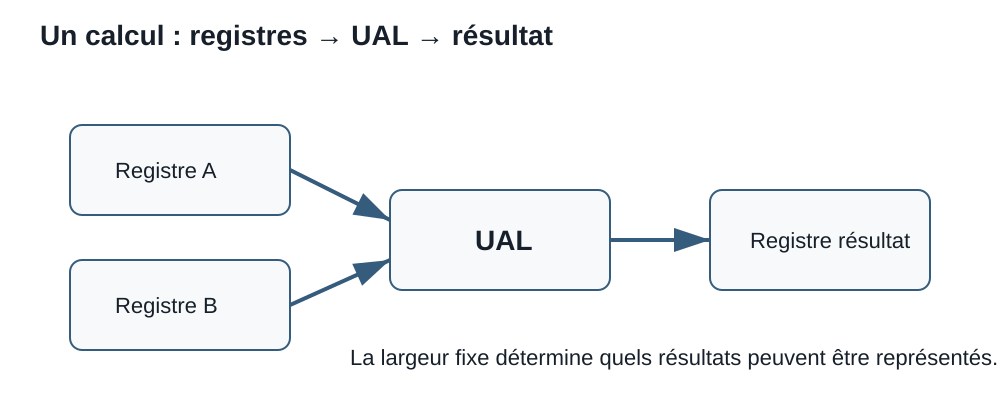

# Séance 5 - Processeur, UAL et arithmétique à largeur fixe

## But de la séance

À la Séance 4, nous avons suivi une valeur depuis une adresse en RAM jusqu'à un registre du processeur. Cette valeur peut maintenant être utilisée par une instruction.

Mais que se passe-t-il ensuite?

```text
LOAD [0202], R1
LOAD [0203], R2
ADD  R1, R2
```

Les deux premières instructions placent des valeurs dans des registres. La troisième demande au processeur d'effectuer une addition. Cette opération soulève deux questions qui guideront la séance :

> Quelle partie du processeur effectue réellement le calcul?

> Que se passe-t-il lorsque le résultat mathématique ne peut pas tenir dans le nombre de bits disponible?

Cette séance présente les principaux rôles internes du processeur, puis utilise l'**unité arithmétique et logique**, ou **UAL**, pour relier les représentations binaires des Séances 2 et 3 au fonctionnement réel d'un ordinateur. Nous étudierons l'addition à largeur fixe, les retenues, le bouclage des valeurs non signées et le débordement signé. Nous terminerons en apprenant à interpréter quelques caractéristiques courantes d'un processeur réel.

## Objectifs

À la fin de cette séance, vous devriez être en mesure de :

- distinguer le boîtier du processeur, le socket de la carte mère et les dispositions LGA et PGA;
- reconnaître les familles de sockets Intel LGA1700 et LGA1851 ainsi qu'AMD AM4 et AM5 sans confondre fabricant et compatibilité complète;
- distinguer les rôles de l'unité de contrôle, des registres, de l'UAL et de la cache, puis suivre le trajet simplifié des opérandes et du résultat;
- expliquer la largeur d'une opération, effectuer une addition binaire à largeur fixe et montrer les retenues;
- séparer la somme complète du résultat conservé et expliquer le bouclage d'un entier non signé;
- reconnaître un débordement signé, le distinguer d'une retenue finale et interpréter les principaux indicateurs d'état;
- distinguer largeur, jeu d'instructions, cœur, fil d'exécution, processeur logique, fréquence, pipeline et niveaux de cache;
- interpréter une fiche de processeur et comparer plusieurs caractéristiques selon un besoin, une plateforme et des contraintes.

!!! question "Questions directrices"
    1. **Qui dirige l'opération?** Comment l'unité de contrôle interprète-t-elle une instruction?
    2. **Où sont les opérandes?** Quels registres fournissent les valeurs à l'UAL?
    3. **Le résultat tient-il?** Comment distinguer une retenue, un bouclage et un débordement signé?

!!! info "Portée de la séance"
    **À maîtriser aujourd'hui :** unité de contrôle, registre, UAL, opérande, résultat, largeur, addition binaire, retenue, retenue finale, bouclage non signé et débordement signé.

    **À reconnaître aujourd'hui :** cœur, fil d'exécution matériel, fréquence, fréquence de base et d'accélération, pipeline, cache L1/L2/L3, jeu d'instructions, processeur logique, cœur de performance et cœur d'efficacité.

    **Non exigé :** microarchitecture détaillée, prédiction de branchement, exécution spéculative ou calcul précis des performances à partir d'une seule caractéristique.

## Une énigme pour commencer : que vient après 255?

Imaginez un compteur non signé de huit bits. Il contient actuellement :

```text
11111111
```

Cette configuration représente `255`<sub>`10`</sub>. Le processeur doit maintenant ajouter `1`.

Mathématiquement :

```text
255 + 1 = 256
```

Pourtant, un registre de huit bits ne possède que huit positions. La représentation binaire de `256` en exige neuf :

```text
1 00000000
```

Quelle valeur restera dans le registre?

!!! question "Première hypothèse"
    Sans encore effectuer l'addition complète, choisissez l'hypothèse qui vous semble la plus plausible.

    1. Le registre s'agrandit temporairement à neuf bits.
    2. Le processeur refuse toujours l'opération.
    3. Le neuvième bit est conservé ailleurs et les huit bits du registre deviennent `00000000`.
    4. Le résultat devient automatiquement un nombre négatif.

    Notez votre choix et votre justification. Nous reviendrons à ce compteur après avoir examiné l'organisation interne du processeur.

## Du processeur visible au travail effectué

Dans le langage courant, le mot **processeur** peut désigner le boîtier physique installé dans le connecteur de la carte mère. Dans cette séance, nous nous intéressons surtout aux fonctions réalisées à l'intérieur de ce boîtier.


### Boîtier, socket et disposition des contacts

Le **boîtier du processeur** est le composant manipulé lors de l'installation. Le **socket** est le connecteur mécanique et électrique correspondant sur la carte mère. Il aligne le processeur, maintient les contacts et relie ses signaux au reste de la plateforme.

Deux dispositions de contacts sont particulièrement utiles à reconnaître :

- **LGA** (*land grid array*) : les contacts à ressort se trouvent principalement dans le socket de la carte mère, tandis que le processeur présente des plages de contact planes;
- **PGA** (*pin grid array*) : les broches se trouvent principalement sous le processeur et entrent dans les ouvertures du socket.

Le nom du socket désigne une interface précise. Le nombre qui suit `LGA`, par exemple, ne constitue pas une mesure de performance : il fait partie du nom du boîtier et de son arrangement de contacts.

| Fabricant | Famille de socket de bureau | Disposition | Exemples de familles de processeurs |
|---|---|---|---|
| Intel | LGA1700 | LGA | Certains processeurs Intel Core de 12e, 13e et 14e génération |
| Intel | LGA1851 | LGA | Processeurs Intel Core Ultra de bureau série 2 |
| AMD | AM4 | PGA | Plusieurs processeurs Ryzen de générations antérieures |
| AMD | AM5 | LGA | Processeurs Ryzen récents destinés à la plateforme AM5 |

!!! warning "Le fabricant ne détermine pas le socket"
    Un processeur Intel n'est pas compatible avec toutes les cartes mères Intel, et un processeur AMD n'est pas compatible avec toutes les cartes mères AMD. Il faut faire correspondre le **socket exact**. La Séance 8 ajoutera ensuite le chipset, le micrologiciel et la liste officielle de prise en charge à cette vérification.

!!! note "Exemples, pas catalogue permanent"
    Les familles de sockets évoluent. Le tableau sert à reconnaître des exemples récents et la différence entre fabricant, famille de processeur et socket; il ne remplace pas la fiche technique du modèle exact.

Cette distinction situe physiquement le processeur. Nous pouvons maintenant examiner le travail réalisé à l'intérieur de son boîtier.

Un processeur moderne contient de très nombreux circuits. Pour comprendre une instruction, nous utiliserons un modèle volontairement simplifié :

```text
                    ┌──────────────────────────────┐
instruction ───────▶│ unité de contrôle            │
                    │          │                   │
                    │          ▼                   │
données ◀──────────▶│      registres ◀────▶ UAL    │
                    │          ▲            │      │
                    │          └── résultat ─┘      │
                    │      mémoire cache            │
                    └──────────────────────────────┘
```

Ce schéma montre des **rôles**, pas nécessairement des blocs uniques et séparés dans tous les processeurs.

### L'unité de contrôle

L'**unité de contrôle** coordonne l'exécution des instructions. Dans notre modèle, elle :

- obtient l'instruction;
- la décode;
- détermine l'opération demandée;
- sélectionne les registres ou les données concernés;
- commande les transferts nécessaires;
- dirige le résultat vers sa destination.

Elle ne remplace pas l'UAL. Elle organise l'opération et indique ce qui doit être fait.

### Les registres

Un **registre** est une très petite zone de stockage située dans le processeur. Il peut conserver temporairement :

- un opérande;
- un résultat;
- une adresse;
- une instruction;
- l'état nécessaire au contrôle de l'exécution.

Les registres sont identifiés par des noms ou des numéros définis par l'architecture du processeur. Une instruction peut préciser les registres à lire et celui qui recevra le résultat.

### L'unité arithmétique et logique

L'**unité arithmétique et logique**, ou **UAL** (*arithmetic logic unit*, ALU), effectue des opérations sur des configurations de bits.

Elle peut notamment réaliser :

| Catégorie | Exemples |
|---|---|
| Arithmétique | addition, soustraction, incrémentation, décrémentation |
| Logique | ET, OU, OU exclusif, NON |
| Comparaison | déterminer si deux valeurs sont égales ou si l'une est plus petite |
| Décalage | déplacer les bits vers la gauche ou vers la droite |

Un processeur réel peut contenir plusieurs unités d'exécution spécialisées. Le terme UAL reste néanmoins utile pour comprendre le rôle général des circuits qui réalisent les opérations entières et logiques.

### La mémoire cache

La **mémoire cache** conserve des copies de données et d'instructions susceptibles d'être utilisées bientôt. Elle réduit le nombre de fois où le processeur doit attendre une mémoire plus éloignée.

On rencontre souvent les appellations :

- **L1** : très petite et très proche des unités d'exécution;
- **L2** : plus grande, mais généralement un peu plus éloignée;
- **L3** : encore plus grande et souvent partagée entre plusieurs cœurs.

Les détails varient selon le processeur. Il ne faut donc pas supposer que tous les modèles possèdent exactement la même organisation.

!!! question "Vérification : qui fait quoi?"
    Associez chaque action au rôle principal correspondant.

    1. conserver temporairement les deux opérandes;
    2. décoder l'instruction `ADD`;
    3. produire la somme;
    4. conserver une copie récente d'une donnée provenant de la RAM.

    **Réponse :** registres → unité de contrôle → UAL → mémoire cache.

## Du cycle d'instruction à l'UAL

Reprenons une instruction simplifiée :

```text
ADD R1, R2, R3
```

Nous l'interpréterons comme :

> Additionner le contenu de `R1` et celui de `R2`, puis placer le résultat dans `R3`.

Le trajet conceptuel est le suivant :

1. l'unité de contrôle décode l'opération `ADD`;
2. elle identifie `R1` et `R2` comme registres sources;
3. les contenus de ces registres deviennent les **opérandes**;
4. l'UAL effectue l'addition;
5. le résultat à la largeur prévue est placé dans `R3`;
6. certains indicateurs d'état peuvent être mis à jour.

```text
R1 ── opérande A ──┐
                   ├──▶ UAL ── résultat ──▶ R3
R2 ── opérande B ──┘
```

!!! note "La syntaxe varie"
    Les vrais jeux d'instructions n'utilisent pas tous la même syntaxe. Certaines architectures écrivent la destination en premier, certaines utilisent deux opérandes et d'autres trois. Notre notation sert uniquement à suivre les rôles.

## Jeu d'instructions et architecture

Le **jeu d'instructions** décrit les opérations qu'un processeur peut exécuter et la façon dont les programmes les demandent. L'expression **architecture du jeu d'instructions**, ou **ISA**, décrit notamment :

- les instructions disponibles;
- les registres visibles par les programmes;
- les tailles de données prises en charge;
- la façon de coder les instructions;
- certaines règles d'adressage et d'exécution.

Des familles comme **x86-64** et **Arm** utilisent des jeux d'instructions différents. Deux processeurs compatibles avec la même ISA peuvent toutefois avoir une organisation interne et une performance différentes.

!!! warning "Architecture et modèle commercial ne sont pas synonymes"
    Le nom d'un processeur indique un produit. L'ISA indique le langage machine qu'il comprend. Plusieurs produits et plusieurs générations peuvent mettre en œuvre la même ISA.

## Largeur des données et largeur de l'opération

Une UAL ne travaille pas avec des nombres abstraits de taille illimitée. Elle travaille avec des configurations de bits dont la largeur est définie.

Dans une opération sur huit bits :

```text
opérande A : 8 bits
opérande B : 8 bits
résultat   : 8 bits
```

La somme mathématique de deux valeurs de huit bits peut toutefois exiger neuf bits.

Par exemple :

```text
  11111111
+ 00000001
----------
1 00000000
```

La somme complète contient neuf bits, mais le résultat conservé dans une destination de huit bits est seulement :

```text
00000000
```

Le bit supplémentaire est la **retenue finale** (*carry out*).

!!! note "Règle de largeur fixe"
    Pour une opération de `n` bits, la destination conserve les `n` bits les moins significatifs du résultat.

    Les bits supplémentaires ne deviennent pas automatiquement une partie de la destination. Le processeur peut toutefois signaler leur présence avec un indicateur d'état.

## Comment effectuer une addition binaire

L'addition binaire suit le même principe que l'addition décimale : on travaille de droite à gauche et on transmet une retenue à la position suivante.

### Les quatre cas fondamentaux

| A | B | Retenue entrante | Bit de somme | Retenue sortante |
|:---:|:---:|:---:|:---:|:---:|
| 0 | 0 | 0 | 0 | 0 |
| 0 | 1 | 0 | 1 | 0 |
| 1 | 0 | 0 | 1 | 0 |
| 1 | 1 | 0 | 0 | 1 |

Lorsqu'une retenue entrante vaut `1`, il faut également l'ajouter :

| A | B | Retenue entrante | Total | Bit de somme | Retenue sortante |
|:---:|:---:|:---:|---:|:---:|:---:|
| 0 | 0 | 1 | 1 | 1 | 0 |
| 0 | 1 | 1 | 2 | 0 | 1 |
| 1 | 0 | 1 | 2 | 0 | 1 |
| 1 | 1 | 1 | 3 | 1 | 1 |

En binaire :

- `0 + 0 = 0`;
- `0 + 1 = 1`;
- `1 + 1 = 10` : on écrit `0` et on retient `1`;
- `1 + 1 + 1 = 11` : on écrit `1` et on retient `1`.

### Exemple sans retenue finale

Additionnons `0101` et `0011` sur quatre bits :

```text
 retenues :  1 1
             0 1 0 1
           + 0 0 1 1
           ---------
             1 0 0 0
```

La somme est `1000`<sub>`2`</sub>, soit `8`<sub>`10`</sub>. Elle tient dans quatre bits, donc il n'y a pas de retenue finale.

### Exemple avec retenue finale

Additionnons `1110` et `0101` sur quatre bits :

```text
 retenues : 1 1 1
             1 1 1 0
           + 0 1 0 1
           ---------
           1 0 0 1 1
```

La somme mathématique complète est `10011`<sub>`2`</sub>, soit `19`<sub>`10`</sub>.

Dans une destination de quatre bits :

- le résultat conservé est `0011`;
- la retenue finale vaut `1`.

??? question "Vérification : addition à quatre bits"
    Calculez `1011 + 0110` sur quatre bits.

    1. Quelle est la somme complète?
    2. Quels quatre bits sont conservés?
    3. Existe-t-il une retenue finale?

    **Réponse :** la somme complète est `10001`; le résultat conservé est `0001`; la retenue finale vaut `1`.

## Entiers non signés et bouclage

Avec `n` bits, un entier non signé peut représenter les valeurs de `0` à `2`<sup>`n`</sup>` - 1`.

| Largeur | Minimum | Maximum | Nombre de configurations |
|---:|---:|---:|---:|
| 4 bits | 0 | 15 | 16 |
| 8 bits | 0 | 255 | 256 |
| 16 bits | 0 | 65 535 | 65 536 |

Lorsque le résultat dépasse le maximum, seuls les bits qui tiennent dans la largeur sont conservés. La valeur revient donc au début de l'intervalle. Ce comportement est appelé **bouclage** (*wraparound*).

### Le compteur de départ

```text
  11111111   255
+ 00000001     1
----------
1 00000000   256 comme somme complète
```

Sur huit bits, le registre conserve :

```text
00000000
```

Le compteur passe donc de `255` à `0`.

Ce n'est pas un résultat aléatoire. L'arithmétique non signée à `n` bits fonctionne **modulo `2`**<sup>`n`</sup>. Pour huit bits, on conserve le reste après une division par `256`.

```text
256 modulo 256 = 0
257 modulo 256 = 1
511 modulo 256 = 255
```

!!! note "Le bouclage peut être voulu ou problématique"
    Un compteur circulaire peut utiliser volontairement le bouclage. Dans un calcul de taille de fichier, de prix ou de sécurité, un bouclage non prévu peut produire une erreur grave.

### Un autre exemple

```text
  11111010   250
+ 00001010    10
----------
1 00000100   260 comme somme complète
```

Le résultat de huit bits est `00000100`, soit `4`. La retenue finale indique que la somme non signée ne tenait pas dans huit bits.

## Une même configuration, deux interprétations

À la Séance 3, nous avons vu qu'une configuration de bits n'indique pas elle-même son type.

Considérons :

```text
10000000
```

Sur huit bits, cette configuration peut représenter :

- `128` comme entier non signé;
- `-128` comme entier signé en complément à deux.

L'UAL produit des bits. L'interprétation dépend de l'instruction, du type de données et du contexte du programme.

Cette distinction explique pourquoi la retenue finale ne suffit pas à détecter toutes les erreurs possibles.

## Rappel : complément à deux

Pour un entier signé en complément à deux sur `n` bits :

- le bit le plus à gauche est le bit de signe;
- `0` indique une valeur non négative;
- `1` indique une valeur négative;
- l'intervalle va de `-2`<sup>`n-1`</sup> à `2`<sup>`n-1`</sup>` - 1`.

| Largeur | Minimum signé | Maximum signé |
|---:|---:|---:|
| 4 bits | -8 | 7 |
| 8 bits | -128 | 127 |
| 16 bits | -32 768 | 32 767 |

!!! note "Pourquoi l'intervalle n'est-il pas symétrique?"
    Sur huit bits, une configuration sert à représenter zéro. Il reste donc 255 configurations : 127 positives et 128 négatives.

    La valeur minimale possède une configuration particulière, `10000000`, alors que la valeur maximale est `01111111`.

## Débordement signé

Un **débordement signé** se produit lorsque le résultat mathématique est en dehors de l'intervalle représentable, même si l'UAL produit une configuration de bits de la largeur attendue.

### Débordement positif

```text
  01111111   127
+ 00000001     1
----------
  10000000  -128 si le résultat est interprété comme signé
```

La somme mathématique devrait être `128`, mais huit bits signés ne peuvent représenter que les valeurs de `-128` à `127`.

Il n'y a pas de retenue finale, mais il y a un débordement signé.

### Débordement négatif

```text
  10000000  -128
+ 11111111    -1
----------
1 01111111   127 dans les huit bits conservés
```

La somme mathématique devrait être `-129`, qui se trouve sous la valeur minimale représentable. Le résultat conservé ressemble donc à une valeur positive.

Dans ce cas, il existe à la fois une retenue finale et un débordement signé.

### Règle pratique pour l'addition

Pour une addition en complément à deux :

> Il y a débordement signé lorsque deux opérandes de même signe produisent un résultat de signe opposé.

| Signe de A | Signe de B | Signe du résultat | Débordement signé? |
|:---:|:---:|:---:|:---:|
| positif | positif | négatif | Oui |
| négatif | négatif | positif | Oui |
| positif | négatif | positif ou négatif | Non |
| négatif | positif | positif ou négatif | Non |

!!! warning "Deux signes différents ne débordent pas lors d'une addition"
    L'addition d'une valeur positive et d'une valeur négative rapproche généralement le résultat de zéro. Le résultat ne peut donc pas dépasser simultanément les deux extrémités de l'intervalle signé.

## Retenue finale et débordement ne sont pas la même chose

La **retenue finale** répond surtout à une question non signée :

> La somme complète exige-t-elle un bit supplémentaire?

Le **débordement signé** répond à une question signée :

> Le résultat mathématique se trouve-t-il en dehors de l'intervalle signé?

Ces deux conditions sont indépendantes.

| Addition sur 8 bits | Interprétation non signée | Interprétation signée | Retenue finale | Débordement signé |
|---|---:|---:|:---:|:---:|
| `11111111 + 00000001` | 255 + 1 → 0 | -1 + 1 → 0 | Oui | Non |
| `01111111 + 00000001` | 127 + 1 → 128 | 127 + 1 → -128 | Non | Oui |
| `10000000 + 11111111` | 128 + 255 → 127 | -128 + -1 → 127 | Oui | Oui |
| `11111110 + 00000001` | 254 + 1 → 255 | -2 + 1 → -1 | Non | Non |

??? question "Vérification : retenue ou débordement?"
    Pour chaque addition, indiquez si une retenue finale et un débordement signé se produisent.

    1. `11111111 + 00000001`
    2. `01111111 + 00000001`
    3. `10000000 + 11111111`
    4. `11111110 + 00000001`

    Comparez ensuite vos réponses au tableau précédent. La configuration produite est la même pour l'UAL; ce sont les questions posées qui changent.

## Indicateurs d'état

Après une opération, un processeur peut mettre à jour des **indicateurs d'état**, souvent appelés *flags*. Ils permettent aux instructions suivantes de savoir quelque chose sur le résultat sans refaire l'opération.

Des indicateurs courants comprennent :

| Indicateur conceptuel | Ce qu'il signale |
|---|---|
| Zéro | Le résultat conservé vaut zéro |
| Signe | Le bit de signe du résultat vaut `1` |
| Retenue | Une retenue est sortie de la position la plus significative |
| Débordement | Le résultat signé n'est pas représentable dans la largeur utilisée |

Les noms exacts et les règles détaillées varient selon l'architecture.

!!! note "Un indicateur ne comprend pas le programme"
    Un indicateur signale une condition. C'est au programme ou à l'instruction suivante de décider si cette condition est normale, attendue ou problématique.

## Et la soustraction?

Une UAL peut réaliser une soustraction directement ou en utilisant une forme d'addition avec le complément à deux.

Conceptuellement :

```text
A - B = A + (-B)
```

Par exemple, sur huit bits :

```text
5 - 3 = 5 + (-3)
```

La représentation en complément à deux de `-3` est `11111101` :

```text
  00000101    5
+ 11111101   -3
----------
1 00000010    2
```

Les huit bits conservés représentent `2`.

!!! warning "Retenue et emprunt dans une soustraction"
    Les architectures n'interprètent pas toutes l'indicateur de retenue de la même façon après une soustraction. Certaines l'utilisent pour signaler l'absence d'emprunt, d'autres présentent l'information différemment.

    Pour cette séance, nous concentrons donc l'analyse détaillée de la retenue et du débordement sur l'addition.

## Que signifie « processeur 64 bits »?

L'expression **64 bits** peut décrire plusieurs largeurs liées à l'architecture, notamment la taille de nombreux registres généraux et la largeur des opérations entières courantes.

Elle ne signifie pas que chaque circuit, chaque instruction ou chaque transfert du processeur utilise toujours exactement 64 bits.

Un processeur et un système d'exploitation 64 bits peuvent notamment :

- manipuler directement des entiers et des adresses plus larges que dans une architecture 32 bits;
- utiliser un espace d'adressage potentiel beaucoup plus grand;
- exécuter un système d'exploitation et des logiciels conçus pour cette ISA.

!!! warning "Largeur théorique et limite réelle"
    Une adresse de 64 bits permet théoriquement `2`<sup>`64`</sup> configurations différentes. Les processeurs, les systèmes d'exploitation et les cartes mères n'emploient toutefois pas nécessairement tous ces bits d'adresse.

    La quantité de RAM réellement utilisable dépend donc de plusieurs limites, et non du seul mot « 64 bits ».

Cette notion rejoint la Séance 4 : une largeur d'adresse détermine combien d'emplacements différents peuvent être identifiés, tandis qu'une largeur de donnée indique combien de bits peuvent être traités ou transférés dans un contexte donné.

## Cœur, fil d'exécution et processeur logique

Un **cœur** est une unité capable d'exécuter un flux d'instructions. Un processeur physique peut contenir plusieurs cœurs.

Certains cœurs peuvent maintenir l'état de plusieurs fils d'exécution matériels. Le système d'exploitation les présente souvent comme plusieurs **processeurs logiques**.

| Terme | Idée générale |
|---|---|
| Processeur physique | Boîtier ou composant installé dans le système |
| Cœur | Ressource d'exécution à l'intérieur du processeur |
| Fil d'exécution matériel | Contexte permettant à un cœur de faire progresser plus d'un flux d'instructions |
| Processeur logique | Ressource d'exécution visible par le système d'exploitation |

!!! warning "Deux fils ne signifient pas deux fois la performance"
    Deux fils d'exécution sur un même cœur partagent certaines ressources. Le gain dépend du logiciel, du type de travail et de la partie du processeur qui limite l'exécution.

### Cœurs de performance et d'efficacité

Certains processeurs utilisent des cœurs de types différents :

- des **cœurs de performance**, conçus pour fournir davantage de performance par fil;
- des **cœurs d'efficacité**, conçus pour accomplir le travail avec une consommation et une surface plus faibles.

Le système d'exploitation et le processeur collaborent pour attribuer les tâches. Le simple nombre total de cœurs ne décrit donc pas toute la performance.

## Fréquence et cycles d'horloge

La **fréquence** indique combien de cycles d'horloge se produisent par seconde.

- `1 MHz` = un million de cycles par seconde;
- `1 GHz` = un milliard de cycles par seconde.

Un cycle fournit un rythme commun aux circuits, mais il ne correspond pas nécessairement à une instruction complète.

Une instruction peut :

- demander plusieurs cycles;
- chevaucher son exécution avec d'autres instructions;
- attendre des données;
- être divisée en plusieurs étapes;
- utiliser une unité d'exécution différente.

!!! warning "Plus de GHz ne signifie pas automatiquement plus rapide"
    La performance dépend aussi de l'architecture, du nombre de cœurs, de la mémoire cache, de la bande passante mémoire, des limites de puissance, du refroidissement et du logiciel exécuté.

### Pipeline et exécution chevauchée

Une instruction peut être divisée en étapes, par exemple obtenir l'instruction, la décoder, obtenir les opérandes et exécuter l'opération. Un **pipeline** permet à plusieurs instructions de se trouver dans des étapes différentes au même moment.

```text
cycle 1 : instruction A — chercher
cycle 2 : instruction A — décoder    | instruction B — chercher
cycle 3 : instruction A — exécuter   | instruction B — décoder | instruction C — chercher
```

Ce chevauchement peut augmenter le débit, mais il ne garantit pas qu'une instruction complète soit terminée à chaque cycle. Une dépendance entre instructions, une donnée absente de la cache ou une décision de branchement peut ralentir le pipeline.

Certains processeurs peuvent également envoyer plusieurs opérations vers différentes unités d'exécution pendant un même cycle. Cette capacité contribue à la performance, mais elle dépend du programme et de la disponibilité des opérandes.

### Fréquence de base et fréquence d'accélération

Une fiche technique peut indiquer :

- une **fréquence de base**, associée à un fonctionnement soutenu dans certaines conditions définies;
- une **fréquence d'accélération** ou *boost*, atteignable temporairement lorsque la température, la puissance et la charge le permettent.

La fréquence maximale annoncée ne signifie pas que tous les cœurs fonctionnent toujours à cette fréquence.

## Comment lire une fiche de processeur

Une fiche technique contient de nombreuses valeurs. Il faut les relier au besoin réel plutôt que choisir automatiquement le nombre le plus élevé.

| Caractéristique | Question utile |
|---|---|
| Cœurs et fils | Le logiciel peut-il utiliser plusieurs tâches en parallèle? |
| Fréquences | Quelle performance par cœur peut-on raisonnablement attendre dans cette architecture? |
| Cache | Quelle quantité de données et d'instructions peut rester près des unités d'exécution? |
| ISA et extensions | Le système d'exploitation et les logiciels sont-ils compatibles? |
| Socket ou boîtier | Le processeur est-il physiquement et électriquement compatible avec la carte mère? |
| Mémoire prise en charge | Quels types, capacités et vitesses de RAM sont officiellement compatibles? |
| Puissance | Le refroidissement et l'alimentation conviennent-ils à la charge prévue? |
| Graphique intégré | Une carte graphique distincte est-elle nécessaire? |

### Pourquoi une comparaison demande plusieurs indices

Considérez deux processeurs fictifs :

| Caractéristique | Processeur A | Processeur B |
|---|---:|---:|
| Cœurs | 4 | 8 |
| Fréquence maximale | 4,8 GHz | 4,2 GHz |
| Cache | 12 Mo | 24 Mo |
| Puissance | 65 W | 105 W |

Ces nombres ne suffisent pas à déclarer un gagnant universel.

Il faut également connaître :

- le type de logiciel;
- le nombre de fils réellement utilisables;
- la performance de chaque cœur;
- la durée de la charge;
- le refroidissement disponible;
- le coût;
- la carte mère requise;
- les résultats de tests pertinents.

!!! question "Mini-analyse"
    Une personne utilise surtout un navigateur, une suite bureautique et des visioconférences. Une autre effectue régulièrement du rendu 3D et de la compilation.

    Expliquez pourquoi elles pourraient choisir des processeurs différents, même si un modèle possède le plus grand nombre de cœurs.

<figure markdown="span">
  { loading=lazy width="900" }
  <figcaption>Schéma de synthèse créé pour C12. Il sert de repère conceptuel; les spécifications réelles doivent toujours être vérifiées dans la documentation du matériel.</figcaption>
</figure>

## Synthèse intégrée : relier les spécifications au fonctionnement interne

Les caractéristiques commerciales décrivent des ressources qui servent finalement à exécuter des instructions :

- les **cœurs** permettent de faire progresser plusieurs flux d'instructions;
- les **fils matériels** améliorent l'utilisation de certaines ressources partagées;
- la **fréquence** fournit le rythme des opérations;
- les **caches** rapprochent les données et les instructions;
- l'**ISA** définit les opérations visibles par les programmes;
- les unités comme l'**UAL** réalisent les calculs demandés.

Aucune de ces caractéristiques n'agit seule. Une recommandation technique doit donc considérer l'ensemble du système et le travail à accomplir.

## Erreurs fréquentes à éviter

### Confondre le processeur avec l'UAL

L'UAL est une partie fonctionnelle du processeur. Le processeur contient également des registres, des unités de contrôle, des caches et d'autres unités d'exécution.

### Ajouter sans conserver la largeur

Une opération de huit bits conserve huit bits. Écrire neuf bits comme résultat dans le registre change le problème.

### Confondre une retenue intermédiaire avec la retenue finale

Une addition peut produire plusieurs retenues entre les colonnes. Seule celle qui sort de la position la plus significative est la retenue finale.

### Déduire un débordement signé à partir de la retenue seule

Une retenue finale peut exister sans débordement signé, et un débordement signé peut exister sans retenue finale.

### Interpréter les bits avant de connaître le type

`10000000` vaut `128` comme entier non signé et `-128` comme entier signé sur huit bits.

### Comparer les processeurs uniquement par la fréquence

Deux processeurs à la même fréquence peuvent accomplir une quantité de travail différente par cycle et réagir différemment à une charge soutenue.

### Additionner les fréquences des cœurs

Un processeur à huit cœurs de 4 GHz ne devient pas un processeur de 32 GHz. Les cœurs exécutent des travaux en parallèle; leurs fréquences ne s'additionnent pas de cette manière.

## Ce qu'il faut retenir

### Comment le processeur organise-t-il une opération?

- L'unité de contrôle décode et coordonne.
- Les registres fournissent les opérandes et reçoivent les résultats.
- L'UAL effectue les opérations arithmétiques et logiques.
- La mémoire cache garde des informations utiles près des unités d'exécution.

### Que devient un résultat trop large?

- L'opération possède une largeur définie.
- La destination conserve les bits les moins significatifs qui tiennent.
- Une retenue finale indique qu'une somme non signée exigeait un bit supplémentaire.
- Les entiers non signés bouclent modulo `2`<sup>`n`</sup>.

### Comment reconnaître un débordement signé?

- Il faut connaître la largeur et l'interprétation en complément à deux.
- Deux opérandes de même signe qui produisent un résultat de signe opposé indiquent un débordement.
- La retenue finale et le débordement signé répondent à deux questions différentes.

### Comment comparer des processeurs?

- Les cœurs, les fils, la fréquence, le cache, l'ISA, la puissance et la compatibilité décrivent des aspects différents.
- Aucun chiffre isolé ne permet de choisir le meilleur processeur pour tous les usages.
- Une recommandation doit relier les caractéristiques aux besoins, au budget et au reste du système.

## Passer à la pratique

[Continuer vers le Laboratoire 5 - Observer le processeur et analyser l'arithmétique de l'UAL](../laboratoires/laboratoire-5.md)
