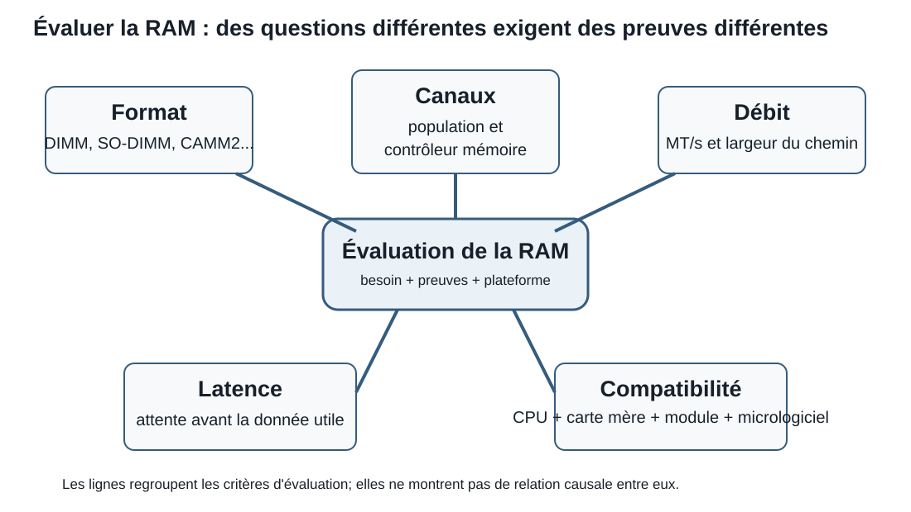

# Séance 6 - Mémoire vive : capacité, performance et formats modernes

## But de la séance

À la Séance 4, nous avons appris qu'une adresse permet de retrouver un octet en mémoire et qu'une valeur de plusieurs octets occupe plusieurs adresses consécutives. À la Séance 5, nous avons suivi des opérandes jusque dans les registres et l'UAL du processeur, puis nous avons vu que les caches gardent près des unités d'exécution les données et les instructions susceptibles d'être réutilisées.

Il reste maintenant à comprendre la mémoire de travail beaucoup plus grande qui alimente ces caches : la **mémoire vive**, ou **RAM**.

Cette séance répond à trois questions :

> Comment la RAM conserve-t-elle temporairement une grande quantité de données?

> Comment la capacité, la bande passante et la latence influencent-elles le comportement d'un système?

> Comment déterminer si un module ou une technologie de mémoire convient à un processeur, une carte mère et un usage donné?

Nous relierons le fonctionnement interne de la DRAM aux caractéristiques visibles dans une fiche technique : génération DDR, débit en MT/s, canaux, latences, ECC, type de module et format physique. Nous terminerons par les formats DIMM, SO-DIMM, CAMM2 et LPCAMM2, en établissant une méthode d'évaluation sans supposer qu'une technologie est toujours supérieure aux autres.

## Objectifs

### Parcours principal

À la fin du parcours principal, vous devriez être en mesure de :

- expliquer le rôle de la RAM et distinguer SRAM, DRAM, stockage et mémoire cache;
- distinguer capacité installée, capacité prise en charge et mémoire disponible;
- interpréter une génération DDR et distinguer MHz de MT/s;
- calculer une bande passante théorique et comparer des latences CAS simples;
- expliquer comment les canaux et la population des modules influencent les performances et la compatibilité;
- distinguer ECC, UDIMM, RDIMM, DIMM, SO-DIMM, CAMM2 et LPCAMM2;
- vérifier la compatibilité d'une solution mémoire à l'aide de la documentation du processeur, de la carte mère ou du système et du module;
- déterminer quelles preuves sont nécessaires pour recommander une solution de mémoire selon les besoins, la compatibilité, la fiabilité et le cycle de vie d'un système.

!!! question "Questions directrices"
    1. **Où se trouve la donnée maintenant?** Dans un registre, une cache, la RAM ou le stockage?
    2. **Combien peut-on déplacer, et combien de temps faut-il attendre?** Capacité, bande passante et latence répondent à des questions différentes.
    3. **Le système complet est-il compatible?** Le module seul ne détermine ni la vitesse réelle, ni la fiabilité, ni la possibilité d'installation.

!!! info "Portée de la séance"
    **À maîtriser aujourd'hui :** rôle et volatilité de la RAM, SRAM et DRAM, capacité, DDR, MHz et MT/s, bande passante, latence CAS, canaux, ECC, UDIMM, RDIMM, DIMM, SO-DIMM, CAMM2, LPCAMM2 et démarche de compatibilité.

    **À reconnaître aujourd'hui :** SPD, paramètres JEDEC, profils XMP ou EXPO et mémoire soudée.

    **Pour aller plus loin après le lien du laboratoire :** adressage détaillé de la DRAM, timings secondaires, horloge de base, multiplicateurs, ratios du contrôleur mémoire, surcadençage (overclocking), entraînement de la mémoire et optimisation de profils. Cette partie est facultative.

<div class="admonition info session-6-navigation"><p class="admonition-title">Repères de navigation</p>
<p>Cette séance est volontairement détaillée parce qu'elle sert de référence après le cours. Pour une première lecture, suivez le parcours suivant :</p>
<ol>
<li><strong>Rôle de la RAM :</strong> hiérarchie mémoire, SRAM et DRAM.</li>
<li><strong>Mesures à ne pas confondre :</strong> capacité, MT/s, bande passante et latence.</li>
<li><strong>Organisation :</strong> canaux, population des modules et ECC.</li>
<li><strong>Compatibilité :</strong> génération DDR, format, contrôleur mémoire, carte mère et documentation.</li>
<li><strong>Formats modernes :</strong> DIMM, SO-DIMM, CAMM2 et LPCAMM2.</li>
</ol>
<p>Les détails de SPD, profils et réglages avancés restent du contenu de reconnaissance ou d'approfondissement selon la portée indiquée plus haut.</p></div>

## Une histoire de livre : où chercher le prochain mot?

Imaginez que le processeur travaille actuellement sur un mot précis d'un livre.

| Niveau de mémoire | Élément de l'analogie |
|---|---|
| Registre | Le mot exact actuellement nécessaire |
| Cache L1 | La phrase contenant ce mot |
| Cache L2 | Le paragraphe contenant cette phrase |
| Cache L3 | La page contenant ce paragraphe |
| RAM | Le livre contenant cette page |
| Stockage | Un autre livre qu'il faut aller chercher à la bibliothèque |

Si le prochain mot nécessaire se trouve dans la même phrase, le processeur peut le trouver dans ce qui est déjà très proche, représenté ici par la cache L1.

S'il se trouve dans une autre phrase du même paragraphe, il faut consulter une zone plus grande, représentée par la cache L2, puis rapprocher la phrase utile avant de prendre le mot.

S'il se trouve dans un autre paragraphe de la même page, la cache L3 représente une zone encore plus grande à consulter.

S'il se trouve sur une autre page du même livre, il faut aller jusqu'à la RAM. Et si la partie nécessaire n'est pas actuellement en RAM, le système peut devoir la récupérer depuis le stockage, ce qui ressemble davantage à un déplacement vers une bibliothèque.

```text
mot actuel
   │
   ▼
registre
   │ manque
   ▼
L1 : phrase
   │ manque
   ▼
L2 : paragraphe
   │ manque
   ▼
L3 : page
   │ manque
   ▼
RAM : livre
   │ donnée absente de la mémoire de travail
   ▼
stockage : bibliothèque
```

### Ce que l'analogie permet de comprendre

L'analogie représente deux idées importantes.

La **localité spatiale** signifie que, lorsqu'une donnée est utilisée, les données voisines ont souvent de bonnes chances d'être utilisées prochainement. Un programme parcourt fréquemment des instructions consécutives, les éléments voisins d'un tableau ou les caractères voisins d'un texte.

La **localité temporelle** signifie qu'une donnée récemment utilisée a souvent de bonnes chances d'être réutilisée bientôt. Une boucle, une variable fréquemment consultée ou une instruction répétée en sont des exemples.

Ces régularités permettent aux caches de rapprocher des blocs de données avant que chaque octet soit explicitement demandé.

!!! warning "Une analogie, pas un plan littéral"
    Une cache ne comprend ni mots, ni phrases, ni paragraphes. Elle déplace des blocs de données appelés **lignes de cache**. Les détails de recherche, de remplissage et de remplacement varient selon le processeur.

    L'analogie sert à représenter la distance, la taille des zones conservées et l'augmentation du temps d'accès lorsque la donnée doit être cherchée plus loin.

??? question "Vérification : quel niveau de l'analogie?"
    Associez chaque situation à la première zone où la donnée pourrait être trouvée dans l'analogie.

    1. Le prochain caractère se trouve dans la même phrase.
    2. Il se trouve dans un autre paragraphe de la même page.
    3. Il se trouve sur une autre page du même livre.
    4. Le document n'est pas actuellement chargé en mémoire de travail.

    **Réponse :** L1, L3, RAM, puis stockage.

## La RAM est une mémoire de travail

La **mémoire vive** conserve les instructions et les données utilisées par les programmes en cours d'exécution. Elle offre beaucoup plus de capacité que les registres et les caches, tout en permettant un accès beaucoup plus rapide que le stockage secondaire.

La RAM est dite **volatile** : son contenu n'est pas conservé lorsque l'alimentation disparaît.

Lorsque vous ouvrez un programme ou un fichier :

1. les données persistantes sont lues depuis un SSD ou un autre support;
2. les parties nécessaires sont placées en RAM;
3. des blocs utiles sont ensuite rapprochés dans les caches;
4. les opérandes immédiats sont placés dans des registres;
5. les unités d'exécution effectuent les opérations.

```text
stockage → RAM → caches → registres → unités d'exécution
   lent      │        │       │              rapide
 grande      │        │       │              petite
capacité     └────────┴───────┴── proximité croissante du CPU
```

### Capacité insuffisante

Lorsque la RAM ne peut pas contenir l'ensemble de travail actif, le système d'exploitation peut déplacer temporairement certaines données entre RAM et stockage. Cette technique permet au système de continuer à fonctionner, mais le stockage reste beaucoup plus lent que la RAM.

Nous étudierons la mémoire virtuelle et la pagination plus précisément pendant la séance consacrée aux systèmes d'exploitation. Pour le moment, retenez ceci :

> Ajouter de la capacité peut améliorer fortement un système qui manquait réellement de RAM, mais ajouter de la RAM à un système qui en possède déjà suffisamment ne rend pas automatiquement chaque opération plus rapide.

## SRAM et DRAM : deux compromis différents

Le mot RAM décrit une mémoire accessible par adresse, mais plusieurs technologies peuvent remplir ce rôle.

### SRAM

La **SRAM** (*static random-access memory*) conserve un bit dans un petit circuit composé de plusieurs transistors. Elle n'a pas besoin d'un rafraîchissement périodique tant que l'alimentation est présente.

Elle est :

- très rapide;
- coûteuse par bit;
- relativement peu dense;
- utilisée en petites quantités près des unités d'exécution, notamment dans les caches.

### DRAM

La **DRAM** (*dynamic random-access memory*) représente typiquement un bit à l'aide d'un condensateur commandé par un transistor.

Le condensateur perd progressivement sa charge. Le contenu doit donc être lu et restauré périodiquement par un processus de **rafraîchissement**.

La DRAM est :

- plus lente que la SRAM;
- moins coûteuse par bit;
- beaucoup plus dense;
- adaptée à la grande capacité de la mémoire principale.

| Propriété | SRAM | DRAM |
|---|---|---|
| Utilisation typique | Caches du processeur | Mémoire principale |
| Structure d'une cellule | Plusieurs transistors | Transistor et condensateur, modèle simplifié |
| Rafraîchissement périodique | Non | Oui |
| Densité | Plus faible | Plus élevée |
| Coût par bit | Plus élevé | Plus faible |
| Capacité habituelle dans un système | Petite | Grande |

!!! note "Les registres ne sont pas simplement une cache encore plus petite"
    Les registres et la SRAM peuvent utiliser des circuits apparentés, mais un registre est une ressource architecturale ou interne directement utilisée par les unités d'exécution. Une cache gère automatiquement des copies de données provenant d'un niveau plus éloigné.

## Comment une cellule DRAM conserve un bit

Dans notre modèle simplifié :

- une charge électrique représente un état;
- l'absence ou une quantité différente de charge représente l'autre état;
- un transistor contrôle l'accès au condensateur;
- la lecture peut perturber l'état, qui doit ensuite être restauré;
- la fuite naturelle de charge oblige le système à rafraîchir périodiquement les cellules.

```text
ligne de mot ── commande le transistor
                    │
ligne de bit ───────┤── condensateur
```

Le contrôleur mémoire et les circuits de DRAM coordonnent ces opérations. Le processeur n'exécute pas une instruction logicielle distincte pour rafraîchir chaque cellule.

!!! warning "Charge électrique ne signifie pas lecture analogique par le programme"
    Les circuits interprètent les états selon des seuils électriques. Le programme voit des bits et des octets, pas la quantité précise de charge d'un condensateur.

## Revoir l'espace d'adressage et la capacité

Avec `n` bits d'adresse, il est possible de former `2`<sup>`n`</sup> configurations différentes.

Si chaque adresse désigne un octet :

```text
32 bits d'adresse
→ 2³² adresses
→ 4 294 967 296 octets
→ 4 Gio d'espace d'adressage théorique
```

Cependant, plusieurs limites doivent être distinguées.

| Limite | Question |
|---|---|
| Espace d'adressage de l'architecture | Combien d'adresses le modèle architectural peut-il exprimer? |
| Bits d'adresse effectivement mis en œuvre | Combien de ces bits sont réellement utilisés par ce processeur? |
| Contrôleur mémoire | Quelle capacité, quels canaux et quels types prend-il en charge? |
| Carte mère et micrologiciel | Quels modules, capacités et populations sont pris en charge? |
| Mémoire installée | Quelle capacité physique se trouve dans la machine? |
| Mémoire utilisable par le système | Quelle capacité reste disponible après les réservations matérielles et logicielles? |

Un processeur « 64 bits » ne garantit donc pas que le système accepte `2`<sup>`64`</sup> octets de RAM.

??? question "Vérification : quelle capacité parle-t-on?"
    Un ordinateur 64 bits possède 16 Gio installés, mais le système indique 15,7 Gio utilisables. Le fabricant du processeur annonce une capacité maximale de 256 Gio.

    - `256 Gio` décrit ici une limite du contrôleur ou du produit.
    - `16 Gio` décrit la mémoire physiquement installée.
    - `15,7 Gio` décrit la mémoire utilisable après certaines réservations.

## De la SDRAM à la DDR

La mémoire principale moderne est généralement de la **SDRAM**, c'est-à-dire de la DRAM synchrone avec une horloge de communication.

**DDR** signifie *double data rate*. Des transferts sont effectués sur deux moments d'un cycle d'horloge, ce qui produit deux transferts par cycle pour le signal de données.

```text
horloge mémoire : 3 000 millions de cycles par seconde
DDR             : 2 transferts par cycle
résultat         : 6 000 millions de transferts par seconde
```

Une mémoire annoncée **DDR5-6000** est donc décrite par un débit de `6 000 MT/s`, et non par une horloge de 6 000 MHz.

### MHz et MT/s

- **MHz** mesure des millions de cycles par seconde;
- **MT/s** mesure des millions de transferts par seconde.

Dans le cas simplifié d'une mémoire DDR :

```text
débit en MT/s ≈ 2 × horloge mémoire en MHz
```

Ainsi, avec un autre débit DDR5 :

```text
DDR5-5600
≈ horloge mémoire de 2 800 MHz
× 2 transferts par cycle
= 5 600 MT/s
```

!!! question "À vous : retrouver l'horloge"
    Une mémoire **DDR5-5200** effectue `5 200 MT/s`.

    Quelle est approximativement son horloge mémoire réelle en MHz?

??? success "Vérification"
    `5 200 ÷ 2 = 2 600`

    Une mémoire DDR5-5200 utilise donc, dans ce modèle simplifié, une horloge mémoire d'environ **2 600 MHz**.

!!! warning "Une habitude commerciale fréquente"
    Les magasins et certains logiciels parlent souvent de « RAM à 6000 MHz ». Cette formulation désigne généralement le débit DDR de 6000 MT/s. Elle ne signifie pas que l'horloge physique de la DRAM effectue 6000 millions de cycles par seconde.

## Générations DDR

Les générations DDR ne sont pas seulement des vitesses différentes. Elles modifient les caractéristiques électriques, la signalisation, la gestion de l'alimentation et l'organisation interne.

| Génération | Idée générale | Compatibilité physique |
|---|---|---|
| DDR3 | Ancienne génération encore présente dans des systèmes plus âgés | Encoche et caractéristiques propres |
| DDR4 | Très répandue dans les PC des années 2010 et du début des années 2020 | Incompatible avec DDR3 et DDR5 |
| DDR5 | Débits et capacités plus élevés, changements d'organisation et d'alimentation | Incompatible avec DDR4 |

<div style="display:grid;grid-template-columns:repeat(auto-fit,minmax(210px,1fr));gap:1rem;align-items:start;margin:1rem 0;">
  <figure style="margin:0;">
    
    <figcaption><strong>DDR3 DIMM.</strong> Photo : Suyash.dwivedi, <a href="https://commons.wikimedia.org/wiki/File:2GB_DDR3_Desktop_RAM_1333Mhz.jpg">Wikimedia Commons</a>, <a href="https://creativecommons.org/licenses/by-sa/4.0/">CC BY-SA 4.0</a>.</figcaption>
  </figure>
  <figure style="margin:0;">
    
    <figcaption><strong>DDR4 DIMM.</strong> Photo : ElooKoN, <a href="https://commons.wikimedia.org/wiki/File:RAM_Module_(SDRAM-DDR4).jpg">Wikimedia Commons</a>, <a href="https://creativecommons.org/licenses/by-sa/4.0/">CC BY-SA 4.0</a>.</figcaption>
  </figure>
  <figure style="margin:0;">
    
    <figcaption><strong>DDR5 DIMM.</strong> Photo : Jacek Halicki, <a href="https://commons.wikimedia.org/wiki/File:2023_Pami%C4%99ci_Corsair_Vengeance_RGB.jpg">Wikimedia Commons</a>, <a href="https://creativecommons.org/licenses/by-sa/4.0/">CC BY-SA 4.0</a>.</figcaption>
  </figure>
</div>

Les images permettent de reconnaître la forme générale d'un DIMM, mais elles ne suffisent pas pour identifier avec certitude la génération. Les dissipateurs, les couleurs et le nombre de puces varient selon le fabricant. Il faut vérifier l'étiquette, l'encoche, la fiche technique et la plateforme prévue.

Les modules DDR4 et DDR5 de bureau peuvent posséder le même nombre général de contacts annoncé dans certaines fiches, mais leur encoche, leur signalisation et leur fonctionnement sont différents. Ils ne sont pas interchangeables.

!!! note "ECC interne de DDR5"
    Les puces DDR5 utilisent des mécanismes internes de correction pour améliorer leur fabrication et leur fiabilité interne. Cet **ECC interne à la puce** ne remplace pas une mémoire ECC de plateforme qui protège les données sur le chemin visible par le système.

## Calculer la bande passante théorique

La **bande passante** indique combien de données pourraient être transférées par unité de temps dans des conditions idéales.

Pour les exercices de bande passante de ce cours, nous utilisons un **modèle simplifié de chemin de données agrégé de 64 bits** :

```text
64 bits ÷ 8 = 8 octets par transfert
```

Un DIMM DDR5 standard divise ce chemin de données en **deux sous-canaux de données indépendants de 32 bits**. Sur un DIMM ECC, chaque sous-canal est large de 40 bits : 32 bits de données et 8 bits de contrôle ECC. Cette organisation permet davantage d'indépendance dans les accès, mais elle ne double pas les 64 bits de données utiles employés dans notre calcul agrégé.

Dans les calculs qui suivent, l'expression « canal de 64 bits » désigne donc le **chemin agrégé de 64 bits utilisé par ce modèle simplifié de plateforme**, et non un seul sous-canal DDR5.

Avec DDR5-5600 :

```text
5 600 millions de transferts/s × 8 octets
= 44 800 millions d'octets/s
≈ 44,8 Go/s pour ce chemin agrégé de 64 bits
```

Avec deux chemins agrégés indépendants de 64 bits :

```text
44,8 Go/s × 2
≈ 89,6 Go/s
```

Formule générale simplifiée :

```text
bande passante théorique
= débit en MT/s × octets transférés par chemin agrégé × nombre de chemins agrégés
```

!!! warning "Théorique ne signifie pas mesuré"
    Cette formule ne tient pas compte des commandes, rafraîchissements, changements de ligne, conflits, attentes, limites du logiciel ni de l'efficacité du contrôleur. Une application réelle n'obtient pas nécessairement ce maximum.

??? question "Exemple guidé"
    Dans ce modèle simplifié, une plateforme utilise deux chemins agrégés de 64 bits avec de la DDR5-4800.

    ```text
    4 800 MT/s × 8 octets × 2 canaux
    = 76 800 Mo/s
    ≈ 76,8 Go/s
    ```

    Cette valeur décrit une bande passante théorique agrégée.

## Capacité, bande passante et latence

Ces trois caractéristiques ne répondent pas à la même question.

| Caractéristique | Question principale |
|---|---|
| Capacité | Quelle quantité de données actives peut rester en RAM? |
| Bande passante | Quelle quantité de données peut être transférée par seconde? |
| Latence | Combien de temps faut-il attendre avant qu'une donnée demandée commence à arriver? |

Une grande capacité n'implique pas automatiquement une faible latence. Un débit élevé n'empêche pas une demande individuelle de devoir attendre. Une faible latence ne garantit pas une capacité suffisante.

### Analogie routière

- La **capacité** ressemble à la quantité totale de marchandises pouvant être conservée dans un entrepôt.
- La **bande passante** ressemble au nombre de camions pouvant passer sur une route par minute.
- La **latence** ressemble au temps nécessaire au premier camion pour effectuer un trajet.

Une route plus large peut transporter davantage de marchandises sans nécessairement réduire la distance jusqu'à l'entrepôt.

## Convertir la latence CAS en temps

Comparer seulement le nombre `CL` peut être trompeur, car chaque cycle dure moins longtemps lorsque l'horloge est plus rapide.

Pour de la mémoire DDR :

```text
latence CAS approximative en ns
= CL × 2 000 ÷ débit DDR en MT/s
```

### Exemple 1 : DDR5-6000 CL30

```text
30 × 2 000 ÷ 6 000
= 10 ns
```

### Exemple 2 : DDR5-4800 CL40

```text
40 × 2 000 ÷ 4 800
≈ 16,7 ns
```

Le premier module possède un nombre CL inférieur et un débit supérieur. Dans d'autres comparaisons, un nombre CL plus élevé peut tout de même produire une durée similaire parce que le cycle est plus court.

!!! question "Vérification : lequel répond le plus vite?"
    Comparez DDR5-5600 CL28 et DDR5-6400 CL32.

    ```text
    28 × 2 000 ÷ 5 600 = 10 ns
    32 × 2 000 ÷ 6 400 = 10 ns
    ```

    Leur latence CAS approximative est identique, même si leurs débits et nombres CL diffèrent.

## Le CPU et la RAM n'utilisent pas une seule horloge commune

Le cœur du processeur, le contrôleur mémoire et la DRAM peuvent fonctionner dans des domaines d'horloge différents.

- la fréquence du cœur indique le rythme de certaines opérations internes du CPU;
- l'horloge mémoire organise la communication avec la DRAM;
- le débit DDR indique les transferts de données;
- le contrôleur utilise des ratios et des files d'attente pour coordonner ces domaines;
- les caches réduisent le nombre de fois où le cœur doit attendre la RAM.

Un processeur à 5 GHz et une mémoire DDR5-6000 ne fonctionnent donc pas « à la même vitesse » et leurs nombres ne peuvent pas être comparés directement.

### Quand une mémoire plus rapide aide-t-elle?

Une mémoire plus rapide peut être utile lorsque le travail :

- transfère de grandes quantités de données;
- dépasse fréquemment les caches;
- utilise un graphique intégré qui partage la RAM;
- exécute plusieurs cœurs qui sollicitent la mémoire;
- dépend fortement de la bande passante ou de la latence mémoire.

Elle peut avoir moins d'effet lorsque :

- le travail tient largement dans les caches;
- le processeur attend principalement le stockage, le réseau ou un autre périphérique;
- le logiciel ne produit pas assez de demandes pour utiliser la bande passante supplémentaire;
- une autre limite domine déjà la performance.

## Canaux et population des modules

Le nombre de canaux est une caractéristique du processeur et de la plateforme. L'installation physique doit respecter la documentation de la carte mère ou du système.

Sur une carte mère de bureau à quatre emplacements et deux canaux, deux modules sont souvent installés dans une paire précise d'emplacements. Les couleurs peuvent aider, mais le manuel reste la source d'autorité.

!!! warning "Deux modules ne garantissent pas toujours deux canaux"
    Le comportement dépend de l'architecture, du format et du câblage de la plateforme. Certains formats modernes fournissent une interface large dans un seul module; certains systèmes utilisent des canaux divisés ou des organisations particulières.

### Population et charge électrique

Ajouter des modules augmente la capacité, mais peut aussi augmenter la charge sur le contrôleur et les pistes de la carte mère.

La vitesse stable peut dépendre :

- du nombre de modules;
- du nombre de rangs;
- de la capacité totale;
- de la qualité du contrôleur mémoire dans le processeur;
- du dessin des pistes de la carte mère;
- de la version du micrologiciel;
- des tensions, températures et timings.

Une fiche de processeur peut donc annoncer des vitesses différentes pour `2×1R`, `2×2R`, `4×1R` ou `4×2R`.

## SPD, paramètres JEDEC et profils de performance

Un module contient généralement une petite mémoire **SPD** (*serial presence detect*) décrivant ses caractéristiques et plusieurs paramètres de fonctionnement.

Au démarrage, le micrologiciel peut lire ces informations afin de configurer la mémoire.

### Paramètres JEDEC

Les paramètres normalisés définissent des combinaisons de débit, timings et tension prévues pour l'interopérabilité.

Par défaut, un système choisit généralement un ensemble de paramètres pris en charge par le module, le processeur et la carte mère.

### XMP et EXPO

**Intel XMP** et **AMD EXPO** fournissent des profils permettant d'appliquer plus facilement des réglages de mémoire à performance élevée.

Un profil peut modifier :

- le débit;
- les timings;
- la tension;
- certains paramètres liés au contrôleur.

Ces profils simplifient la configuration, mais ils ne transforment pas un réglage surcadencé en garantie universelle.

!!! warning "Profil validé ne signifie pas compatible avec tout système"
    Un fabricant peut valider un kit à un réglage donné dans certaines conditions. La stabilité finale dépend encore du processeur, de la carte mère, du micrologiciel, de la population des modules et des conditions thermiques.

    Intel décrit XMP comme une méthode de surcadençage de mémoire compatible, et AMD décrit EXPO comme une technologie de surcadençage DDR5. Les deux fabricants avertissent que l'utilisation hors spécification peut affecter la stabilité, les données, le matériel ou la garantie.

## Parité, ECC et fiabilité

Des perturbations électriques, des défauts ou d'autres événements peuvent modifier des bits. Les systèmes utilisent différentes techniques pour détecter ou corriger certaines erreurs.

### Parité

Un bit de parité permet de détecter certaines configurations d'erreurs, mais il ne fournit pas généralement assez d'information pour reconstruire le bit incorrect.

### ECC de plateforme

La mémoire **ECC** (*error-correcting code*) conserve des informations supplémentaires permettant au contrôleur de détecter et de corriger certaines erreurs.

Une mise en œuvre courante peut corriger une erreur d'un bit et détecter certaines erreurs multiples, mais les capacités exactes dépendent du système.

L'utilisation d'ECC exige une chaîne compatible :

- processeur et contrôleur;
- carte mère et micrologiciel;
- type de module;
- configuration prise en charge.

Installer un module portant la mention ECC ne suffit pas si la plateforme ne l'utilise pas.

### ECC interne et ECC de plateforme

| Mécanisme | Protection principale |
|---|---|
| ECC interne à une puce DDR5 | Corrige certaines erreurs à l'intérieur de la puce afin d'améliorer son fonctionnement interne |
| ECC de plateforme | Protège les données visibles par le contrôleur et le système sur un chemin plus large |

Le premier ne remplace pas automatiquement le second.

## UDIMM et RDIMM

### UDIMM

Un **UDIMM** (*unbuffered DIMM*) transmet les signaux de commande et d'adresse sans registre intermédiaire de type RDIMM. Il est courant dans les ordinateurs de bureau et certaines stations de travail.

### RDIMM

Un **RDIMM** (*registered DIMM*) utilise un registre pour certains signaux de commande et d'adresse. Cela réduit la charge électrique vue par le contrôleur et facilite des configurations de serveur comportant davantage de modules ou de capacité.

| Propriété | UDIMM | RDIMM |
|---|---|---|
| Usage fréquent | PC de bureau, certaines stations | Serveurs, stations et plateformes à grande capacité |
| Registre de commande/adresse | Non | Oui |
| Capacité d'expansion typique | Plus limitée | Plus élevée selon la plateforme |
| Compatibilité | Plateforme prévue pour UDIMM | Plateforme prévue pour RDIMM |

!!! warning "RDIMM et UDIMM ne sont pas des options interchangeables"
    Un emplacement ayant une forme semblable ne garantit pas la compatibilité. Le processeur, la carte mère et le micrologiciel doivent prendre en charge le type exact.

## Formats physiques traditionnels

### DIMM

Le **DIMM** est le format courant des modules de mémoire dans les ordinateurs de bureau et de nombreux serveurs. Il s'insère verticalement ou à angle droit dans un connecteur à contacts sur le bord.

### SO-DIMM

Le **SO-DIMM** est un module plus court, conçu pour les portables, mini-PC et systèmes compacts. Il utilise également un connecteur à contacts sur le bord.

DIMM et SO-DIMM décrivent surtout la forme du module. Il faut encore vérifier :

- la génération DDR;
- le type électrique;
- la capacité;
- le débit;
- ECC ou non-ECC;
- enregistré ou non enregistré;
- la compatibilité de la plateforme.

### Mémoire soudée

Certains appareils soudent directement des puces DRAM ou LPDDR sur la carte mère. Cette solution peut réduire la hauteur, la longueur des pistes et la consommation, mais elle limite généralement la réparation et la mise à niveau.

## Pourquoi chercher un nouveau format?

Les modules traditionnels à contacts sur le bord imposent des contraintes :

- hauteur du connecteur;
- longueur des pistes entre le contrôleur et les puces;
- espace occupé sur la carte;
- difficulté à fournir une interface très large dans un appareil mince;
- charge électrique croissante à haute vitesse.

Un nouveau format peut tenter d'améliorer certains de ces aspects, mais il peut aussi introduire :

- un nouvel écosystème de cartes mères et de modules;
- un coût initial plus élevé;
- une disponibilité limitée;
- une procédure d'installation différente;
- de nouveaux besoins de refroidissement ou de pression mécanique.

## CAMM2

**CAMM2** désigne une famille normalisée de modules fixés à plat contre la carte et reliés par des contacts comprimés plutôt que par un long connecteur à contacts sur le bord.

Le format est différent parce que les contraintes ont changé. Un DIMM ou un SO-DIMM doit placer tous ses contacts sur un bord du module, puis faire parcourir aux signaux une certaine distance entre ce connecteur, les pistes de la carte mère et les puces de mémoire. À mesure que les débits augmentent, ces trajets deviennent plus difficiles à maintenir électriquement propres; dans un appareil mince, le connecteur vertical impose aussi une hauteur et une disposition peu pratiques. CAMM2 répartit plutôt les contacts sous un module posé à plat. Cette disposition peut raccourcir les pistes, réduire la hauteur, offrir une interface plus large dans un seul module et laisser davantage de liberté pour placer les puces et le refroidissement.

Le module est généralement maintenu par une plaque ou des vis qui appliquent une pression uniforme sur les contacts. Cette pression fait partie de l'interface électrique : le module ne se contente donc pas de « cliquer » dans un connecteur comme un SO-DIMM.

{ width="650" loading=lazy }

*Présentation de composants mécaniques CAMM2 par Amphenol à Computex 2025. Photo : 4300streetcar, [Wikimedia Commons](https://commons.wikimedia.org/wiki/File:Amphenol_CAMM2_RAM_display.jpg), [CC BY 4.0](https://creativecommons.org/licenses/by/4.0/).*

Cette approche peut permettre :

- des pistes électriques plus courtes;
- une hauteur réduite;
- une interface plus large dans un seul module;
- une plus grande densité de capacité;
- une disposition différente du refroidissement et de la carte mère;
- la remplaçabilité, contrairement à une mémoire directement soudée.

CAMM2 décrit un **format de module et d'interface**. Il ne suffit pas à lui seul pour connaître la technologie DRAM, la capacité, le débit, l'ECC ou l'usage prévu.

## LPCAMM2

**LPCAMM2** est une mise en œuvre de la famille CAMM2 conçue pour utiliser de la mémoire à faible consommation, notamment LPDDR5X, dans un module remplaçable.

La mémoire LPDDR est traditionnellement soudée afin de conserver des pistes courtes et une faible consommation. LPCAMM2 vise à conserver plusieurs de ces avantages tout en permettant le remplacement du module.

Des produits LPCAMM2 actuels visent surtout les portables minces, les stations mobiles et certains PC orientés IA. Des fabricants mettent en avant :

- une interface de 128 bits dans un module;
- des débits élevés;
- une consommation réduite;
- un encombrement inférieur à une paire de SO-DIMM;
- la possibilité de remplacer ou de mettre à niveau la mémoire.

!!! warning "LPCAMM2 n'est pas simplement un SO-DIMM plus rapide"
    Il utilise une technologie, une interface, un connecteur et une organisation de plateforme différents. Un ordinateur conçu pour SO-DIMM ne peut pas recevoir LPCAMM2 sans avoir été conçu pour ce format.

## CAMM2, LPCAMM2 et les autres formats

| Format | Technologie fréquemment associée | Orientation générale | Remplaçable? |
|---|---|---|:---:|
| DIMM | DDR, souvent UDIMM ou RDIMM selon la plateforme | Bureau et serveur | Oui |
| SO-DIMM | DDR pour systèmes compacts | Portable et mini-PC | Oui |
| LPDDR soudée | LPDDR | Appareils minces et économes | Généralement non |
| CAMM2 | Peut varier selon la mise en œuvre | Module comprimé à plat | Oui |
| LPCAMM2 | LPDDR5X dans les produits courants | Portable, station mobile, PC compact | Oui |

!!! note "Limite volontaire de cette séance"
    Cette page explique les technologies et les critères qui permettent de les étudier. Elle ne détermine pas quel format convient à un client, un serveur ou une charge de travail particulière.

    Une recommandation exige des preuves sur la plateforme réelle, la capacité, la bande passante, la fiabilité, l'expansion, le coût, la disponibilité, le refroidissement, la maintenance et le soutien du fabricant.

<figure markdown="span">
  { loading=lazy width="900" }
  <figcaption>Schéma de synthèse créé pour C12. Il sert de repère conceptuel; les spécifications réelles doivent toujours être vérifiées dans la documentation du matériel.</figcaption>
</figure>

## Synthèse intégrée : comment évaluer une solution mémoire

Une démarche de compatibilité et de pertinence peut suivre cet ordre.

### 1. Déterminer le besoin de capacité

- Quelle quantité de données doit rester active?
- Plusieurs applications ou utilisateurs travaillent-ils simultanément?
- Le besoin risque-t-il d'augmenter?
- Quelle marge est raisonnable sans surpayer une capacité inutilisée?

### 2. Déterminer le besoin de performance

- La charge est-elle sensible à la bande passante?
- La latence influence-t-elle réellement le travail?
- Le processeur intégré ou le GPU partage-t-il la RAM?
- Le logiciel exploite-t-il plusieurs cœurs ou de grands ensembles de données?

### 3. Déterminer le besoin de fiabilité

- Le système doit-il fonctionner longtemps sans interruption?
- Une erreur silencieuse aurait-elle un coût important?
- ECC est-il requis ou recommandé?
- La plateforme prend-elle réellement en charge l'ECC de bout en bout?

### 4. Vérifier le processeur

- génération et type de mémoire;
- nombre de canaux;
- capacité maximale;
- débits officiels selon la population;
- ECC;
- UDIMM, RDIMM ou autre type;
- formats ou interfaces propres à la plateforme.

### 5. Vérifier la carte mère ou le système

- génération DDR;
- nombre et type de connecteurs;
- capacité par emplacement;
- population recommandée;
- liste de modules validés, si disponible;
- version du BIOS ou de l'UEFI;
- soutien de XMP, EXPO ou autres profils;
- dégagement physique et refroidissement.

### 6. Évaluer le module

- capacité;
- débit nominal et paramètres JEDEC;
- profil de performance éventuel;
- timings;
- tension;
- rangs;
- ECC ou non-ECC;
- UDIMM, RDIMM, SO-DIMM, CAMM2 ou LPCAMM2;
- garantie et disponibilité.

### 7. Évaluer l'ensemble du cycle de vie

- coût initial;
- possibilité d'expansion;
- disponibilité des remplacements;
- consommation électrique;
- facilité de réparation;
- stabilité;
- soutien du fabricant;
- durée prévue du système.

!!! warning "La fiche du module ne suffit jamais"
    Une barrette peut être excellente en elle-même et néanmoins inappropriée pour un système précis. La compatibilité et la pertinence appartiennent à l'ensemble **processeur + carte mère + micrologiciel + modules + charge de travail**.

## Erreurs fréquentes à éviter

### Confondre RAM et stockage

La RAM conserve temporairement les données actives. Le stockage conserve les données de manière persistante.

### Penser que davantage de RAM accélère toujours l'ordinateur

Une capacité supplémentaire aide fortement lorsqu'il manque de la RAM. Elle peut avoir peu d'effet lorsque la capacité actuelle est déjà suffisante.

### Confondre MHz et MT/s

DDR5-6000 décrit environ 6000 MT/s, pas une horloge mémoire de 6000 MHz.

### Comparer seulement le nombre CL

Le nombre de cycles doit être converti en temps à l'aide de la fréquence ou du débit.

### Multiplier automatiquement par le nombre de modules

La bande passante dépend des canaux et de l'organisation de la plateforme, pas simplement du nombre de barrettes.

### Supposer qu'un module plus rapide fonctionnera toujours à son débit annoncé

La plateforme peut choisir un réglage inférieur, échouer à démarrer ou devenir instable. Il faut vérifier les paramètres pris en charge et la population.

### Confondre ECC interne DDR5 et ECC de plateforme

L'ECC interne à une puce ne fournit pas automatiquement la protection de bout en bout attendue d'une plateforme ECC.

### Supposer que CAMM2 ou LPCAMM2 est universellement supérieur

Un format peut améliorer certains critères tout en étant moins adapté selon le coût, la disponibilité, la plateforme, la maintenance ou le besoin réel.

## Ce qu'il faut retenir

### Pourquoi la RAM existe-t-elle?

- Elle fournit une grande mémoire de travail entre le stockage et les caches.
- Elle est plus lente que les caches, mais beaucoup plus grande et moins coûteuse par bit.
- Elle est volatile et doit être alimentée pour conserver son contenu.

### Pourquoi utilise-t-on la DRAM?

- Ses cellules sont denses et économiques.
- Elles perdent leur charge et doivent être rafraîchies.
- L'organisation interne de la DRAM aide à expliquer la latence; les banques, les lignes et les colonnes sont approfondies dans l'autoformation facultative.

### Comment interpréter une fiche mémoire?

- La capacité, la bande passante et la latence répondent à des questions différentes.
- MT/s n'est pas MHz.
- Les timings exprimés en cycles doivent être reliés à la durée d'un cycle.
- Les canaux et la population appartiennent à la plateforme complète.

### Comment comparer les formats?

- DIMM et SO-DIMM utilisent des connecteurs à contacts sur le bord.
- CAMM2 utilise des contacts comprimés et une installation à plat.
- LPCAMM2 permet d'utiliser de la mémoire LPDDR dans un module remplaçable.
- Aucun format ne peut être recommandé sans étudier le système et le besoin.

## Passer à la pratique

[Continuer vers le Laboratoire 6 - Observer et évaluer la mémoire vive](../laboratoires/laboratoire-6.md)

## Pour aller plus loin : architecture avancée et réglage de la mémoire

Cette section est facultative. Elle n'est pas requise pour le Laboratoire 6 et ne fait pas partie des objectifs à maîtriser pendant cette séance. Elle permet d'explorer plus en profondeur l'organisation interne de la DRAM, les timings secondaires et les réglages de performance.

Les activités et calculs correspondants se trouvent dans la section d'autoformation à la fin du laboratoire.

### De l'adresse à la cellule physique

À la Séance 4, nous avons utilisé un tableau dans lequel chaque adresse identifiait un octet. Cette vue reste essentielle : du point de vue du programme, une adresse permet de retrouver une position dans un espace de mémoire.

La DRAM physique est toutefois organisée en structures plus grandes.

```text
adresse demandée
      ↓
contrôleur mémoire intégré
      ↓
canal
      ↓
module
      ↓
rang
      ↓
puces DRAM
      ↓
banque
      ↓
ligne
      ↓
colonne
      ↓
données transférées
```

#### Contrôleur mémoire

Le **contrôleur mémoire** reçoit les demandes, planifie les opérations et communique avec les modules. Dans de nombreux processeurs actuels, il est intégré au boîtier du CPU.

Il doit notamment :

- transformer les demandes en commandes comprises par la DRAM;
- sélectionner le canal et les structures concernées;
- respecter les délais électriques;
- organiser les lectures, écritures et rafraîchissements;
- gérer plusieurs demandes en attente.

#### Canal

Un **canal mémoire** est une voie de communication indépendante entre le contrôleur et la mémoire. Plusieurs canaux peuvent permettre des transferts en parallèle.

Un canal n'est pas la même chose qu'un module. Un système peut :

- posséder plusieurs emplacements sur un même canal;
- utiliser un module qui fournit une interface large;
- organiser les canaux différemment selon le processeur et le format de mémoire.

#### Rang

Un **rang** est un groupe de puces qui travaillent ensemble pour fournir la largeur de données attendue par le canal. Un module peut contenir un ou plusieurs rangs.

Le rang n'est pas simplement « un côté du module ». Des puces visibles des deux côtés ne prouvent pas à elles seules le nombre de rangs.

#### Banque, ligne et colonne

Les cellules d'une puce sont réparties dans des **banques**. Une banque contient de nombreuses lignes et colonnes.

Pour accéder à une donnée, la DRAM peut devoir :

1. fermer une ligne précédemment active;
2. ouvrir la ligne contenant la donnée;
3. sélectionner la colonne;
4. transférer un bloc de données.

Si la bonne ligne est déjà active, une partie de ce travail peut être évitée. Cela contribue aux différences de latence selon le motif d'accès.

!!! note "Le mappage exact est une décision de plateforme"
    Le contrôleur ne découpe pas nécessairement une adresse en champs simples et visibles « canal-rang-banque-ligne-colonne ». Les processeurs peuvent répartir ou entrelacer les bits d'adresse de différentes manières afin d'améliorer le parallélisme.

    Pour cette séance, vous devez comprendre les niveaux d'organisation, pas reconstruire le mappage propriétaire d'un processeur particulier.

### Les principaux timings

Une fiche de mémoire peut afficher une suite comme :

```text
30-38-38-96
```

Ces nombres représentent des délais exprimés en cycles de l'horloge mémoire.

| Timing | Rôle introductif |
|---|---|
| `CL` | Délai entre une demande de colonne et la disponibilité des données |
| `tRCD` | Délai entre l'ouverture d'une ligne et l'accès à une colonne |
| `tRP` | Temps nécessaire pour fermer ou préparer une banque avant une autre ligne |
| `tRAS` | Durée minimale pendant laquelle une ligne doit rester active |

Les interactions réelles sont plus complexes, et de nombreux timings secondaires existent. L'objectif est de comprendre que l'accès à une donnée peut exiger plusieurs étapes, et non de mémoriser tous les paramètres.

### Que signifie surcadencer la mémoire?

**Surcadencer** la mémoire signifie faire fonctionner une partie du sous-système mémoire au-delà des paramètres de référence publiés pour la combinaison concernée.

Cela peut comprendre :

- augmenter le multiplicateur ou le débit;
- réduire certains timings;
- augmenter la tension DRAM;
- modifier des tensions liées au contrôleur;
- modifier des ratios entre contrôleur et mémoire;
- relancer l'entraînement de la mémoire.

#### Horloge de base, multiplicateurs et ratios

Pour analyser un surcadençage CPU/RAM, il faut distinguer plusieurs nombres qui décrivent des domaines d'horloge différents.

##### Fréquence du processeur

Dans un modèle simplifié :

```text
fréquence CPU = horloge de base × multiplicateur CPU
```

Par exemple :

```text
100 MHz × 52 = 5 200 MHz
```

Le multiplicateur peut varier selon le nombre de cœurs actifs, la température, la puissance disponible et les mécanismes automatiques du processeur. Le calcul donne donc un réglage ou une cible, pas nécessairement une fréquence constante observée en tout temps.

##### Horloge de la mémoire

Pour une mémoire DDR :

```text
horloge mémoire ≈ débit DDR ÷ 2
```

Ainsi :

```text
DDR5-6000 → 6 000 ÷ 2 = 3 000 MHz
```

##### Horloge du contrôleur mémoire

Le contrôleur mémoire peut fonctionner selon un ratio par rapport à l'horloge de la mémoire. Dans notre modèle simplifié :

```text
ratio 1:1 → contrôleur à la même horloge que la mémoire
ratio 1:2 → contrôleur à la moitié de l'horloge mémoire
```

Exemple :

```text
DDR5-6400
horloge mémoire = 3 200 MHz

ratio 1:1 → contrôleur = 3 200 MHz
ratio 1:2 → contrôleur = 1 600 MHz
```

Les noms exacts varient selon la plateforme. Certaines plateformes AMD exposent notamment `MCLK`, `UCLK` et parfois `FCLK`; certaines plateformes Intel parlent de modes ou de rapports du contrôleur. Il faut consulter la documentation de la génération concernée plutôt que de supposer qu'un nom ou un ratio s'applique partout.

!!! warning "Un ratio n'est pas un multiplicateur de performance"
    Passer de 1:1 à 1:2 ne signifie pas que les performances sont divisées exactement par deux. Le changement peut ajouter de la latence ou modifier le comportement du sous-système mémoire, mais l'effet réel dépend du processeur, du contrôleur, du logiciel et des autres paramètres.

#### Optimiser signifie respecter des contraintes

Dans ce cours, **optimiser** une configuration ne signifie pas choisir le plus grand nombre affiché. La démarche est :

1. éliminer les réglages incompatibles ou hors des limites imposées;
2. éliminer les réglages qui ne satisfont pas les exigences de tension, de température ou de stabilité;
3. comparer les fréquences CPU encore valides;
4. comparer les ratios contrôleur-mémoire;
5. comparer la bande passante et la latence;
6. choisir selon la charge de travail.

Une charge de jeu sensible à la latence, un traitement de données orienté bande passante et un serveur qui privilégie la stabilité peuvent donc produire des choix différents avec le même matériel.

!!! example "Exemple de décision simplifiée"
    Une plateforme impose les limites suivantes :

    - horloge de base : `100 MHz`;
    - multiplicateur CPU maximal : `52`;
    - ratio 1:1 pris en charge jusqu'à DDR5-6000;
    - tension DRAM maximale autorisée : `1,35 V`.

    Un profil `100 × 53` doit être rejeté avant même de comparer sa mémoire, car il dépasse le multiplicateur autorisé. Un profil à `1,40 V` doit aussi être rejeté. L'optimisation commence donc par les contraintes, puis compare seulement les profils encore valides.

#### Entraînement de la mémoire

Au démarrage, le système peut tester et ajuster la communication avec les modules. Ce processus est appelé **entraînement de la mémoire**.

Après un changement de modules ou de paramètres, le démarrage peut prendre plus de temps, redémarrer plusieurs fois ou revenir à des réglages sûrs si l'entraînement échoue.

#### Risques et symptômes d'instabilité

Une mémoire instable peut produire :

- un échec de démarrage;
- des boucles d'entraînement;
- des écrans bleus ou redémarrages;
- des plantages d'applications;
- des erreurs de calcul;
- de la corruption silencieuse de données;
- davantage de chaleur et de consommation;
- une réduction des marges de fiabilité.

!!! note "Le meilleur réglage dépend du contexte"
    Un système de jeu personnel peut accepter une expérimentation prudente pour obtenir un petit gain. Un serveur qui exécute des calculs longs ou conserve des résultats importants doit généralement accorder davantage de poids à la stabilité, à la correction d'erreurs et au soutien du fabricant.

#### Que change le surcadençage?

- Les profils XMP ou EXPO appliquent des réglages de performance, souvent hors des paramètres de référence du processeur.
- La stabilité dépend du processeur, de la carte mère, du micrologiciel, des modules et des conditions de fonctionnement.
- Une erreur mémoire peut produire de la corruption silencieuse, pas seulement un plantage visible.

## Références

- [Intel Extreme Memory Profile](https://www.intel.com/content/www/us/en/gaming/extreme-memory-profile-xmp.html)
- [Technologie AMD EXPO](https://www.amd.com/fr/products/processors/technologies/expo.html)
- [Micron LPCAMM2](https://www.micron.com/products/memory/lpddr-modules/lpcamm2)
- [Modules LPDDR Micron : LPCAMM2 et SOCAMM2](https://www.micron.com/products/memory/lpddr-modules)

Ces pages de fabricants décrivent leurs technologies et peuvent mettre l'accent sur leurs avantages. Une évaluation technique doit également consulter les spécifications du processeur, de la carte mère et du système complet, puis comparer plusieurs sources.
