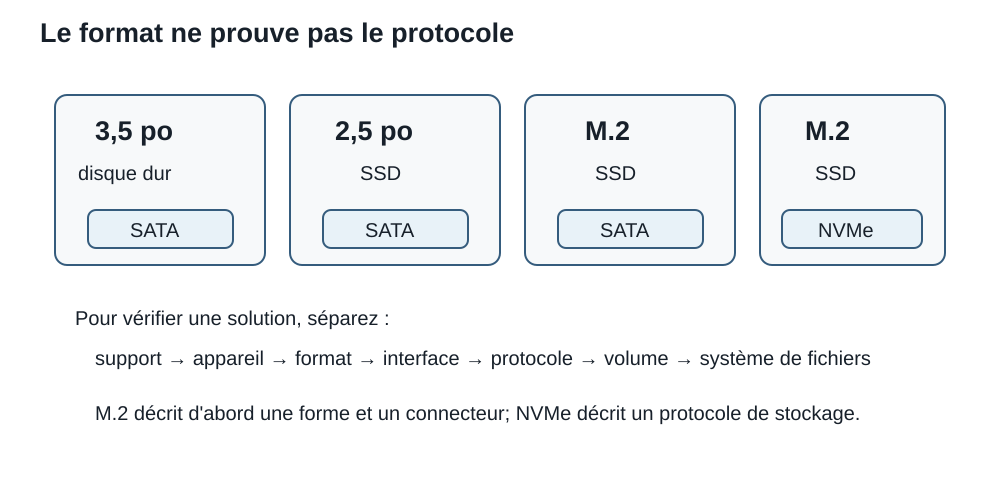

# Séance 9 - Du support à la protection des données : choisir une stratégie de stockage

## But de la séance

À la Séance 8, nous avons vérifié qu'un appareil de stockage pouvait être installé sur une plateforme : format M.2, interface, lignes PCIe, ports SATA et ressources partagées. Cette compatibilité constitue seulement le début de l'évaluation.

Un SSD très rapide peut manquer d'espace. Un HDD de grande capacité peut ralentir une charge composée de milliers de petits fichiers. Deux disques identiques peuvent offrir des résultats très différents selon qu'ils sont utilisés séparément, en miroir ou en RAID 0. Une synchronisation peut reproduire une suppression sur tous les appareils. Une sauvegarde peut exister sans être réellement restaurable.

Nous passons donc de la question **« Est-ce que ce disque fonctionne dans ce PC? »** à une question plus complète :

> Quelle combinaison de supports, d'appareils, d'organisation logique et de mécanismes de protection répond au besoin, au budget et au risque?

Cette séance suit le chemin complet de la donnée : du support magnétique ou flash jusqu'au fichier visible par le système d'exploitation, puis du fichier jusqu'à la stratégie de récupération après un incident. Comme dans les autres séances consacrées au matériel, l'objectif n'est pas de mémoriser un catalogue de produits. Il faut comprendre les mécanismes suffisamment pour **interpréter une fiche technique, comparer des options et justifier une recommandation**.

## Objectifs

### Parcours principal

À la fin de la séance et du laboratoire associé, vous devriez être en mesure de :

- distinguer **support**, **appareil**, **format**, **connecteur**, **interface**, **protocole**, **partition**, **volume** et **système de fichiers**;
- expliquer le chemin général suivi par une lecture ou une écriture sur un HDD;
- relier temps de recherche, latence rotationnelle et débit séquentiel au comportement d'un HDD;
- expliquer les rôles généraux des pages, blocs, contrôleur, traduction d'adresses, collecte des déchets, nivellement de l'usure et TRIM dans un SSD;
- comparer HDD, SSD SATA et SSD NVMe selon une charge de travail plutôt qu'à partir d'un seul nombre maximal;
- distinguer les formats 3,5 po, 2,5 po et M.2 des interfaces ou protocoles qu'ils peuvent utiliser;
- distinguer SATA, PCI Express, NVMe et M.2 et reconnaître les connecteurs SATA de données et d'alimentation;
- convertir une capacité annoncée entre unités décimales et binaires et estimer un temps de transfert;
- interpréter un style de partition, une partition, un volume, un point de montage et un système de fichiers rapportés par Windows;
- expliquer les mécanismes de répartition, miroir et parité utilisés par les niveaux RAID courants;
- calculer la capacité utile et la tolérance des RAID 0, 1, 5, 6 et 10;
- expliquer l'état dégradé, la reconstruction et les limites d'un RAID comme mécanisme de protection;
- distinguer RAID, sauvegarde, synchronisation, versionnement et instantané;
- relier fréquence de sauvegarde, perte de données acceptable et délai de récupération;
- recommander une stratégie de stockage et de récupération en tenant compte de la performance, de la compatibilité, du coût, du cycle de vie et des preuves disponibles.

!!! question "Questions directrices"
    1. **Comment la donnée est-elle réellement conservée?** Le mécanisme du support explique certaines forces et certaines limites.
    2. **Quel nombre décrit le besoin?** Capacité, débit, IOPS, latence et endurance répondent à des questions différentes.
    3. **Quel chemin la donnée doit-elle traverser?** Le format physique, l'interface, le protocole, le contrôleur et le système d'exploitation peuvent tous imposer une limite.
    4. **Quel incident veut-on prévenir ou récupérer?** RAID, sauvegarde, versionnement et synchronisation ne répondent pas au même risque.
    5. **Quelle preuve manque encore?** Une fiche technique, un état « Healthy » ou une vitesse annoncée ne suffit pas toujours pour conclure.

!!! info "Portée de la séance"
    **À maîtriser aujourd'hui :** modèle en couches du stockage; mécanismes généraux HDD et SSD; formats 3,5 po, 2,5 po et M.2; distinction M.2/SATA/PCIe/NVMe; performances séquentielles et aléatoires; capacité décimale et binaire; GPT et MBR comme styles de partition; rôles d'un système de fichiers; RAID 0, 1, 5, 6 et 10; état dégradé et reconstruction; sauvegarde, synchronisation, versionnement et instantané.

    **À reconnaître aujourd'hui :** pistes et secteurs; CMR et SMR; secteurs logiques et physiques; pages et blocs de mémoire flash; traduction d'adresses, collecte des déchets, nivellement de l'usure et TRIM; caches d'écriture; SLC/MLC/TLC/QLC; TBW; S.M.A.R.T.; stockage optique, amovible, réseau, infonuagique et sur bande; objectifs de point et de temps de récupération; règle 3-2-1.

    **Pour aller plus loin après le lien du laboratoire :** parité et XOR; amplification d'écriture; organisation détaillée de NAND; 512e et 4Kn; systèmes de fichiers à somme de contrôle; sauvegardes immuables et stockage par zones. Cette partie est facultative.

<div class="admonition info session-9-navigation"><p class="admonition-title">Repères de navigation</p>
<p>Cette séance est volontairement détaillée parce qu'elle sert de référence après le cours. Pour une première lecture, suivez le parcours suivant :</p>
<ol>
<li><strong>Support physique :</strong> comprendre pourquoi HDD et SSD se comportent différemment.</li>
<li><strong>Chemin vers le système :</strong> séparer format, connecteur, interface et protocole.</li>
<li><strong>Mesures :</strong> capacité, débit, IOPS, latence et endurance.</li>
<li><strong>Organisation logique :</strong> disque, partition, volume et système de fichiers.</li>
<li><strong>Disponibilité :</strong> répartition, miroir, parité et RAID.</li>
<li><strong>Récupération :</strong> sauvegarde, versions, instantanés et copie hors site.</li>
</ol>
<p>Les détails de technologies de cellules, de secteurs physiques et de mécanismes avancés restent du contenu de reconnaissance ou d'approfondissement selon la portée indiquée plus haut.</p></div>

## Le problème d'un seul « bon disque »

Le projet **Atlas** vise un PC de jeu et de diffusion en continu. La plateforme accepte un SSD NVMe M.2 de 2 To. Le client veut aussi conserver :

- le système d'exploitation et les jeux actifs;
- des projets vidéo en cours de montage;
- plusieurs téraoctets d'enregistrements terminés;
- des travaux de cours;
- des photos irremplaçables;
- des fichiers synchronisés entre deux appareils.

Le SSD principal peut répondre au besoin de rapidité, mais il ne répond pas à toutes les autres questions. Combien d'espace faudra-t-il dans deux ans? Les fichiers vidéo sont-ils lus de façon séquentielle ou modifiés en petits blocs? Que se passe-t-il si le SSD tombe en panne? Si un fichier est supprimé? Si le compte de synchronisation est compromis? Si le logement subit un vol ou un incendie?

Une recommandation doit donc séparer au moins trois problèmes :

```text
performance et capacité
+ organisation des données
+ récupération après un incident
```

??? question "Vérification : deux disques valent-ils automatiquement mieux qu'un?"
    Non. Deux disques peuvent former un RAID 0 sans tolérance, un miroir qui reproduit les suppressions, ou deux copies réellement indépendantes. Le nombre d'appareils ne révèle pas leur rôle.

## Le stockage est une pile de décisions

Le mot « disque » est souvent utilisé pour plusieurs choses différentes. Pour évaluer correctement une solution, il faut séparer les couches.

```text
besoin, valeur des données et risque
                ↓
politique de conservation et de récupération
                ↓
système de fichiers, volume et point de montage
                ↓
partition et table de partitions
                ↓
appareil de stockage et son contrôleur
                ↓
support physique
                ↓
interface, protocole et chemin vers le système
```

| Couche | Question utile | Exemple |
|---|---|---|
| Support | Comment les bits sont-ils conservés? | surface magnétique, NAND flash, bande |
| Appareil | Quel contrôleur gère le support? | HDD, SSD, lecteur de bande |
| Format | Quelles dimensions et quel montage? | 3,5 po, 2,5 po, M.2 2280 |
| Connecteur/interface | Par quel chemin physique et électrique? | SATA, connecteur M.2, PCIe |
| Protocole | Quelles commandes sont échangées? | ATA sur SATA, NVMe sur PCIe |
| Organisation logique | Comment l'espace devient-il utilisable? | GPT, partition, volume, NTFS |
| Protection | Comment récupère-t-on après un incident? | sauvegarde, versions, copie hors site |

!!! example "Un même aspect, plusieurs couches"
    Un module M.2 2280 peut contenir un SSD SATA ou un SSD PCIe/NVMe. Un SSD SATA 2,5 po et un HDD SATA 3,5 po peuvent employer des connecteurs de données de la même famille. La forme extérieure ne prouve donc ni le protocole, ni la performance, ni le rôle de l'appareil.

## Le HDD : des bits sur un support en mouvement

Un **disque dur**, ou **HDD** (*hard disk drive*), conserve les données par magnétisation de surfaces recouvrant un ou plusieurs plateaux. Les plateaux tournent autour d'un axe. Un actionneur déplace un bras qui positionne les têtes de lecture et d'écriture au-dessus de la zone voulue.

<figure markdown="span">
  { loading=lazy width="760" }
  <figcaption>Un HDD ouvert permet d'observer les plateaux, le bras de l'actionneur et les têtes de lecture-écriture. Photo : Matthew Field, <a href="https://commons.wikimedia.org/wiki/File:Hard_disk_platters_and_head.jpg">Wikimedia Commons</a>, <a href="https://creativecommons.org/licenses/by-sa/3.0/">CC BY-SA 3.0</a>.</figcaption>
</figure>

### Plateaux, pistes et secteurs

Dans un modèle simplifié, chaque surface est divisée en **pistes** concentriques, elles-mêmes divisées en **secteurs**. Les disques modernes exposent toutefois au système des **adresses logiques de blocs** plutôt qu'une géométrie physique que le logiciel doit calculer directement.

```text
surface d'un plateau

   ┌──────────────────────────────┐
   │      piste extérieure        │
   │   ┌──────────────────────┐   │
   │   │   piste intérieure   │   │
   │   │      ◉ axe           │   │
   │   └──────────────────────┘   │
   └──────────────────────────────┘

une piste → plusieurs secteurs / blocs physiques
```

Le contrôleur du HDD traduit donc une requête logique en opérations physiques. Le système d'exploitation ne demande pas « déplace la tête de 14,2 mm et tourne de 37 degrés »; il demande un bloc logique et le micrologiciel du disque détermine comment l'atteindre.

### Le chemin d'une lecture

Pour lire des données qui ne se trouvent pas déjà dans un cache, un HDD doit généralement :

1. recevoir une requête portant sur une adresse logique;
2. positionner les têtes sur la bonne région du plateau;
3. attendre que la rotation place les données sous la tête;
4. lire les signaux magnétiques et les convertir en données numériques;
5. effectuer les contrôles et corrections prévus par le contrôleur;
6. transférer les données vers l'hôte par l'interface.

Trois notions deviennent alors importantes :

- le **temps de recherche** (*seek time*) : temps nécessaire pour positionner les têtes;
- la **latence rotationnelle** : attente liée à la position angulaire des données;
- le **temps de transfert** : temps nécessaire pour lire ou écrire les données une fois la bonne zone atteinte.

Ces étapes expliquent pourquoi un HDD peut transférer un long fichier à un débit raisonnable tout en répondant beaucoup plus lentement à une grande quantité de petites requêtes dispersées.

### Un calcul de latence rotationnelle

Prenons un HDD à `7 200 tr/min`.

```text
60 secondes ÷ 7 200 tours
≈ 0,00833 seconde par tour
≈ 8,33 ms par tour
```

Si la position recherchée est distribuée au hasard, l'attente rotationnelle moyenne correspond approximativement à un demi-tour :

```text
8,33 ms ÷ 2 ≈ 4,17 ms
```

Cette valeur **n'est pas le temps d'accès total**. Il faut encore considérer le déplacement de la tête, le cache, la file de requêtes, les corrections et le transfert. Le calcul sert surtout à montrer qu'un mécanisme tournant possède une latence physique que l'augmentation du débit de l'interface ne peut pas supprimer.

??? question "Vérification : pourquoi la copie d'un gros fichier peut-elle sembler rapide alors qu'une application chargée de petits fichiers semble lente?"
    Une lecture séquentielle amortit le coût de positionnement sur une grande quantité de données contiguës. Des accès aléatoires peuvent répéter recherche et attente rotationnelle pour de petites quantités de données.

### Formats 3,5 po et 2,5 po

Les deux formats de HDD les plus courants dans les PC sont **3,5 pouces** et **2,5 pouces**. Le nom désigne une famille de dimensions normalisées; il ne faut pas le traiter comme une mesure exacte du boîtier ou du diamètre des plateaux.

<figure markdown="span">
  { loading=lazy width="650" }
  <figcaption>Comparaison visuelle des formats 2,5 po et 3,5 po. Photo : MaxVT, <a href="https://commons.wikimedia.org/wiki/File:Comparison_of_3.5_and_2.5_inch_hard_drives.jpg">Wikimedia Commons</a>, <a href="https://creativecommons.org/licenses/by-sa/3.0/">CC BY-SA 3.0</a>.</figcaption>
</figure>

| Format | Contexte fréquent | Contraintes à vérifier |
|---|---|---|
| HDD 3,5 po | PC de bureau, NAS, stockage de grande capacité | baie du boîtier, alimentation, vibrations, refroidissement |
| HDD 2,5 po | portables plus anciens, serveurs compacts, boîtiers externes | hauteur du disque, baie/adaptateur, alimentation, capacité disponible |
| SSD 2,5 po | remplacement ou ajout SATA dans de nombreux PC | baie, câble SATA de données, alimentation SATA |
| M.2 | SSD compact monté directement sur carte mère ou adaptateur | longueur, clé, interface, lignes, dissipateur et ressources partagées |

Le format influence le montage, mais il ne suffit pas à déterminer l'interface ni la performance.

### Connecteurs SATA : données et alimentation sont séparées

Un HDD SATA ou un SSD SATA 2,5 po utilise normalement deux connexions :

- une connexion **SATA de données** vers la carte mère ou le contrôleur;
- une connexion **SATA d'alimentation** provenant du bloc d'alimentation ou d'un fond de panier.

<figure markdown="span">
  { loading=lazy width="720" }
  <figcaption>Les connecteurs SATA de données et d'alimentation ont des rôles distincts. Photo : Bubba73, <a href="https://commons.wikimedia.org/wiki/File:SATA_data_and_power_connectors.jpg">Wikimedia Commons</a>, <a href="https://creativecommons.org/licenses/by-sa/4.0/">CC BY-SA 4.0</a>.</figcaption>
</figure>

Un disque externe USB peut contenir un appareil SATA derrière un pont USB-SATA. Dans ce cas, l'ordinateur voit le chemin externe USB tandis que le boîtier traduit vers l'interface interne. Encore une fois, **l'appareil, le connecteur visible et le support physique sont des couches différentes**.

### CMR et SMR : deux façons d'organiser les pistes magnétiques

Tous les HDD ne placent pas les pistes de la même façon.

Dans un HDD utilisant l'enregistrement magnétique conventionnel **CMR** (*conventional magnetic recording*), les pistes sont organisées de manière à pouvoir être réécrites sans devoir volontairement chevaucher les pistes voisines dans le modèle général.

L'enregistrement **SMR** (*shingled magnetic recording*) augmente la densité en faisant se chevaucher partiellement des pistes, un peu comme les bardeaux d'un toit. Cette organisation peut rendre certaines réécritures plus complexes, car modifier une piste peut exiger de réorganiser une zone plus large. Le comportement exact dépend de l'implémentation et du micrologiciel.

<figure markdown="span">
  { loading=lazy width="720" }
  <figcaption>Principe visuel de pistes partiellement superposées en SMR. Illustration : WikiTapeUser, <a href="https://commons.wikimedia.org/wiki/File:SMR_HDD.png">Wikimedia Commons</a>, <a href="https://creativecommons.org/licenses/by-sa/4.0/">CC BY-SA 4.0</a>.</figcaption>
</figure>

| Technologie | Atout possible | Question d'évaluation |
|---|---|---|
| CMR | comportement de réécriture plus direct pour de nombreux usages généraux | capacité, coût, débit, charge prévue |
| SMR | densité et capacité élevées pour certains produits et charges | la charge comporte-t-elle de nombreuses réécritures aléatoires ou peut-elle être séquentielle? |

!!! warning "CMR n'est pas automatiquement « bon » et SMR automatiquement « mauvais »"
    Une technologie peut convenir à une archive séquentielle et moins bien à une autre charge. Vérifiez le **modèle exact**, la documentation du fabricant et le scénario d'utilisation. Ne déduisez pas le comportement d'un disque uniquement à partir de son étiquette commerciale.

### Ce qu'il faut réellement comparer entre deux HDD

La vitesse de rotation n'est qu'un critère. Selon le besoin, vérifiez aussi :

- la capacité;
- le débit séquentiel soutenu;
- le type de charge prévu par le fabricant;
- CMR ou SMR lorsque cette information est pertinente;
- la consommation, le bruit et les vibrations;
- la garantie;
- la charge de travail ou les limites d'utilisation publiées;
- les fonctions de surveillance;
- le coût par téraoctet;
- la possibilité de remplacement dans le système visé.

!!! note "Secteur logique et secteur physique"
    Un système peut présenter des blocs logiques d'une taille différente de l'organisation physique interne. Des termes comme **512e** et **4Kn** décrivent certaines de ces situations. Vous devez surtout reconnaître que la taille de bloc rapportée par le système n'est pas toujours une description complète de la géométrie physique. Les détails restent en approfondissement.

## Le SSD : de la mémoire flash gérée par un contrôleur

Un **SSD** (*solid-state drive*) conserve les données dans de la mémoire flash non volatile. Il n'a pas de tête mobile et ne subit donc pas la recherche mécanique ni la latence rotationnelle d'un HDD. Cela ne signifie pas qu'il est instantané, que toutes les écritures ont la même vitesse ou que la mémoire flash peut être réécrite sans contrainte.

### Pages et blocs : lire, programmer, effacer

Dans un modèle simplifié de NAND flash :

- les données sont lues et programmées par **pages**;
- l'effacement s'effectue sur des unités plus grandes appelées **blocs**;
- une page ne peut pas toujours être réécrite directement comme un octet de RAM;
- avant de réutiliser certaines cellules, le contrôleur doit éventuellement déplacer des données valides puis effacer un bloc.

```text
bloc NAND
├── page 0
├── page 1
├── page 2
├── ...
└── page n

lecture / programmation → page
réutilisation complète  → peut exiger l'effacement du bloc
```

Cette différence entre unité de lecture-écriture et unité d'effacement explique une partie du travail invisible effectué par le contrôleur.

### Traduction d'adresses : l'ordinateur ne choisit pas la cellule

Le système d'exploitation envoie des requêtes portant sur des **blocs logiques**. Le SSD maintient une table de traduction, souvent décrite par le terme **FTL** (*flash translation layer*), qui associe ces adresses logiques à des emplacements physiques dans la mémoire flash.

Lorsqu'un bloc logique est modifié, le SSD peut écrire la nouvelle version à un autre emplacement et marquer l'ancienne comme invalide. Plus tard, la **collecte des déchets** (*garbage collection*) regroupe les données encore valides et libère des blocs pouvant être effacés.

```text
adresse logique 42
      ↓
table de traduction
      ↓
page physique disponible

ancienne page 42 → invalide → récupérée plus tard
```

L'utilisateur voit donc un espace de blocs relativement simple, alors que le contrôleur déplace et réorganise les données en arrière-plan.

### Nivellement de l'usure, correction et blocs de réserve

Les cellules flash supportent un nombre fini de cycles de programmation et d'effacement. Le contrôleur utilise plusieurs mécanismes pour rendre cette limite gérable :

- **nivellement de l'usure** : répartir les écritures afin d'éviter d'user toujours les mêmes blocs;
- **correction d'erreurs (ECC)** : détecter et corriger certaines erreurs de lecture;
- **gestion des blocs défectueux** : éviter ou remplacer des zones devenues inutilisables;
- **surprovisionnement** : conserver une partie de la flash hors de l'espace utilisateur afin d'aider aux remplacements, à la collecte des déchets et à la gestion de l'usure.

Ces fonctions sont principalement gérées par le contrôleur et son micrologiciel. Deux SSD de même capacité et utilisant la même interface peuvent donc se comporter différemment.

### TRIM : informer plutôt qu'effacer immédiatement

Lorsqu'un fichier est supprimé, le système de fichiers sait que certains blocs logiques ne contiennent plus de données utiles. Une commande **TRIM** permet au système d'indiquer cette information au SSD. Le contrôleur peut alors traiter ces pages comme inutiles lors de sa gestion interne.

!!! warning "TRIM n'est pas une commande d'effacement sécurisé"
    TRIM indique que certains blocs logiques ne sont plus nécessaires. Il ne constitue pas, à lui seul, une preuve que chaque cellule physique correspondante a été immédiatement effacée ou qu'une procédure de destruction de données est terminée.

### SLC, MLC, TLC et QLC : densité contre marge électrique

Une cellule flash peut représenter plus d'un bit en distinguant plusieurs niveaux électriques. Les noms suivants sont courants :

| Terme | Bits par cellule dans le modèle courant | Conséquence générale à reconnaître |
|---|---:|---|
| SLC | 1 | grande marge entre états, coût élevé par capacité |
| MLC | 2 | densité supérieure, compromis différent |
| TLC | 3 | très courant dans de nombreux SSD modernes |
| QLC | 4 | densité plus élevée, contraintes d'endurance et d'écriture à considérer |

Une conclusion ne doit pas être tirée uniquement du type de cellule. Le contrôleur, la quantité de flash de réserve, le cache, le micrologiciel, la capacité du modèle et la charge de travail influencent le résultat réel.

### Le cache peut rendre une courte mesure trompeuse

De nombreux SSD utilisent une partie de leur mémoire comme cache rapide, par exemple en faisant fonctionner temporairement une zone TLC ou QLC comme si elle stockait moins de bits par cellule. Une écriture courte peut alors atteindre un débit très élevé. Une écriture longue peut finir par dépasser ce cache et révéler un débit soutenu plus faible.

La performance peut aussi changer lorsque :

- le SSD est presque plein;
- une collecte des déchets importante est nécessaire;
- le contrôleur chauffe et réduit ses fréquences;
- la charge mélange lectures et écritures;
- plusieurs appareils partagent le même chemin PCIe;
- le système d'exploitation utilise son propre cache.

!!! question "Vérification : un SSD annoncé à 7 000 Mo/s écrit-il nécessairement 7 000 Mo/s pendant la copie de 2 To?"
    Non. Il faut vérifier si le nombre décrit une lecture ou une écriture, la taille de la charge, le cache, la température, le niveau de remplissage et le débit soutenu mesuré dans des conditions comparables.

### Endurance : TBW n'est pas une date de décès

L'endurance d'un SSD client est souvent exprimée en **TBW** (*terabytes written*), c'est-à-dire une quantité d'écritures associée à la spécification ou à la garantie du produit. Certains produits professionnels utilisent aussi **DWPD** (*drive writes per day*).

Une valeur plus élevée n'est pas automatiquement préférable. Il faut la relier :

- au volume d'écriture prévu;
- à la durée d'utilisation;
- à la garantie;
- à la capacité;
- au coût;
- à la possibilité de remplacer l'appareil sans interruption excessive.

## Format, interface et protocole : éviter quatre confusions fréquentes

Les termes **M.2**, **SATA**, **PCI Express** et **NVMe** sont souvent mélangés, mais ils ne décrivent pas la même chose.

| Terme | Décrit principalement | Ne prouve pas à lui seul |
|---|---|---|
| 2,5 po / 3,5 po | format physique | interface ou vitesse |
| M.2 | format de module, connecteur et système de clés | SATA ou NVMe; nombre de lignes; performance |
| SATA | interface série de stockage; transporte généralement des commandes ATA | format de l'appareil; vitesse réelle du support |
| PCI Express | interconnexion générale à lignes et générations | que l'appareil est un SSD ou qu'il utilise NVMe |
| NVMe | interface de registres et jeu de commandes pour stockage non volatil, couramment sur PCIe | format M.2; génération PCIe précise |

### Deux SSD M.2 peuvent être différents

<figure markdown="span">
  { loading=lazy width="520" }
  <figcaption>Deux SSD M.2 peuvent utiliser des interfaces différentes malgré un format général similaire. Photo : ガラパリ, <a href="https://commons.wikimedia.org/wiki/File:M2_SATA_M2_NVMe_compare.png">Wikimedia Commons</a>, <a href="https://creativecommons.org/licenses/by-sa/4.0/">CC BY-SA 4.0</a>.</figcaption>
</figure>

À la Séance 8, nous avons vu qu'il faut vérifier la clé, la longueur, l'interface, les lignes et les ressources partagées du connecteur M.2. Cette logique reste valable ici : **M.2 décrit d'abord comment le module se présente et se connecte; NVMe décrit comment un appareil de stockage communique.**

### SATA 6 Gb/s n'est pas 6 GB/s

Les fiches techniques peuvent mélanger bits et octets.

```text
6 Gb/s = 6 gigabits par seconde
6 GB/s = 6 gigaoctets par seconde
```

Avant même de considérer les en-têtes et autres surcharges :

```text
6 Gb/s ÷ 8 = 0,75 GB/s
```

Le débit de données réellement utilisable est plus faible que ce plafond brut. Le même principe vaut pour les autres interfaces : la vitesse de signalisation ou la bande passante théorique représente un **plafond**, pas une promesse de débit du support.

!!! warning "La limite de l'interface n'est pas la vitesse du support"
    Un HDD SATA ne devient pas aussi rapide qu'un SSD SATA parce qu'ils utilisent le même connecteur. Inversement, un SSD NVMe très rapide peut être limité par une génération PCIe plus ancienne, moins de lignes, la température, son contrôleur ou la charge de travail.

<figure markdown="span">
  { loading=lazy width="900" }
  <figcaption>Schéma de synthèse créé pour C12. Il sert de repère conceptuel; les spécifications réelles doivent toujours être vérifiées dans la documentation du matériel.</figcaption>
</figure>

## Mesurer la performance utile

Un seul nombre de « vitesse » ne décrit pas correctement un système de stockage. Il faut choisir la mesure qui correspond à la charge.

### Débit séquentiel

Le **débit séquentiel** mesure la quantité de données transférée lorsque les blocs sont lus ou écrits dans un ordre relativement continu. Il est particulièrement pertinent pour :

- de gros fichiers vidéo;
- des images disque;
- certaines sauvegardes;
- la copie de grands ensembles déjà organisés de façon séquentielle.

### IOPS et accès aléatoires

Les **IOPS** (*input/output operations per second*) indiquent combien d'opérations d'entrée-sortie peuvent être réalisées par seconde dans un scénario donné. Le nombre dépend notamment :

- de la taille des blocs;
- de la proportion lecture/écriture;
- de la profondeur de file;
- du motif séquentiel ou aléatoire;
- du logiciel et du matériel utilisés pour le test.

`100 000 IOPS` sans taille de bloc ni contexte n'est donc pas une description complète.

!!! example "Relier IOPS et quantité de données"
    Si chaque opération transporte `4 Kio`, alors `100 000 IOPS` représentent théoriquement :

    ```text
    100 000 × 4 096 octets
    = 409 600 000 octets/s
    ≈ 409,6 Mo/s
    ≈ 390,6 Mio/s
    ```

    Ce calcul ne prédit pas la performance d'un appareil. Il montre seulement que le nombre d'opérations et la taille de chaque opération doivent être interprétés ensemble.

### Latence

La **latence** mesure le temps entre une demande et sa réponse. Pour une application qui effectue de nombreuses petites lectures dépendantes les unes des autres, quelques millisecondes ou microsecondes supplémentaires par opération peuvent compter davantage qu'un très grand débit séquentiel maximal.

### Profondeur de file

La **profondeur de file** indique combien de requêtes peuvent être en attente simultanément dans un scénario de mesure. Une charge de serveur capable d'envoyer plusieurs requêtes en parallèle n'est pas la même chose qu'une application de bureau qui attend souvent la réponse d'une opération avant d'en demander une autre.

### Pointe, cache et débit soutenu

Une fiche peut annoncer une **pointe** mesurée sur une courte durée. Une charge comme l'enregistrement vidéo ou une grande copie demande plutôt :

> Quel débit peut être maintenu après les caches et pendant la durée réelle de la tâche?

### Le chemin complet compte

```text
application
   ↓
système de fichiers
   ↓
cache du système d'exploitation
   ↓
pilote / file de requêtes
   ↓
protocole
   ↓
interface et contrôleur
   ↓
support physique
```

Une mesure observée au niveau de l'application inclut plusieurs couches. Une valeur plus faible que le maximum du SSD ne prouve pas que le SSD est défectueux.

### Tableau de décision par charge

| Charge | Mesures particulièrement utiles | Piège fréquent |
|---|---|---|
| Démarrage et applications | latence, accès aléatoires, IOPS à faible profondeur de file | regarder seulement le débit séquentiel maximal |
| Montage et copie de gros médias | débit séquentiel soutenu, capacité | ignorer la chute après cache |
| Jeux | temps de chargement, accès aléatoires, capacité | supposer qu'un SSD deux fois plus rapide sur une fiche réduit tous les temps de moitié |
| Archives | capacité, coût/TB, fiabilité, récupération | payer pour une latence qui n'est pas utile |
| Machines virtuelles ou bases de données | latence, IOPS, mélange lecture/écriture, endurance | utiliser un seul benchmark de lecture séquentielle |
| Sauvegarde | débit soutenu, capacité, connexion, rétention | oublier le temps de restauration |

??? question "Vérification : quel nombre faut-il comparer?"
    Un projet vidéo peut dépendre du débit soutenu et de la capacité. Le démarrage d'applications dépend davantage de la latence et des accès dispersés. Une archive peut privilégier capacité, coût et récupération. Identifiez la charge avant de choisir la mesure.

## Capacité : octets annoncés, espace utilisable et espace libre

### To et Tio

Les fabricants utilisent généralement les préfixes décimaux :

```text
1 To = 10^12 octets
```

Les unités binaires utilisent :

```text
1 Tio = 2^40 octets
```

Un SSD annoncé à 2 To contient donc environ :

```text
2 000 000 000 000 ÷ 1 099 511 627 776 ≈ 1,82 Tio
```

Cette différence d'unités n'est pas une perte de données.

### Capacité brute, capacité utilisable et espace libre

Trois valeurs doivent être distinguées :

- **capacité annoncée** : quantité d'octets vendue selon la convention du fabricant;
- **capacité utilisable par un volume** : espace restant après certaines réservations, partitions et métadonnées;
- **espace libre** : partie de ce volume qui ne contient pas actuellement de données allouées.

```text
capacité annoncée
- espace réservé par appareil ou organisation
- partitions non affectées au volume étudié
- métadonnées du système de fichiers
- données déjà présentes
= espace libre observé
```

Cette représentation est conceptuelle. Les détails varient selon l'appareil, le système de fichiers et le système d'exploitation.

!!! warning "Ne pas attribuer toute différence au formatage"
    Une différence entre la valeur sur la boîte et la valeur affichée peut venir des unités décimales/binaires, des partitions, de l'espace réservé et des métadonnées. Identifiez l'unité et la couche avant d'expliquer l'écart.

### Estimer un temps de transfert

```text
temps = quantité de données ÷ débit effectif
```

Par exemple, pour `750 Go` copiés à un débit effectif de `150 Mo/s` :

```text
750 000 Mo ÷ 150 Mo/s
= 5 000 s
≈ 83 min 20 s
```

Le résultat est une estimation minimale si le débit de `150 Mo/s` est réellement soutenu. De nombreux facteurs peuvent l'allonger : petits fichiers, métadonnées, antivirus, cache, chaleur, ralentissement après cache, réseau, chiffrement ou partage de l'interface.

??? question "Vérification : 2 To affichés comme environ 1,82 Tio indiquent-ils une perte?"
    Non. Les deux nombres décrivent approximativement la même quantité d'octets avec des unités différentes. Vérifiez d'abord l'unité avant de conclure qu'une capacité manque.

## Du disque brut au fichier

Un appareil physique ne devient pas automatiquement un lecteur `C:` ou `D:`. Plusieurs couches logiques organisent l'espace.

```text
appareil / disque
  └── table de partitions
        └── partition
              └── volume
                    └── système de fichiers
                          └── point de montage
                                └── dossiers et fichiers
```

### Table de partitions

Une **table de partitions** décrit où se trouvent les partitions et quel rôle elles peuvent avoir.

Deux styles sont courants sur PC :

| Style | Contexte général | Points à reconnaître |
|---|---|---|
| MBR | ancien modèle PC et démarrage BIOS hérité | table historique; nombre limité de partitions primaires dans le schéma standard; contraintes avec de très grands disques |
| GPT | systèmes modernes, notamment avec UEFI | identifiants GUID, nombreuses entrées de partition, métadonnées principales et de secours |

Sur Windows moderne démarré en mode UEFI, le disque système utilise normalement GPT. Des disques de données supplémentaires peuvent toutefois employer un autre style selon le contexte.

!!! note "GPT n'est pas un système de fichiers"
    GPT et MBR décrivent le **partitionnement**. NTFS, exFAT, ext4 et APFS décrivent des **systèmes de fichiers**. Un disque GPT n'est donc pas « formaté en NTFS » au même niveau de description : une partition ou un volume du disque peut contenir NTFS.

### Partition, volume et point de montage

Une **partition** est une région définie dans la table de partitions. Un **volume** est un espace logique présenté au système d'exploitation; il peut correspondre directement à une partition, mais des technologies plus avancées peuvent construire des volumes autrement.

Un **point de montage** rend le volume accessible dans l'arborescence du système. Sous Windows, une lettre comme `C:` est un point de montage courant, mais un volume peut aussi être monté dans un dossier ou rester sans lettre.

!!! warning "Une partition sans lettre n'est pas nécessairement inutilisée"
    Un poste peut contenir des partitions de démarrage, de récupération ou d'un autre système d'exploitation qui ne possèdent pas de lettre de lecteur. L'absence de lettre n'est **pas** une permission de modifier, initialiser ou formater la partition.

### Le système de fichiers organise les données

Un **système de fichiers** fournit les structures permettant notamment de gérer :

- les noms de fichiers et de dossiers;
- l'allocation de l'espace;
- les métadonnées comme tailles et dates;
- l'espace libre;
- certaines autorisations;
- certaines fonctions de journalisation ou de récupération.

Le disque peut être divisé en unités d'allocation plus grandes qu'un octet. La quantité d'espace réellement consommée et les métadonnées dépendent du système de fichiers et de sa configuration.

| Système de fichiers | Contexte général à reconnaître | Question de compatibilité |
|---|---|---|
| NTFS | Windows; autorisations, journalisation et grands volumes/fichiers | les autres appareils doivent-ils écrire? |
| exFAT | médias amovibles et échange entre plusieurs systèmes | faut-il les fonctions de sécurité ou journalisation de NTFS? |
| FAT32 | très large compatibilité historique | les limites de taille conviennent-elles? |
| ext4 | courant sous Linux | les systèmes clients doivent-ils le monter nativement? |
| APFS | courant sur les systèmes Apple récents | l'environnement est-il principalement Apple? |
| UDF | médias optiques et certains échanges spécialisés | quel lecteur et quel système doivent y accéder? |

Le « meilleur » système de fichiers n'existe pas sans contexte. Il faut connaître les appareils qui doivent lire et écrire, la taille des fichiers, les autorisations, la résilience attendue et les outils de récupération disponibles.

## État et santé : une mesure n'est pas une prédiction

Les appareils de stockage exposent différentes informations de diagnostic. Les HDD et SSD peuvent fournir des données **S.M.A.R.T.** (*Self-Monitoring, Analysis and Reporting Technology*). Windows peut aussi présenter des états comme `Healthy` ou `OK` par l'intermédiaire de différentes couches de stockage.

Ces états sont utiles, mais ils ont des limites :

- les attributs disponibles varient selon le fabricant et l'interface;
- une valeur générique peut cacher des détails;
- une alerte peut indiquer un problème déjà détecté;
- l'absence d'alerte ne garantit pas qu'une panne ne se produira pas demain;
- un état logiciel ne remplace pas une sauvegarde.

!!! example "Fait, inférence, recommandation"
    **Fait :** Windows rapporte `HealthStatus = Healthy` pour le disque observé.

    **Inférence raisonnable :** aucune condition que cette couche sait signaler n'est actuellement présentée comme défaillante.

    **Conclusion interdite :** « le disque ne tombera pas en panne ».

    **Recommandation :** conserver la protection prévue pour la valeur des données, même si l'état actuel est sain.

## RAID : combiner des appareils pour la performance ou la disponibilité

**RAID** désigne une famille de méthodes qui combinent plusieurs appareils de stockage. Les trois idées fondamentales sont la **répartition**, le **miroir** et la **parité**.

### Répartition (*striping*)

Les blocs sont distribués entre plusieurs appareils.

```text
          disque A   disque B
bloc 1       A1         A2
bloc 2       A3         A4
bloc 3       A5         A6
```

La répartition peut permettre de travailler avec plusieurs appareils en parallèle, mais elle ne crée aucune copie à elle seule.

### Miroir (*mirroring*)

Les mêmes données sont conservées sur plusieurs appareils.

```text
          disque A   disque B
bloc 1       A1         A1
bloc 2       A2         A2
bloc 3       A3         A3
```

Le miroir consomme de la capacité pour maintenir une copie disponible en cas de panne d'un membre.

### Parité

La **parité** conserve une information calculée qui permet de reconstruire certaines données manquantes. Dans les RAID à parité distribuée, les blocs de données et de parité sont répartis entre les appareils.

```text
          disque A   disque B   disque C
rangée 1     D1         D2         P1
rangée 2     D3         P2         D4
rangée 3     P3         D5         D6
```

Le détail mathématique de XOR est placé dans l'approfondissement. Pour le parcours principal, retenez que la parité offre une tolérance avec moins de duplication qu'un miroir complet, au prix de calculs et d'opérations supplémentaires, particulièrement lors de certaines écritures et reconstructions.

## RAID 0, 1, 5, 6 et 10

Pour `n` disques de même capacité `D` :

| Niveau | Mécanisme | Minimum | Capacité utile théorique | Tolérance générale |
|---|---|---:|---:|---|
| RAID 0 | répartition | 2 | `n × D` | aucune |
| RAID 1 | miroir | 2 | `D` | une ou plusieurs pannes tant qu'une copie complète demeure |
| RAID 5 | répartition + une parité distribuée | 3 | `(n - 1) × D` | une panne |
| RAID 6 | répartition + deux parités | 4 | `(n - 2) × D` | deux pannes |
| RAID 10 | répartition entre paires miroir | 4, nombre pair | `(n ÷ 2) × D` | dépend des paires miroir touchées |

!!! warning "Les formules supposent des membres de même capacité"
    Avec des appareils de tailles différentes, de nombreuses implémentations ne peuvent utiliser sur chaque membre que l'équivalent de la capacité du plus petit. Les règles exactes dépendent du contrôleur ou du logiciel RAID. Vérifiez la documentation de l'implémentation.

### Exemple de capacité

Quatre disques de `4 To` donnent `16 To` de capacité brute.

```text
RAID 0  : 4 × 4 To       = 16 To utiles, aucune tolérance
RAID 5  : (4 - 1) × 4 To = 12 To utiles, une panne tolérée
RAID 6  : (4 - 2) × 4 To =  8 To utiles, deux pannes tolérées
RAID 10 : (4 ÷ 2) × 4 To =  8 To utiles, tolérance selon les paires
```

Un RAID 1 composé de quatre membres tous miroirs conserverait `4 To` utiles. Certaines solutions organisent plutôt quatre disques comme deux miroirs répartis, ce qui correspond alors au principe de RAID 10. Le nom et l'implémentation doivent être vérifiés.

### RAID 0 : performance sans redondance

RAID 0 répartit les données. Une panne d'un seul membre peut rendre l'ensemble inutilisable parce que chaque fichier peut dépendre de blocs répartis sur plusieurs disques.

Le `R` de RAID ne doit donc pas être interprété comme une garantie de redondance dans RAID 0.

### RAID 1 : disponibilité par duplication

RAID 1 conserve une copie complète. Si un membre tombe en panne, une copie intacte peut permettre de continuer le service. La capacité utile correspond généralement à celle d'un seul membre de la taille considérée.

Un miroir reproduit cependant aussi les modifications logiques : suppression de fichier, chiffrement par logiciel malveillant ou corruption écrite par le système.

### RAID 5 et RAID 6 : parité distribuée

RAID 5 réserve l'équivalent d'un disque de capacité à la parité distribuée et tolère généralement une panne. RAID 6 réserve l'équivalent de deux disques et tolère généralement deux pannes.

Les écritures peuvent exiger davantage de travail qu'en RAID 0 ou dans certains miroirs parce que l'information de parité doit rester cohérente. La performance réelle dépend du contrôleur, du logiciel, de la taille des blocs, du cache et de la charge.

### RAID 10 : paires miroir et répartition

RAID 10 combine généralement des paires miroir, puis répartit les données entre ces paires.

Avec six disques organisés en trois paires, deux pannes peuvent être tolérées **si elles touchent des paires différentes**. Si les deux membres de la même paire tombent en panne, les données de cette paire sont perdues et l'ensemble peut échouer.

??? question "Vérification : deux pannes sont-elles toujours tolérées en RAID 10?"
    Non. La réponse dépend de l'emplacement des pannes dans les paires miroir. C'est un exemple où une conclusion correcte doit rester conditionnelle.

## État dégradé et reconstruction

Après une panne tolérée, un ensemble RAID est **dégradé**. Les données peuvent rester accessibles, mais la marge de sécurité est réduite.

Une **reconstruction** consiste à reconstituer les données manquantes sur un membre de remplacement à partir des copies ou de la parité disponibles.

Pendant cette période :

- de grandes quantités de données peuvent être lues;
- la performance peut diminuer;
- la reconstruction peut durer longtemps sur de gros disques;
- une nouvelle panne peut dépasser la tolérance restante;
- des erreurs latentes peuvent être découvertes pendant les lectures intensives.

La bonne réaction n'est pas « le RAID fonctionne encore, donc tout va bien ». Il faut vérifier l'état, remplacer le membre défaillant selon la procédure prévue, surveiller la reconstruction et confirmer qu'une sauvegarde récente et restaurable existe.

!!! question "Vérification : RAID 5 protège-t-il les fichiers pendant la reconstruction?"
    Il maintient normalement le service après une panne, mais la marge de tolérance est réduite. Vérifiez l'état de l'ensemble, la sauvegarde récente et le résultat d'un test de restauration avant de conclure que les données sont suffisamment protégées.

### RAID matériel et RAID logiciel

Le RAID peut être implémenté par :

- un contrôleur matériel dédié;
- le micrologiciel de plateforme;
- le système d'exploitation;
- un système de stockage spécialisé.

Ces solutions peuvent différer pour le cache, les métadonnées, les procédures de remplacement, la portabilité vers une autre machine et la surveillance. Le **niveau RAID** décrit une organisation générale; il ne décrit pas à lui seul tous les comportements du produit.

## RAID n'est pas une sauvegarde

Pour comprendre pourquoi, classons les incidents.

<figure markdown="span">

```text
panne d’un disque ───────────────→ RAID / disponibilité
suppression ou écrasement ───────→ versions / sauvegarde
corruption logique ──────────────→ version ou sauvegarde vérifiée
perte du site ou vol ────────────→ copie hors site
logiciel malveillant ────────────→ copie isolée / version / immutabilité selon le risque
besoin de revenir rapidement ────→ instantané, puis restauration vérifiée
```

<figcaption>Les mécanismes de protection ne répondent pas aux mêmes incidents. Une stratégie solide associe chaque risque à une méthode et à une preuve de restauration. Diagramme original du cours, CC BY 4.0.</figcaption>
</figure>

Un RAID peut augmenter la **disponibilité** : le service continue après certaines pannes matérielles. Une sauvegarde vise la **récupération d'un état antérieur ou indépendant**. Ce sont des objectifs différents.

## Sauvegarde, synchronisation, versionnement et instantané

| Mécanisme | But principal | Limite importante |
|---|---|---|
| RAID | disponibilité locale après certaines pannes | ne crée pas une copie indépendante |
| Sauvegarde | copie récupérable et séparée | exige fréquence, rétention et test de restauration |
| Synchronisation | maintenir un état courant entre emplacements | peut propager erreurs et suppressions |
| Versionnement | conserver certains états antérieurs | dépend de la durée et du nombre de versions conservées |
| Instantané | créer un point de retour rapide d'un volume ou système | reste souvent dans la même infrastructure |
| Copie hors site | survivre à la perte du site local | peut dépendre du réseau, du chiffrement et du fournisseur |

### Une sauvegarde doit avoir une politique

Une copie n'est pas encore une stratégie. Il faut définir :

- **quoi** sauvegarder;
- **à quelle fréquence**;
- **combien de temps** conserver les versions;
- **où** se trouvent les copies;
- **qui** peut les modifier ou les supprimer;
- **comment** restaurer;
- **quand** tester la restauration.

### Perte acceptable et délai de récupération

Deux idées utilisées en continuité et sauvegarde donnent un vocabulaire utile :

- **RPO** (*recovery point objective*, objectif de point de récupération) : quelle quantité de travail récent peut être perdue?;
- **RTO** (*recovery time objective*, objectif de temps de récupération) : combien de temps peut-on attendre avant de retrouver le service ou les données?

Exemple : si un étudiant ne peut perdre qu'une heure de travail, une sauvegarde quotidienne ne répond pas à ce RPO. Si une entreprise doit reprendre un service en dix minutes, une sauvegarde hors site lente à télécharger peut protéger les données sans satisfaire le RTO à elle seule.

### La règle 3-2-1

Une règle pratique courante est **3-2-1** :

- conserver trois copies des données importantes;
- utiliser deux supports ou systèmes distincts;
- conserver au moins une copie hors site.

Cette règle est un point de départ, pas une preuve suffisante. Elle ne précise pas la rétention, l'isolation contre un compte compromis, le chiffrement, la qualité des supports ni la fréquence des tests.

!!! warning "Synchronisé ne signifie pas sauvegardé"
    Si un dossier synchronisé est supprimé ou chiffré et que la modification est propagée immédiatement, tous les appareils peuvent reproduire le nouvel état. Le versionnement ou une sauvegarde indépendante peut fournir un retour en arrière; il faut vérifier la politique exacte du service.

!!! note "Chiffrement et sauvegarde répondent à des questions différentes"
    Le chiffrement protège principalement la confidentialité. Il ne crée pas une copie supplémentaire. Une clé perdue peut même rendre une sauvegarde inutilisable, donc la gestion des clés fait partie de la stratégie de récupération.

## Autres formes et emplacements de stockage

Le HDD et le SSD interne ne sont pas les seules options. Il faut distinguer **support**, **appareil** et **emplacement du service**.

| Forme | Usage possible | Limite à vérifier |
|---|---|---|
| Clé USB ou carte mémoire | transfert, installation, appareil mobile | endurance, authenticité, retrait sécuritaire, perte physique |
| SSD/HDD externe USB | copie locale, transfert, sauvegarde débranchable | pont USB, câble, alimentation, débit réel, risque de rester branché |
| CD, DVD, Blu-ray | distribution ou archive spécialisée | capacité, lecteur disponible, compatibilité, durée de vie du média |
| Bande magnétique | sauvegarde et archive à grande échelle | lecteur, bibliothèque, accès séquentiel, procédures, coût initial |
| NAS | stockage accessible par réseau local | réseau, authentification, RAID interne, sauvegarde du NAS lui-même |
| Stockage infonuagique | accès hors site, collaboration, versionnement possible | réseau, coût récurrent, rétention, confidentialité, frais de sortie |

« Dans l'infonuagique » décrit un emplacement de service, pas automatiquement une sauvegarde. « Sur un NAS » décrit un système de stockage en réseau, pas automatiquement une copie hors site. Dans les deux cas, il faut vérifier les mécanismes réellement fournis.

## Construire une recommandation de stockage

Une recommandation responsable n'est pas une liste de produits. Elle relie chaque choix à une exigence et à une preuve.

### 1. Classer les données

Demandez :

- sont-elles remplaçables, coûteuses à recréer ou irremplaçables?;
- sont-elles actives, temporaires ou archivées?;
- quelle croissance est prévue?;
- contiennent-elles des informations confidentielles?;
- combien de temps doivent-elles être conservées?

### 2. Décrire la charge de travail

- grandes lectures/écritures séquentielles?;
- nombreux petits accès aléatoires?;
- forte proportion d'écritures?;
- fonctionnement continu?;
- accès local ou réseau?;
- besoin de silence, faible consommation ou résistance aux chocs?

### 3. Vérifier la compatibilité du chemin complet

```text
format physique
+ baie ou emplacement
+ connecteur
+ interface
+ protocole
+ lignes / contrôleur
+ alimentation
+ système d'exploitation
```

### 4. Prévoir la capacité et la croissance

Un disque adapté aujourd'hui peut devenir trop petit bien avant d'être techniquement usé. Une recommandation doit donc distinguer :

- capacité requise maintenant;
- croissance estimée;
- marge de fonctionnement;
- coût d'une future migration.

### 5. Choisir le niveau de disponibilité nécessaire

RAID n'est utile que si la continuité après une panne justifie le coût, la capacité perdue et la complexité. Pour certaines données personnelles, une meilleure sauvegarde peut être plus importante qu'un RAID. Pour un serveur qui doit rester disponible, les deux peuvent être nécessaires.

### 6. Concevoir la récupération

Associez chaque incident important à un mécanisme :

| Incident | Mécanisme possible à évaluer |
|---|---|
| panne d'un appareil | RAID ou remplacement rapide + restauration |
| suppression accidentelle | versions ou sauvegarde |
| ransomware | copie isolée, versionnée ou immuable selon la menace |
| vol/incendie | copie hors site |
| corruption découverte tardivement | rétention de plusieurs versions |
| besoin de reprise très rapide | instantané, réplication ou système de secours selon le contexte |

### 7. Examiner le cycle de vie

Le plan cadre demande d'appuyer les avis sur la longévité, la stabilité, l'efficacité et la maintenabilité. Pour le stockage, ces critères peuvent être posés ainsi :

| Critère | Questions de stockage |
|---|---|
| **Longévité** | La capacité et l'endurance resteront-elles suffisantes? Le format et l'interface resteront-ils supportés pendant la durée prévue? |
| **Stabilité** | L'appareil convient-il à la charge continue ou occasionnelle? Quelles preuves de santé, garantie et comportement soutenu sont disponibles? |
| **Efficacité** | La performance utile justifie-t-elle le coût, la consommation, le bruit, la chaleur et la capacité sacrifiée? |
| **Maintenabilité** | Le disque peut-il être remplacé facilement? La reconstruction ou la restauration est-elle documentée et testée? Les données peuvent-elles migrer vers un autre système? |

### 8. Nommer les limites et questions ouvertes

Une conclusion techniquement honnête peut ressembler à ceci :

> Les preuves disponibles soutiennent provisoirement ce type de stockage pour la charge active, mais il faut encore vérifier le débit d'écriture soutenu du modèle exact et la politique de rétention de la sauvegarde avant de finaliser la recommandation.

Cette formulation est plus utile que « prenez le disque le plus rapide ».

## Synthèse intégrée

Une stratégie complète peut être résumée comme une chaîne de questions :

```text
valeur des données et risques
        ↓
charge de travail
        ↓
support et appareil
        ↓
format + interface + protocole
        ↓
performance et capacité
        ↓
partition + volume + système de fichiers
        ↓
disponibilité nécessaire
        ↓
sauvegarde + rétention + copie hors site
        ↓
test de restauration
        ↓
coût et cycle de vie
```

HDD, SSD SATA et SSD NVMe répondent différemment aux besoins de capacité, latence, débit, coût, bruit, consommation et endurance. CMR et SMR montrent qu'une même famille de support peut elle-même contenir des compromis importants. RAID 0, 1, 5, 6 et 10 organisent plusieurs appareils pour des objectifs différents. Sauvegarde, synchronisation, versionnement et instantané répondent à des incidents différents.

Une solution solide ne dit pas seulement **où les données seront stockées**. Elle nomme :

- la charge prévue;
- la capacité et la croissance;
- les contraintes physiques et logiques;
- les incidents envisagés;
- la perte acceptable;
- le délai de récupération;
- la rétention;
- la preuve qu'une restauration est possible;
- les conséquences de coût et de maintenance.

## Erreurs fréquentes à éviter

| Erreur plausible | Test ou méthode corrective |
|---|---|
| Employer M.2 comme synonyme de NVMe | Identifier séparément le format, l'interface et le protocole. |
| Supposer qu'un SSD M.2 est automatiquement plus rapide qu'un SSD 2,5 po | Vérifier SATA/PCIe/NVMe, les lignes, le contrôleur et la charge. |
| Comparer seulement le débit maximal | Identifier séquentiel/aléatoire, taille de bloc, latence, profondeur de file et débit soutenu pertinent. |
| Traiter 6 Gb/s comme 6 GB/s | Vérifier bits contre octets, puis tenir compte des surcharges. |
| Présumer que la vitesse du connecteur est celle du disque | Traiter la bande passante de l'interface comme un plafond, puis vérifier les mesures de l'appareil. |
| Choisir un HDD seulement avec le nombre de tr/min | Ajouter latence, débit soutenu, CMR/SMR, charge, bruit, garantie et coût. |
| Conclure qu'un état `Healthy` garantit l'avenir | Traiter l'état comme une observation actuelle, pas une prédiction. |
| Interpréter 2 To et 2 Tio comme la même unité | Convertir les octets avec `10^12` et `2^40` avant de comparer. |
| Confondre GPT et NTFS | Séparer table de partitions et système de fichiers. |
| Supposer qu'une partition sans lettre est inutile | Identifier son rôle avant toute action; ne pas modifier une partition inconnue. |
| Appeler RAID 0 « redondant » | Vérifier si des copies ou de la parité existent; RAID 0 n'en fournit aucune. |
| Dire qu'un RAID 10 tolère toujours deux pannes | Identifier les paires miroir touchées. |
| Appeler un miroir une sauvegarde | Vérifier indépendance, rétention et test de restauration. |
| Supposer que l'infonuagique inclut toujours sauvegarde et versionnement | Lire la politique de rétention, suppression et restauration du service. |
| Recommander une sauvegarde sans test | Définir un fichier ou ensemble de test, une fréquence et un critère de restauration réussie. |

## Ce qu'il faut retenir

- Le stockage doit être décrit en couches : support, appareil, format, interface, protocole, organisation logique et protection.
- Un HDD possède des coûts mécaniques de recherche et de rotation; le séquentiel et l'aléatoire peuvent donc se comporter très différemment.
- CMR et SMR représentent des compromis différents; il faut vérifier le modèle et la charge plutôt que juger le sigle seul.
- Un SSD masque une gestion complexe de pages, blocs, traduction d'adresses, collecte des déchets et usure derrière des blocs logiques simples.
- M.2 est principalement un format; SATA et PCIe décrivent des chemins de communication; NVMe décrit un protocole/interface de stockage.
- Débit, IOPS, latence et endurance répondent à des questions différentes. Une valeur maximale ne remplace pas une comparaison selon la charge réelle.
- To et Tio utilisent des bases différentes; capacité annoncée, capacité de volume et espace libre ne sont pas synonymes.
- GPT/MBR décrivent le partitionnement; le système de fichiers organise les données dans un volume.
- RAID améliore surtout performance ou disponibilité; il ne remplace pas une copie indépendante.
- La synchronisation maintient l'état courant; le versionnement conserve certains états passés; un instantané facilite un retour rapide mais peut rester dans le même système.
- Une sauvegarde doit être indépendante selon le risque, conservée assez longtemps et **testée par restauration**.
- Une recommandation doit considérer longévité, stabilité, efficacité et maintenabilité, pas seulement la vitesse d'achat.

## Passer à la pratique

Dans le [Laboratoire 9 - Évaluer un système de stockage et construire une stratégie de protection](../laboratoires/laboratoire-9.md), vous allez observer le stockage du poste sans le modifier, reconstruire ses couches logiques, effectuer des calculs de capacité et de transfert, comparer des technologies selon des charges de travail, analyser des RAID et prolonger le cahier des charges Atlas avec une stratégie de récupération.

## Pour aller plus loin

### Parité et XOR

Pour des bits simples, XOR permet de retrouver une valeur manquante lorsque les autres sont connues :

```text
A XOR B = P
A XOR P = B
B XOR P = A
```

Dans un RAID à parité, le principe est appliqué sur de nombreux blocs avec une organisation définie par l'implémentation. La parité permet une reconstruction; elle ne fournit pas une copie indépendante de chaque bloc.

### Amplification d'écriture

Une petite écriture logique peut entraîner plusieurs écritures physiques lorsqu'un bloc flash doit être réorganisé. Le rapport entre données écrites physiquement et données demandées par l'hôte est souvent décrit par l'**amplification d'écriture**. La collecte des déchets, le niveau de remplissage, le surprovisionnement et la charge influencent ce comportement.

### 512e, 4Kn et alignement

Certains disques utilisent des secteurs physiques de 4 Kio tout en présentant des secteurs logiques de 512 octets pour compatibilité (**512e**). D'autres exposent directement des secteurs logiques de 4 Kio (**4Kn**). Des structures mal alignées peuvent imposer des lectures-modifications-écritures supplémentaires. Les systèmes modernes gèrent généralement l'alignement automatiquement, mais la documentation reste nécessaire dans les scénarios spécialisés.

### Sommes de contrôle et systèmes de fichiers avancés

Certains systèmes de fichiers et systèmes de stockage conservent des sommes de contrôle sur les données ou métadonnées afin de détecter certaines corruptions. Selon l'architecture, ils peuvent aussi utiliser des copies ou de la parité pour réparer une donnée détectée comme incorrecte. Une somme de contrôle permet la **détection**; elle ne garantit pas une réparation si aucune copie correcte n'existe.

### Sauvegardes immuables et stockage par zones

Une sauvegarde dite **immuable** limite les modifications pendant une période définie. Certains systèmes de stockage modernes exposent aussi des zones afin que l'hôte organise les écritures de façon plus prévisible. Ces mécanismes répondent à des problèmes spécialisés et ne remplacent pas une politique de rétention, une copie indépendante et des tests de restauration.

## Sources techniques de référence

- [SATA-IO - The SATA Ecosystem](https://sata-io.org/developers/sata-ecosystem)
- [SATA-IO - SATA Naming Guidelines](https://sata-io.org/developers/sata-naming-guidelines)
- [NVM Express - About NVMe](https://nvmexpress.org/about/)
- [Micron - What is an SSD?](https://www.micron.com/about/micron-glossary/solid-state-drives)
- [Seagate - CMR and SMR Hard Drives](https://www.seagate.com/ca/en/products/cmr-smr-list/)
- [Microsoft Learn - Windows Setup: Installing using the MBR or GPT partition style](https://learn.microsoft.com/en-us/windows-hardware/manufacture/desktop/windows-setup-installing-using-the-mbr-or-gpt-partition-style)
- [Microsoft Learn - File systems overview](https://learn.microsoft.com/en-us/windows-server/storage/file-server/file-system-overview)
- [Microsoft Learn - Storage Spaces overview](https://learn.microsoft.com/en-us/windows-server/storage/storage-spaces/overview)
- [Microsoft Learn - Get-PhysicalDisk](https://learn.microsoft.com/en-us/powershell/module/storage/get-physicaldisk)
- [Microsoft Learn - Get-Disk](https://learn.microsoft.com/en-us/powershell/module/storage/get-disk)
- [Microsoft Learn - Get-Partition](https://learn.microsoft.com/en-us/powershell/module/storage/get-partition)
- [Microsoft Learn - Get-Volume](https://learn.microsoft.com/en-us/powershell/module/storage/get-volume)
